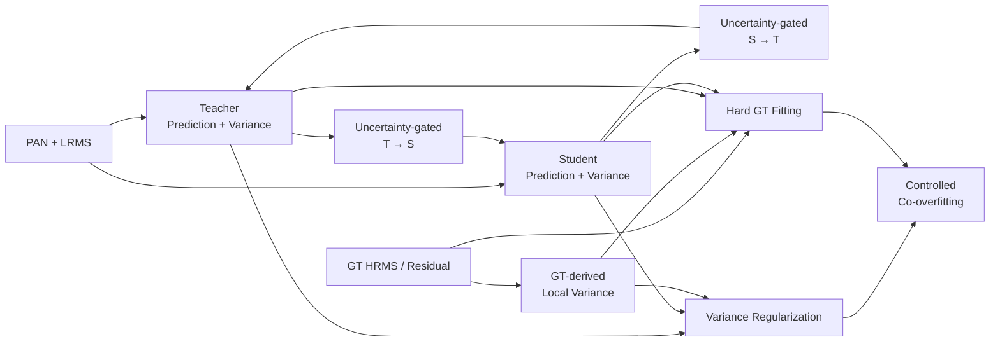

# Variance-Regularized Mutual Overfitting for PAN-Sharpening

> **Method concept v0.1**  
> 핵심 키워드: **Intentional Overfitting · One-stage Mutual Learning · Dual Uncertainty · GT-derived Variance · Controlled Co-overfitting**

---

## 1. 한 문장 요약

PAN-sharpening에서는 범용 일반화보다 특정 위성·센서 데이터셋의 spatial–spectral 특성을 깊게 학습하는 **의도적 overfitting**이 중요하며, 본 방법은 Teacher와 Student를 한 번의 학습 과정에서 공동 overfitting시키되, 각 모델의 NLL uncertainty와 GT-derived variance를 이용해 **누가 어느 영역을 더 강하게 학습할지 제어하는 variance-regularized mutual learning**을 제안한다.

---

## 2. 핵심 연구 가설

### 2.1 Main claim

> **PAN-sharpening models should be intentionally overfitted to the target dataset.**

PAN-sharpening 데이터셋은 다음 특성을 가진다.

- 위성·센서별 spectral response, MTF, spatial resolution, radiometric characteristic가 다르다.
- 데이터 확보가 어렵고, nominal patch 수에 비해 실제 scene diversity가 제한적일 수 있다.
- 여러 데이터셋을 포괄하는 일반화는 센서별 고주파 및 spectral 특성을 평균화하여 세부 복원을 약화시킬 수 있다.
- 따라서 목표 센서에서 최대 복원 성능을 얻기 위해서는 해당 데이터셋의 고유 분포에 대한 강한 fitting이 필요하다.

본 연구에서 **overfitting**은 단순한 training sample 암기가 아니라 다음을 포함하는 적극적 의미로 사용한다.

- 센서 고유의 spatial–spectral mapping 학습
- 데이터셋별 degradation 및 frequency statistics 학습
- edge, texture, small object 등 고주파 residual의 반복적이고 강한 fitting
- training/interpolation regime까지 충분히 최적화

다만 noise, misregistration, synthetic degradation artifact까지 암기하는 것은 원하지 않는 overfitting이다. 따라서 본 연구의 목적은 **overfitting을 억제하는 것**이 아니라 **overfitting의 방향을 제어하는 것**이다.

---

## 3. U-Know-DiffPAN으로부터 가져오는 출발점

U-Know-DiffPAN은 다음과 같은 two-stage teacher–student 구조를 사용한다.

1. 고용량 Teacher(FSA-T)를 먼저 학습한다.
2. Teacher는 복원 residual \(\hat X_T\)와 pixel-wise uncertainty/variance \(\theta_T\)를 출력한다.
3. 학습된 Teacher를 고정한다.
4. Student(FSA-S)는 Teacher output, feature, uncertainty를 이용해 별도로 학습된다.

Teacher의 uncertainty-driven loss는 다음 형태다.

\[
\mathcal L_{U\text{-Diff}}
=
\left\|
\frac{1}{2\theta_T}\odot |\hat X_T-X_0|
+
\frac{1}{2}\log\theta_T
\right\|_1
\]

Student는 Teacher uncertainty가 높은 영역에서는 GT를 더 강하게 사용하고, 낮은 영역에서는 Teacher output을 더 신뢰한다.

\[
\mathcal L_{hard}
=
\left\|
(\tau+\theta_T)\odot |\hat X_S-X_0|
\right\|_1
\]

\[
\mathcal L_{soft}
=
\left\|
(\tau-\theta_T)\odot |\hat X_S-\hat X_T|
\right\|_1
\]

### 본 연구의 확장점

원 논문과 달리 다음을 제안한다.

- Teacher pretraining과 Student distillation을 분리하지 않는 **one-stage joint training**
- Teacher와 Student 모두 residual과 variance를 출력
- Teacher → Student뿐 아니라 Student → Teacher도 가능한 **bidirectional mutual learning**
- Teacher variance, Student variance 외에 **GT-derived variance**를 추가
- 세 variance 구조를 이용해 두 모델이 함께 특정 데이터셋에 overfit되도록 제어

> **중요:** 원 U-Know-DiffPAN에는 Student variance와 GT variance가 존재하지 않는다. 이 두 요소는 본 연구에서 새롭게 추가하는 구성이다.

---

## 4. 논지와 Mutual Learning의 연결

단순히 다음과 같이 연결하면 논리적 근거가 약하다.

\[
\text{Overfitting is needed}
\Rightarrow
\text{Mutual Learning}
\]

본 연구에서는 중간 문제를 추가하여 다음과 같이 전개한다.

\[
\text{Intentional dataset-specific overfitting}
\]

\[
\Downarrow
\]

\[
\text{A single model has uneven fitting and blind spots}
\]

\[
\Downarrow
\]

\[
\text{Two complementary models identify and compensate for each other's underfit regions}
\]

\[
\Downarrow
\]

\[
\text{Variance-guided mutual learning completes joint overfitting}
\]

즉, mutual learning은 overfitting을 막는 정규화가 아니다.

> **Mutual learning is introduced to complete overfitting by mutually correcting residual underfit regions.**

두 모델이 동일한 데이터셋을 충분히 학습하더라도 architecture, capacity, receptive field, frequency bias가 다르면 아직 잘 학습하지 못한 영역이 서로 다를 수 있다. 한 모델이 확신하고 다른 모델이 불확실한 위치에서만 peer guidance를 활성화하면, 상대 모델의 underfit 영역을 보완할 수 있다.

---

## 5. Proposed One-stage Mutual Framework

### 5.1 Prediction targets

PAN \(I_{PAN}\)과 interpolated LRMS \(I_{MS}^{LR}\)를 입력으로 사용하며, 두 모델 모두 HRMS residual을 예측한다.

\[
X_0 = I_{MS}^{HR}-I_{MS}^{LR}
\]

Teacher와 Student의 출력은 다음과 같다.

\[
(\hat X_T,\theta_T)=f_T(I_{PAN},I_{MS}^{LR})
\]

\[
(\hat X_S,\theta_S)=f_S(I_{PAN},I_{MS}^{LR})
\]

- \(\hat X_T,\hat X_S\): Teacher/Student residual prediction
- \(\theta_T,\theta_S\): Teacher/Student pixel-wise estimated variance

Teacher와 Student는 서로 다른 inductive bias를 가져야 한다.

- Teacher: large capacity, frequency/global modeling
- Student: lightweight, local/spatial residual modeling

두 모델이 지나치게 유사하면 mutual learning의 상보성이 약해질 수 있다.

---

## 6. Individual Overfitting Loss

두 모델 모두 GT에 직접 fitting되도록 각각 uncertainty-aware NLL 계열 loss를 사용한다.

\[
\mathcal L_{NLL}^{T}
=
\left\|
\frac{1}{2\theta_T}\odot |\hat X_T-X_0|
+
\frac12\log\theta_T
\right\|_1
\]

\[
\mathcal L_{NLL}^{S}
=
\left\|
\frac{1}{2\theta_S}\odot |\hat X_S-X_0|
+
\frac12\log\theta_S
\right\|_1
\]

\[
\mathcal L_{individual}
=
\mathcal L_{NLL}^{T}+\mathcal L_{NLL}^{S}
\]

이 항이 두 모델을 training dataset에 직접 overfit시키는 기본 목적함수다.

> 최종 구현에서는 L1 residual을 사용할 경우 \(\theta\)를 Gaussian variance가 아니라 Laplace scale로 해석하는 방안도 검토할 필요가 있다. 현재 식은 U-Know-DiffPAN의 uncertainty loss 구조를 우선적으로 계승한 working formulation이다.

---

## 7. Uncertainty-Guided Mutual Learning

### 7.1 Bounded uncertainty

NLL에서 예측되는 \(\theta\)는 양수이지만 상한이 없으므로 mutual weight에는 그대로 사용하지 않는다.

\[
\bar\theta_m=
\frac{\theta_m}{\theta_m+c}
\in[0,1),
\qquad m\in\{T,S\}
\]

### 7.2 Directional peer weights

Teacher가 확신하고 Student가 불확실한 위치에서는 Teacher → Student 전달을 강화한다.

\[
w_{T\rightarrow S}
=
(1-\bar\theta_T)\bar\theta_S
\]

Student가 확신하고 Teacher가 불확실한 위치에서는 Student → Teacher 전달을 허용한다.

\[
w_{S\rightarrow T}
=
(1-\bar\theta_S)\bar\theta_T
\]

### 7.3 Mutual prediction loss

\[
\mathcal L_{mut}
=
\left\|
\operatorname{sg}(w_{T\rightarrow S})
\odot
|\hat X_S-\operatorname{sg}(\hat X_T)|
\right\|_1
\]

\[
+
\alpha
\left\|
\operatorname{sg}(w_{S\rightarrow T})
\odot
|\hat X_T-\operatorname{sg}(\hat X_S)|
\right\|_1
\]

- \(\operatorname{sg}\): stop-gradient
- \(0<\alpha<1\): Student가 Teacher를 지나치게 끌어내리는 것을 방지하는 비대칭 계수

### 7.4 해석

| Teacher | Student | 학습 방향 |
|---|---|---|
| Low uncertainty | High uncertainty | Teacher → Student |
| High uncertainty | Low uncertainty | Student → Teacher, 약한 가중치 |
| High uncertainty | High uncertainty | Peer transfer 억제, GT fitting 강화 |
| Low uncertainty | Low uncertainty | 약한 consistency 또는 독립 GT fitting |

이 구조에서 mutual learning은 두 모델을 단순히 같은 출력으로 수렴시키는 것이 아니라, **상대 모델의 residual underfitting을 선택적으로 제거하는 cooperative fitting mechanism**이다.

---

## 8. GT-derived Variance

### 8.1 Working definition

현재 제안에서 GT variance는 동일 입력에 대한 여러 정답의 통계적 conditional variance가 아니다. PAN-sharpening supervised dataset에는 일반적으로 하나의 HRMS GT만 존재하기 때문이다.

따라서 working definition으로 GT residual \(X_0\)의 local variance를 사용한다.

\[
v_{GT}(p)
=
\operatorname{Norm}
\left(
\operatorname{Var}_{q\in\mathcal N(p)} X_0(q)
\right)
\]

- Low \(v_{GT}\): smooth or low-detail region
- High \(v_{GT}\): edge, texture, small object, high-frequency residual region

엄밀한 의미는 다음에 가깝다.

> **GT-derived detail variance / target complexity prior**

논문 내에서는 편의상 GT variance라고 부를 수 있으나, ground-truth uncertainty라고 해석해서는 안 된다.

### 8.2 역할

GT variance는 두 모델이 동일한 smooth output에 자신 있게 합의하는 상황을 방지하는 외부 기준으로 사용한다.

- 두 모델 모두 uncertainty가 낮더라도 GT detail variance가 높다면 추가 fitting 필요
- high-frequency target 영역의 reconstruction pressure 유지
- mutual agreement가 곧 정답이라는 confirmation bias 완화

---

## 9. GT-Variance-Guided Hard Fitting

GT variance를 NLL의 분모에 직접 넣으면 detail-rich 영역의 error penalty가 작아질 수 있으므로, **hard GT fitting weight**로 사용하는 것이 적절하다.

\[
w_{GT}
=
1+
\beta_T\bar\theta_T+
\beta_S\bar\theta_S+
\gamma v_{GT}
\]

\[
\mathcal L_{hard}
=
\left\|
w_{GT}\odot|\hat X_T-X_0|
\right\|_1
+
\left\|
w_{GT}\odot|\hat X_S-X_0|
\right\|_1
\]

이 항의 의미는 다음과 같다.

- Teacher가 불확실한 영역: GT fitting 강화
- Student가 불확실한 영역: GT fitting 강화
- GT residual variance가 높은 영역: high-frequency/detail fitting 강화
- 두 모델이 동일하게 틀린 영역: GT가 다시 학습 방향을 고정

---

## 10. Variance Regularization

Teacher variance, Student variance, GT-derived variance를 완전히 동일하게 만드는 것은 권장하지 않는다. 모델 capacity가 다르면 uncertainty의 절대 크기도 달라질 수 있기 때문이다.

따라서 absolute equality보다 **relative spatial structure alignment**를 목표로 한다.

\[
\mathcal L_{var}
=
D(\bar\theta_T,v_{GT})
+
D(\bar\theta_S,v_{GT})
+
\eta D(\bar\theta_T,\bar\theta_S)
\]

예시:

\[
D(a,b)=1-\operatorname{Corr}(a,b)
\]

### 해석

- Teacher와 Student가 어떤 위치를 어려운 영역으로 보는지 GT detail structure와 연결
- 두 모델의 uncertainty scale을 강제로 같게 만들지 않음
- mutual confirmation bias 및 uncertainty collapse 억제
- overfitting이 smooth region이나 noise보다 detail-rich region을 향하도록 유도

이 정규화는 overfitting을 억제하는 일반적인 regularization과 목적이 다르다.

> **The regularization does not suppress overfitting; it determines where and from whom the models should overfit.**

---

## 11. Total Objective

최종 working loss는 다음과 같다.

\[
\boxed{
\mathcal L_{total}
=
\mathcal L_{NLL}^{T}
+
\mathcal L_{NLL}^{S}
+
\lambda_h\mathcal L_{hard}
+
\lambda_m\mathcal L_{mut}
+
\lambda_v\mathcal L_{var}
}
\]

| Loss | 역할 |
|---|---|
| \(\mathcal L_{NLL}^{T}\) | Teacher의 개별 GT overfitting 및 uncertainty estimation |
| \(\mathcal L_{NLL}^{S}\) | Student의 개별 GT overfitting 및 uncertainty estimation |
| \(\mathcal L_{hard}\) | 불확실하거나 detail-rich한 영역의 강한 GT fitting |
| \(\mathcal L_{mut}\) | 서로의 residual underfit 영역 보완 |
| \(\mathcal L_{var}\) | uncertainty 구조와 GT detail structure의 정렬 |

---

## 12. One-stage Training Schedule

Teacher와 Student를 scratch부터 동시에 학습하지만, 초기 오류 증폭을 막기 위해 하나의 training run 안에서 progressive schedule을 사용한다.

### Phase A — Individual fitting warm-up

- 전체 iteration의 초기 약 5–10%
- \(\lambda_m\approx0\), \(\lambda_v\)는 매우 작게 설정
- 두 모델이 각자의 NLL과 GT loss로 기본 복원 함수를 학습

### Phase B — Mutual activation

- \(\lambda_m\)을 점진적으로 증가
- uncertainty가 낮은 peer만 상대 모델을 지도
- GT variance 기반 high-frequency fitting 활성화

### Phase C — Controlled co-overfitting

- 두 모델을 training/interpolation regime까지 충분히 학습
- mutual loss로 남은 underfit 영역 보완
- variance regularization으로 공동 오류와 uncertainty collapse 억제

별도의 Teacher checkpoint를 생성하거나 freeze하지 않으므로 전체 과정은 **single-run one-stage training**이다.

---

## 13. Method Diagram

---

## 14. Expected Effects

효과가 있을 가능성이 높은 조건은 다음과 같다.

- Teacher와 Student가 서로 다른 architecture 또는 inductive bias를 가짐
- 두 모델이 잘 복원하는 공간·주파수 영역이 실제로 다름
- 기존 단일 모델이 edge, texture, small object에서 residual underfitting을 보임
- 목표가 cross-sensor generalization보다 same-sensor/dataset 성능 극대화임
- GT residual local variance가 복원해야 할 high-frequency detail을 잘 반영함

예상 효과:

1. 단일 모델이 남겨두는 hard region의 추가 fitting
2. Teacher와 Student의 complementary knowledge 활용
3. one-stage 학습으로 기존 two-stage KD 파이프라인 단순화
4. high-frequency 및 complex texture 복원 강화
5. Student가 Teacher의 약한 영역을 보완할 가능성
6. 두 모델이 동일 데이터셋에 대해 더 완전하게 공동 overfit

---

## 15. Main Risks

### 15.1 Mutual confirmation bias

두 모델이 동일한 오류 또는 smooth prediction에 함께 수렴할 수 있다.

**대응:** GT hard loss, uncertainty gating, stop-gradient, GT variance prior.

### 15.2 Noise/artifact memorization

GT local variance가 misregistration, aliasing, sensor noise도 높은 detail로 판단할 수 있다.

**대응:** residual preprocessing, robust local variance, gradient/wavelet 기반 detail mask 비교, clipping.

### 15.3 Early mutual collapse

scratch 상태의 두 모델이 초기 오류를 서로 학습할 수 있다.

**대응:** NLL warm-up, mutual weight ramp-up.

### 15.4 Student-to-Teacher degradation

저용량 Student가 Teacher를 낮은 성능 방향으로 끌 수 있다.

**대응:** \(\alpha<1\), reliable-region gating, 필요 시 T→S 중심의 asymmetric mutual learning.

### 15.5 Variance interpretation ambiguity

Teacher/Student의 predicted variance와 GT local variance는 동일한 확률적 의미를 갖지 않는다.

**대응:** GT variance를 `GT-derived detail variance`로 정의하고, 절대값 일치보다 공간적 correlation regularization 사용.

---

## 16. Minimum Required Ablations

| 설정 | 검증 목적 |
|---|---|
| Teacher only | 고용량 모델 baseline |
| Student only | 경량 모델 baseline |
| Original two-stage U-Know KD | 기준 논문과 직접 비교 |
| Naive one-stage mutual learning | 단순 mutual learning 효과 |
| + Teacher/Student variance gating | dual uncertainty 기여 |
| + GT variance hard weighting | detail prior 기여 |
| + Variance regularization | 최종 정규화 기여 |
| T→S only | 단방향 online KD 비교 |
| T↔S mutual | 양방향 전달 필요성 |
| Without warm-up | 초기 mutual collapse 검증 |
| Same architecture pair | diversity 필요성 검증 |
| Different architecture pair | complementarity 검증 |

추가로 학습 iteration에 따른 다음 곡선이 필요하다.

- Train loss / train PSNR
- Same-sensor validation PSNR, SAM, ERGAS
- Teacher–Student uncertainty 변화
- high-GT-variance 영역의 MAE
- low-GT-variance 영역의 MAE
- Teacher가 더 정확한 pixel 비율과 Student가 더 정확한 pixel 비율

---

## 17. Core Novelty Claim

본 방법의 노벨티는 one-stage 자체나 mutual learning 자체가 아니다.

> **A one-stage, bidirectional, variance-guided framework that intentionally co-overfits two complementary PAN-sharpening networks to a target dataset, while using GT-derived variance to prevent incorrect mutual agreement and direct the fitting process toward high-frequency details.**

한국어 표현:

> **본 연구는 특정 PAN-sharpening 데이터셋에 대한 의도적 overfitting을 목표로 하며, 서로 다른 두 네트워크를 한 단계에서 공동 학습한다. 각 모델의 pixel-wise NLL uncertainty를 이용해 상대 모델의 underfit 영역에만 지식을 전달하고, GT residual로부터 계산한 detail variance를 공통 기준으로 추가하여 두 모델의 잘못된 합의와 smooth collapse를 억제한다. 이를 통해 overfitting을 방지하는 것이 아니라, 고주파 세부 구조를 향해 완전하고 방향성 있게 수행되는 controlled co-overfitting을 달성한다.**

---

## 18. Suggested Terminology

### Method name candidates

- **Variance-Regularized Mutual Overfitting for PAN-Sharpening**
- **Variance-Guided Co-Overfitting Network**
- **Mutual Overfitting with Dual Uncertainty**
- **Uncertainty-Calibrated Mutual Overfitting**
- **GT-Variance-Guided Mutual PAN-Sharpening**

### Recommended key phrase

> **Mutual learning is not introduced to prevent overfitting, but to make overfitting complete and directionally correct.**

### Compact logical flow

\[
\boxed{
\text{Dataset-specific characteristics}
\rightarrow
\text{Intentional overfitting}
\rightarrow
\text{Single-model fitting blind spots}
\rightarrow
\text{Mutual completion}
\rightarrow
\text{Variance-guided controlled co-overfitting}
}
\]

---

## 19. Current Status of the Concept

### Relatively solid

- U-Know-DiffPAN의 two-stage uncertainty-aware KD를 one-stage mutual framework로 확장한다는 방향
- Teacher와 Student가 모두 uncertainty를 예측하도록 하는 dual-uncertainty 구조
- peer confidence 차이에 따라 양방향 지식 전달을 조절한다는 구조
- GT supervision을 유지하여 mutual error amplification을 제한하는 방식

### Still provisional

- GT variance의 정확한 수학적·확률적 의미
- GT local variance와 predicted NLL variance를 어떤 distance로 정렬할지
- Teacher와 Student의 최적 architecture 조합
- S→T 전달이 실제 성능 향상에 필요한지
- aggressive overfitting이 same-sensor unseen scenes에서도 이득인지
- local variance가 실제 detail과 noise를 충분히 구분하는지

따라서 초기 구현에서는 **GT residual local variance를 detail-complexity prior로 정의한 단순 버전**부터 검증하고, 이후 uncertainty calibration 및 variance alignment를 정교화하는 것이 적절하다.

---

## Source Basis

이 문서는 업로드된 **U-Know-DiffPAN: An Uncertainty-aware Knowledge Distillation Diffusion Framework with Details Enhancement for PAN-Sharpening**의 다음 요소를 출발점으로 작성되었다.

- Eq. (1): HRMS residual prediction
- Eq. (4): Teacher uncertainty-driven diffusion loss
- Eq. (16)–(19): hard, soft, feature distillation loss
- Fig. 2: Teacher pretraining 후 Student를 학습하는 two-stage pipeline
- Fig. 5: uncertainty map과 error/high-frequency region의 관계

Student uncertainty, GT-derived variance, bidirectional mutual learning, intentional co-overfitting은 원 논문에 없는 본 연구의 제안 확장이다.
