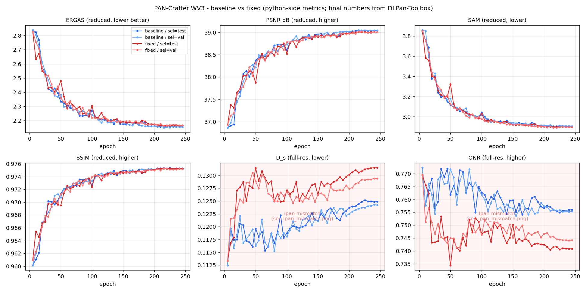
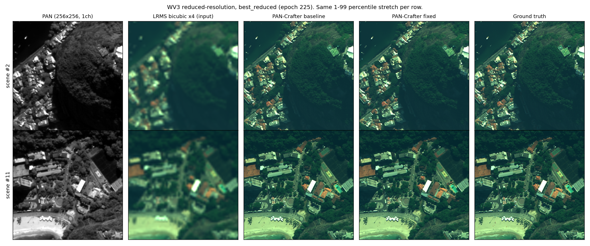
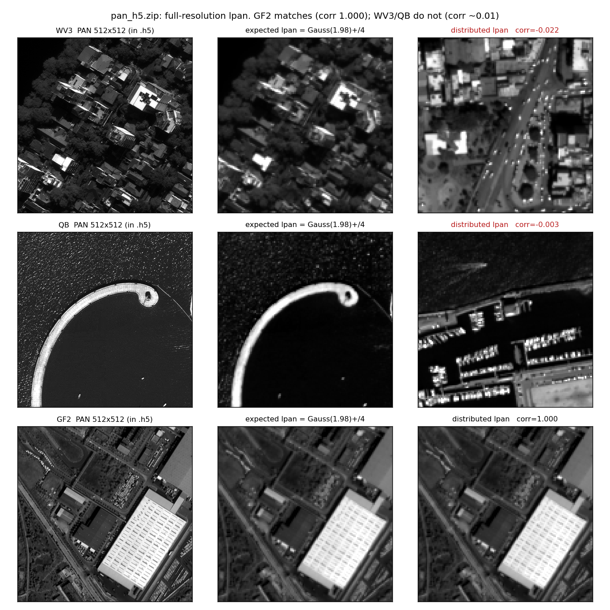

# WV3 재현 — 배포본 vs 논문대로 고친 것 (2026-08-14)

옆 저장소 `../CANConv` 와 같은 PanCollection 데이터로 PAN-Crafter(ICCV 2025)를 재현했다.
배포 코드가 논문과 다르게 동작하는 지점이 둘 있어([../KNOWN_ISSUES.md](../KNOWN_ISSUES.md) A-1, A-2)
**baseline(배포본 그대로)** 과 **fixed(논문대로)** 를 쌍으로 학습했다.

**DLPan-Toolbox 프로토콜로 측정한 reduced-resolution 결과** (dim_cut=21, Q2n block 32, thvalues=0)

| 실행 | ERGAS↓ | SAM↓ | Q8↑ | PSNR↑ | SCC↑ | 학습 시간 | full-res |
|---|---:|---:|---:|---:|---:|---:|---|
| lms 보간 입력 (기준선) | 7.122 | 5.753 | 0.620 | 29.13 | 0.169 | — | — |
| baseline @ep225 | **2.163** | 2.909 | 0.9165 | 39.07 | 0.878 | 4h55m | HQNR 0.9486 |
| fixed @ep225 | **2.177** | 2.902 | 0.9177 | 39.02 | 0.878 | 4h59m | HQNR 0.9496 |
| 논문 Table 1 | 2.040 | 2.787 | 0.922 | 37.96 | 0.988 | — | HQNR 0.958 |
| | +6.0% | +4.4% | −0.6% | — | — | | |

아무것도 안 한 기준선 대비 ERGAS 7.12 → 2.16 으로 **3.3배** 개선된다.
논문 대비 Q8 은 0.6% 차이로 사실상 일치하고, ERGAS·SAM 이 4~6% 뒤진다.

> **수치 신뢰도 경고**
> 1. 이 머신에 **MATLAB 이 없다.** 대신 `../CANConv/tools/eval_rr.py`(DLPan-Toolbox 파이썬 포팅,
>    CANNet 논문 대비 SAM/ERGAS/Q2n 0.7% 이내 검증됨)를 재사용했다 — `tools/eval_dlpan.py`.
>    SAM·ERGAS·Q8 은 논문과 비교 가능하다. **PSNR·SCC 는 정의가 달라 비교하면 안 된다**
>    (그래서 PSNR 이 논문보다 높게, SCC 가 낮게 나온다).
> 2. full-resolution 은 배포 데이터 결함으로 한 번 무효였다가 **`lpan` 을 재생성해 복구했다**
>    ([3절](#3-배포-데이터-결함--wv3qb-full-res-lpan-불일치)). 위 HQNR 은 복구본 기준이고,
>    논문과 비교 가능한 12-19번 8장 부분집합 값이다.
> 3. best 체크포인트를 **테스트셋으로 골랐다.** 검증셋은 로드만 되고 쓰이지 않는다 ([4절](#4-train-val-구조-문제)).

---

## 1. Reduced-resolution — 재현이 성립할 가능성이 높다


*좌 3칸 reduced 지표는 단조 개선. 우 2칸 full-res 지표(붉은 배경)는 3절의 데이터 결함 때문에 무의미하다.*

학습 중 모니터링 지표(`metrics.csv`)로는 ERGAS 2.84 → 2.15 로 단조 수렴했다.
위 요약표의 확정 수치는 DLPan 프로토콜로 다시 측정한 값이다.


*입력 LRMS(2열)의 뭉개짐이 출력(3·4열)에서 사라지고 GT(5열)와 육안 구분이 어렵다. 행마다 동일 stretch.*

**효과의 크기**: 아무것도 안 한 기준선(LRMS 보간 입력)이 ERGAS 7.12 / Q8 0.620 인데
2.16 / 0.9165 가 된다. 건물 윤곽·차량·해안선이 GT 수준으로 복원된다.

## 2. A-1/A-2 를 고쳐도 차이를 판정할 수 없다

| 지표 (epoch≥150 평균) | baseline | fixed | 차이 |
|---|---:|---:|---|
| ERGAS | 2.1678 ± 0.0133 | 2.1773 ± 0.0118 | 0.0095 = **0.76× epoch 간 표준편차** |
| PSNR | 38.999 ± 0.048 | 38.972 ± 0.042 | 0.028 = 0.60× |
| SAM | 2.9169 ± 0.0132 | 2.9078 ± 0.0105 | 0.0090 = 0.76× |
| SSIM | 0.9751 ± 0.0003 | 0.9750 ± 0.0003 | 0.0001 = 0.22× |

두 실행의 차이가 **같은 실행 안에서 epoch 마다 흔들리는 폭보다 작다.** 시드가 1개씩이라
"A-1/A-2 가 효과 없다" 고 결론 낼 수 없다 — WIP 에서 미리 정해 둔 대로 **판정 보류**다.

다만 방향성은 기록해 둔다. A-1 수정은 죽어 있던 파라미터 611,584개(전체의 6.13%)를 되살리고
CM3A 의 key 경로를 논문 Eq (10)/(11) 대로 되돌리는 큰 변경인데도 지표가 움직이지 않았다.
CM3A 의 기여가 key 경로가 아니라 **value 경로**(`v_pan` 에 `pan − ↑4 lpan` 고주파를 직접 넣는 것)에서
나올 가능성을 시사한다. 논문 Table 4 는 CM3A 제거 시 ERGAS 2.232 → 2.040 이라고 보고한다.

## 3. 배포 데이터 결함 — WV3/QB full-res lpan 불일치


*좌: `.h5` 안의 PAN. 중: 그것을 4배 축소한 기대값. 우: 배포된 `lpan`. WV3·QB 는 완전히 다른 장면이다.*

`pan_h5.zip` 의 `test_{wv3,qb}_OrigScale_multiExm1_pan.h5` 는 짝이 되는 PAN 과 상관계수가
**0.011 / −0.001** 이다. 순열 문제도 아니다(최적 매칭 상관도 0.37/0.28, 인덱스가 중복). 다른 센서·WV2
와 대조해도 맞는 원본이 없다. 잡음은 아니고(인접픽셀 상관 0.88) 값 범위도 센서와 일치하니,
**저자의 내보내기 스크립트가 다른 장면 목록을 참조한 것으로 보인다.** GF2 만 정확히 일치한다(1.000).

영향: `lpan` 은 입력 concat(`↑4 lpan`, `pan − ↑4 lpan`)과 모든 AttnBlock 의 value 경로에 들어간다.
full-res 추론에서 이 값이 엉뚱하면 논문이 핵심이라 말한 고주파 주입 채널이 통째로 오염된다.
실제로 full-res 지표는 학습할수록 나빠졌고(D_s 0.1125→0.1249), `best_full` 로 epoch 5(사실상 미학습)가
선택됐다. **`full_*.mat` 과 `best_full` 체크포인트는 버려야 한다.**

### 복구 결과

`tools/repair_lpan.py` 로 `lpan` 을 재생성하고 두 실행을 재추론했다. 효과가 결정적이다.

| WV3 full-res (전체 20장) | D_λ↓ | D_s↓ | HQNR↑ |
|---|---:|---:|---:|
| lms (EXP, 모델 무관 기준선) | 0.0457 | 0.1201 | 0.8399 |
| baseline — **손상된 lpan** | 0.5489 | 0.1645 | **0.3768** |
| baseline — **복구한 lpan** | 0.0849 | 0.0827 | **0.8446** |
| fixed — 복구한 lpan | 0.0751 | 0.0846 | 0.8502 |

논문과 비교 가능한 12-19번 8장 부분집합 (CANConv RUNBOOK 8절: 이 배포본은 0-11번이
크게 어려워 논문 수치는 12-19 와 맞는다):

| | D_λ↓ | D_s↓ | HQNR↑ |
|---|---:|---:|---:|
| lms (EXP) | 0.0246 | 0.0811 | 0.8964 |
| **baseline (복구)** | 0.0245 | **0.0277** | **0.9486** |
| **fixed (복구)** | 0.0232 | 0.0279 | 0.9496 |
| 논문 Table 1 | 0.016 | 0.027 | 0.958 |
| 참고: CANNet (같은 평가기) | 0.0253 | 0.0261 | 0.9493 |

**D_s 는 논문(0.027)과 사실상 일치**하고 HQNR 은 1.2% 낮다. EXP 기준선이 CANConv 측정치
(0.8963)와 정확히 일치해 평가기 자체는 신뢰할 수 있다. 이 평가기 기준으로 PAN-Crafter 와
CANNet 은 사실상 동률이다(0.9486 vs 0.9493). 논문은 PAN-Crafter 0.958 > CANNet 0.951 을 주장한다.

**복구 방법**: `lpan` 생성 필터를 역추정했다. `Gaussian(sigma≈1.98, N≥17, BORDER_REPLICATE)` 후
`[2::4, 2::4]` 데시메이션이면 배포본을 재현한다.

| 파일 | RMSE | 파일 | RMSE |
|---|---:|---|---:|
| train/valid/test_reduced ×3센서 (9개) | 0.23 ~ 0.53 | test_gf2_OrigScale | 0.37 |
| test_wv3_OrigScale | **331.6** | test_qb_OrigScale | **178.9** |

값 범위가 0~2047 인 데이터에서 RMSE 0.5 는 사실상 일치다(상관 0.9999997). 12개 중 10개가 맞고
어긋난 2개가 정확히 문제의 파일이다. **이 레시피로 WV3/QB full-res `lpan` 을 다시 만들어
재평가하면 full-res 결과를 복구할 수 있다.**

## 4. train-val 구조 문제

**검증셋이 만들어지기만 하고 한 번도 쓰이지 않는다.**

- `main.py:118` 이 `data_loader['val']` 을 만들고 `train.py:35` 가 `self.val_data_loader` 로 받는다.
  이후 **어디서도 참조되지 않는다.** `Trainer.save_val()` 도 정의만 있고 호출부가 없다.
- `valid_wv3.h5` 1,080장(620MB)이 매 실행마다 RAM 에 올라갔다가 그대로 버려진다.
- best 체크포인트는 `test_reduced` / `test_full`, 즉 **논문이 결과를 보고하는 그 테스트셋 20장으로 고른다.**

즉 49회 평가 중 테스트 성적이 가장 좋은 것을 뽑는 구조라 낙관 편향이 있다. 이번 실행에서 크기는
작았다(best 2.1532 vs 마지막 2.1567, 0.16%). 곡선이 매끄러워 어느 지점을 잡아도 비슷하기 때문이다.
하지만 **baseline 과 fixed 를 비교할 때는 문제가 커진다** — 둘 다 같은 20장에서 best-of-49 를
뽑았으므로, 2절의 0.5% 차이에 선택 편향이 섞여 있다.

**변형안**: 선택을 `valid_*.h5` 로 옮긴다. reduced 와 동일한 전처리라 코드 변경이 작다.

```python
# main.py — test_reduced 대신 val 로 best 를 고르고, test 는 최종 1회만 본다
ergas = trainer.evaluate(data_loader['val'], ...)   # 선택용
if ergas < best_ergas: trainer.save_best_model_reduced()
# 학습 종료 후에만 test_reduced / test_full 평가
```

지금 당장 바꾸지는 않았다. 두 실행이 이미 같은 조건이라 상호 비교는 유효하고,
바꾸면 이번 결과와 비교할 수 없게 된다. QB/GF2 착수 전에 정하는 것이 맞다.

## 5. 배제한 가설

| 가설 | 검증 방법 | 결과 |
|---|---|---|
| full-res 지표가 나쁜 건 학습 부족 | 49회 평가 곡선 확인 | 기각. 학습할수록 **나빠진다**(D_s 0.1125→0.1249) |
| full-res `lpan` 이 샘플 순서만 어긋남 | 20×20 교차상관 행렬 | 기각. 최적 매칭도 0.37, 인덱스 중복 |
| `lpan` 이 다른 센서 파일과 뒤바뀜 | wv3·qb·gf2·wv2 전량 교차 대조 | 기각. 맞는 원본이 없음 |
| VRAM 19.8GB 는 A-1/A-2 버그 탓 | A-2 켜고 재측정 | 기각. 16.51 → 16.52 GB (차이 없음) |
| `lpan` = 단순 bicubic/box 축소 | 재표본화 후보 20종 RMSE 비교 | 기각. Gaussian(σ≈1.98)+`[2::4]` 만 일치 |
| baseline 과 fixed 성능 차이가 유의 | epoch 간 표준편차와 비교 | **판정 보류.** 차이 < 노이즈, 시드 1개 |

## 6. 확정된 설정 (근거 포함)

| 항목 | 값 | 근거 |
|---|---|---|
| iteration / batch / optimizer | 50,000 / 48(실효 96) / AdamW 1e-4 wd 0.01 cosine warmup 100 | 논문 Sec 4.2 그대로 |
| seed | 2025 | 논문 명시 |
| `save_epoch` | 25 | 500 이면 총 epoch(WV3 248) 안에서 한 번도 발동하지 않는다 |
| `lpan` 재생성 레시피 | `cv2.GaussianBlur(sigma=1.98, N=41, REPLICATE)` → `[2::4, 2::4]` | 배포본 10/12 파일을 RMSE ≤0.53 으로 재현 |
| GPU | RTX 4090, 학습 peak 16.5GB allocated | 24GB 에서 OOM 없음. 논문 3090 서술과 일관 |
| 1회 학습 시간 | 4h55m ~ 4h59m (0.33 s/iter) | 실측 |

## 7. 남은 것

1. ~~DLPan-Toolbox 평가~~ — **완료.** MATLAB 대신 CANConv 파이썬 포팅 재사용(`tools/eval_dlpan.py`).
   논문 대비 Q8 −0.6%, ERGAS +6.0%, SAM +4.4%.
2. ~~full-res 복구~~ — **완료.** `tools/repair_lpan.py` → 재추론 → `tools/eval_dlpan_fr.py`.
   HQNR 0.3768 → 0.9486. QB 는 같은 절차로 처리하면 된다(아직 미실행).
3. **시드 반복** — 2절을 판정하려면 최소 3시드. `../CANConv` 의 `seed10/20/30` 전례가 있다. 실행당 5시간.
4. **QB / GF2** — 두 벌씩 20시간. 위 1~3 을 정리한 뒤 착수.
5. **WV2 zero-shot** — 3절 레시피로 `lpan` 을 만들 수 있게 됐으므로 **착수 가능해졌다**(이전 블로커 해소).
6. **CAS500(4095) / Vantor(16383)** — feeder 가 경로 문자열로 `max_pixel` 을 추론해 그대로는 안 된다
   ([B-1~B-3](../KNOWN_ISSUES.md)). 코드 수정 선행 필요.
