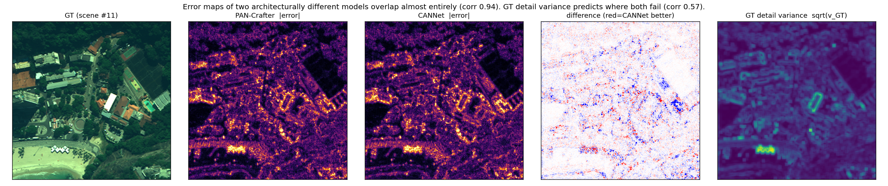

# 검토 — Variance-Regularized Mutual Overfitting (2026-08-18)

[method_concept_variance_regularized_mutual_overfitting.md](../research_log/method_concept_variance_regularized_mutual_overfitting.md) 에 대한 검토다.
기반 논문은 U-Know-DiffPAN(`../uknowdiff.pdf`).

**핵심 전제 두 개를 기존 산출물로 실제 측정했다.** 하나는 지지되고 하나는 지지되지 않는다.

---

## 1. 총평

| 구성요소 | 판정 | 근거 |
|---|---|---|
| GT-derived variance 기반 hard fitting | **지지됨** | v_GT ↔ 오차 corr 0.56, 상위 10% 영역 MAE 4.2배 |
| Dual uncertainty (T·S 모두 variance 예측) | 조건부 타당 | 원 논문도 WV3/QB 에서 S > T 라 양방향 근거는 있다 |
| One-stage joint training | 타당, 기여는 공학적 | two-stage 대비 파이프라인 단순화 |
| **두 모델의 상보성에 기반한 mutual learning** | **약함** | 서로 다른 구조의 오차 지도 corr **0.94**, 오라클 상한 **+7.9%** |
| "Intentional overfitting" 프레이밍 | 재검토 필요 | 테스트셋은 같은 센서의 **미학습 장면**이다 |

**결론**: 방법 전체를 mutual learning 위에 세우는 것은 근거가 약하다. 반면 **uncertainty ·
GT-detail-variance 로 단일 모델의 fitting 방향을 제어하는 축**은 데이터가 뒷받침한다.
비중을 후자로 옮기고, mutual learning 은 "상보적인 쌍을 먼저 찾은 뒤" 붙이는 것이 안전하다.

---

## 2. 전제 1 — 두 모델은 상보적인가? (약함)

WV3 reduced 20장, 경계 21픽셀 제거. PAN-Crafter(본 저장소)와 CANNet(`../CANConv`)은
구조가 상당히 다르다(U-Net + local attention vs cluster-adaptive convolution).


*좌→우: GT / PAN-Crafter 오차 / CANNet 오차 / 두 오차의 차 / GT detail variance.
네 번째 칸이 거의 백색이다 — 어느 쪽이 나은지에 공간적 구조가 없다.*

| 쌍 | 오차 지도 상관 | 픽셀 승률 | 오라클 상한 (ERGAS) |
|---|---:|---:|---|
| PAN-Crafter(base) vs CANNet | **0.9416** | 46.8 : 53.2 | 2.1633 → 1.9914 (**+7.9%**) |
| PAN-Crafter(base) vs (fixed) | 0.9772 | 48.5 : 51.5 | 2.1633 → 2.0642 (+4.6%) |

읽는 법:

- **오차 상관 0.94** — "두 모델의 blind spot 이 서로 다르다"는 §4의 전제가 대체로 성립하지 않는다.
  둘은 같은 곳(건물 윤곽, 텍스처)에서 같이 틀린다. 서로 보완할 영역이 6% 남짓이다.
- **픽셀 승률 47:53** — 어느 모델도 특정 영역을 체계적으로 더 잘하지 않는다. 거의 동전던지기다.
- **오라클 +7.9%** — 픽셀마다 **GT 를 보고** 더 나은 쪽을 골랐을 때의 상한이다.
  mutual learning 은 GT 없이 학습 중에 이 중 일부만 realize 한다. 논문 간 격차가 통상 5% 안팎임을
  감안하면 무의미하진 않으나, **방법의 주축으로 삼기엔 천장이 낮다.**

같은 계열 쌍(base vs fixed)은 상관 0.977, 오라클 +4.6%로 더 낮다.
§14의 "Teacher 와 Student 가 서로 다른 architecture" 조건이 왜 중요한지는 확인되지만,
**아키텍처를 상당히 바꿔도 0.94에서 크게 내려가지 않는다**는 것이 이번 측정의 요지다.

> **권고**: 방법을 설계하기 전에 **후보 쌍의 오차 상관을 먼저 측정**하라.
> 0.94 수준이면 어떤 mutual 기법을 써도 상한이 8% 미만이다.
> 상관을 실제로 낮추는 쌍(주파수 대역 분담, 수용영역 극단화, 서로 다른 열화 가정 등)을
> 찾는 것이 방법 설계보다 선행돼야 한다.

## 3. 전제 2 — GT detail variance 가 어려운 곳을 짚는가? (지지됨)

`v_GT = Var_{5x5}(X_0)`, `X_0 = HRMS − LRMS`.

| 모델 | corr(v_GT, \|error\|) | 상위 10% v_GT MAE / 하위 50% MAE |
|---|---:|---|
| PAN-Crafter(base) | 0.5669 | 36.56 / 8.64 = **4.2배** |
| PAN-Crafter(fixed) | 0.5670 | 36.71 / 8.58 = 4.3배 |
| CANNet | 0.5550 | 36.81 / 8.57 = 4.3배 |

상관 0.56 은 픽셀 단위 지표로는 충분히 높다. **§8~9의 GT-variance-guided hard fitting 은
근거가 있다.** 다만 두 가지를 유의해야 한다.

1. 세 모델의 값이 0.555~0.567 로 **사실상 동일**하다. v_GT 는 *공통으로* 어려운 곳을 짚을 뿐,
   **모델별로 다른 영역을 지목하지 않는다.** 따라서 v_GT 는 두 모델을 차별화하는 신호가 될 수 없고,
   §10의 `D(θ̄_T, v_GT) + D(θ̄_S, v_GT)` 는 두 uncertainty 를 **같은 방향으로** 끌어당긴다.
2. `w_GT = 1 + … + γ v_GT` 로 쓰는 순간 이 항은 **edge-weighted L1 과 거의 같아진다.**
   이미 잘 알려진 기법이므로, 리뷰어는 "gradient/edge weighting 대비 이득이 무엇인가"를 묻는다.
   **v_GT 단독 가중 vs Sobel/wavelet 가중** 비교 ablation 이 반드시 필요하다.

---

## 4. 수식 수준의 문제 4가지

### 4.1 `L_NLL` 과 `L_hard` 가 같은 모델에서 정반대로 작용한다 (가장 중요)

- `L_NLL`: `|e|` 에 붙는 가중이 **1/(2θ)** — θ 가 크면 **약하게**
- `L_hard`: `w_GT = 1 + β θ̄ + …` — θ 가 크면 **강하게**

원 논문은 이 둘을 **다른 모델**에 적용해 충돌이 없었다(Teacher 는 Eq 4, Student 는 Eq 17).
제안서 §11은 **두 모델 모두에 둘 다** 건다. 합쳐진 가중은

```
f(θ) = 1/(2θ) + λ_h (1 + β·θ/(θ+c))
```

θ→0 에서 발산, θ→∞ 에서 1+β 로 수렴하는 **U자형**이다. 즉 **중간 정도로 불확실한 픽셀이
가장 낮은 가중을 받는다.** 의도한 설계가 아닐 것이다.

**대응**: (a) `L_NLL` 은 θ 추정 전용으로 두고 residual gradient 를 끊거나(θ 에만 gradient),
(b) `L_hard` 의 θ 항을 빼고 v_GT 만 남기거나, (c) 둘 중 하나만 쓴다.
어느 쪽이든 **합성 가중 f(θ) 를 그려서 단조성을 확인**하고 논문에 실을 것.

### 4.2 `‖ · ‖₁` 가 NLL 을 접는다

`L_NLL = ‖ (1/2θ)|e| + (1/2)log θ ‖₁` 에서 θ<1 이면 `log θ < 0` 이라 괄호 안이 음수가 될 수 있고,
`|·|` 가 부호를 접어 **gradient 방향이 뒤집힌다.** 원 논문 Eq (4) 를 그대로 옮긴 것이지만
정상적인 NLL 이 아니다. Laplace NLL 은 `mean(|e|/b + log b)` 로 쓰고 절대값을 씌우지 않는다.

**대응**: `‖·‖₁` 대신 평균을 쓰고, θ 에 `SoftPlus + ε` 하한을 둔다(원 논문도 SoftPlus 사용).

### 4.3 `L_var` 의 `η·D(θ̄_T, θ̄_S)` 는 목적과 모순된다

§10의 목적은 "mutual confirmation bias 및 uncertainty collapse 억제"인데,
`D(θ̄_T, θ̄_S)` 를 줄이는 것은 **두 모델의 불확실도 구조를 일치시키는** 방향이다.
게다가 이미 둘 다 v_GT 에 정렬되므로 이 항은 중복이다. 3절에서 본 대로 v_GT–오차 상관이
세 모델 모두 동일하다는 사실이 이를 뒷받침한다.

**대응**: η 항을 빼거나, **부호를 뒤집어** 다양성을 장려하는 항으로 재정의한다(그쪽이 §2의 논지와 맞는다).

### 4.4 diffusion 을 떼어낸 근거가 필요하다

U-Know-DiffPAN 의 θ 는 **diffusion denoiser 가 timestep t 에서 예측하는 값**이다
(Eq 3: `Ψ([X_t | I_PAN | I_MS^LR]; v, S-Cond; t)`). 제안서는 t 와 X_t 를 없애고
deterministic regressor 로 옮겼다. 형식적으로는 그냥 heteroscedastic NLL 이라 문제없지만,
**"U-Know 를 계승했다"는 서술의 근거는 약해진다.** 어느 backbone 위에 올릴지(PAN-Crafter?)와
diffusion 없이도 uncertainty 가 의미 있게 학습되는지를 먼저 보여야 한다.

부수적으로 `τ − θ` (원 논문 Eq 18) 는 θ>τ 일 때 **음수 가중**이 되어 soft loss 를 최대화하는
방향이 된다. τ=1 이므로 실제로 발생한다. 제안서는 `w = (1−θ̄)θ̄` 로 [0,1) 로 bound 해 이 문제를
피했다 — 좋은 개선이다. 논문에 **명시적 기여로 적을 것.**

---

## 5. 프레이밍 — "Intentional overfitting"

주장은 "목표 데이터셋에 의도적으로 overfit 하라"인데, **평가 프로토콜은 같은 센서의
미학습 장면**이다(WV3 train 9,714 patch / test 20장은 서로 다른 scene).
따라서 실제로 원하는 것은 memorization 이 아니라 **센서 고유 열화·분광 매핑의 특화**다.
그건 overfitting 이 아니라 올바른 specialization 이고, 리뷰어는 이 구분을 반드시 지적한다.

우리 측 데이터도 이 프레이밍에 불리하다. WV3 baseline 의 test ERGAS 는
2.8389(ep5) → 2.1740(ep155) → 2.1542(ep215) → 2.1567(ep245) 로 **마지막 90 epoch 동안 1% 개선에
그치며 평탄해진다.** 50k iteration 시점에서 "더 fit 시킬 여지" 는 크지 않다.
(단, cosine schedule 이 0 으로 수렴한 영향이 있으므로 **더 긴 스케줄에서 재확인**이 필요하다.
U-Know-DiffPAN 은 300K iteration 을 쓴다 — 6배다.)

한편 우리 WV2 zero-shot 결과는 정반대 방향을 시사한다. 논문대로 고친 `fixed` 가
in-domain(WV3)에서는 차이가 없다가 **미학습 위성(WV2)에서 HQNR 0.9125 → 0.9305 로 앞섰다.**
"일반화를 포기하고 특화하라"는 논지와 충돌할 수 있는 관측이다.

**권고**: hook 으로 overfitting 을 쓰되, 본문 용어는 `dataset-specific specialization` /
`controlled fitting direction` 으로 두고, **"어디까지 fit 하면 이득이 멈추는가"를 곡선으로 제시**하라.
그 곡선 자체가 논문의 기여가 될 수 있다.

---

## 6. 자원 현실성

본 저장소 실측 기준(RTX 4090 24GB, WV3, 실효 배치 96):

| | 단일 PAN-Crafter | Teacher+Student 동시 |
|---|---|---|
| 학습 peak VRAM | 16.5 GB | **약 25~33 GB → 24GB 카드에서 불가** |
| 50k iteration | 4h 55m | 8~10h (추정) |

- 배치를 절반으로 줄이면 들어가지만 **논문 설정(실효 96)에서 벗어나 baseline 비교가 흔들린다.**
- §16의 ablation 12종을 WV3 에서만 돌려도 **100~120시간**(4~5일)이다. 3개 데이터셋이면 2주 이상.
- U-Know-DiffPAN 급 300K iteration 을 따라가면 6배가 더 붙는다.

**권고**: ablation 을 우선순위 3단계로 나누고, 1차는 WV3 단일 데이터셋 · 축소 iteration(예: 20k)으로
방향성만 확인한 뒤 확대한다.

---

## 7. 권장 진행 순서

**Phase 0 — 전제 검증 (방법 구현 전, 대부분 기존 자산으로 가능)**

1. ~~두 모델 오차 상관 · 오라클 상한 측정~~ — **완료** (2절). 결과가 부정적이므로 다음이 필요하다.
2. **상보적인 쌍 탐색.** 오차 상관을 실제로 낮추는 조합을 찾는다. 후보: 주파수 대역을 나눠 학습한 쌍,
   수용영역이 극단적으로 다른 쌍, 서로 다른 열화 가정으로 학습한 쌍.
   **상관 0.85 이하 · 오라클 +15% 이상**을 넘기지 못하면 mutual 축은 접는다.
3. **fitting 여력 곡선.** 50k → 150k 로 늘려 test 지표가 계속 개선되는지 확인(약 15시간).
   §2 주장의 실증 근거이자 그 자체로 보고 가치가 있다.

**Phase 1 — 단일 모델 uncertainty 축 (근거가 확인된 부분부터)**

4. PAN-Crafter 에 `(X̂, θ)` 이중 출력 추가 + Laplace NLL. θ 가 실제로 오차와 상관되는지 확인.
5. `w_GT` hard fitting 적용. **반드시 Sobel/wavelet 가중과 비교**한다(4.1·3절 참고).
6. 4.1 의 가중 충돌을 해소한 형태를 확정한다.

**Phase 2 — mutual (Phase 0-2 를 통과했을 때만)**

7. one-stage 양방향, `sg` 와 warm-up 포함. T→S only 와 반드시 비교.

---

## 8. 요약

| 살릴 것 | 재검토할 것 |
|---|---|
| GT detail variance 기반 hard fitting (근거 확인됨) | 두 모델 상보성 전제 (오차 상관 0.94) |
| bounded weight `(1−θ̄)θ̄` — 원 논문 음수 가중 문제 해결 | `L_NLL` 과 `L_hard` 의 가중 충돌 |
| one-stage 로 two-stage 파이프라인 제거 | `‖·‖₁` NLL 형식 |
| dual uncertainty (원 논문도 S>T 관측) | `η·D(θ̄_T, θ̄_S)` 항의 방향 |
| | "overfitting" 프레이밍과 평가 프로토콜의 불일치 |
| | 2모델 동시 학습의 VRAM·시간 비용 |
