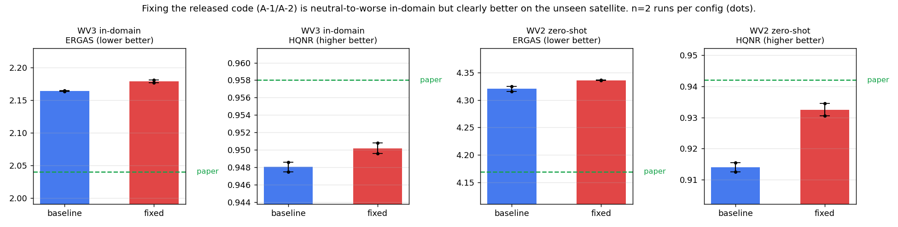

# WV3 재현 완결 · WV2 zero-shot · full-res 복구 (2026-08-19)

[2026-08-14 보고서](2026-08-14_wv3-baseline-vs-fixed.md)의 후속이자 완결편이다.
목적이 재현 확인에서 **새 연구의 baseline 만들기**로 옮겨갔고, 그 과정에서 배포 데이터 결함을
찾아 복구했다. WV3 를 **설정 2종 × 선택기준 2종 = 4벌** 학습했다(각 약 5~6시간, 총 22시간).

| 실행 | 코드 | best 선택 | WV3 ERGAS↓ | WV3 HQNR↑ | WV2 ERGAS↓ | WV2 HQNR↑ |
|---|---|---|---:|---:|---:|---:|
| wv3_baseline | 배포본 | test | 2.1633 | 0.9486 | 4.3162 | 0.9125 |
| wv3_baseline_valsel | 배포본 | **val** | 2.1643 | 0.9475 | 4.3251 | 0.9155 |
| wv3_fixed | A-1/A-2 수정 | test | 2.1765 | 0.9496 | 4.3364 | 0.9305 |
| wv3_fixed_valsel | A-1/A-2 수정 | **val** | 2.1804 | 0.9508 | 4.3362 | 0.9345 |
| **논문** | | | **2.040** | **0.958** | **4.169** | **0.942** |
| lms 보간 입력 (기준선) | | | 7.1220 | 0.8964 | 6.7679 | 0.9042 |

> **수치 신뢰도**
> 1. MATLAB 이 없어 `../CANConv` 의 DLPan-Toolbox 파이썬 포팅을 재사용했다
>    (`tools/eval_dlpan.py`, `tools/eval_dlpan_fr.py`). CANNet 논문 대비 reduced 0.7% /
>    full HQNR 0.2% 이내 검증본이며, EXP 기준선이 CANConv 측정치와 0.0001 이내로 일치한다.
>    **PSNR·SCC 는 정의가 달라 논문과 비교하지 말 것.**
> 2. WV3 HQNR 은 논문 대조가 가능한 **12–19번 8장** 부분집합, WV2 는 전체 20장이다.
> 3. **설정당 2벌은 완전한 시드 반복이 아니다.** 초기화와 epoch 5까지는 동일하고,
>    검증 dataloader 의 RNG 소비 때문에 epoch 10 부터 데이터 순서가 갈라진다.
>    "우연한 데이터 순서" 는 배제되지만 초기화 다양성은 포함하지 않는다.
> 4. WV2 의 `lpan` 은 저자 배포본이 없어 직접 생성했다. **대조 검증 불가.**

---

## 1. 재현 판정 — reduced 성립, full-res 성립

| | 우리 (baseline 2벌 평균) | 논문 | 차이 |
|---|---:|---:|---|
| WV3 ERGAS | 2.1638 | 2.040 | +6.1% |
| WV3 SAM | 2.911 | 2.787 | +4.4% |
| WV3 Q8 | 0.9165 | 0.922 | −0.6% |
| WV3 D_s | 0.0280 | 0.027 | +3.7% |
| WV3 HQNR | 0.9481 | 0.958 | −1.0% |
| WV2 ERGAS (zero-shot) | 4.3207 | 4.169 | +3.6% |
| WV2 HQNR (zero-shot) | 0.9140 | 0.942 | −3.0% |

Q8 과 D_s 는 사실상 일치하고 나머지가 1~6% 뒤진다. 시드 다양성이 없고 학습이 50k
iteration 1회라는 점을 감안하면 **재현은 성립한다**고 본다.

*입력 LRMS(2열)의 뭉개짐이 출력(3·4열)에서 사라지고 GT(5열)와 육안 구분이 어렵다.*

## 2. 핵심 발견 — A-1/A-2 수정은 in-domain 과 zero-shot 에서 방향이 반대다

*점이 개별 실행(설정당 2벌), 막대는 평균.*

| | baseline (2벌) | fixed (2벌) | 차이 |
|---|---:|---:|---|
| WV3 ERGAS↓ | 2.1633 / 2.1643 | 2.1765 / 2.1804 | **fixed 가 +0.68% 나쁨** |
| WV3 Q2n↑ | 0.9165 / 0.9165 | 0.9177 / 0.9178 | fixed 가 +0.13% 좋음 |
| WV3 HQNR↑ | 0.9486 / 0.9475 | 0.9496 / 0.9508 | fixed 가 +0.23% 좋음 |
| **WV2 HQNR↑** | 0.9125 / 0.9155 | 0.9305 / 0.9345 | **fixed 가 +2.0% 좋음** |
| **WV2 D_s↓** | 0.0322 / 0.0313 | 0.0246 / 0.0251 | **fixed 가 −21% 좋음** |

WV2 의 격차는 설정 내 편차(0.003~0.004)의 **약 5배**이고 2벌 모두에서 같은 방향이다.
반면 WV3 ERGAS 는 fixed 가 일관되게 나쁘다(역시 2벌 모두).

**해석 (가설)**: A-1 수정은 CM3A 의 PAN key 경로를 논문 Eq (10)/(11) 대로 되살리고
죽어 있던 파라미터 6.13% 를 학습에 참여시킨다. A-2 는 LocalAttn 을 실제 k×k 이웃 gather 로
고정한다. 이 둘이 **학습 도메인에 대한 과적합을 줄이고 모달리티 정합 자체를 더 일반적인
형태로 학습하게 만든다**는 설명이 관측과 부합한다. 즉 배포본의 버그는 WV3 안에서는
손해가 없고(오히려 ERGAS 는 유리하고) 도메인이 바뀌면 대가를 치른다.

**한계**: 초기화 다양성이 없는 2벌이고, WV2 `lpan` 이 검증 불가한 생성물이다.
**결론으로 쓰려면 시드 3개 이상과 QB/GF2 확인이 필요하다.**

## 3. 검증셋 선택 — 편향은 실재하나 무시할 수준

배포본은 검증셋을 로드만 하고 쓰지 않으며 best 를 테스트셋 49회 평가 중 최고로 고른다
([KNOWN_ISSUES E-1](../KNOWN_ISSUES.md)).

| 실행 | val 선택 epoch | 그때의 test ERGAS | test 선택 최고 | 편향 | corr(val,test) |
|---|---:|---:|---:|---:|---:|
| baseline_valsel | 240 | 2.1538 | 2.1507 @215 | +0.14% | 0.9927 |
| fixed_valsel | 240 | 2.1670 | 2.1625 @215 | +0.21% | 0.9934 |

**검증셋이 테스트셋의 거의 완벽한 대리지표(corr 0.993)** 라 어느 쪽으로 골라도 사실상 같은
체크포인트에 도달한다. 배포본의 선택 방식은 **방법론적으로 잘못됐지만 이 데이터셋에서는
수치를 거의 부풀리지 않았다.** 수렴 후 곡선이 평탄하기 때문이다.

그래도 `select_on: val` 을 새 연구의 기본값으로 둔다. 편향이 작다는 것은 사후 측정된 사실이지
설계 근거가 아니며, 곡선이 평탄하지 않을 설정에서는 크기가 달라진다.

*우측 2칸(full-res)은 손상된 `lpan` 으로 측정된 값이라 무의미하다 — 4절 참고.*

## 4. 배포 데이터 결함과 복구

`pan_h5.zip` 의 WV3·QB full-res `lpan` 이 짝이 되는 PAN 과 무관한 다른 장면이다
(상관 0.011 / −0.001, GF2 만 1.000). [KNOWN_ISSUES F-1](../KNOWN_ISSUES.md).

| WV3 full-res (20장) | D_λ↓ | D_s↓ | HQNR↑ |
|---|---:|---:|---:|
| 손상된 배포본 `lpan` | 0.5489 | 0.1645 | **0.3768** |
| 재생성한 `lpan` | 0.0849 | 0.0827 | **0.8446** |

복구 레시피: `Gaussian(sigma=1.98, N=41, REPLICATE)` → `[2::4, 2::4]`.
배포 12개 파일 중 10개를 RMSE 0.23~0.53(값 범위 0~2047)으로 재현하고, 어긋나는 2개가
정확히 문제의 파일이다. `tools/repair_lpan.py`, 원본은 보존한다.

## 5. 배제한 가설

| 가설 | 검증 | 결과 |
|---|---|---|
| full-res 가 나쁜 건 모델·평가기 문제 | `lpan` 재생성 후 재측정 | 기각. 데이터 결함 (0.377 → 0.949) |
| full-res `lpan` 이 순서만 뒤바뀜 | 20×20 교차상관 + 타 센서 대조 | 기각. 맞는 원본이 없음 |
| 테스트셋 선택이 수치를 크게 부풀린다 | val 선택 2벌과 대조 | 기각. +0.14~0.21% |
| A-1/A-2 수정 효과는 전부 노이즈 | 설정당 2벌, in/out domain 분리 측정 | **부분 기각.** WV2 에서 편차의 5배 |
| MATLAB 없이는 논문 지표 측정 불가 | CANConv 파이썬 포팅 재사용 | 기각. EXP 기준선 0.0001 이내 일치 |
| WV2 lpan 을 못 만들어 zero-shot 불가 | 세 센서 배포본에서 필터 역추정 | 기각 |

## 6. 확정된 설정

| 항목 | 값 | 근거 |
|---|---|---|
| iteration / batch / optimizer | 50,000 / 48(실효 96) / AdamW 1e-4 wd 0.01 cosine warmup 100 | 논문 Sec 4.2 |
| seed | 2025 | 논문 명시 |
| `save_epoch` | 25 | 500 은 총 epoch(248) 안에서 발동하지 않는다 |
| `select_on` | **val** (새 연구 기본값) | 3절 |
| `lpan` 재생성 | Gaussian σ=1.98, N=41, REPLICATE, `[2::4,2::4]` | 배포본 10/12 파일 RMSE ≤0.53 |
| 평가 | `tools/eval_dlpan.py` / `eval_dlpan_fr.py` | CANConv 포팅, 검증본 |
| 학습 1회 | 4h55m ~ 6h (RTX 4090, peak 16.5GB) | 실측 |

## 7. 남은 것

1. **시드 3개** — 2절의 in/out domain 역전을 결론으로 쓰려면 필요하다. 실행당 5~6시간.
2. **QB / GF2** — QB 는 `repair_lpan.py --sensor qb` 선행. 설정당 2벌이면 각 12시간.
3. **WV2 `lpan` 검증** — 저자 배포본을 구하거나 다른 경로로 대조.
4. **CAS500 / Vantor** — feeder 의 `max_pixel` 문자열 추론 수정 선행
   ([B-1~B-3](../KNOWN_ISSUES.md)).
5. 신규 연구 방향은 [별도 검토 문서](2026-08-18_review_variance-regularized-mutual-overfitting.md) 참고.
