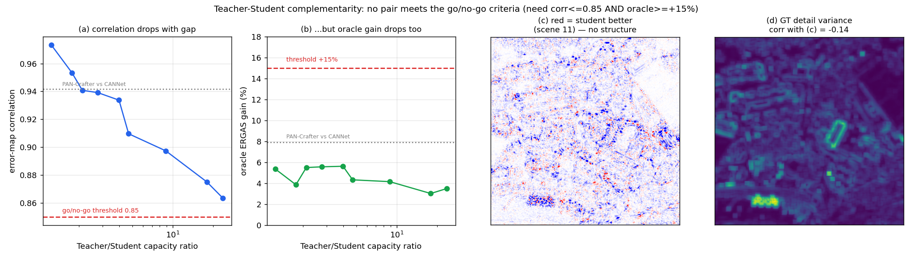

# Mutual learning go/no-go — Teacher–Student 상보성 측정 (2026-08-20)

[신규 연구방향 검토(8/18)](2026-08-18_review_variance-regularized-mutual-overfitting.md)에서
**사전에 정해 둔 판정 기준**으로 mutual learning 축의 존폐를 결정한다.

> 기준: **오차 지도 상관 ≤ 0.85** AND **오라클 이득 ≥ +15%**

## 판정: **양방향 상보성 활용은 접는다 (no-go)**

9개 Teacher–Student 쌍 중 **기준을 넘긴 것이 하나도 없다.** 최선이 상관 0.863 / 오라클 +5.6% 다.

> **이 판정의 적용 범위 (2026-08-20 추가)**
>
> 여기서 기각한 것은 **"두 모델의 서로 다른 강점을 골라 쓰는" 양방향 mutual learning** 이다
> (S→T 전달, uncertainty routing, GT-variance gating).
>
> **가지치기로 잃은 성능을 Teacher→Student 로 회복하는 단방향 증류는 별개이며, 오히려 근거가 있다.**
> Teacher 가 61.6% 픽셀에서 우세하고 ERGAS 격차가 9.4% 이므로 **회복할 여지가 명확히 존재**한다.
> 상보성이 없다는 것은 "학생이 교사에게 가르칠 게 없다" 는 뜻이지 "교사가 학생을 못 가르친다" 는
> 뜻이 아니다. 후자는 이 실험이 답하지 않았다.

---

## 1. 측정

Teacher = `W128-D2222-A5`(9.97M). Student 후보는 [스윕](2026-08-20_student-architecture-sweep.md)의
나머지 구성으로, **모두 같은 25K·같은 데이터·같은 코드**라 비교가 공정하다.

| Student | Params | 용량비 | 오차 상관 | Teacher 승률 | 단독 best | 오라클 | 이득 |
|---|---:|---:|---:|---:|---:|---:|---:|
| W128D2222A3 | 8.03M | 1.2× | 0.9733 | 50.5% | 2.2523 | 2.1315 | +5.4% |
| W96D2222A5 | 5.64M | 1.8× | 0.9534 | 61.7% | 2.2598 | 2.1723 | +3.9% |
| W96D1121A5 | 4.72M | 2.1× | 0.9408 | 60.0% | 2.2598 | 2.1353 | +5.5% |
| W96D1121A3 | 3.61M | 2.8× | 0.9391 | 62.9% | 2.2598 | 2.1338 | **+5.6%** |
| W96D1121A1 | 2.51M | 4.0× | 0.9337 | 61.6% | 2.2598 | 2.1325 | **+5.6%** |
| W64D1121A5 | 2.13M | 4.7× | 0.9096 | 71.1% | 2.2598 | 2.1618 | +4.3% |
| W64D1121A1 | 1.12M | 8.9× | 0.8973 | 74.4% | 2.2598 | 2.1657 | +4.2% |
| W32D1121A5 | 0.56M | 18.0× | 0.8751 | 79.2% | 2.2598 | 2.1913 | +3.0% |
| W32D1121A3 | 0.42M | 23.7× | **0.8634** | 80.0% | 2.2598 | 2.1805 | +3.5% |
| *(참고)* PAN-Crafter vs CANNet | — | — | 0.9416 | 53.2% | 2.1633 | 1.9914 | +7.9% |

**같은 구조 계열이라 오히려 더 나쁘다.** 논문이 다른 CANNet 과의 쌍(+7.9%)보다 모든 쌍이 낮다.

## 2. 왜 안 되는가 — 용량 차이를 벌려도 소용없다

상관과 오라클 이득이 **같은 방향으로 움직이지 않는다.**

- 용량 차이를 1.2× → 23.7× 로 벌리면 오차 상관은 0.973 → 0.863 으로 **떨어진다**(원하는 방향).
- 그런데 오라클 이득도 5.4% → 3.5% 로 **함께 떨어진다**.
- 이유는 Teacher 승률이다: 50.5% → 80.0%. 학생이 약해질수록 **그냥 전 영역에서 지므로**
  보탤 것이 없어진다.

즉 **"둘이 서로 다르면서 둘 다 좋은" 지점이 존재하지 않는다.** 오라클 이득은 용량비 2.8~4.0× 에서
+5.6% 로 정점을 찍고, 그 값도 기준의 1/3 에 불과하다.

## 3. 마지막 탈출구도 막혔다 — 학생의 승리에 구조가 없다

gating 으로 활용하려면 "학생이 이기는 곳"이 예측 가능해야 한다.
추천 쌍(`W128D2222A5` vs `W96D1121A1`, 학생 승률 38.4%)으로 확인했다.

**① GT detail variance 와 무관하다**

| 영역 | 학생 승률 |
|---|---:|
| 하위 50% v_GT (평탄) | 39.6% |
| 50–90% | 37.3% |
| 상위 10% (디테일) | 36.3% |

`corr(v_GT, ET−ES) = −0.136`. 사실상 평탄하다. **GT-variance 기반 라우팅이 성립하지 않는다.**

**② 공간적으로 뭉쳐 있지 않다**

연결성분 개수가 같은 비율의 **무작위 패턴 대비 0.78~0.86 배**에 그친다. 노이즈에 가깝다.

**③ 이득이 흩어져 있다**

승리 픽셀의 평균 개선은 전체 오차의 18% 지만, **개선 상위 1% 픽셀이 전체 이득의 9.9%** 밖에
차지하지 않는다. 집중된 hotspot 이 없어 선택적으로 뽑아낼 대상이 없다.

## 4. 결론과 함의

- **mutual learning 축을 접는다.** uncertainty gating, GT-variance routing, 양방향 전달 모두
  활용할 신호 자체가 없다. [8/18 검토](2026-08-18_review_variance-regularized-mutual-overfitting.md)의
  Phase 0-② 를 통과하지 못했다.
- 이 결론은 **아키텍처 쌍 선택의 문제가 아니다.** 용량비를 1.2× 부터 23.7× 까지 20배 범위로
  훑었고, 구조가 다른 외부 모델(CANNet)까지 포함해도 마찬가지였다.
- **단일 모델 축은 여전히 살아 있다.** GT detail variance 와 오차의 상관은 0.56 이고
  상위 10% 영역의 MAE 가 4.2 배다([8/18](2026-08-18_review_variance-regularized-mutual-overfitting.md) 3절).
  즉 "어디가 어려운지" 는 알 수 있고, "어느 모델이 나은지" 만 모른다.

### 남은 유망한 방향

| 방향 | 근거 | 비용 |
|---|---|---|
| **CM3A 위치 최적화** | H/2 CM3A 2개 제거가 **무손실**(p=0.20)인데 추론 1.7×. 논문 Table 4 의 "CM3A 필수" 주장을 **위치별로 정밀화**하는 결과다 | 이미 측정됨 |
| 단일 모델 uncertainty + GT-variance 가중 | v_GT↔오차 corr 0.56, 상위 10% MAE 4.2배 | 학습 1회 |
| full-res 효율 | 2.51M 이 9.97M 과 HQNR 동일(0.9483 vs 0.9465) | 이미 측정됨 |

## 5. 배제한 가설 (누적)

| 가설 | 검증 | 결과 |
|---|---|---|
| 구조가 다르면 오차도 다를 것 | PAN-Crafter vs CANNet | 기각. 상관 0.94 |
| 같은 계열이라 상관이 높았다 | Teacher–Student 9쌍 | 기각. 오히려 더 나쁘다 |
| 용량 차이를 벌리면 상보성이 생긴다 | 용량비 1.2~23.7× 스윕 | 기각. 상관은 내려가나 오라클도 함께 내려감 |
| 학생 승리 영역을 gating 으로 쓸 수 있다 | v_GT 상관·공간 군집성·이득 집중도 | 기각. 셋 다 구조 없음 |
