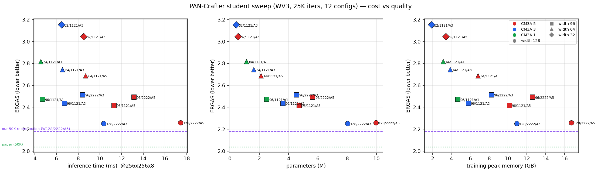
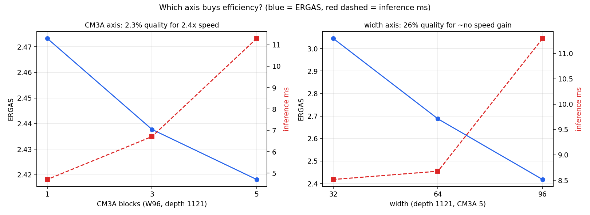

# Student 아키텍처 스윕 — 가성비 탐색 (2026-08-20)

PAN-Crafter 를 Teacher 후보로 두고 **width(W) × depth(D) × CM3A 개수(A)** 세 축으로 12개 구성을
동일 조건에서 학습해 성능/비용 파레토를 찾았다. 총 소요 **15시간 08분**(2026-08-19 17:47 → 08-20 08:55).
설계 근거: [research_log/pancrafter_student_first_strategy_v0.1.md](../research_log/pancrafter_student_first_strategy_v0.1.md)

## 결론

| 용도 | 추천 구성 | Params | 추론 | 학습mem | ERGAS | Q2n | HQNR(12-19) |
|---|---|---:|---:|---:|---:|---:|---:|
| **성능 우선** | `W128-D2222-A3` | 8.03M (0.81×) | **10.3ms (1.7× 빠름)** | 10.95GB | 2.2523 | 0.9133 | **0.9482** |
| **가성비 우선** | `W96-D1121-A1` | **2.51M (0.25×)** | **4.7ms (3.7× 빠름)** | **4.67GB** | 2.4732 | 0.9056 | **0.9483** |
| (기준점) Teacher | `W128-D2222-A5` | 9.97M | 17.4ms | 16.72GB | 2.2598 | 0.9134 | 0.9465 |

핵심 발견 세 가지.

1. **CM3A 블록 2개(H/2 위치)를 빼는 것은 사실상 공짜다.** W128 에서 5→3 은 ERGAS +0.0075
   (대응표본 **p=0.20, 구분 불가**)인데 추론 1.7배, 학습 메모리 35% 절감이다.
2. **width 축소는 가성비가 가장 나쁘다.** W96→W32 는 ERGAS 26% 악화인데 추론은 1.3배밖에 안 빨라진다.
   폭이 작아지면 커널 오버헤드가 지배해 속도 이득이 사라진다.
3. **full-resolution 품질은 용량에 거의 둔감하다.** 2.51M 짜리가 HQNR 0.9483 으로
   9.97M Teacher(0.9465)와 같다. 축소 손실은 reduced-resolution 에만 나타난다.

---

## 1. 논문 · 50K 재현 · 25K 기준점

스윕은 예산상 **25,000 iteration**(원 설정의 50%)으로 돌렸다. 그 영향을 먼저 분리한다.
세 행 모두 아키텍처가 동일한 `W128-D2222-A5` 다.

| | ERGAS↓ | SAM↓ | Q8↑ | SSIM↑ | SCC↑ | PSNR↑ | HQNR↑(12-19) | iter |
|---|---:|---:|---:|---:|---:|---:|---:|---:|
| **논문 PAN-Crafter** | **2.040** | **2.787** | **0.922** | 0.976 | 0.988 | 37.956 | **0.958** | 50K |
| 우리 50K 재현 (fix=True) | 2.1804 | 2.9024 | 0.9178 | 0.9752 | 0.9897 | 37.456 | 0.9508 | 50K |
| 스윕 기준점 (fix=True) | 2.2598 | 2.9953 | 0.9134 | 0.9734 | 0.9887 | 37.163 | 0.9465 | 25K |

- **논문 대비 재현 격차**: ERGAS +6.9%, SAM +4.1%, Q8 −0.5%, SSIM/SCC 는 사실상 일치.
- **25K → 50K 의 iteration 효과**: ERGAS 2.2598 → 2.1804, 즉 **3.6% 개선**.
  **스윕의 모든 수치는 이만큼 비관적으로 봐야 한다.**
- HQNR 은 논문 대조 가능한 12–19번 8장 기준이다(FR 테스트셋 버전 이슈 —
  [감사 문서 ④절](2026-08-19_metric-and-dataset-audit.md)).

## 2. 전체 결과

공통: WV3, seed 2025, nominal batch 48(실효 96), AdamW 1e-4 / wd 0.01, cosine + warmup 100,
`select_on: val`, `fix_key_alias/fix_local_attn: True`, full-res 는 복구 `lpan` 사용.

| 구성 | W | D | A | Params(M) | 비율 | FLOPs(G) | 추론(ms) | 학습(GB) | val ERGAS↓ | test ERGAS↓ | SAM↓ | Q2n↑ | SSIM↑ | HQNR↑ |
|---|--:|---|--:|--:|--:|--:|--:|--:|--:|--:|--:|--:|--:|--:|
| W128D2222A5 | 128 | 2222 | 5 | 9.969 | 1.000 | 168.1 | 17.4 | 16.72 | **2.3180** | 2.2598 | 2.9953 | 0.9134 | 0.9734 | 0.8453 |
| W128D2222A3 | 128 | 2222 | 3 | 8.030 | 0.806 | 136.1 | 10.3 | 10.95 | 2.3271 | **2.2523** | 3.0068 | 0.9133 | 0.9733 | **0.8680** |
| W96D2222A5 | 96 | 2222 | 5 | 5.643 | 0.566 | 95.4 | 13.1 | 12.59 | 2.3995 | 2.4927 | 3.1884 | 0.9058 | 0.9707 | 0.8592 |
| W96D1121A5 | 96 | 1121 | 5 | 4.717 | 0.473 | 68.0 | 11.3 | 10.14 | 2.4369 | 2.4182 | 3.1766 | 0.9056 | 0.9709 | 0.8248 |
| W96D2222A3 | 96 | 2222 | 3 | 4.539 | 0.455 | 77.0 | 8.4 | 8.24 | 2.4146 | 2.5132 | 3.2000 | 0.9062 | 0.9705 | 0.8673 |
| W96D1121A3 | 96 | 1121 | 3 | 3.613 | 0.362 | 49.6 | 6.7 | 5.78 | 2.4791 | 2.4377 | 3.2483 | 0.9040 | 0.9704 | 0.8641 |
| **W96D1121A1** | 96 | 1121 | 1 | **2.509** | 0.252 | 45.0 | **4.7** | 4.67 | 2.4979 | 2.4732 | 3.2880 | 0.9056 | 0.9701 | 0.8544 |
| W64D1121A5 | 64 | 1121 | 5 | 2.127 | 0.213 | 31.0 | 8.7 | 6.81 | 2.6176 | 2.6876 | 3.5628 | 0.8936 | 0.9647 | 0.8324 |
| W64D1121A3 | 64 | 1121 | 3 | 1.625 | 0.163 | 22.4 | 6.6 | 3.87 | 2.6788 | 2.7427 | 3.6871 | 0.8881 | 0.9631 | 0.8558 |
| W64D1121A1 | 64 | 1121 | 1 | 1.122 | 0.113 | 20.2 | 4.5 | 3.13 | 2.6734 | 2.8176 | 3.7865 | 0.8850 | 0.9621 | 0.8505 |
| W32D1121A5 | 32 | 1121 | 5 | 0.555 | 0.056 | 8.3 | 8.5 | 3.42 | 2.9003 | 3.0448 | 4.1352 | 0.8791 | 0.9553 | 0.8518 |
| W32D1121A3 | 32 | 1121 | 3 | 0.420 | 0.042 | 5.9 | 6.5 | 1.89 | 2.9307 | 3.1507 | 4.3559 | 0.8790 | 0.9538 | 0.8521 |

기준선(보간 입력 lms): ERGAS 7.1220 / SAM 5.7534 / Q2n 0.6199.
HQNR 은 전체 20장 기준이라 논문과 직접 비교하지 말 것(1절의 12–19 값을 쓸 것).

*보라 파선 = 우리 50K 재현, 초록 점선 = 논문. 색 = CM3A 개수, 모양 = width.*

## 3. 어느 축이 효율을 사는가

같은 20장이므로 **대응표본 t-검정**으로 봤다. 장면 간 변동이 상쇄돼 검정력이 높다
(비대응 SE 0.129 → 대응 SE 0.006~0.043).

| 축 변화 | Params | ERGAS 변화 | p | 얻는 것 |
|---|---|---:|---:|---|
| **CM3A 5→3 (W128)** | 9.97→8.03M | +0.0075 (0.3%) | **0.200 구분 불가** | 추론 **1.7×**, 메모리 −35% |
| CM3A 5→3 (W96) | 4.72→3.61M | +0.0195 (0.8%) | 0.019 | 추론 1.7×, 메모리 −43% |
| CM3A 3→1 (W96) | 3.61→2.51M | +0.0355 (1.5%) | 0.001 | 추론 1.4×, 메모리 −19% |
| depth 2222→1121 (W96·A5) | 5.64→4.72M | −0.0745 (test 개선) | 0.009 | val 은 반대 — 4절 참고 |
| **width 96→64 (A1)** | 2.51→1.12M | **+0.3444 (13.9%)** | <0.0001 | 추론 1.04× (거의 없음) |
| **width 64→32 (A5)** | 2.13→0.56M | **+0.3572 (13.3%)** | <0.0001 | 추론 **오히려 느려짐** |

**CM3A 축**: W96 에서 5→1 은 파라미터 47% 감소·추론 2.4배인데 ERGAS 손실은 2.3% 뿐이다.

**width 축**: W96→W32 는 파라미터 88% 감소인데 ERGAS 26% 악화, 추론은 11.3→8.5ms(1.3×)에 그친다.
W64→W32(A5)는 추론이 **8.7→8.5ms 로 사실상 동일**하다. 폭이 작아지면 연산량이 아니라
커널 실행 오버헤드가 병목이 되어, 줄여도 빨라지지 않는다.

> 실용적 함의: **줄이려면 CM3A 부터 줄이고, width 는 마지막에 손댄다.**
> 이는 문서 v0.1 의 전략(width 128→96, depth 축소, CM3A 5개 유지)과 **정반대**다.

## 4. 검증셋과 테스트셋이 엇갈리는 구간

전체 순위 상관은 높다(Spearman ρ = **0.881**). 그러나 W96 묶음에서 뒤집힌다.

| 구성 | val ERGAS (1080장) | 순위 | test ERGAS (20장) | 순위 |
|---|---:|--:|---:|--:|
| W96D2222A5 | **2.3995** | 3 | 2.4927 | 6 |
| W96D2222A3 | 2.4146 | 4 | 2.5132 | 7 |
| W96D1121A5 | 2.4369 | 5 | **2.4182** | 3 |
| W96D1121A3 | 2.4791 | 6 | 2.4377 | 4 |

**depth 축은 판정 보류한다.** 테스트셋에서는 얕은 쪽(1121)이 유의하게 좋고(p=0.009), 검증셋에서는
깊은 쪽(2222)이 좋다. 검증셋이 54배 많은 표본이므로 신뢰도가 높지만, 두 지표가 반대를 가리키는
이상 어느 쪽도 결론으로 쓸 수 없다. **CM3A·width 축은 두 셋이 일치하므로 결론이 안전하다.**

## 5. full-resolution 은 용량에 둔감하다

논문 대조 구간(12–19번 8장):

| | Params | D_λ↓ | D_s↓ | HQNR↑ |
|---|---:|---:|---:|---:|
| 25K W128D2222A5 (기준점) | 9.969M | 0.0257 | 0.0287 | 0.9465 |
| 25K W128D2222A3 | 8.030M | 0.0260 | 0.0265 | 0.9482 |
| **25K W96D1121A1** | **2.509M** | 0.0285 | **0.0241** | **0.9483** |
| 50K fixed_valsel | 9.969M | 0.0234 | 0.0265 | 0.9508 |
| 논문 | — | 0.016 | 0.027 | 0.958 |

**파라미터를 4배 줄여도 HQNR 이 떨어지지 않는다**(0.9465 → 0.9483). D_s 는 오히려 좋아진다.
reduced-resolution ERGAS 는 9.4% 나빠지는데 full-resolution 은 그대로다 —
축소가 **GT 대비 정밀도**를 깎지, **분광·공간 일관성**을 깎지는 않는다는 뜻이다.
실사용(정답 없는 실제 영상)이 목적이라면 작은 모델의 대가가 생각보다 작다.

## 6. 배제한 가설

| 가설 | 검증 | 결과 |
|---|---|---|
| CM3A 5개가 성능에 필수다 | W128 5→3 대응표본 검정 | **기각.** p=0.20, 구분 불가 |
| 작게 만들면 그만큼 빨라진다 | W64→W32 추론 시간 측정 | **기각.** 8.7→8.5ms, 이득 없음 |
| 축소는 모든 지표를 균등히 깎는다 | reduced vs full-res 대조 | **기각.** full-res(HQNR)는 거의 무영향 |
| 20장 테스트셋 차이는 노이즈다 | 대응표본 t-검정 | **부분 기각.** 대응 SE 0.006~0.043 로 0.02 차이도 검출 |
| depth 축소가 성능을 올린다 | val(1080장) 대조 | **판정 보류.** val 은 반대 방향 |

## 7. 한계

1. **25K 미수렴** — 50K 대비 3.6% 손해. 순위 판정에는 충분하나 절대값은 비관적이다.
   작은 모델이 빨리 수렴하므로 소형 쪽에 약간 유리한 편향이 있다.
2. **시드 1개** — 구성 간 차이는 대응표본으로 검정했으나 학습 재현 변동은 측정하지 않았다.
3. **depth 축 미결** — 4절.
4. HQNR 전체 20장 값은 FR 테스트셋 버전 이슈로 논문과 비교 불가.

## 8. 다음

1. **우승 후보 2개를 50K 로 재확인** — `W128-D2222-A3`, `W96-D1121-A1`. 각 2.9h / 1.2h.
2. **Teacher–Student 오차 상보성 측정** — `W128-D2222-A5`(또는 A3) vs `W96-D1121-A1`.
   용량이 4배 차이나므로 오차 패턴이 다를 가능성이 있다.
   [8월 18일 검토](2026-08-18_review_variance-regularized-mutual-overfitting.md)의 기준
   (오차 상관 0.85 이하 · 오라클 +15% 이상)을 넘기지 못하면 mutual learning 축은 접는다.
3. depth 축을 결론내려면 W96 4개 구성을 50K 로 다시 돌려야 한다(약 5h). 우선순위는 낮다.
