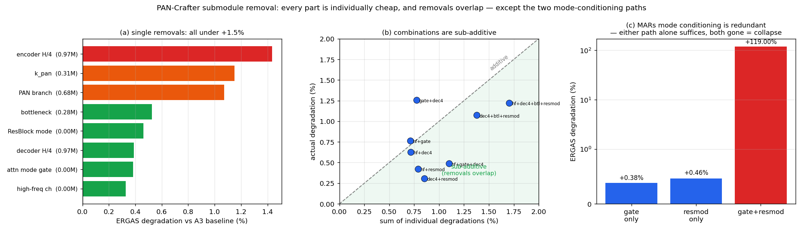

# 서브모듈 제거 실험 — 단일 8종 + 조합 9종 (2026-08-21)

[제거 분석](2026-08-20_submodule-removal-analysis.md)의 실행편이다. 기준선 `A3`(H/2 CM3A 제거,
8.030M — 이미 무손실로 확인된 지점)에서 서브모듈을 하나씩, 그리고 겹쳐서 제거했다.
총 17회 학습(각 25K, 약 1.5h) — 8/20 09:50 ~ 8/21 14:57, **약 29시간**.

공통: WV3, seed 2025, 실효 배치 96, AdamW 1e-4 / wd 0.01, cosine + warmup 100, `select_on: val`,
`fix_key_alias/fix_local_attn: True`, full-res 는 복구 `lpan`. 차이는 제거한 서브모듈뿐이다.

## 결론

1. **모든 서브모듈이 개별로는 +1.5% 이내로 제거 가능하다.** 가장 비싼 encoder H/4 CM3A 조차 +1.44% 다.
2. **제거 효과는 대체로 가산 이하다.** 여러 개를 함께 빼도 손실이 단순 합보다 작다 — 서로 겹친다.
3. **예외가 하나 있다. MARs 의 두 mode 조건화 경로는 서로 중복이며, 둘 다 빼면 모델이 붕괴한다**
   (개별 +0.38% / +0.46% → 동시 **+119%**).
4. **결과적으로 원 Teacher 대비 파라미터 −32%, 추론 2.0× 를 ERGAS +0.88% 로 얻었다.**

---

## 1. 단일 제거 8종

기준선 A3 = 8.030M / ERGAS 2.2523. 같은 20장이므로 **대응표본 t-검정**.

| 제거 대상 | 절감 params | ERGAS | 열화 | p | 판정 |
|---|---:|---:|---:|---:|---|
| 고주파 채널 `pan − ↑4lpan` | 0.002M | 2.2597 | +0.33% | 0.202 | **구분 불가** |
| AttnBlock mode gate (Eq 8 α) | 0 | 2.2609 | +0.38% | 0.052 | 경향 |
| decoder H/4 CM3A | 0.969M | 2.2611 | +0.39% | 0.059 | 경향 |
| ResBlock mode 변조 (Eq 6 β,γ) | 0 | 2.2627 | +0.46% | 0.074 | 경향 |
| bottleneck CM3A | 0.285M | 2.2641 | +0.53% | 0.026 | 유의 |
| **PAN 브랜치 전체** | 0.683M | 2.2764 | +1.07% | 0.018 | 유의 |
| `k_pan` conv | 0.314M | 2.2782 | +1.15% | 0.001 | 유의 |
| **encoder H/4 CM3A** | 0.969M | 2.2846 | +1.44% | 0.004 | 유의 |

### 논문 주장과 충돌하는 두 가지

**(1) CM3A 의 cross-modality 기여가 1% 수준이다.**
PAN 브랜치(`k_pan` + `v_pan` + `proj_pan`)를 통째로 빼면 CM3A 는 순수 MS local self-attention 이 된다.
그런데 손실이 **+1.07%** 뿐이다. 논문 Table 4 는 CM3A 를 제거하면 ERGAS 2.232 → 2.040
(**9.4% 차이**)이라고 보고한다. 즉 **CM3A 의 기여 대부분은 cross-modality 가 아니라 local attention
구조 자체**에서 나온다고 보는 것이 관측과 맞는다.

고주파 주입 채널(`pan − ↑4lpan`)도 제거해도 **통계적으로 구분되지 않는다**(p=0.202).
논문이 Eq (11) 에서 강조하는 요소인데 기여가 확인되지 않는다.

**(2) 정합은 인코딩 단계에서 일어난다.**
encoder H/4 (+1.44%) 가 decoder H/4 (+0.39%) 보다 **3.7배** 중요하다. 파라미터는 정확히 같다(0.969M).
논문은 인코더/디코더 CM3A 를 구분하지 않는다.

## 2. 조합 9종 — 대체로 가산 이하

| 조합 | params | ERGAS | A3 대비 | 단순 합 | 가산성 | p |
|---|---:|---:|---:|---:|---|---:|
| dec4 + resmod | 7.061M | 2.2592 | +0.31% | +0.85% | 가산 이하 | 0.209 |
| hf + resmod | 8.028M | 2.2618 | +0.42% | +0.79% | 가산 이하 | 0.112 |
| hf + gate + dec4 | 7.059M | 2.2633 | +0.49% | +1.10% | **가산 이하** | 0.113 |
| hf + dec4 | 7.059M | 2.2664 | +0.63% | +0.72% | 가산적 | 0.061 |
| hf + gate | 8.028M | 2.2695 | +0.76% | +0.71% | 가산적 | 0.022 |
| dec4 + btl + resmod | 6.775M | 2.2765 | +1.07% | +1.38% | 가산 이하 | 0.000 |
| **hf + dec4 + btl + resmod** | **6.774M** | 2.2798 | **+1.22%** | +1.70% | 가산 이하 | 0.000 |
| gate + dec4 | 7.061M | 2.2806 | +1.26% | +0.77% | 가산 초과 | 0.000 |
| **gate + resmod** | 8.030M | **4.9325** | **+119.00%** | +0.84% | **붕괴** | 0.000 |

**9개 중 5개가 가산 이하**다. 즉 제거들이 서로 겹쳐, 여러 개를 함께 빼는 것이 단순 합보다 싸다.
`hf+gate+dec4` 는 단순 합 +1.10% 인데 실제 **+0.49%** 로 절반 이하다.

## 3. 핵심 발견 — MARs mode 조건화의 이중화

`attn_mode_gate`(Eq 8 의 α)와 `res_mode_mod`(Eq 6 의 β,γ)는 둘 다 **네트워크가 MS mode 와
PAN mode 를 구분하게 해 주는 경로**다.

| | ERGAS | 열화 |
|---|---:|---:|
| AttnBlock gate 만 제거 | 2.2609 | +0.38% |
| ResBlock 변조 만 제거 | 2.2627 | +0.46% |
| **둘 다 제거** | **4.9325** | **+119.00%** |

MARs 는 같은 백본으로 완전히 다른 두 타깃(HRMS vs 반복 PAN)을 학습한다. mode 를 구분할 수단이
하나도 없으면 두 타깃을 평균낼 수밖에 없어 붕괴한다. **하나만 남으면 충분하다** — 두 경로는 중복이다.

논문 Table 14 는 α 와 (β,γ) 를 **각각 따로만** ablate 해서 이 상호작용을 놓쳤다.
"각 요소가 조금씩 기여한다" 로 읽히지만, 실제로는 **"둘 중 아무거나 하나는 반드시 있어야 한다"** 가
정확한 서술이다.

## 4. 최대 감축 구성

`hf + dec4 + btl + resmod` — CM3A 가 **encoder H/4 하나만** 남는다.

| | 원 Teacher | A3 | 최대 감축 |
|---|---:|---:|---:|
| 구성 | W128-D2222, CM3A 5개 | CM3A 3개 | CM3A **1개** + 고주파채널·ResBlock변조 제거 |
| Params | 9.969 M | 8.030 M | **6.774 M (−32.0%)** |
| 추론 (256²) | 17.4 ms | 10.4 ms | **8.7 ms (2.0×)** |
| ERGAS | 2.2598 | 2.2523 | 2.2798 |
| Teacher 대비 | — | −0.33% | **+0.88%** (p=0.0033) |

**파라미터 32%, 추론 시간 절반을 ERGAS 0.88% 로 샀다.** 유의하지만 절대량이 작다.

## 5. 배제한 가설

| 가설 | 검증 | 결과 |
|---|---|---|
| CM3A 의 cross-modality 가 성능의 핵심이다 | PAN 브랜치 전체 제거 | **기각.** +1.07% 뿐 |
| 고주파 주입(`pan−↑4lpan`)이 핵심이다 | 해당 채널만 제거 | **기각.** p=0.202, 구분 불가 |
| CM3A 는 위치와 무관하게 기여한다 | encoder vs decoder H/4 | **기각.** 3.7배 차이 |
| 제거 손실은 더해진다 | 조합 9종 | **기각.** 9개 중 5개가 가산 이하 |
| mode 조건화 요소는 각각 조금씩 기여 | gate+resmod 동시 제거 | **기각.** 중복 관계, 둘 다 빼면 붕괴 |

## 6. 한계

1. **25K 학습**(원 설정의 50%). 순위·부호 판정에는 충분하나 절대값은 비관적이다.
2. **시드 1개.** 구성 간 차이는 대응표본으로 검정했으나 학습 재현 변동은 미측정.
3. 기준선 A3 자체가 이미 H/2 CM3A 를 뺀 상태다. **원 배포본에서 직접 뺐을 때도 같은 결론인지는
   확인하지 않았다** — H/2 가 있는 상태에서는 다른 CM3A 의 역할이 달라질 수 있다.
4. 조합은 안전한 원자 위주로 골랐다. `enc4`·`panbr`·`kpan` 이 포함된 조합은 미측정.

## 7. 실행 기록

| 단계 | 기간 | 내용 |
|---|---|---|
| 단일 8종 | 8/20 09:50 ~ 23:34 (13h44m) | B2panbr → B1kpan → B3hf → A2enc → A3dec → A1btl → C1gate → C2resmod |
| 조합 6종 (자동 계획) | 8/20 23:34 ~ 8/21 09:49 | 단일 결과 기반 자동 생성, 열화 오름차순 |
| 조합 3종 (수동 재배치) | 8/21 10:00 ~ 14:57 | `gate+resmod` 붕괴 확인 후 삼중·사중으로 전환 |

중간에 `gate+resmod` 붕괴를 확인하고 남은 슬롯을 재배치했다. 자동 계획은 단일 결과만 보고 짜여
붕괴 조합이 5개 포함돼 있었고, 쌍은 이미 6개 확보돼 비어 있던 삼중·사중에 시간을 썼다.
