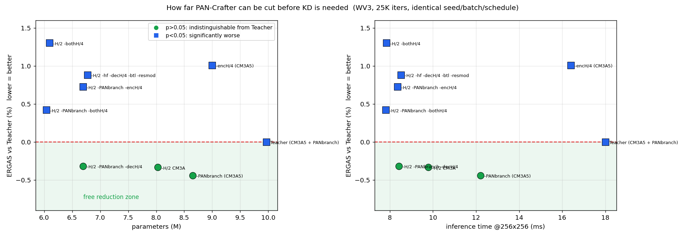

# 확장 서브모듈 실험 — KD 대상 선정 (2026-08-22)

[8/21 서브모듈 제거](2026-08-21_submodule-ablation.md)의 후속 8종(15.1h, 8/21 17:39 ~ 8/22 10:30).
**최종 목적이 KD(교사→학생 지식 전달)로 손실을 회복하는 것**이므로, "얼마나 줄일 수 있는가"를
**KD 가 개입하기 전 손실** 기준으로 정리한다.

## 결론 — KD 없이도 파라미터 33% · 추론 2.1배를 무손실로 얻는다

| 구성 | Params | 추론 | ERGAS | Teacher 대비 | p |
|---|---:|---:|---:|---:|---:|
| **Teacher** (배포본, CM3A 5 + PAN 브랜치) | 9.969 M | 18.0 ms | 2.2598 | — | — |
| H/2 CM3A 제거 (A3) | 8.030 M | 9.8 ms | 2.2523 | −0.33% | 0.200 |
| CM3A 5 유지 + **PAN 브랜치 제거** | 8.654 M | 12.2 ms | 2.2499 | **−0.44%** | 0.137 |
| **H/2 + PAN 브랜치 + decoder H/4 제거** | **6.694 M** | **8.4 ms** | **2.2527** | **−0.32%** | **0.114** |
| H/2 + PAN 브랜치 + H/4 양쪽 제거 | **6.041 M** | **7.8 ms** | 2.2693 | +0.42% | 0.013 |
| H/2 + hf + dec H/4 + btl + resmod | 6.774 M | 8.5 ms | 2.2798 | +0.88% | 0.003 |
| H/2 + H/4 양쪽 제거 (PAN 브랜치 유지) | 6.091 M | 7.8 ms | 2.2893 | +1.30% | 0.019 |

**`6.694 M / 8.4 ms` 구성이 Teacher 와 통계적으로 구분되지 않는다**(p=0.114, 오히려 −0.32%).
파라미터 **−32.9%**, 추론 **2.1배**. **KD 로 회복할 손실이 아예 없다.**

한 단계 더 줄인 `6.041 M / 7.8 ms`(−39.4%, 2.3배)도 **+0.42%** 에 그친다.

---

## 1. PAN 브랜치는 제거하면 오히려 나아진다

CM3A 의 PAN 브랜치(`k_pan` + `v_pan` + `proj_pan`)를 없애면 CM3A 는 순수 MS local self-attention 이 된다.

| 기준 | PAN 브랜치 유지 | 제거 | 차이 |
|---|---:|---:|---|
| CM3A 5개 (배포본) | 2.2598 | **2.2499** | **−0.44%** |
| CM3A 3개 (A3) | 2.2523 | 2.2764 | +1.07% |
| CM3A 2개 (A3 − dec H/4) | — | **2.2527** | (A3 와 동일) |
| CM3A 1개 (A3 − H/4 양쪽) | 2.2893 | **2.2693** | **−0.88%** |

**CM3A 를 많이 남기거나 적게 남길 때는 PAN 브랜치가 없는 편이 낫다.**
특히 CM3A 1개만 남긴 경우 PAN 브랜치를 함께 빼면 **1.30% → 0.42%** 로 개선된다.
파라미터를 0.68M 줄이면서 성능이 올라가는, **음의 비용** 제거다.

논문 Table 4 는 CM3A 전체 제거 시 ERGAS 2.232 → 2.040(9.4%)을 보고하며 cross-modality 정합을
핵심 기여로 제시한다. 우리 결과는 **그 기여가 cross-modality 가 아니라 local attention 구조 자체**
에서 나온다는 쪽을 지지한다. attention 은 남기고 PAN 경로만 없애면 손실이 없거나 이득이다.

## 2. 8/21 의 "붕괴" 는 조건부였다 — 정정

8/21 보고서는 MARs mode 조건화 2경로를 동시에 제거하면 **+119% 붕괴**한다고 적었다.
배포본(CM3A 5개) 기준으로 재확인한 결과는 다르다.

| 기준 | gate + resmod 동시 제거 |
|---|---:|
| CM3A 3개 (A3) | **+119.00%** (ERGAS 4.93) |
| CM3A 5개 (배포본) | **+10.49%** (ERGAS 2.50) |

**붕괴는 CM3A 를 줄인 상태에서만 일어난다.** 이유는 mode 조건화 경로가 **셋** 이기 때문이다.

1. AttnBlock adaLN gate (Eq 8 의 α) — `attn_mode_gate` 로 제어
2. ResBlock scale/shift 변조 (Eq 6 의 β,γ) — `res_mode_mod` 로 제어
3. **CM3A query 조건화** — `cond = lpan.repeat·(1−s) + ms·s` (`model/pancrafter.py` CMAAA.forward)

3번은 `s` 에 직접 의존하며 어떤 플래그로도 제거되지 않는다. **CM3A 블록 수가 곧 3번 경로의 용량**이다.
5개면 1·2 를 빼도 버티고, 3개면 부족해 붕괴한다.

따라서 정확한 서술은 "두 경로가 중복" 이 아니라 **"mode 신호의 총량이 임계치를 넘어야 하며,
CM3A 개수가 그 총량에 기여한다"** 이다. 8/21 의 결론은 A3 조건부였고, 여기서 정정한다.

## 3. 학습을 늘리면 격차가 줄어든다 (50K)

| | Params | 추론 | ERGAS | Teacher 대비 |
|---|---:|---:|---:|---:|
| Teacher 50K | 9.969 M | 17.8 ms | 2.1804 | — |
| 최대 감축 50K (`hf+dec4+btl+resmod`) | 6.774 M | 8.7 ms | 2.1894 | **+0.41%** (p=0.056) |
| (같은 구성 25K) | | | 2.2798 | +0.88% |

**25K 에서 +0.88% 였던 격차가 50K 에서 +0.41% 로 절반이 된다.** 유의성도 사라진다(p=0.056).
즉 **작은 모델은 학습을 더 주면 따라온다** — 이번 스윕의 25K 수치는 축소 쪽에 불리하게 편향돼 있다.

## 4. KD 관점 — 지금 어디에 서 있는가

목표가 "최대한 줄이고 KD 로 회복" 이라면, 이번 결과는 **KD 가 필요한 지점이 생각보다 훨씬 아래**임을
말한다.

| 구간 | 크기 | Teacher 대비 손실 | KD 의 역할 |
|---|---|---|---|
| 9.97 → **6.69 M** | −33% | **없음** (p=0.114) | **불필요** |
| 6.69 → **6.04 M** | −39% | +0.42% | 거의 불필요 |
| 6.04 → ? | ? | ? | **여기서부터 KD 가 값어치를 한다** |

참고로 U-Know-DiffPAN 의 KD 기여는 GF2 full-res HQNR 기준 **+0.9%** 였다(Table 6, `L₁` 0.935 →
`L_U-know` 0.944). 우리가 지금 손에 쥔 손실(0~0.42%)은 그보다 작아, **KD 를 붙일 여지 자체가 없다.**

### 아직 안 가본 구간 — 두 축 결합

폭 축소와 서브모듈 제거를 **함께** 적용하면 여기서 훨씬 더 내려간다. 크기·비용만 계산했다(성능 미측정).

| 구성 | Params | 비율 | 추론 | 비고 |
|---|---:|---:|---:|---|
| W128, CM3A 2, PAN브랜치 X | 6.694 M | 67.2% | 8.2 ms | **측정됨: −0.32%** |
| W128, CM3A 1, PAN브랜치 X | 6.041 M | 60.6% | 7.7 ms | **측정됨: +0.42%** |
| W96-D2222, CM3A 1, PAN브랜치 X | 3.407 M | 34.2% | 6.1 ms | 미측정 |
| W96-D1121, CM3A 2, PAN브랜치 X | 2.854 M | 28.6% | 5.2 ms | 미측정 |
| W96-D1121, CM3A 1, PAN브랜치 X | 2.481 M | 24.9% | 4.4 ms | 미측정 |
| W64-D1121, CM3A 1, PAN브랜치 X | 1.109 M | 11.1% | 4.3 ms | 미측정 |

참고 좌표: 폭만 줄인 `W96-D1121-A5`(2.51M)는 Teacher 대비 **+9.4%** 였다
([스윕](2026-08-20_student-architecture-sweep.md)). 서브모듈 제거를 함께 적용한 2.48M 이
그보다 나을지 나쁠지는 **미지수이며, 이것이 다음에 답할 질문**이다.

## 5. 배제한 가설 (누적)

| 가설 | 검증 | 결과 |
|---|---|---|
| CM3A 의 cross-modality 가 성능의 핵심 | PAN 브랜치 제거 × 4개 기준 | **기각.** 대부분 무손실, 일부는 이득 |
| mode 조건화 2경로는 중복이며 둘 다 빼면 붕괴 | A5 기준 재확인 | **부분 기각.** A3 조건부. 경로는 셋이다 |
| encoder/decoder CM3A 의 역할이 같다 | 위치별 제거 | **기각.** encoder 가 3.7배 중요 |
| 25K 결과가 축소 모델에 유리하다 | 50K 재확인 | **기각.** 반대다. 격차가 절반으로 줄었다 |
| 제거 손실은 더해진다 | 조합 13종 | **기각.** 대체로 가산 이하, 일부는 음수 |

## 6. 한계

1. **시드 1개.** 구성 간 차이는 대응표본으로 검정했으나 학습 재현 변동은 미측정.
   특히 ±0.4% 대 결과는 시드 변동과 구분이 안 될 수 있다.
2. 대부분 **25K**. 3절이 보여주듯 25K 는 축소 쪽에 불리하다. 최종 후보는 50K 재확인이 필요하다.
3. **WV3 단일 데이터셋.** QB/GF2 에서 같은 결론인지 미확인.
4. 4절의 두 축 결합 후보는 **크기만 계산**했다. 성능은 측정하지 않았다.

## 7. 다음

1. **두 축 결합 4종 측정** (4절 표의 미측정 행). 각 약 1h, 총 4~5시간.
   여기서 손실이 나타나면 그것이 **KD 의 실제 작업 대상**이다.
2. 확정 후보 **50K 재확인** (2~3시간).
3. KD 구현은 1번 결과로 대상이 정해진 뒤 착수. 지금 붙이면 회복할 손실이 없어 효과를 측정할 수 없다.
