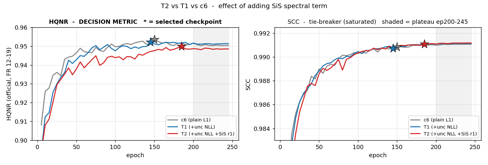

# 2026-08-31 — KD Teacher 준비(T1·T2) + Bottleneck Swin 종합

이 날의 두 갈래를 하나로 합쳤다.

| 갈래 | 건수 | 결론 |
|---|---:|---|
| **KD Teacher 준비 (T1·T2)** | 2 | T1 은 품질 손실 없이 신뢰도 맵 확보 — **θ calibration 압도적 통과**(10분위 완전 단조, 꼬리 14.6배, risk–coverage oracle 대비 8%). T2 의 SiS 는 D_λ 를 사고 D_s 를 팔아 기각 → **K2+ teacher 는 T1 확정** |
| **Bottleneck Swin 종합** | 26 (두 캠페인 재정리) | 11ch 에선 기각(형태 자체 비용, CM3A>Swin) · **효과 부호가 맥락에 따라 반전** — 9ch·d122 에서만 유익 → `SW2_d122_9ch`(3.44M) 가 동률 params 최소 Quality winner 후보 · 비용은 공짜(+0.1ms) |

---

## 2026-08-31 — KD Teacher 준비 (T1 · T2)

> 원문: `2026-08-31.md`

s1 · 2건 완주 (각 2.4~2.5h) · 50K · seed 2025 · 아키텍처 `fixed`
캠페인 문서: [`../2026-09-01_kd-mutual-campaign-results.md`](2026-09-01_kd-se-msonly-campaigns.md)

> **판정 = best checkpoint HQNR(공식 12-19) → SCC.** ERGAS·SAM 은 §4 참고 지표.
> **판정선 = 0.0027** (실측 상한. 종전 0.011 은 [2026-09-04](2026-09-04_placement-and-band-invalidation.md) 에서 무효 판정).

---

### 1. 어떤 실험인가

KD 의 Teacher 를 만든다. Student 에게 "무엇을 배울지" 알려주려면 Teacher 가
**픽셀 단위로 자기 확신도를 말할 수 있어야** 한다. 최고 Teacher 후보 c6 에 항을 하나씩 얹었다.

| | 구조 | loss | params |
|---|---|---|---:|
| c6 (기준) | w128 · d124 · attn 없음 · 11ch · nocrop | L1 | 3.7719 M |
| **T1** | **동일** | **+ uncertainty NLL** `\|e\|/2θ + ½logθ` | 동일 |
| **T2** | **동일** | **+ SiS** (λ0.1 · r1 · shared_vector) | 동일 |

답할 것: ① HQNR 이 깨지지 않는가 ② θ 가 실제 오차를 예측하는가(K2~K4 게이트 조건)

### 2. 어떤 결과가 나왔나

#### 2.1 판정 지표

| | best HQNR | ep | SCC | D_λ | D_s | vs c6 |
|---|---:|---:|---:|---:|---:|---:|
| c6 (기준) | 0.9536 | 150 | 0.9908 | 0.0213 | 0.0256 | — |
| **T1** | 0.9522 | 145 | 0.9906 | 0.0253 | 0.0231 | −0.0014 (동급) |
| **T2** | 0.9498 | 185 | **0.9910** | 0.0236 | 0.0272 | −0.0038 (**초과**) |

T1 은 판정선 안 → c6 와 **구분되지 않는다**. T2 는 −0.0038 로 판정선(0.0027)을 넘는다.


*★ = 선택 체크포인트. SCC(우)는 세 곡선이 겹쳐 포화.*

#### 2.2 Uncertainty 진단 (`tools/uncertainty_diag.py`)


| | **T1** | T2 |
|---|---:|---:|
| **조건부 오차 순서** `E[e\|Top10]>Top20>Top30>E[e]>Bot10` | **성립** | **성립** |
| E[e\|Top10] / E[e\|Bot10] | **14.6×** | 14.7× |
| Spearman(θ, \|e\|) | **0.8843** | 0.8850 |
| 10분위 단조성 | 완전 단조 | 완전 단조 |
| risk–coverage excess (0=oracle, 1=무작위) | **0.082** | 0.082 |
| Spearman(θ, GT 국소분산) | 0.517 | 0.513 |
| (대조) Spearman(GT 국소분산, \|e\|) | 0.469 | 0.468 |

### 3. 어떤 분석이 나왔나

**① T1 은 품질 손실 없이 신뢰도 맵을 얻었다.** HQNR −0.0014 는 판정선의 절반이다.
D_λ↑·D_s↓ 가 상쇄된 내부 재배치였고 순효과는 구분되지 않는다.

**② θ 는 통과가 아니라 압도적 통과다.** 게이트 요구는 Spearman>0 과 5분위 단조뿐인데,
실제로는 **10분위 완전 단조 · 꼬리 14.6배 · oracle 대비 8% 손해**가 나왔다.
분위 간 값이 붙어 있으면 가중을 만들어도 전부 1 근처가 되어 아무 일도 안 일어나는데,
14.6배면 `w_hard=1+u`·`w_soft=1−u` 가 픽셀을 실제로 **구분**한다. K2 의 물리적 근거.

**③ θ 는 GT 분산의 재탕이 아니다.** 오차 설명력이 θ 0.884 vs GT분산 0.469 로 두 배다.
K3(GT분산 가중)가 K2 와 중복이 아니라 **직교 정보를 더하는 실험**임이 여기서 확보됐다.

**④ T2 의 SiS 는 채택하지 않는다.** D_λ −6.7% 를 D_s +17.7% 로 상쇄당해 HQNR 이
판정선을 넘어 하락했다. SiS 는 "±1px 어긋남을 벌하지 말라"고 가르치는데 D_s 가 바로
PAN 과의 공간 정합 지표라, **정의에서 예측되는 대가**다. calibration 은 T1 과 동률이라
교체 사유도 없다 → **K2+ teacher 는 T1 확정.**

> SiS 는 뒤에 Student 쪽(K4)에서도 같은 부호로 실패하고([2026-09-01](2026-09-01_kd-se-msonly-campaigns.md)),
> 결국 **MS 조건 입력 jitter** 라는 다른 형태로만 성공한다([2026-09-07](2026-09-07_alignment-shift-robust-and-metric-v2.md)).

### 4. 참고 지표 — 판정에 쓰지 않음

| | ERGAS ↓ | SAM ↓ | PSNR ↑ | Q2n ↑ |
|---|---:|---:|---:|---:|
| c6 | 2.0826 | 2.8178 | 37.8373 | 0.9204 |
| T1 | 2.0950 | 2.7937 | 37.8231 | 0.9211 |
| T2 | **2.0682** | **2.7613** | **37.9151** | **0.9228** |

ERGAS·SAM 로는 T2 가 전부 1위다. HQNR 로는 최하위다. **이 지표로 골랐다면 T2 를
teacher 로 삼았을 것이고**, 그 오류가 실제로 다음 캠페인 전체를 규정했다 → [2026-09-01](2026-09-01_kd-se-msonly-campaigns.md).

#### 재현
```bash
./tools/run.sh T1_c6_unc ; ./tools/run.sh T2_c6_unc_sis
python tools/uncertainty_diag.py T1_c6_unc     # 진단 5종 + 4패널 그림
```

---

## Bottleneck Swin Transformer 실험 종합 보고서 (2026-08-31)

> 원문: `2026-08-31_swin-bottleneck-report.md`

> CNN 기반 pan-sharpening 모델의 **bottleneck(H/4)에 표준 Swin Transformer block 을
> 추가하면 무엇이 좋아지는가**를 두 캠페인(2026-08-29~31, s1·s2 양 서버 13+13건)에
> 걸쳐 검증한 결과를 한 문서로 정리한다. 개별 실행 로그가 아니라 질문별 종합이다.
> 원자료: [Swin·CM3A 캠페인](2026-08-30_swin-campaign-and-compression-attribution.md) ·
> [압축 귀속 캠페인 WIP](2026-08-30_swin-campaign-and-compression-attribution.md) · 시트 `결과정리` 탭.

### 1. 배경 — 무엇 위에 무엇을 달았나

**기반 모델**은 논문 충실 재구성 PAN-Crafter 에서 attention 을 모두 제거하고 depth 를
[1,2,4](full-res/H2/H4 ResBlock 수)로 줄인 **3.77M 경량 기준 `c6_c4d124`** 다
(이 저장소의 표준 anchor — ERGAS 2.0826, 논문 원형 7.17M 과 품질 동급).
여기에 **표준 pre-norm Swin block** (W-MSA→SW-MSA 교대쌍, window 8×8, shift 0/4,
heads 4, MLP ratio 2, relative-position bias, embed dim = backbone width, 블록당
0.133M)을 **H/4 bottleneck 의 ResBlock 뒤에** 삽입했다. 구현은 `model/swin.py`
(외부 의존성 없음), 검증 23항목 통과.

**측정**: 모든 수치는 50K 학습·crop 없음·LayerNorm·dual MARs·best 선택 = 공식
HQNR(FR index 12-19) 로 통일된 재구성(fixed) 계열이며, RR 지표는 DLPan MATLAB
프로토콜 포팅으로 잰 값이다(논문 Table 과 비교 가능). 서버 간 절대값 비교는 금지
— 각 서버의 anchor 대비로 읽는다 (s1 anchor 2.0826 / s2 anchor 2.0716).

**판정 규칙**: HQNR 차이 0.011(확정 2σ) 이내는 동급, 동급이면 SCC(±0.0005 이하
단독 판정 금지) → ERGAS(유의선 0.23%) 순. 이 범위에서 HQNR 는 사실상 판별하지
못하므로(아래 전 실행이 0.947~0.956 에 밀집) 실질 판별은 ERGAS 가 맡았다.

### 2. 설계 — 여섯 개의 질문과 대조군

| 질문 | 비교 설계 |
|---|---|
| ① Swin 을 달면 좋아지는가 | c6 vs c6+Swin×2 (`SW2_add`) |
| ② 좋아지면/나빠지면 그것이 Swin 고유인가 | 같은 위치의 자체 attention CM3A 대조 (`CM3A_btl_nopan_d124`) |
| ③ 단순히 params 가 늘어서인가 | attention 없이 conv 블록만 +2 한 용량 등가 대조 (`c6_d126`, 4.36M — SW4 4.31M·CM3A 4.39M 과 ±1.6% 매칭) |
| ④ 깊이를 늘리면 좋아지는가 | Swin 2→4→6 블록 사다리 |
| ⑤ 입력(11ch/9ch)과 상호작용하는가 | 9ch 판 (`SW2_add_9ch`, `SW2_d122_9ch` 등) |
| ⑥ 압축(bottleneck·폭 축소) 하에서는 어떤가 | d122(btl 4→2)·w112/96/80 결합 계열 |

입력 표기: 11ch = 배포 코드형(PAN·↑저주파PAN·고주파PAN·↑MS), 9ch = 논문형(PAN·↑MS).

### 3. 결과

#### 3.1 상단(w128) — Swin 존재·기전·용량·깊이 (s1, anchor `c6_c4d124` 2.0826)

| 실행 | 구성 | Params | ERGAS↓ | vs anchor | SCC↑ | HQNR↑ | 추론 |
|---|---|---:|---:|---|---:|---:|---:|
| `c6_d126` | conv 블록만 +2 (attention 없음) | 4.364M | 2.0839 | +0.06% | 0.9909 | 0.9537 | 6.68ms |
| `CM3A_btl_nopan_d124` | 자체 CM3A attention 1개 | 4.392M | 2.1051 | +1.08% | 0.9905 | 0.9519 | 6.59ms |
| `SW4_add` | Swin 4블록 | 4.305M | 2.1332 | +2.43% | 0.9901 | 0.9518 | 6.76ms |
| `SW2_add` | Swin 2블록 | 4.039M | 2.1420 | +2.85% | 0.9900 | 0.9539 | 6.55ms |
| `SW6_add` | Swin 6블록 | 4.572M | 2.1725 | +4.32% | 0.9896 | 0.9554 | 7.37ms |

#### 3.2 입력×Swin 요인 — 부호가 뒤집힌다 (s1, 같은 서버 내 비교)

| 골격 | 무 Swin | +Swin×2 | Swin 의 효과 |
|---|---:|---:|---|
| 11ch · d124 | 2.0826 (`c6_c4d124`) | 2.1420 (`SW2_add`) | **+2.85% 유해** |
| 9ch · d124 | 2.0810 (`N3_9_d124_noattn`) | 2.0858 (`SW2_add_9ch`) | +0.23% 무해(경계) |
| 9ch · d122 | 2.0982 (`d122_9ch`) | **2.0811** (`SW2_d122_9ch`) | **−0.81% 유익** — 유일한 이득 조합 |

d122 = bottleneck ResBlock 을 4→2 로 줄인 골격(그 자체는 준무손실, `d122` 2.0884).
`SW2_d122_9ch` 는 s2 재현(2.0844, 차이 0.16%)까지 확보됐고, **3.44M 로 anchor 와
품질 동률 — 현재 params 최소의 Quality winner 후보**다.

#### 3.3 압축 결합 — 폭을 줄일 때 (s2 서버 내 요인, anchor 2.0716)

| 실행 | 구성 | Params | ERGAS↓ | vs s2 anchor |
|---|---|---:|---:|---|
| `SW2_d122` | 11ch·d122·Swin×2 | 3.446M | 2.1016 | +1.45% |
| `SW2_d122_w112` | 〃 폭 112 | 2.643M | 2.1065 | +1.68% |
| `SW2_d122_w96` | 〃 폭 96 | 1.946M | 2.1121 | +1.95% |
| `d122_w96` | 〃 **무 Swin** 폭 96 | 1.795M | 2.1129 | +1.99% |
| `CM3A_d122_w96` | 〃 CM3A 판 폭 96 | 2.149M | 2.1132 | +2.01% |
| `SW2_d122_w80` | 〃 폭 80 | 1.356M | 2.1575 | +4.15% — 폭 바닥 |

w96 세 변형(무/Swin/CM3A)이 사실상 동일하다 — **폭 축소 하에서 attention 의 보호
효과는 없다.** 참고로 s1 에서 잰 `d122_w96`(2.1482)은 s2 값과 1.67% 차이가 났다:
w96 급에서는 실행 간 변동이 anchor 급(0.4~0.5%)의 3배로 증폭되므로, 이 급의 단일
실행 비교는 신뢰 구간이 넓다는 단서를 함께 남긴다. (LR 격자에서만 연산하는 별도
초경량 구조에 Swin 을 넣은 `LR_SW2_w128` 은 ERGAS 3.72 로 그 패러다임 자체가 기각됐다.)

### 4. 발견

1. **11ch 에서 bottleneck Swin 은 유해하다 — 그리고 그 손실은 "attention 형태
   자체의 비용"이다.** 같은 예산의 순수 conv(`c6_d126`)는 ±0σ, 자체 CM3A 는
   +1.08%, Swin 은 +2.43~2.85% — params 가설(③)은 기각되고, 손실 크기는
   attention 종류가 결정한다. 같은 위치·비슷한 예산에서 **CM3A 가 표준 Swin 을
   유의하게 이긴다**(−1.72%).
2. **깊이 확대는 무효다.** 2→4 블록은 유의선 언저리의 회복(−0.41%)이지만 6블록에서
   명확히 악화(2.1725)해 사다리가 비단조다. Swin 용량을 늘려 손실을 메우는 길은 없다.
3. **효과의 부호가 입력과 골격에 따라 뒤집힌다.** 동일한 Swin 쌍이 11ch·d124 에선
   +2.85% 유해, 9ch·d124 에선 무해, **9ch·d122 에선 −0.81% 유익**이다. 11ch 의
   명시적 고주파 채널과 bottleneck 전역 attention 이 나쁘게 상호작용한다는 해석이
   가장 단순하다 — attention 효과의 맥락(depth·입력) 의존성은 세 캠페인에 걸쳐
   일관된 서사다.
4. **폭 축소 국면에서 attention 보호는 없다.** w96 에서 무/Swin/CM3A 세 변형이
   동일(±0.1%)했고, w80 은 어느 쪽이든 붕괴한다. 한때 "Swin 이 압축을 보호한다"고
   읽혔던 중간 결론은 서버 교차 비교의 착시였음을 s2 서버 내 요인으로 정정했다.
5. **비용은 사실상 공짜다.** Swin 2블록의 추론 증가는 측정 오차 수준(6.55 vs
   6.63ms), 6블록도 +0.7ms 다. 즉 채택/기각은 전적으로 품질 축에서 갈린다.

### 5. 결론과 권고

- **11ch 모델에 bottleneck Swin 을 다는 것은 기각한다** — 품질을 잃고 얻는 것이
  없으며, 필요하면 자체 CM3A 가 항상 더 낫다.
- **유일한 채택 지점은 9ch·d122 조합**이다: `SW2_d122_9ch`(3.44M)가 anchor 와
  품질 동률로 **params 최소 Quality winner 후보**이며 서버 독립 재현까지 확보됐다.
  Swin 이 "이겨서"가 아니라 "이 맥락에서만 소폭 보태서" 얻은 지점임을 명확히 한다.
- 압축(폭 축소) 목적이라면 attention 없는 골격과 차이가 없으므로, 더 단순한
  무-attention 판을 우선한다.
- 후속으로 가치 있는 미측정 지점: `CM3A_d122_9ch` (CM3A 도 9ch·d122 에서
  유익으로 뒤집히는지 — 발견 3 의 일반성 검증).

### 6. 재현 정보

실행명 = `config/<이름>.yaml` (모든 세팅이 config 에 있음). 상단 공통 세팅과 Swin
상세 명세는 시트 `결과정리` 탭 1~2행, 수치 원본은 `WV3-s1`/`WV3-s2` 탭.
Swin 구현·검증은 [`research_log/2026-08-29_swin-implementation-report.md`](../research_log/2026-08-29_swin-implementation-report.md).
