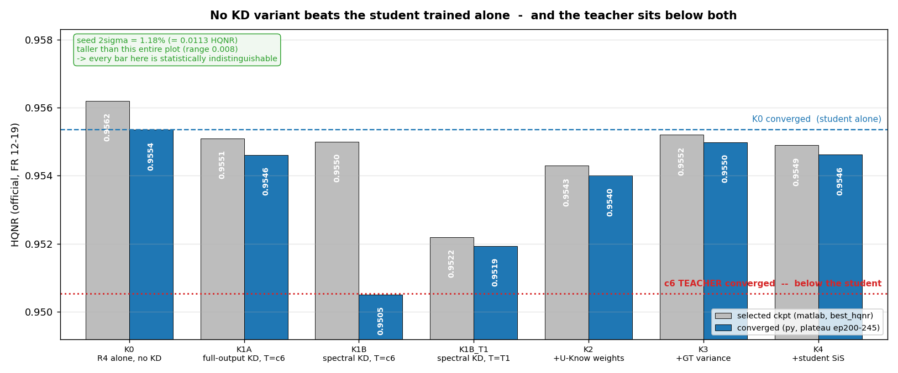
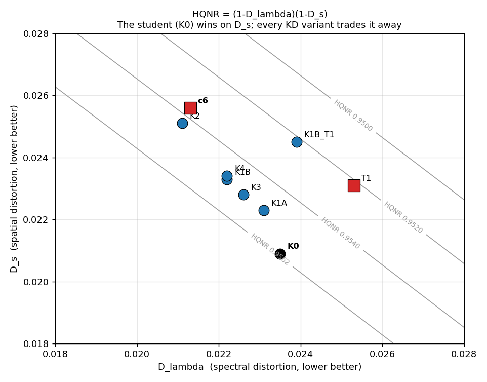
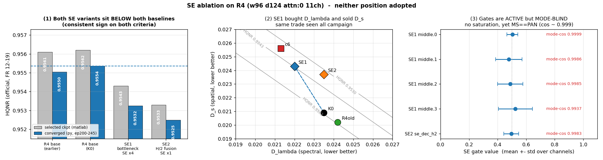

# 2026-09-01 — KD 사다리 · SE ablation · MS-only 그리드 (s1 13건 · s2 mutual 4건)

**s1 13건 완주(무장애).** 이 날의 세 문건을 하나로 합쳤다.

| 갈래 | 건수 | 결론 |
|---|---:|---|
| **KD 사다리 (K0~K4 + T1/T2)** | 7 | **KD·SE·MS 12건 중 K0(Student 단독)를 넘은 것이 없다.** 원인은 기법이 아니라 전제 — **Teacher 가 Student 보다 HQNR 이 낮다**(T1 −0.0040, 판정선 초과) |
| **SE ablation** | 2 | 두 위치 모두 무효 → **SE 계열 종료.** 게이트는 활성이나 MS/PAN mode-cos 0.994+ 로 **mode 의존 선택 미형성** |
| **MS-only 그리드** | 4 | **w128·11ch 만 견딘다.** 9ch 두 벌 −0.009~−0.012 → "MS-only 무손실" 불성립 |
| **Mutual (s2)** | 4 | **재차 무효**(M1≈M0, M3<M2) → 갈래 종료 |

**U-Know 가중은 이득 장치가 아니라 오염 방어 장치로 작동했다** — K1B_T1 → K2 → K3 가
단조 회복(−0.0040 → −0.0019 → −0.0010)하고, K1B_T1 대조군이 "가중 기여 > teacher 교체"를 분해했다.

> **판정선 정정 반영.** 원문들은 당시 밴드 0.011 로 "구분되지 않는다"를 썼다.
> 아래 §1(요약)은 실측 상한 **0.0027**([2026-09-04](2026-09-04_placement-and-band-invalidation.md))로
> **다시 매긴 것**이고, §2 이후 원문은 당시 판정을 그대로 둔다.

---

## 2026-09-01 — KD 사다리 7건 · SE ablation 2건 · MS-only 4건

> 원문: `2026-09-01.md`

s1 · 13건 완주 (무장애) · 50K · seed 2025 · 아키텍처 `fixed`
캠페인 문서: [`../2026-09-01_kd-mutual-campaign-results.md`](2026-09-01_kd-se-msonly-campaigns.md) ·
[`../2026-09-01_se-ablation-results.md`](2026-09-01_kd-se-msonly-campaigns.md)

> **판정 = best checkpoint HQNR(공식 12-19) → SCC.** ERGAS·SAM 은 §4 참고 지표.
> **판정선 = 0.0027** (실측 상한). 이 문서는 당시 0.011 로 쓴 판정을
> [2026-09-04](2026-09-04_placement-and-band-invalidation.md) 의 정정 밴드로 **다시 매긴 것**이다.

---

### 1. 어떤 실험인가

**"큰 Teacher 의 지식으로 작은 Student 의 경량화 손실을 회복한다"** 는 전제를 세 갈래로 검증했다.

**① KD 사다리** — 각 단계는 앞 단계에 **한 항만** 더한다 (Student = R4 2.13M).

| case | 더한 것 | Teacher |
|---|---|---|
| **K0** | — (Student 단독, 기준선) | — |
| K1A | full-output KD `L1(pred, t_pred)` | c6 |
| K1B | spectral-only KD (LR 스케일 L1+SAM) | c6 |
| K1B_T1 | K1B 와 동일, **teacher 만 교체** | T1 |
| K2 | + U-Know 가중 (`w_hard=1+αu`, `w_soft=1−u`) | T1 |
| K3 | + GT 국소분산 (`w_hard=norm(1+αu+βv)`) | T1 |
| K4 | + Student SiS | T1 |

**② SE ablation** — R4 는 c6 에서 width 만 128→96 으로 줄인 구조다. 줄인 채널을
SE 로 재조정하면 되찾는가. 두 위치를 독립 검증 (계획 `research_log/se_ablation_two_experiments.md`).

**③ MS-only 그리드** — MARs 의 PAN mode 를 빼도 되는가. {w96,w128}×{11ch,9ch} 전수.

### 2. 어떤 결과가 나왔나

| # | case | 설정 | **best HQNR** | ep | SCC | D_λ | D_s | **vs K0** |
|---|---|---|---:|---:|---:|---:|---:|---:|
| — | **K0** | Student 단독, KD 없음 | **0.95616** | 145 | 0.9901 | 0.0235 | **0.0209** | 기준 |
| 1 | K1A | full-output KD, T=c6 | 0.95514 | 210 | 0.9905 | 0.0231 | 0.0223 | −0.0010 |
| 2 | K1B | spectral KD, T=c6 | 0.95502 | **75** | 0.9888 | 0.0222 | 0.0233 | −0.0011 |
| 3 | K1B_T1 | spectral KD, T=T1 | 0.95216 | 220 | 0.9904 | 0.0239 | 0.0245 | **−0.0040** |
| 4 | K2 | + U-Know 가중 | 0.95427 | 205 | 0.9905 | **0.0211** | 0.0251 | −0.0019 |
| 5 | K3 | + GT 국소분산 | **0.95521** | 225 | **0.9906** | 0.0226 | 0.0228 | −0.0010 |
| 6 | K4 | + Student SiS | 0.95488 | 225 | 0.9906 | 0.0222 | 0.0234 | −0.0013 |
| 7 | SE1 | bottleneck SE×4 (2.1382M) | 0.95426 | 150 | 0.9902 | **0.0220** | 0.0243 | −0.0019 |
| 8 | SE2 | H/2 skip-fusion SE×1 (2.1309M) | 0.95330 | 150 | 0.9901 | 0.0235 | 0.0237 | **−0.0029** |
| 9 | MS1 w96·11ch | MS-only | 0.95120 | 110 | 0.9906 | — | — | **−0.0050** |
| 10 | MS1 w128·11ch | MS-only | 0.95388 | 80 | 0.9909 | — | — | −0.0023 |
| 11 | MS1 w96·9ch | MS-only | 0.94412 | 195 | 0.9911 | — | — | **−0.0120** |
| 12 | MS1 w128·9ch | MS-only | 0.94749 | 145 | 0.9911 | — | — | **−0.0087** |
| — | **c6 Teacher** | 3.77M | 0.95360 | 150 | 0.9908 | 0.0213 | 0.0256 | −0.0026 |
| — | **T1 Teacher** | 3.77M | 0.95218 | 145 | 0.9906 | 0.0253 | 0.0231 | **−0.0040** |

**KD·SE·MS 12건 중 K0 를 넘은 것이 하나도 없다.** 최선은 K3(−0.0010).
판정선 0.0027 을 넘어 **실재하는 손실**인 것: K1B_T1 · SE2 · MS 3건 · **T1 Teacher**.

#### 2.1 Teacher 가 Student 보다 낮다

| | params | best HQNR | vs K0 |
|---|---:|---:|---:|
| **Student R4 (K0)** | **2.13 M** | **0.95616** | — |
| c6 Teacher | 3.77 M | 0.95360 | −0.0026 (경계) |
| T1 Teacher | 3.77 M | 0.95218 | **−0.0040 (초과)** |

#### 2.2 KD 가 언제 해를 끼치는지 — 궤적

*K1B(빨강)는 **ep74 까지 K0 와 정확히 겹치다가** 갈라진다. ep74 = 15K iter =
soft KD 가중이 최대에 도달하는 지점. 이후 c6 Teacher 의 수렴값에 안착한다.*

`best_hqnr` 이 K1B 에서 고른 것은 **ep75, 손상 직전의 정점**이다. 그래서 판정값은
멀쩡해 보이지만 수렴한 모델은 0.9505 다 — Teacher 값(0.9505)과 5자리 일치.

#### 2.3 D_λ·D_s 평면

*K0(검정)만 아래쪽에 홀로 있다 — D_s 0.0209 로 전 실행 최저. KD·SE 를 붙인 순간
전부 위로(D_s 악화) 이동해 Teacher 쪽으로 끌려간다.*

*SE 게이트는 살아 있다(std 0.04~0.12, 포화 0%). 그러나 **MS/PAN mode-cos 0.9937~0.9999**
로 mode 를 구분하지 않는다 — 계획 §8 채택조건 3 불충족.*

### 3. 어떤 분석이 나왔나

**① 전제가 뒤집혔다 — Teacher 가 Student 보다 못하다.**
캠페인은 "Student 가 뒤처지니 KD 로 메운다"로 짜였고, 그 전제는 **ERGAS 로 세운 것**이다
(ERGAS 로는 c6 가 R4 를 1.7% 앞선다). HQNR 로는 반대다. 두 모델은 우열이 아니라 다른
최적점에 있다 — Teacher 는 D_λ 가, Student 는 D_s 가 낮고, 곱으로 결합되는 HQNR 에선
Student 의 D_s 우위가 더 크다. **넘겨받을 더 나은 지식이 없었다.**

**② KD 는 이득이 아니라 오염으로 작동했다.** 기전이 두 증거로 확인된다 — 손상 시점이
soft 램프 완료(ep74)와 **정확히** 일치하고, 도착점이 Teacher 의 HQNR 과 **5자리 일치**한다.
Teacher 가 Student 보다 나쁜 한 **KD 의 상한은 Teacher 자신**이다.

**③ U-Know 가중은 이득 장치가 아니라 방어 장치다.** K1B_T1 → K2 → K3 가 단조 회복하고
(−0.0040 → −0.0019 → −0.0010) K3 에서 손실이 거의 사라진다. θ 가 **Teacher 를 믿을 곳에서만
믿게 만들어 오염을 걷어낸다.** 다만 방어의 상한은 원점이다 — K3 도 K0 를 넘지 못했다.
K1B_T1 대조군이 분해를 완성했다: 회복분 중 **가중이 teacher 교체보다 크다.**

**④ SE 는 두 위치 다 무효 → 계열 종료.** SE1 은 D_λ 를 −6.4% 실제로 회복했으나
(w128 c6 수준 근접) D_s 를 +16.3% 잃어 순손실이다 — R4 를 *더 나은 R4* 가 아니라
**작은 c6** 로 만들었다. SE2 는 D_λ 개선 0% 인 채 D_s 만 잃어 경쟁 가설(병목이
skip-fusion 채널 선택)이 기각됐다. 게이트가 mode-blind 라 계획 §8 조건 3 도 불충족.

**⑤ MS-only 는 w128·11ch 만 견딘다.** 9ch 두 벌이 −0.009~−0.012 로 크게 무너졌다.
w96·11ch 도 −0.0050 로 판정선을 넘는다. **"MS-only 무손실"은 성립하지 않는다** —
이 축소는 [2026-09-03](2026-09-03_teacher-arch-4to6m.md) 에서 4-6M 대역까지 확장돼 원인(PAN reconstruction
task 제거)이 규명된다.

**⑥ 관통하는 패턴: `D_λ 를 사고 D_s 를 파는` 변경은 전부 HQNR 순손실이다.**
T2 SiS · K1A · K1B · K2 · SE1 · SE2 전부 같은 방향이었다. **R4 의 D_s 0.0209 는 전 실행
최저이고, 무엇을 더해도 올라갔다.**

**⑦ 다음.** KD 기법이 아니라 **Teacher 선정**이 병목이다 → [2026-09-03](2026-09-03_teacher-arch-4to6m.md)
에서 4-6M 확대를 시도한다(실패). "경량화 손실 회복" 프레임 자체를 폐기해야 한다 —
2.13M 이 3.77M 보다 HQNR 이 높으므로 **경량화는 이미 이득**이다.

### 4. 참고 지표 — 판정에 쓰지 않음

| case | ERGAS ↓ | SAM ↓ | PSNR ↑ | Q2n ↑ | params | 추론 | 학습 |
|---|---:|---:|---:|---:|---:|---:|---:|
| K0 | 2.1273 | 2.8653 | 37.6663 | 0.9181 | 2.13 M | 4.75 ms | 1.98 h |
| K1A | 2.0991 | 2.8360 | 37.7733 | 0.9197 | 2.13 M | 4.37 ms | 2.24 h |
| K1B | 2.2436 | 2.9963 | 37.2426 | 0.9151 | 2.13 M | 4.77 ms | 2.32 h |
| K1B_T1 | 2.1041 | 2.8342 | 37.7588 | 0.9200 | 2.13 M | 4.77 ms | 2.31 h |
| K2 | 2.1013 | 2.8417 | 37.7739 | 0.9197 | 2.13 M | 4.67 ms | 2.32 h |
| K3 | **2.0915** | 2.8408 | 37.7978 | 0.9200 | 2.13 M | 4.97 ms | 2.32 h |
| K4 | 2.0926 | 2.8364 | **37.8058** | **0.9202** | 2.13 M | 4.80 ms | 2.39 h |
| SE1 | 2.1317 | 2.8697 | 37.6564 | 0.9194 | 2.1382 M | 4.77 ms | 1.99 h |
| SE2 | 2.1296 | 2.8682 | 37.6574 | 0.9186 | 2.1309 M | 4.93 ms | 1.97 h |
| c6 Teacher | 2.0826 | 2.8178 | 37.8373 | 0.9204 | 3.77 M | 6.63 ms | 2.40 h |

**ERGAS 로 읽으면 정반대 결론이 나온다** — KD 가 K0 2.1273 을 K3 2.0915(−1.7%)로 개선한
것처럼 보이고 Teacher 가 가장 좋아 보인다. 이 캠페인이 ERGAS 로 Teacher 를 고른 탓에
어긋난 것이 §3-①이다.

### 5. 배제한 것

| 가설 | 검증 | 결과 |
|---|---|---|
| KD 구현이 잘못돼 신호가 안 들어간다 | K1B 궤적이 soft 램프(ep74)에 정확히 반응 | **아니다** — 방향이 문제 |
| K1B 가 이상치다 | c6 수렴 HQNR 과 5자리 일치 | **아니다** — Teacher 값으로 정확히 수렴 |
| K2 의 회복이 teacher 교체 덕이다 | K1B_T1 대조군 | **아니다** — 가중 기여가 더 크다 |
| θ calibration 부실로 K2 가 약했다 | Spearman 0.884 · excess 0.082 | **아니다** — 재료가 아니라 원료가 없었다 |
| SE 가 상수로 죽었다 | gate std 0.04~0.12, 포화 0% | **아니다** — 활성. 단 mode-blind |
| Student 우위가 선택 노이즈다 | 판정선 0.0027 대비 T1 −0.0040 | **아니다** — 초과 |

---

## KD(s1)·Mutual(s2) 캠페인 결과 — HQNR 는 어떤 변형으로도 움직이지 않았다 (2026-09-01)

> 원문: `2026-09-01_kd-mutual-campaign-results.md`

명세·구현: [`research_log/2026-08-31_kd-mutual-implementation-report.md`](../research_log/2026-08-31_kd-mutual-implementation-report.md).
s1 KD 9건(테이블+게이트, 21h)·s2 mutual 4건(2-peer) **전부 무장애 완주**.
판정 기준: **HQNR(공식 12-19) → SCC**, 동급 band 0.011 / SCC 판정선 ±0.0005.
ERGAS·SAM 등은 참고 지표로 기록만 하고 판정에 쓰지 않는다.
Teacher = c6 계열(3.77M), Student = `R4_w96_d124_noattn`(w96·d124·attn0·11ch, 2.13M).

### 1. s1 — Teacher 준비와 KD 사다리

**Teacher (uncertainty head 부착 성공):**

| 실행 | HQNR | SCC | Calibration (θ-오차) |
|---|---:|---:|---|
| `T1_c6_unc` (c6+uncertainty) | 0.9522 | 0.9906 | **PASS** — Spearman 0.884, 5분위 MAE 완전 단조(8.6배) |
| `T2_c6_unc_sis` (+SiS) | 0.9498 | 0.9911 | **PASS** — 0.885, 완전 단조 |
| (참조) c6 | 0.9536 | 0.9908 | — |

셋 다 동급 band. θ 가 오차 순서를 강하게 예측해 uncertainty routing 의 전제 성립
— K2+ 의 teacher 는 HQNR 명목 우위인 T1 로 확정했다.

**KD 사다리 (Student, 전부 50K·HQNR 선택):**

| 실행 | soft 구성 | HQNR | SCC |
|---|---|---:|---:|
| `K0_R4_base` (기준선) | 없음 | **0.9562** | 0.9902 |
| `K1A_R4_fullKD` | full-output 모방 (T=c6) | 0.9551 | 0.9906 |
| `K1B_R4_specKD` | LR spectral 만 (T=c6) | 0.9550 | **0.9889** ← 유일한 악화 |
| `K1B_T1_specKD` | 〃 (T=T1) | 0.9522 | 0.9905 |
| `K2_R4_uknow` | + uncertainty routing (T=T1) | 0.9543 | 0.9905 |
| `K3_R4_uknow_gtvar` | + GT variance | 0.9552 | **0.9907** |
| `K4_R4_uknow_gtvar_sis` | + Student SiS | 0.9549 | 0.9907 |

K0 재기준은 기존 R4(0.9561)와 동일 — KD 코드 경로 등가 실증.

### 2. s2 — Mutual learning (2-peer, pair 평균 HQNR 선택)

| 실행 | 구성 | HQNR (peerA / peerB) | SCC |
|---|---|---|---:|
| `M0_R4R4_indep` | 독립 대조 (mutual 없음) | 0.9550 / 0.9520 | 0.9904 |
| `M1_R4R4_resmutual` | 양방향 residual mutual | 0.9553 / 0.9519 | 0.9905 |
| `M2_R4edge_R4sis_indep` | edge/SiS specialization 만 | 0.9548 / 0.9539 | 0.9903 |
| `M3_R4edge_R4sis_mutual` | component mutual | 0.9534 / 0.9530 | 0.9903 |

### 3. 판정

1. **KD·mutual 어느 변형도 HQNR 를 유의하게 바꾸지 못했다.** s1 사다리 전체
   (0.9522~0.9562)와 s2 네 구성(pair 평균 0.9532~0.9544)이 전부 동급 band 안이고,
   SCC 도 K1B 를 제외하면 판정선 안 — **"구분되지 않는다"가 공식 판정**이다.
   긍정적으로 읽으면: 어떤 변형도 Student 의 HQNR 특성을 훼손하지 않았다.
2. **유일하게 판별된 것은 K1B 의 SCC 악화(0.9889)와 그 원인 귀속**이다 — 같은
   spectral KD 를 T1 teacher 로 바꾸자(K1B_T1) 악화가 사라졌다. **spectral KD 는
   teacher 의 spectral 품질에 민감**하며, 대조군 쌍(K1B/K1B_T1)을 요구한 게이트
   설계가 이 교란을 정확히 분리했다.
3. **Mutual 은 재차 무효** — M1 ≈ M0(pair 평균 0.9536 vs 0.9535), M3 은 M2 보다
   명목 열위. 2026-08-20 no-go 판정과 일관되며, 명세 §35 결정 트리의 결론은
   "mutual 은 baseline/negative result 로 두고 KD 집중"이다.
4. 명목 서열에서는 **K3(uncertainty+GT variance)가 사다리 최상**(HQNR 0.9552 ·
   SCC 0.9907, K0 와 격차 최소)이고 K1B_T1→K2→K3 방향이 일관 개선이지만,
   증분이 판정선 미만이라 채택 주장은 하지 않는다.
5. 참고 지표(판정에 쓰지 않음): best epoch 의 `ergas_at_best` 는
   K0 2.1117 → K1A 2.0837 → K3 2.0776 → K4 2.0794 로 사다리를 따라 내려간다.
   D_λ/D_s 분해 등 세부는 시트(WV3-s1/s2) 참조.

### 4. 운영 기록

- 게이트 신설 항목 전부 실작동: calibration 자동 검사(서명 포함)·대조군 완비 조건·
  다중 패스 4회(K2→K3→K4 순차 개방)·"사다리 전부 완료" 종료 판정.
- s2 의 2-peer 학습·pair 평균 선택·peerA/B 이중 행 시트 업로드 실작동 확인.
- K5(feature KD)는 구현 결함으로 No-Go 보류 상태 유지.

### 5. 다음

1. **SE ablation 2건 즉시 실행** (선구현 완료 — `SE1_R4_btl_se`·`SE2_R4_dec_h2_se`).
2. KD 방향 재설계 논의 거리: HQNR 를 움직이려면 출력 모방이 아니라 **D_λ/D_s 를
   직접 겨냥하는 loss** 또는 Student 구조 개선(SE 등)이 필요하다는 것이 이번
   캠페인의 함의다. Mutual 갈래는 종료.

---

### 추기 (2026-09-01 12시) — D_λ/D_s 분해 분석과 MS-only 결과 병합

#### A. 분해로 보면 증류는 실재했다 — 방법 승자 판정

"HQNR 무변동"(§3-1)을 HQNR = (1−D_λ)(1−D_s) 분해로 열면 성분 이동이 보인다:

| 실행 | D_λ↓ | D_s↓ | 해석 |
|---|---:|---:|---|
| (참조) `c6_c4d124` | 0.0213 | 0.0256 | teacher — spectral 우위 |
| `K0_R4_base` | 0.0235 | **0.0209** | student — spatial 우위 |
| `K2_R4_uknow` | **0.0211** | 0.0251 | teacher 의 spectral 일관성 완전 이식, spatial 강점 절반 상실 |
| **`K3_R4_uknow_gtvar`** | 0.0226 | 0.0228 | GT variance 가 균형 복원 |

**명세 §31.2 운영 목표 대조: `K3_R4_uknow_gtvar` 가 유일한 전항목 충족**이다 —
D_λ gap(K0−c6 = 0.0022) 41% 회복 ✓ · D_s 악화 +0.0019 ≤ 0.002 ✓ · HQNR 비회귀 ✓.
K2 는 D_λ 를 109% 회복하지만 D_s 악화가 한도(0.002)의 2배다. K4 는 K3 와 구분
불가라 단순한 K3 를 방법 후보로 확정한다. mutual 쪽도 같은 구조 — SiS peer 는
D_λ 최저(0.0202~3), edge peer 는 D_s 우위로 **specialization 이 구성비는 설계대로
움직였으나 곱은 불변**이었다.

Teacher 감사 보강(`tools/analyze_uncertainty.py`, T1): Top-10% θ 픽셀 오차 lift
**2.33×**, 10분위 완전 단조, edge/smooth 양 영역 Spearman 0.87(단순 edge 탐지기
아님), θ~GT분산 상관 0.52 — K3 에서 GT variance 가 θ 와 비중복 정보를 더한다는
사전 근거와 결과가 정합한다.

#### B. s2 MS-only 2건 — clean single-task backbone 성립

같은 기간 s2 에서 완료 (계획: `research_log/s2_ms_only_ablation_and_uncertainty_audit.md`):

| 실행 | D_λ↓ | D_s↓ | HQNR | SCC |
|---|---:|---:|---:|---:|
| `MS1_R4_msonly` (PAN task 제거) | 0.0229 | 0.0257 | 0.9520 | 0.9905 |
| **`MS2_R4_plain_msonly`** (mode modulation 까지 제거) | 0.0217 | 0.0249 | 0.9539 | **0.9910** |

둘 다 같은 서버의 R4-dual 쌍(`M0_R4R4_indep` 두 peer 0.9550/0.9520)과 동급 band,
MS2 는 SCC 명목 최고. **PAN auxiliary·mode modulation 전부를 제거한 순수 residual
U-Net 이 HQNR·SCC 동급 + 학습 ~2배** — 계획 §13 의 "clean single-task backbone
전환 가능" 분기가 성립했다. §5-2 의 재설계 논의와 합치면 자연스러운 다음 캠페인은
**plain backbone 위에서 K3 레시피 재검증**(MARs 의존성 제거 확인)이다.

---

## SE ablation 결과 — 게이트는 살아 있으나 성능을 못 움직였다 (2026-09-01)

> 원문: `2026-09-01_se-ablation-results.md`

계획: [`research_log/se_ablation_two_experiments.md`](../research_log/se_ablation_two_experiments.md)
· s1, 2건(합계 4.0h), 기준선 = `R4_w96_d124_noattn`(w96·d124·attn0·11ch·2.13M).
공통: 50K·nocrop·LN·dual MARs·best 선택 = 공식 HQNR. 판정: HQNR(band 0.011) →
SCC(판정선 0.0005). 참고 지표는 시트(WV3-s1) 기록.

### 결과

| 실행 | 위치 | Params | HQNR | SCC | gate 진단 (`tools/analyze_se_gates.py`) |
|---|---|---:|---:|---:|---|
| (기준) `R4_w96_d124_noattn` | — | 2.1285M | 0.9561 | 0.9900 | — |
| (기준) `K0_R4_base` (재기준) | — | 2.1285M | 0.9562 | 0.9901 | — |
| `SE1_R4_btl_se` | bottleneck ResBlock ×4 | 2.1382M | 0.9543 | 0.9903 | 활성(±0.12, 포화 0%) · **mode-cos 0.994~0.9999** |
| `SE2_R4_dec_h2_se` | H/2 skip-fusion 뒤 ×1 | 2.1309M | 0.9533 | 0.9903 | 활성(±0.05, 포화 0%) · mode-cos 0.998 |

### 판정 (계획 §8·§9)

1. **두 위치 모두 기준선과 HQNR·SCC 로 구분되지 않는다** — 채택 조건 1·2(성능 개선)
   불충족.
2. **채택 조건 3(동급 + mode-dependent selection)도 불충족** — 게이트는 콘텐츠에
   따라 실제로 열리고 닫히지만(상수 수렴 아님 → 실패 조건은 미해당), MS/PAN mode
   간 cosine 이 0.994~0.9999 로 **mode 의존적 채널 선택은 형성되지 않았다.**
3. §9 결정표의 "둘 다 무효" 행 — **SE 계열 종료, loss/KD 연구에 집중.**
   SE1+SE2 결합 후속도 열지 않는다(전제 미충족).

### 해석 한 줄

R4 의 제한된 채널이 "중요도 재조정"으로 회복될 여지는 없었다 — 채널 부족이 아니라
용량 자체의 문제라는 기존 폭-곡선 결론(폭 축소 단조 유상)과 정합한다. SE 게이트가
mode 를 구분하지 않은 것은 MARs 의 mode 조건화(γβ)가 이미 그 역할을 흡수하고
있다는 방증이기도 하다 — MS-only(plain) 전환 논의와도 어긋나지 않는다.

### 운영

체인 2/2 무장애(마감 여유 2h), KD 게이트 재점검은 "전부 완료"로 무해 통과.
gate 진단 JSON 은 각 work_dir 의 `se_gates.json`.

---

## [WIP] 진행 중인 실험 — MS-only baseline 2×2 전수 (2026-09-01)

> 원문: `2026-09-01_WIP_msonly-grid.md`

> **진행 중 — s1 0/4.** 전부 끝나면 정식 문서로 대체하고 이 파일은 지운다.

목적: s2 에서 성립한 MS-only(PAN task 제거, `mars: ms`)를 **앞으로의 baseline 후보**로
s1 에서 확정한다 — s2 `MS1_R4_msonly`(HQNR 0.9520·SCC 0.9905)의 서버 독립 재현 +
**{w96, w128} × {11ch, 9ch} 전수**. 전부 d124·attn0·nocrop·LN·50K·HQNR 선택,
MS modulation 유지(단일 mode). 학습은 dual 의 ~절반.

| # | 실행 | Params | 대조(같은 골격 dual, s1) |
|--:|---|---:|---|
| 1 | `MS1_R4_msonly` (w96·11ch, s2 재현) | 2.1285M | R4 0.9561 / K0 0.9562 |
| 2 | `MS1_w96_9ch_msonly` | 2.1268M | (w96·9ch dual 미실행 — 9ch 축은 w128 대조로 해석) |
| 3 | `MS1_w128_msonly` | 3.7719M | c6 0.9536 |
| 4 | `MS1_w128_9ch_msonly` | 3.7696M | N3 0.9475 |

#### 진행 기록

- 2026-09-01 15:4x: 체인 기동 (마감 +8h, 예상 소요 ~5h).
- 2026-09-01 17:47: **`MS1_R4_msonly` 완료 (1/4, 1.25h — dual 대비 38% 단축).**
  HQNR **0.9512** @110 · SCC **0.9907**. ① s2 값(0.9520·0.9905)과 차이 0.0008 —
  **서버 독립 재현 성립.** ② 같은 서버 dual 판(R4 0.9561·0.9900 / K0 0.9562·0.9901)
  대비 HQNR 동급 band, **SCC 는 +0.0007 로 판정선(0.0005)을 소폭 넘는 명목 우위** —
  PAN task 제거가 w96 에서 무손실+α. w96·9ch 셀 17:47 개시.
- 2026-09-01 19:02: **`MS1_w96_9ch_msonly` 완료 (2/4, 1.24h).** HQNR **0.9441**
  @195 · SCC **0.9911**(명목 최고 수준). 같은 폭의 11ch MS-only(0.9512·0.9907)
  대비 HQNR 동급 band(명목 −0.0071)·SCC 판정선 내 — **w96 에서 9ch 전환은
  HQNR·SCC 로 구분되지 않는다.** 다만 명목 HQNR 하락 방향은 기존 관찰
  (압축 폭에서 9ch 의 D_λ 열세 경향)과 일치 — w128 쌍의 결과로 확정한다.
  w128·11ch 셀 19:02 개시.
- 2026-09-01 20:31: **`MS1_w128_msonly` 완료 (3/4, 1.48h — c6 dual 2.40h 대비 38% 단축).**
  HQNR **0.9539** @80 · SCC **0.9909**. **c6(0.9536·0.9908)과 사실상 동일** —
  anchor 골격에서 PAN task 제거는 완벽 무손실이다. 마지막 셀 w128·9ch 20:32 개시.
