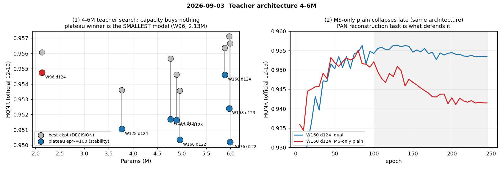

# 2026-09-03 — Teacher 아키텍처 4–6M 탐색 (12건)

**s1 MS-only plain 7건 + dual MARs 5건 완주(무장애, 29.8h).**

| 발견 | 내용 |
|---|---|
| **용량 확대 실패** | 계획 §8 최소 조건(Student 보다 나쁘지 않을 것)을 plateau 로 적용하면 **통과하는 4–6M 후보가 하나도 없다.** plateau 1위는 가장 작은 **W96(2.13M)** |
| **best vs plateau 충돌** | best 1위 W168·d123 이 plateau 7위. best−plateau 격차가 용량에 비례해 커진다(W96 0.0012 → W176 0.0087) |
| **MS-only 붕괴** | 4–6M 에서 −0.012~−0.016. 원인은 **PAN reconstruction task 제거**이고 mode 조건화(γβ)와 무관 → "MS-only 무손실"은 **W96/W128 한정**으로 축소 |

후반 하락 자체는 [2026-09-07](2026-09-07_alignment-shift-robust-and-metric-v2.md) 의 jitter 로 해결된다.

---

## 2026-09-03 — Teacher 아키텍처 4–6M 탐색 (12건)

> 원문: `2026-09-03.md`

s1 · MS-only plain 7건 + dual MARs 5건 완주 (무장애, 29.8h) · 50K · seed 2025
캠페인 문서: [`../2026-09-03_teacher-arch-4to6m-results.md`](2026-09-03_teacher-arch-4to6m.md)

> **판정 = best checkpoint HQNR(공식 12-19) → SCC.** **판정선 = 0.0027**
> (실측 상한, [2026-09-04](2026-09-04_placement-and-band-invalidation.md)). plateau 는 안정성 참고로 병기한다.

---

### 1. 어떤 실험인가

[2026-09-01](2026-09-01_kd-se-msonly-campaigns.md) 에서 **Teacher(3.77M)가 Student(2.13M)보다 HQNR 이 낮다**는
것이 드러났다. 자연스러운 처방은 **더 큰 Teacher** 다. 4–6M 대역을 격자로 훑어
"KD 에 전달할 headroom 이 있는 용량"이 존재하는지 확인한다.

| 축 | 값 |
|---|---|
| width | 96 · 128 · 144 · 152 · 160 · 168 · 176 |
| depth (d0/d1/d2) | d124 · d122 · d123 |
| task | **MS-only plain** 7건 (1차) · **dual MARs** 5건 (2차) |

계획 §8 이 미리 정의한 최소 조건: **Student 보다 HQNR 이 나쁘지 않을 것.**

### 2. 어떤 결과가 나왔나

**dual MARs 8점 격자** (11ch · attention 없음 · nocrop · 50K)

| 구성 | Params | **best HQNR** | plateau(ep≥100) | best−plateau |
|---|---:|---:|---:|---:|
| **W96 · d124** (Student) | **2.13M** | 0.9561 | **0.9549** | 0.0012 |
| W128 · d124 (c6) | 3.77M | 0.9536 | 0.9509 | 0.0027 |
| W144 · d124 | 4.77M | 0.9557 | 0.9504 | 0.0053 |
| W152 · d123 | 4.89M | 0.9546 | 0.9510 | 0.0036 |
| W160 · d122 | 4.96M | 0.9536 | 0.9498 | 0.0038 |
| W160 · d124 | 5.88M | 0.9564 | 0.9540 | 0.0024 |
| **W168 · d123** | 5.97M | **0.9571** | 0.9509 | 0.0062 |
| W176 · d122 | 5.99M | 0.9567 | **0.9480** | 0.0087 |

**best 로는 4–6M 후보 4개가 Student 를 앞선다. plateau 로는 Student 가 1위이고
4–6M 은 전부 그 아래다.** 두 기준이 정반대를 가리킨다.

#### 2.1 MS-only plain 의 후반 붕괴 — 용량에 비례한다

peak → 최종(ep245) HQNR 변화:

| 구성 | Params | MS-only plain | dual MARs |
|---|---:|---:|---:|
| W96 · d124 | 2.1M | −0.0038 | −0.0012 |
| W128 · d124 | 3.8M | −0.0066 | −0.0027 |
| W160 · d122 | 5.0M | −0.0087 | −0.0038 |
| W160 · d124 | 5.9M | −0.0136 | −0.0024 |
| W144 · d124 | 4.8M | **−0.0159** | −0.0053 |
| W176 · d122 | 6.0M | −0.0121 | −0.0087 |

원인 분리 (W128 세 실행, plateau):

| 구성 | plateau HQNR |
|---|---:|
| dual (`c6_c4d124`) | **0.9509** |
| MS-only · γβ 유지 | 0.9450 |
| MS-only plain (γβ 제거) | 0.9460 |

→ 손실은 **PAN reconstruction task 제거**에서 오고, mode 조건화(γβ) 제거와는 무관하다.

### 3. 어떤 분석이 나왔나

**① 4–6M 확대는 실패했다.** 계획 §8 의 최소 조건을 plateau 로 적용하면 **통과하는
후보가 하나도 없다.** width↑ / bottleneck depth↑ / 중간점 어느 배치로도 HQNR 이
오르지 않았다. 계획 §8 마지막 문장이 그대로 실현됐다 — **capacity 가 커져도 KD 에
전달할 headroom 은 생기지 않는다.**

**② best 와 plateau 가 정면 충돌한 첫 캠페인이다.** best 1위 W168·d123 은 plateau 에서
7위다(0.9571 → 0.9509). best epoch 이 75~130 으로 이르고 그 뒤 계속 내려가기 때문이다.
best−plateau 격차가 용량에 비례해 커진다(W96 0.0012 → W176 0.0087).

> **판정 규칙상 best 가 결정한다.** 다만 이 캠페인에서는 두 기준이 갈리므로,
> "W168·d123 을 teacher 로" 라는 결론을 그대로 내리기 전에 **후반 하락 자체가
> 문제**임을 기록해 둔다. 그 하락은 [2026-09-07](2026-09-07_alignment-shift-robust-and-metric-v2.md) 의 jitter 로 해결된다.

**③ KD 의 근본 문제가 재확인됐다.** Student(2.13M)가 plateau 최고라 "더 나은 teacher"가
존재하지 않는다. [2026-09-01](2026-09-01_kd-se-msonly-campaigns.md) 의 전제 붕괴와 같은 결론이 독립 경로로 나왔다.

**④ "MS-only 무손실"은 W96/W128 한정으로 축소된다.** 4–6M 에서는 붕괴가 −0.012~−0.016
으로 커져 band 를 훌쩍 넘는다. plateau ΔHQNR(dual − MS-only) = **+0.0112** 로, 이 저장소에서
구조 비교가 종전 band(0.011)를 넘은 드문 사례다. **s2 의 teacher(W160 MS-only plain)는
이 캠페인 최하위권 구성이므로 교체가 필요하다.**

**⑤ 다음 — loss 축.** 아키텍처 축이 닫혔으므로 남는 것은 loss 다. 직전 캠페인에서
D_λ/D_s 분해로 유일하게 운영 목표를 충족한 **K3(uncertainty + GT variance)** 레시피를
**dual 골격 위에서** 재검증하는 것이 자연스럽다.

### 4. 참고 지표 · 운영

- `tools/plateau_report.py` 가 이 캠페인의 해석을 갈랐다 — best 만 봤다면 반대 결론.
- 12건 전부 무장애. MS-only 7건 13.3h, dual 5건 16.5h.
- 시트 Note 에 **task 축(dual / MS-only)을 항상 명시**하도록 변경 — 이전에는 dual 이
  기준값이라 미기록돼 MS-only 행과 짝지을 수 없었다. 완료 12행 갱신.

---

## 4–6M Teacher 아키텍처 탐색 결과 — 용량 확대로는 headroom 이 생기지 않는다 (2026-09-03)

> 원문: `2026-09-03_teacher-arch-4to6m-results.md`

계획: [s1 4-6M teacher 탐색](../research_log/2026-09-01_s1-teacher-architecture-4-6m-plan.md) ·
검토: [계획 검토·구현 보고](../research_log/2026-09-02_two-plan-review-and-implementation.md).
**MS-only plain 7건 + dual MARs 5건 = 12건 완주(무장애).** 기존 dual 3건 재사용.

판정: **HQNR(공식 12-19) → SCC**, 동급 band 0.011. 확정 규칙에 따라
**best 와 plateau(공통 eval epoch 19개)를 병기**한다 — 이 캠페인에서 그 차이가 결론을 갈랐다.

---

### 1. 답 — 4–6M 확대는 실패했다

**dual MARs 8점 격자 (11ch · attention 없음 · nocrop · 50K)**

| 구성 | Params | best HQNR | **plateau HQNR** | best−plateau |
|---|---:|---:|---:|---:|
| **W96 · d124** (`R4_w96_d124_noattn`) | 2.13M | 0.9561 | **0.9549** | 0.0012 |
| W152 · d123 (`S1_T05_W152_D123_DUAL`) | 4.89M | 0.9546 | 0.9510 | 0.0036 |
| W128 · d124 (`c6_c4d124`) | 3.77M | 0.9536 | 0.9509 | 0.0027 |
| W168 · d123 (`S1_T05_W168_D123_DUAL`) | 5.97M | **0.9571** | 0.9509 | 0.0062 |
| W144 · d124 (`S1_T05_W144_D124_DUAL`) | 4.77M | 0.9557 | 0.9504 | 0.0053 |
| W160 · d124 (`S1_T05_W160_D124_DUAL`) | 5.88M | 0.9564 | 0.9540 | 0.0024 |
| W160 · d122 (`S1_T05_W160_D122_DUAL`) | 4.96M | 0.9536 | 0.9498 | 0.0038 |
| W176 · d122 (`S1_T05_W176_D122_DUAL`) | 5.99M | 0.9567 | **0.9480** | 0.0087 |

전 구간이 동급 band(0.011) 안이므로 **공식 판정은 "구분되지 않는다"**. 그러나 방향은
일관된다 — **plateau 1위는 가장 작은 2.13M 이고, 4–6M 후보는 전부 그 아래다.**
최대 격차 W96 − W176 = 0.0069 로 band 안이지만 이 캠페인 최대치다.

계획 §8 이 미리 정의한 "최소 조건"(student 보다 HQNR 이 나쁘지 않을 것)을 **plateau 로
적용하면 통과하는 4–6M 후보가 하나도 없다.** 계획 §8 마지막 문장이 그대로 실현됐다:
**capacity 가 커져도 KD 에 전달할 headroom 은 생기지 않는다.**

#### 1.1 best 로만 봤다면 정반대 결론이 났다

best HQNR 1위는 W168·d123(0.9571)이고 4–6M 후보 4개가 W96 을 앞선다. 그러나 **셋은
plateau 에서 부호가 뒤집힌다**(W160·d124, W168·d123, W176·d122). best epoch 이 75–130
으로 이르고, 그 이후 값이 계속 내려가기 때문이다. plateau 병기가 없었다면
"W168·d123 이 teacher"라는 잘못된 결론을 냈을 것이다.

---

### 2. 부수 발견 — MS-only plain 의 후반 D_λ 붕괴 (1차 캠페인)

1차 탐색은 계획대로 MS-only plain(PAN 재구성·γβ 제거)으로 돌았고 7/7 완주했지만,
**그 설정 자체가 4–6M 에서 무너진다**는 것이 결과였다.

#### 2.1 손실이 용량에 비례한다

peak → 최종(ep245) HQNR 변화:

| 구성 | Params | MS-only plain | dual MARs |
|---|---:|---:|---:|
| W96 · d124 | 2.1M | −0.0038 | −0.0012 |
| W128 · d124 | 3.8M | −0.0066 | −0.0027 |
| W160 · d122 | 5.0M | −0.0087 | −0.0038 |
| W160 · d124 | 5.9M | −0.0136 | −0.0024 |
| W144 · d124 | 4.8M | **−0.0159** | −0.0053 |
| W176 · d122 | 6.0M | −0.0121 | −0.0087 |

**dual 이 붕괴 폭을 대략 절반으로 줄이지만 없애지는 못한다** — 용량이 커질수록
후반에 HQNR 을 잃는 경향 자체는 두 설정 모두에 있다.

#### 2.2 원인은 D_λ 이고, PAN reconstruction task 가 방어한다

같은 구조 W160·d124 의 A/B (MS-only vs dual):

| ep | MS-only D_λ | dual D_λ | MS-only D_s | dual D_s |
|---:|---:|---:|---:|---:|
| 25 | 0.0211 | 0.0182 | 0.0514 | 0.0450 |
| 85 | 0.0301 | 0.0219 | 0.0507 | 0.0439 |
| 245 | **0.0398** | 0.0279 | 0.0531 | 0.0469 |

D_s 는 거의 고정이고 D_λ 만 단조 악화한다 — 붕괴는 전적으로 **spectral distortion** 이다.
plateau ΔHQNR(dual − MS-only) = **+0.0112 로 band(0.011)를 넘는다**. 이 저장소에서
band 를 넘은 구조 비교는 드물다.

원인은 기존 W128 실행 셋으로 좁혀진다 (plateau):

| 구성 | plateau HQNR |
|---|---:|
| dual (`c6_c4d124`) | **0.9509** |
| MS-only · γβ 유지 (`MS1_w128_msonly`) | 0.9450 |
| MS-only plain (`S1_A0_W128_D124_MS2`) | 0.9460 |

→ 손실은 **PAN reconstruction task 제거**에서 오고, mode 조건화(γβ) 제거와는 무관하다.

#### 2.3 기존 결론 축소

"MS-only 무손실"(m1 · MS1 · MS2 campaigns)은 **W96/W128 한정**으로 축소해야 한다.
그 대역에서는 붕괴 폭이 −0.004 수준이라 band 에 묻혔다.

---

### 3. 결론과 다음

1. **Teacher 는 4–6M 으로 올리지 않는다.** plateau 기준 최고는 여전히 W96(2.13M)이고,
   확대는 어느 배치(width↑ / bottleneck depth↑ / 중간점)로도 HQNR 을 못 올렸다.
2. **KD 의 근본 문제가 재확인됐다** — Student(2.13M)가 이미 plateau 최고라
   "더 나은 teacher"가 존재하지 않는다. 직전 KD 캠페인의 전제 붕괴와 같은 결론이다.
3. **s2 계획의 teacher 를 바꿔야 한다.** `S2_T00_W160_D122_MS2`(W160 MS-only plain)는
   이 캠페인에서 **plateau 최하위권(0.9498 dual / MS-only 는 더 낮음)** 인 구성이다.
   uncertainty KD 를 그 위에 얹으면 teacher 품질이 먼저 무너진다.
4. 남는 방향은 §1 이 아니라 **loss 축**이다 — 직전 캠페인에서 D_λ/D_s 분해로 유일하게
   운영 목표를 충족한 `K3`(uncertainty + GT variance) 레시피를, 이번에 확인된
   **dual 골격 위에서** 재검증하는 것이 자연스럽다.

### 4. 운영 기록

- 12건 전부 무장애. MS-only 7건 13.3h, dual 5건 16.5h.
- `tools/plateau_report.py` 가 이 캠페인의 결론을 갈랐다 — best 만 봤다면 반대 결론.
- 시트 Note 에 **task 축을 항상 명시**하도록 변경(이전에는 dual 이 기준값이라
  미기록돼 MS-only 행과 짝지을 수 없었다). 완료 12행 갱신.
- 계획 §4.2 의 조건부 중간점은 1차에서 SCC 포화(Δ<0.0002)로 게이트가 성립하지 않아,
  dual 재탐색에서는 조건 없이 둘 다 편성했다.
