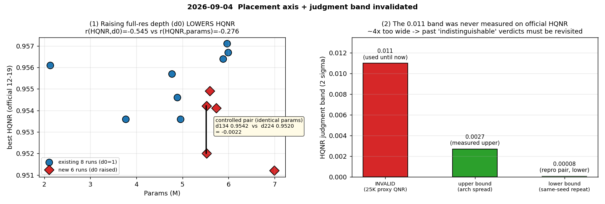

# 2026-09-04 — 배치 축 6건 + 판정 밴드 0.011 무효 판정

**s1 6건 완주(무장애, 24.7h).** 이 날 가장 큰 결과는 아키텍처가 아니라 **판정선 자체**다.

| 발견 | 내용 |
|---|---|
| **판정선 무효** | "HQNR 시드 2σ ≈ 0.011" 이 **공식 HQNR 에서 측정된 적이 없다.** 출처는 25K·proxy QNR. 실측 상한 **0.0027**(4배 좁다) → **과거 "구분되지 않는다" 판정 전부 소급 재검토** |
| **배치 축** | 같은 params 를 full-res 에 쓰면 H/2 에 쓸 때보다 HQNR **−0.0022**(통제쌍). d0 가 params 보다 강한 예측자(r −0.545 vs −0.276) |
| **7M 확대** | 최대 6.99M 이 14벌 중 **최하위** — headroom 없음 |
| **proxy 열 경고** | `metrics.csv` 의 `d_lambda`/`d_s` 는 공식 분해가 **아니다**(순위 상관 사실상 0). 분해는 `tools/eval_dlpan_fr.py --indices 12-19` 로만 |

---

## 2026-09-04 — 배치 축 6건 + **판정 밴드 0.011 무효 판정**

> 원문: `2026-09-04.md`

s1 · 6건 완주 (무장애, 24.7h) · dual MARs · 11ch · attention 없음 · nocrop · 50K
캠페인 문서: [`../2026-09-04_hqnr-band-invalid-and-placement-results.md`](2026-09-04_placement-and-band-invalidation.md)

> **판정 = best checkpoint HQNR(공식 12-19) → SCC.**
> 이 문서가 **판정선 자체를 바꾼다** — 0.011 → 실측 상한 **0.0027**.

---

### 1. 어떤 실험인가

두 가지를 동시에 했다.

**① 배치 축** — [2026-09-03](2026-09-03_teacher-arch-4to6m.md) 에서 용량 확대가 실패했다. 그렇다면
**같은 파라미터를 어디에 쓰느냐**가 문제일 수 있다. full-res(d0) · H/2(d1) · bottleneck(d2)
중 어디에 깊이를 주는가를 6벌로 훑었다. 핵심은 **params 가 완전히 같은 통제쌍**이다.

| | Params | 배치 |
|---|---:|---|
| W144 · **d134** | 5,518,088 | H/2 에 +1 |
| W144 · **d224** | 5,518,088 | full-res 에 +1 |

**② 판정선 출처 추적** — 그동안 모든 판정에 쓴 "HQNR 시드 2σ ≈ 0.011" 이
어디서 나온 숫자인지 확인했다.

### 2. 어떤 결과가 나왔나

#### 2.1 배치 — full-res 에 쓰면 HQNR 이 내려간다

| 구성 | Params | d0/d1/d2 | **best HQNR** | D_λ | D_s |
|---|---:|:---:|---:|---:|---:|
| W136 · d234 | 5.59M | 2/3/4 | **0.9549** | 0.0215 | 0.0241 |
| W144 · d134 | 5.52M | 1/3/4 | 0.9542 | 0.0214 | 0.0249 |
| W152 · d223 | 5.73M | 2/2/3 | 0.9541 | 0.0233 | 0.0231 |
| W168 · d124 | 6.48M | 1/2/4 | 0.9531 | 0.0233 | 0.0241 |
| W144 · d224 | 5.52M | 2/2/4 | 0.9520 | 0.0246 | 0.0240 |
| W168 · d223 | **6.99M** | 2/2/3 | **0.9512** | 0.0217 | 0.0277 |

신규 6벌이 **전부 기존 최고 아래**이고 6벌 중 5벌이 기존 중앙값 아래다.
그룹 평균 차 **ΔHQNR = −0.00219** (순열검정 p=0.015, MWU p=0.029).

**통제쌍**: `d134 0.9542` vs `d224 0.9520` = **−0.0022**. params·seed·데이터·스케줄이
전부 같아 교란이 없다.

**14벌 상관** — d0 가 params 보다 두 배 강한 예측자다.

| 상관 | r |
|---|---:|
| HQNR ↔ **D_s(공식)** | **−0.776** |
| HQNR ↔ **d0 (full-res depth)** | **−0.545** |
| HQNR ↔ params | −0.276 |
| HQNR ↔ D_λ(공식) | −0.241 |

#### 2.2 판정선 0.011 은 공식 HQNR 에서 측정된 적이 없다

| 확인한 것 | 내용 |
|---|---|
| 출처 | `p25_s*` 3벌. 그런데 이 3벌의 `metrics.csv` 에 **`hqnr_official` 열이 없다** — 25K · crop=True 체제의 **proxy QNR(20장)** 이지 공식 HQNR(8장, 12-19)이 아니다 |
| 시드 반복 | `work_dir` 전체에서 seed≠2025 인 실행 7개 중 `hqnr_official` 보유 **0개** → **공식 HQNR 은 시드 반복이 한 번도 없었다** |
| 유일한 재현쌍 | `K0_R4_base` vs `R4_w96_d124_noattn` (동일 config·동일 seed, 3일 간격) → \|Δ\| = **0.0000834** |
| 아키텍처 산포 | 서로 다른 8개 구조의 best HQNR sd = **0.00137**. per-run σ=0.0055 라면 나올 수 없는 값 |

**→ 상한 ≈ 0.0027 (아키텍처 산포), 하한 ≈ 0.00008 (재현쌍). 0.011 은 약 4배 넓다.**

#### 2.3 부수 — `metrics.csv` 의 `d_lambda`/`d_s` 는 공식 분해가 아니다

| | 정의 | 세트 |
|---|---|---|
| `metrics.csv` 열 | `utils.py` global-UIQI **proxy**, MTF 없음 | 20장 전체 |
| `hqnr_official` | Khan D_λ(DLPan genMTF) + block-UQI D_s | **12-19 8장** |

실측 예(W168·d124, ep60): proxy 0.0191/0.0439 → 0.9382 vs 공식 0.0233/0.0241 → 0.9531.
두 계열의 실행 간 **순위 상관은 사실상 0.** 앞으로 HQNR 분해는
`tools/eval_dlpan_fr.py --indices 12-19` 로만 한다.

### 3. 어떤 분석이 나왔나

**① full-res depth 를 올리지 않는다.** 같은 파라미터를 full-res 에 쓰면 H/2 에 쓸 때보다
HQNR 이 0.0022 낮다. d0 는 params 보다 강한 예측자이고, 이번 캠페인이 처음 움직인 축이
바로 그것이다. 단 **그룹 수준에서는 d0 와 용량이 교란**돼 있어(기존 8벌은 전부 d0=1),
분리된 유일한 증거가 통제쌍이다.

**② 7M 까지 확대해도 headroom 은 없다.** 최대 6.99M 이 14벌 중 **최하위**다.
[2026-09-03](2026-09-03_teacher-arch-4to6m.md) 의 결론이 상한을 7M 으로 올려도 유지된다.

**③ 판정선 정정이 이 문서의 가장 큰 결과다.** 0.011 로 "구분되지 않는다" 판정한
**과거 결론 전부가 소급 재검토 대상**이다. 실제로 [2026-09-01](2026-09-01_kd-se-msonly-campaigns.md) 은
이 밴드로 다시 매겼고, 그 결과 "Teacher 가 Student 보다 낮다"가 방향 주장에서
**판정선을 넘는 실재하는 차이**로 승격됐다(T1 −0.0040 > 0.0027).

**④ 아직 모르는 것 — 진짜 밴드는 여전히 미측정이다.** 재현쌍은 같은 seed 라 **비결정성**만
재므로 하한이고, 아키텍처 산포는 구조 차이를 포함하므로 상한이다. **공식 HQNR 의 시드
반복(동일 config, seed 2~3벌)이 지금 가장 필요한 실험이다** — `W168·d123` 과 `W96·d124`
각각 2벌씩 4벌(≈17h)이면 σ 를 얻는다. 그때까지 코드의 `HQNR_BAND` 는 0.011 을 유지하되
**"미검증 상한"** 으로 주석한다(임의로 좁히면 근거 없는 승자 선언이 늘어난다).

**⑤ 판정 지표와 참고 지표가 이 구간에서 분리돼 있다.** 14벌에서 best HQNR 과의 상관이
ERGAS −0.051 · SCC +0.086 · PSNR +0.029 로 사실상 0 이다. 극단적으로 **HQNR 최하위
W168·d223 이 ERGAS·SCC 둘 다 14벌 중 1위**다. 규칙대로 HQNR 이 결정하므로 최하위로
판정하되, 이 캠페인의 "실패"는 **full-resolution no-reference 지표에서의 실패**이지
GT 대비 복원 품질의 실패가 아니라는 점은 기록해 둔다.

### 4. 배제한 것 — 회귀는 없다

| 우려 | 검증 | 결과 |
|---|---|---|
| 두 캠페인 사이 코드 회귀 | `model/`·`feeders/`·`train.py`·`utils.py`·`main.py`·`tools/metrics/` **바이트 동일** | 없음 |
| 환경 변화 | `meta/environment.txt` 동일 (torch 2.4.0/cu11.8, RTX 4090), 41일 무재부팅 | 없음 |
| 학습 이상 | 14벌 전부 49 eval 행 · 마지막 step 49490 · NaN 0 · resume 0건 | 없음 |
| 평가 재현성 | 저장된 `full_best_hqnr.mat` 재평가 시 기록값과 **3e-8 이내** 일치 | 정상 |

### 5. 운영

- 6/6 무장애, case 당 3h25m~4h44m, 전체 24.7h.
- 25K 스케줄 case 는 착수 전 큐에서 제거하고 W168·d223(6.99M)로 교체 — best checkpoint
  로 판정하면 후반 하락이 반영되지 않아 그 가설이 성립하지 않는다.
- **판정 코드에서 ERGAS tie-break 를 제거했다** (`tools/campaign_gate.py`, 커밋 d7beccf).
  문서만 고치고 코드를 두면 규칙이 조용히 되살아난다.

---

## 고해상도 배치 축 결과 + **판정 밴드 0.011 이 이 지표의 것이 아니었다** (2026-09-04)

> 원문: `2026-09-04_hqnr-band-invalid-and-placement-results.md`

큐: `config/queues/s1_teacher_placement.txt` (6벌, dual MARs · 11ch · attention 없음 ·
nocrop · 50K). 2026-09-03 11:54 → 2026-09-04 12:36, **6/6 완주 무장애.**
직전 문서: [4-6M teacher 탐색 결과](2026-09-03_teacher-arch-4to6m.md).

판정: **best checkpoint HQNR(공식 12-19) → SCC.** ERGAS·SAM 은 참고 지표이며 판정에
쓰지 않는다. 이 문서는 직전 문서의 **기전 설명을 정정**한다 (CONVENTION §5 — 원문은 두고
새 문서를 쓴다).

---

### 1. 답 — 배치를 올리면 HQNR 이 내려간다. 그리고 그 차이는 실재한다

**best HQNR (판정 지표)**

| 구성 | Params | d0/d1/d2 | **best HQNR** | best ep | D_λ(공식) | D_s(공식) |
|---|---:|:---:|---:|---:|---:|---:|
| W136·d234 | 5.59M | 2/3/4 | **0.9549** | 100 | 0.0215 | 0.0241 |
| W144·d134 | 5.52M | 1/3/4 | 0.9542 | 80 | 0.0214 | 0.0249 |
| W152·d223 | 5.73M | 2/2/3 | 0.9541 | 100 | 0.0233 | 0.0231 |
| W168·d124 | 6.48M | 1/2/4 | 0.9531 | 60 | 0.0233 | 0.0241 |
| W144·d224 | 5.52M | 2/2/4 | 0.9520 | 80 | 0.0246 | 0.0240 |
| W168·d223 | 6.99M | 2/2/3 | **0.9512** | 130 | 0.0217 | 0.0277 |

기존 8점 격자는 0.9536–0.9571 이었다. **신규 6벌이 전부 기존 최고 아래이고, 6벌 중 5벌이
기존 중앙값 아래다.** 그룹 평균 차 **ΔHQNR = −0.00219** (기존 0.95545 → 신규 0.95326),
정확 순열검정 p=0.015, MWU p=0.029. plateau(ep≥100 평균)에서도 −0.0022 로 동일하므로
**checkpoint 추첨 문제가 아니라 학습된 모델의 성질**이다.

#### 1.1 통제쌍 — params 가 완전히 같은 배치 대조

| 구성 | Params | 배치 | best HQNR | D_λ | D_s |
|---|---:|---|---:|---:|---:|
| W144·**d134** | 5,518,088 | H/2 +1 | **0.9542** | 0.0214 | 0.0249 |
| W144·**d224** | 5,518,088 | full-res +1 | 0.9520 | 0.0246 | 0.0240 |

**같은 파라미터를 full-res 에 쓰면 H/2 에 쓸 때보다 HQNR 이 0.0022 낮다.**
이 쌍은 params·seed·데이터·스케줄이 전부 같아 교란이 없다.

#### 1.2 무엇이 HQNR 을 가르는가 (14벌 상관)

| 상관 | r |
|---|---:|
| HQNR ↔ **D_s(공식)** | **−0.776** |
| HQNR ↔ **d0(full-res depth)** | **−0.545** |
| HQNR ↔ params | −0.276 |
| HQNR ↔ D_λ(공식) | −0.241 |
| HQNR ↔ d2(bottleneck) | −0.076 |
| HQNR ↔ d1(H/2) | +0.015 |

**d0 가 params 보다 두 배 강한 예측자다.** 이번 캠페인이 처음 움직인 축이 바로 그것이다.

단 **그룹 수준에서는 d0 와 용량이 완전히 교란돼 있다** — 기존 8벌은 전부 d0=1·d1=2 로
분산이 0 이고, 신규 6벌은 평균 +1.18M 크다. 14벌만으로는 둘을 분리할 수 없다.
분리된 유일한 증거가 §1.1 통제쌍이다.

#### 1.3 기전은 **공간 왜곡(D_s)** 이다 — 직전 문서의 D_λ 설명은 틀렸다

공식 분해 (`tools/eval_dlpan_fr.py --indices 12-19`, 14벌 전부 재계산):

| | D_λ | D_s | HQNR |
|---|---:|---:|---:|
| 기존 8 평균 | 0.02210 | 0.02294 | 0.95545 |
| 신규 6 평균 | 0.02263 | 0.02465 | 0.95326 |
| Δ | +0.00053 | **+0.00171** | −0.00219 |
| HQNR 기여 | −0.00052 (**24%**) | **−0.00167 (76%)** | |

그룹 차의 **76% 가 D_s(공간)** 이고 D_λ(스펙트럼)는 24% 다. HQNR 최상위 두 벌
(W168·d123 0.9571, W96 0.9561)은 **D_s 가 14벌 중 최저인 0.0202 로 동률**이고,
최하위 W168·d223 은 **D_s 최고 0.0277** 이다.

**단, 통제쌍(§1.1)만은 반대다** — d224 vs d134 의 차이는 D_λ(0.0246 vs 0.0214)에서 오고
D_s 는 오히려 d224 가 낫다. 그룹 기전과 배치 기전이 같지 않다. 하나의 기전으로 뭉뚱그리면 안 된다.

---

### 2. **더 중요한 발견 — 판정 밴드 0.011 은 이 지표에서 측정된 적이 없다**

지금까지 "HQNR 시드 2σ ≈ 1.18%(=0.011), 그보다 작으면 동급" 을 모든 판정에 써 왔다.
이번에 출처를 추적한 결과 **그 숫자는 공식 HQNR 의 것이 아니다.**

**확인된 사실**

1. 밴드의 출처는 `p25_s2025 / p25_s1234 / p25_s7777` 3벌이다. 그런데 이 3벌의
   `metrics.csv` 에는 **`hqnr_official` 열 자체가 없다.** 셋 다 `num_iter: 25000`,
   `crop: True` — 스케줄도 데이터 파이프라인도 지금과 다른 체제다.
   그 값은 20장 전체에 대한 **proxy QNR** 이지 공식 HQNR(8장, 12-19)이 아니다.
2. `work_dir` 전체에서 **seed 2025 가 아닌 실행 7개 중 `hqnr_official` 열을 가진 것은 0개**다.
   → **공식 HQNR 은 이 저장소에서 시드 반복이 한 번도 없었다.**
3. 저장소에 존재하는 유일한 진짜 반복쌍 — `K0_R4_base` vs `R4_w96_d124_noattn`
   (동일 model_args·동일 seed, 3일 간격, trainer wrapper 만 다름):
   **best HQNR 0.9561593 vs 0.9560759, |Δ| = 0.0000834.**
4. 기존 8벌은 **서로 다른 8개 아키텍처**인데 best HQNR 산포가 sd 0.00137 이다.
   per-run σ 가 0.0055(=0.011/2)라면 나올 수 없는 값이다.

**따라서**: 노이즈 2σ 의 상한은 아키텍처 산포에서 **약 0.0027**, 하한은 재현쌍에서
**0.00008** 이다. 0.011 은 다른 체제의 다른 지표에서 넘어온 수치이며 **약 4배 넓다.**

**결과**: 이 밴드로 "구분되지 않는다" 판정한 과거 결론들은 **소급 재검토 대상**이다.
이번 −0.0022 도 0.011 기준으로는 "동급"이지만, 상한 0.0027 기준으로는 실재하는 차이다.

**아직 모르는 것**: 진짜 값은 측정된 적이 없다. 재현쌍은 같은 seed 라 **비결정성**만
재는 것이라 시드 분산의 하한이고, 아키텍처 산포는 실제 구조 차이를 포함하므로 상한이다.
**공식 HQNR 의 시드 반복 측정이 빠져 있고, 그게 지금 가장 필요한 실험이다.**

---

### 3. 배제된 원인 — 회귀는 없다

- 두 캠페인 사이 `model/`·`feeders/`·`train.py`·`utils.py`·`main.py`·`tools/metrics/` 는
  **바이트 동일**. 바뀐 것은 config·게이트·시트·문서뿐이다.
- `meta/environment.txt` 동일 (python 3.9.19, torch 2.4.0/cu11.8, RTX 4090, driver 535.183.01).
  41일간 재부팅 없음. DLPan-Toolbox 는 2026-08-10 이후 무변경, 사본 1개.
- 14벌 전부 49 eval 행 · 마지막 global_step 49490 · NaN 0 · **재개(resume) 0건**.
- 저장된 `full_best_hqnr.mat` 을 오늘 다시 평가하면 기록된 best HQNR 이 **3e-8 이내로 재현**된다.
- config 차이는 `hidden_size`·`depth` 뿐(그 외 comment·work_dir·expect_params_m).

---

### 4. 부수 발견 — `d_lambda`/`d_s` 열은 공식 지표의 분해가 아니다

- `metrics.csv` 의 `d_lambda`/`d_s`/`qnr` = `utils.py:214-237` 의 global-UIQI proxy,
  MTF 없음, **20장 전체**.
- `hqnr_official` = `tools/metrics/eval_fr.py` 의 Khan D_λ(DLPan genMTF) + block-UQI D_s,
  **12-19 8장**. `train.py:357` 에서 `(1−mean D_λ)(1−mean D_s)`.
- 실측 예 (W168·d124, ep60): proxy 0.0191/0.0439 → 0.9382 vs 공식 0.0233/0.0241 → 0.9531.
  두 계열의 실행 간 순위 상관은 사실상 **0**.

→ **직전 문서 §2.2 의 "붕괴는 전적으로 spectral distortion(D_λ)" 은 proxy 열로 세운 것이라
성립하지 않는다.** 공식으로 분해하면 같은 궤적에서 D_λ 는 오히려 개선되고 D_s 가 악화된다.
앞으로 HQNR 분해는 **`tools/eval_dlpan_fr.py --indices 12-19`** 로만 한다.

---

### 5. 판정 지표와 참조 지표가 이 구간에서 분리돼 있다

14벌에서 best HQNR 과 참고 지표의 상관이 사실상 0 이다 — ERGAS **−0.051**, SCC **+0.086**,
PSNR **+0.029**. 극단적으로 **HQNR 최하위 W168·d223(0.9512) 이 ERGAS 2.0431·SCC 0.99115 로
14벌 중 둘 다 1위**다.

판정 규칙에 따라 **HQNR 이 결정하므로 W168·d223 은 최하위로 판정한다.** 다만 이 분리는
기록해 둘 사실이다 — 이번 캠페인의 "실패" 는 **full-resolution no-reference 지표에서의 실패**이지
GT 대비 복원 품질의 실패가 아니다.

---

### 6. 결론과 다음

1. **full-res depth(d0) 를 올리지 않는다.** params 를 같게 두어도 full-res 에 쓰면
   H/2 에 쓸 때보다 HQNR 이 0.0022 낮다(§1.1). d0 는 params 보다 강한 예측자다.
2. **7M 까지 확대해도 teacher headroom 은 없다.** 최대 6.99M(W168·d223)이 14벌 중 최하위다.
   best HQNR 1위는 여전히 기존 **W168·d123 (5.97M, 0.9571)**.
3. **가장 시급한 실험은 아키텍처가 아니라 밴드 측정이다.** 공식 HQNR 의 시드 반복
   (동일 config, seed 2~3벌)을 돌리기 전에는 0.002 급 차이를 주장할 근거도, 기각할 근거도 없다.
   `W168·d123` 과 `W96·d124` 각각 시드 2벌씩 4벌(≈17h) 이면 σ 를 얻는다.
4. 그때까지 `HQNR_BAND` 는 코드에서 0.011 을 유지하되 **"미검증 상한"** 으로 주석한다.
   임의로 좁히면 근거 없는 승자 선언이 늘어난다.

### 7. 운영 기록

- 6/6 무장애, case 당 3h25m~4h44m, 전체 24.7h.
- 25K 스케줄 case 는 착수 전 큐에서 제거하고 `W168·d223`(6.99M)로 교체했다 —
  best checkpoint 로 판정하면 후반 하락이 반영되지 않아 그 가설이 성립하지 않는다.
- 판정 코드에서 ERGAS tie-break 를 제거했다 (`tools/campaign_gate.py`, 커밋 d7beccf).
