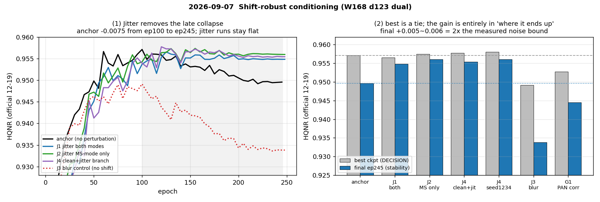

# 2026-09-07 — Global alignment · Shift-robust · 지표 v2 감사

**s1 14건 완주(무장애) + 지표 프로토콜 개정.** 이 날의 세 문건을 하나로 합쳤다.

| 갈래 | 건수 | 결론 |
|---|---:|---|
| **Shift-robust conditioning** | 6 | **jitter 는 후반 붕괴를 없애는 정규화다.** final HQNR +0.005~0.006 · fSCC +0.01 (두 seed·두 backbone·두 커널 재현). best 는 anchor 와 동급 |
| **Global alignment** | 8 | **정렬은 전부 실패.** C1/C3/P0 무효·붕괴, C2 의 이득마저 정렬이 아니라 jitter. PAN 을 흔드는 접근(G1·local·추론정렬)은 세 번 다 실패 |
| **지표 v2 감사** | — | **논문 비교 FR 은 PanCollection `.mat` 20장** (배포 H5 12-19 와 다른 장면, 겹침 6장). SCC/SSIM 관례 교정, genMTF 충실 커널 |

판정 = **best checkpoint HQNR(공식 12-19) → fSCC**, 판정선 **0.0027**
(실측 상한, [2026-09-04](2026-09-04_placement-and-band-invalidation.md)).
anchor `S1_T05_W168_D123_DUAL` = 0.9571 @ep100 · fSCC 0.8785.

> **미세조정은 2/4 에서 멈춰 있다** — `R075`·`R025`(반경 축) 미실행, 현재 도는 작업 없음.
> 완료된 2건(λ1.0, p0.5)은 둘 다 원본보다 낮다.

---

## 2026-09-07 — Global alignment 8건 · Shift-robust 6건 · 지표 v2 감사

> 원문: `2026-09-07.md`

s1 · 14건 완주 (무장애) · 50K · seed 2025
캠페인 문서: [`../2026-09-07_global-alignment-results.md`](2026-09-07_alignment-shift-robust-and-metric-v2.md) ·
[`../2026-09-07_shift-robust-results.md`](2026-09-07_alignment-shift-robust-and-metric-v2.md) ·
[`../2026-09-07_metric-comparability-audit.md`](2026-09-07_alignment-shift-robust-and-metric-v2.md)

> **판정 = best checkpoint HQNR(공식 12-19, 장면별 평균) → fSCC.** **판정선 = 0.0027.**
> anchor `S1_T05_W168_D123_DUAL` = 0.9571 @ep100 · fSCC 0.8785 · D_λ 0.0231 · D_s 0.0202.

---

### 1. 어떤 실험인가

[2026-09-03](2026-09-03_teacher-arch-4to6m.md) 에서 드러난 **후반 하락**(정점 뒤 −0.008 급)이 이 주의 표적이다.
가설은 "PAN–MS 미세 정합오차가 학습을 흔든다" 였고, 두 갈래로 공격했다.

**① Global alignment (40h)** — 데이터를 **실제로 정렬**한다.

| run | 무엇을 하나 |
|---|---|
| P0 | interp23tap phase 수정 |
| C1 | round-trip warp (frozen) |
| C3 | dual-frame (P 출력 좌표) |
| **C2 α0.25/0.5/0.75/1.0** | 입력 쪽만 정렬 (cache Δ) |
| CTRL | 원 bicubic 커널 + C2 의 jitter — 커널 교체와 분리 |

**② Shift-robust conditioning (30h)** — 정렬 대신 **강건하게** 만든다.

| run | 무엇을 하나 |
|---|---|
| J1 | ±0.5px 무작위 jitter, MS·PAN 두 mode |
| J2 | jitter **MS mode 만** |
| J3 | Gaussian blur σ1.225 (MSE 매칭) — **위치 이동 없음, smoothing 대조** |
| J4 | clean+jitter 두 branch + consistency λ0.1 |
| G1 | first-conv PAN 기여에 global correlator |

**③ 지표 v2 감사** — 논문 비교가능성 점검.

### 2. 어떤 결과가 나왔나



#### 2.1 Shift-robust

| run | **best HQNR** | ep | fSCC | D_λ | D_s | plateau(≥100) | final(245) |
|---|---:|---:|---:|---:|---:|---:|---:|
| anchor | 0.9571 | 100 | 0.8785 | 0.0231 | 0.0202 | 0.9524 | 0.9496 |
| J1 both | 0.9565 | 125 | 0.8908 | 0.0222 | 0.0218 | 0.9549 | 0.9548 |
| **J2 MS only** | 0.9574 | 155 | 0.8863 | 0.0200 | 0.0231 | **0.9560** | **0.9560** |
| J3 blur 대조 | 0.9491 | 100 | 0.8800 | 0.0244 | 0.0272 | 0.9390 | 0.9338 |
| **J4 clean+jitter** | 0.9577 | 120 | **0.8963** | 0.0227 | 0.0201 | 0.9558 | 0.9554 |
| J4 seed1234 | **0.9580** | 160 | 0.8858 | 0.0202 | 0.0223 | 0.9556 | 0.9560 |
| G1 PAN correlator | 0.9527 | 70 | 0.8458 | 0.0201 | 0.0278 | 0.9458 | 0.9445 |

**best 로는 전부 anchor 와 동급** (J1 −0.0006 · J2 +0.0003 · J4 +0.0006 · J4-seed +0.0009).
같은 J4 두 seed 의 차이가 0.0003 이므로 이 폭은 노이즈 안이다.

**그러나 후반 붕괴가 사라졌다.** anchor 는 ep100 0.9571 → ep245 **0.9496 (−0.0075)** 로
내려가는데, jitter 3벌은 ep125 이후 0.955~0.956 에 평평하다.

| | plateau − anchor | final − anchor |
|---|---:|---:|
| J1 | +0.0025 | +0.0052 |
| J2 | +0.0036 | +0.0064 |
| J4 | +0.0034 | +0.0058 |
| J4 seed1234 | +0.0032 | +0.0064 |

**+0.005~0.006 은 실측 노이즈 상한(0.0027)의 2배**이고, 두 seed · 두 backbone(W152/W168) ·
두 커널에서 재현된다.

#### 2.2 Global alignment — C2 만 양성, 그마저 정렬이 아니다

| run | best HQNR | fSCC | final | 비고 |
|---|---:|---:|---:|---|
| anchor (bicubic) | 0.9546 | 0.8846 | 0.9502 | |
| P0 (interp23tap) | 0.9543 | 0.8864 | 0.9465 | phase 수정 무효과 |
| C1 round-trip | 0.9383 | 0.8555 | 0.9124 | **붕괴** (best ep5) |
| C3 dual-frame | 0.9245 | 0.9008 | 0.9241 | 공식 D_λ 좌표 충돌 |
| **C2 α1.0** | **0.9553** | 0.900 | 0.9552 | 유일한 양성 |
| **CTRL** (원 커널+jitter) | 0.9539 | 0.8973 | 0.9534 | 커널과 독립 |

#### 2.3 지표 v2 감사 — 보고 기준이 바뀌었다

| 항목 | 정정 |
|---|---|
| **FR 세트** | 논문 비교는 PanCollection **`.mat` 20장**. 배포 H5 12-19 와 **다른 장면**(겹침 6장). 시트 FR = `fr_mat20` 열뿐 |
| SCC | `SCC.m` zero-padding 관례 — 종전 값이 약 **+0.004** 높았다 |
| SSIM | Gaussian 11×11 — 종전 값이 약 **+0.002** 높았다 |
| MTF 커널 | `genMTF.m` 충실 재구현 (DLPan 파이썬 포트 아님) — HQNR 약 **−3e-4** |
| anchor 검증 | EXP·CANConv 배포 가중치가 논문 행과 **평균·N−1 표준편차까지** 일치 |

**이 문서 §2.1·§2.2 의 HQNR 은 공식 12-19 기준**이다(best 선택 기준은 불변).
논문 표와 나란히 놓을 수치는 시트의 `FR·paper mat20` 열이다.

### 3. 어떤 분석이 나왔나

**① 정렬은 전부 실패했고, 남은 것은 jitter 다.** C1·C3·P0 는 무효거나 붕괴했다.
결정적으로 **C2 의 이득도 정렬이 아니다** — C2 checkpoint 에서 추론 shift 를 빼도
HQNR 이 같고(0.9555/0.9560), 원 커널 대조(CTRL)에서도 final +0.003 이 나온다.
데이터셋 `lms` 가 이미 interp23tap 이라 계획이 가정한 phase-2 오정렬이 애초에 없었고,
train patch 의 audit Δ 는 추정 노이즈였다(오차 0.27px > shift 0.06px). **C 계열의 "정렬"은
실은 sd 0.076 LR px 의 jitter 였다.**

**② jitter 는 정규화다 — 정렬 보정이 아니다.** 후속 캠페인이 **noisy cache 없이 통제된
무작위 jitter 만으로 같은 효과를 재현**했다. 그리고 J3 대조가 기전을 확정한다 —
위치 이동 없는 등에너지 blur 는 best 0.9491 · final 0.9338 로 **무너진다**.
즉 이득은 smoothing 이 아니라 **조건 입력의 위치 perturbation 에 대한 강건성**이다.

**③ best 는 못 올리고 "어디서 끝나는가"만 바꾼다.** 판정 규칙상 **동급**이다.
실용적 의미는 "언제 멈춰도 best 근처" — **checkpoint 선택 편향에 덜 의존하는 모델**이다.
[2026-09-03](2026-09-03_teacher-arch-4to6m.md) 에서 best·plateau 가 정면 충돌했던 문제의 첫 해법이고,
[2026-09-04](2026-09-04_placement-and-band-invalidation.md) 가 지적한 "후반 하락" 자체를 없앤다.

**④ PAN 을 흔들면 안 된다 — 세 번째 확인.** G1 은 β=0 에서도 anchor 보다 −0.004 낮다.
학습 중 PAN feature 에 ±1px shift 를 준 것이 GT 정렬을 깨뜨렸고 D_s·fSCC 가 곧바로
나빠졌다(fSCC 0.846). correlator 자체도 끝까지 날카로워지지 않아(boundary 확률 0.50,
거의 균등 posterior) **wrong-sign 이 오히려 더 높았다** — 보정은 노이즈다.
winner J4 에 추론 시 PAN 을 옮기면 0.9577 → **0.9277** (D_s 0.020→0.053).
**PAN 은 공간 기준이라 흔들면 안 되고, 정렬은 MS 조건 쪽 강건성으로만 다룬다.**
→ §12 local alignment **종료**.

**⑤ consistency 항은 작동하지 않았다.** J4 의 λ·L_cons/L_MS EMA = **0.006**
(계획 §9.4 기준 "사실상 무효"). J4 의 우위는 consistency 가 아니라 **clean+jitter 두
branch**(실효 MS batch 2배, 표본 절반이 clean)에서 왔을 가능성이 크다.

### 4. 미세조정 — **2/4 에서 멈춰 있다**

`config/queues/s1_shift_robust_refine.txt` (2026-09-07 09:2x 기동, ≈16h)

| run | 무엇을 가르나 | 상태 |
|---|---|---|
| `SR_J4_CJCONS_R050_L100` | consistency λ 1.0 | **완료** — best **0.9461** (λ↑ 는 크게 해롭다) |
| `SR_J2_C2RAND_MSONLY_R050_P050` | jitter 확률 0.5 | **완료** — best **0.9524** (clean 노출 ↑ 는 손해) |
| `SR_J2_C2RAND_MSONLY_R075` | 반경 ±0.75 | **미실행** |
| `SR_J2_C2RAND_MSONLY_R025` | 반경 ±0.25 | **미실행** |

완료된 2건이 둘 다 J4/J2 원본보다 낮다 — **λ 를 올리는 것도, clean 노출을 늘리는 것도
해롭다.** 남은 반경 축(±0.75 / ±0.25)은 아직 답이 없고, 현재 **실행 중인 작업이 없다.**

### 5. 결론과 다음

1. **Shift-robust conditioning(MS 조건 입력 ±0.5px 무작위 jitter)은 후반 D_s 드리프트를
   없앤다.** final HQNR +0.005~0.006 · fSCC +0.01, 두 seed·두 backbone·두 커널 재현.
   14벌 격자를 괴롭힌 "정점 뒤 하락"의 첫 해법이다.
2. **best HQNR 은 못 올린다(동급).** 얻는 것은 안정성이다.
3. **PAN 을 옮기는 모든 접근은 실패** — global(G1) · local · 추론 시 정렬 전부.
4. 다음: 반경 축 2벌을 마저 돌리고, 계획 §23 Case A — **W96 student · W168 teacher 에
   jitter 를 기본값으로 얹고 KD 재개.** [2026-09-01](2026-09-01_kd-se-msonly-campaigns.md) 의 KD 실패가
   teacher 품질(후반 붕괴) 탓이었는지가 여기서 갈린다.

### 6. 참고 · 운영

- GA 7벌 + 대조 1벌(C4 2벌은 pretrain gate FAIL 로 미학습), SR 6벌 24.3h, 전부 무장애.
- J4 는 4.9h(1.42×). 진단 CSV: `results/sr_diag.csv`, `results/local_diag.csv`.
- 1차 P0 는 LR 증강 × phase-2 오정렬(표본 75%, 1 HR px)로 무효화·재기동했다.
  이후 9건 수정(집계식·tie anchor·50K 평가·provenance·rc=4·smoke).

---

## Shift-robust conditioning 30h 결과 — jitter 는 후반 붕괴를 없애는 정규화다, best HQNR 은 동급 (2026-09-07)

> 원문: `2026-09-07_shift-robust-results.md`

계획: [s1_w168_d123_shift_robust_alignment_30h_plan.md](../research_log/s1_w168_d123_shift_robust_alignment_30h_plan.md) ·
검토·구현: [2026-09-06_shift-robust-plan-review.md](../research_log/2026-09-06_shift-robust-plan-review.md)
**6벌 완주(무장애): J1·J3·J4·J2·G1 + gate 가 연 J4 seed 1234.** 2026-09-06 03:25 → 09-07 03:40 (24.3h).
판정: **best checkpoint HQNR(12-19, 장면별 평균) → fSCC.** anchor `S1_T05_W168_D123_DUAL` = 0.9571@ep100 · fSCC 0.8785 · D_λ 0.0231 · D_s 0.0202.

---

### 1. 결과

| run | 세팅 | **best HQNR** | ep | fSCC | D_λ | D_s | plateau(≥100) | last50 | final(245) | 시간 |
|---|---|---:|---:|---:|---:|---:|---:|---:|---:|---:|
| anchor | 원 bicubic, perturbation 없음 | 0.9571 | 100 | 0.8785 | 0.0231 | 0.0202 | 0.9524 | 0.9497 | 0.9496 | 3.46h |
| J1 | ±0.5px 무작위 jitter, MS·PAN 두 mode | 0.9565 | 125 | 0.8908 | 0.0222 | 0.0218 | 0.9549 | 0.9549 | 0.9548 | 3.47h |
| J2 | jitter MS mode 만 | 0.9574 | 155 | 0.8863 | 0.0200 | 0.0231 | **0.9560** | **0.9560** | **0.9560** | 3.47h |
| J3 | Gaussian blur σ1.225(MSE 매칭), 두 mode | 0.9491 | 100 | 0.8800 | 0.0244 | 0.0272 | 0.9390 | 0.9342 | 0.9338 | 3.47h |
| J4 | clean+jitter branch, consistency λ0.1 | 0.9577 | 120 | **0.8963** | 0.0227 | 0.0201 | 0.9558 | 0.9555 | 0.9554 | 4.93h |
| J4 seed1234 | (winner 반복) | **0.9580** | 160 | 0.8858 | 0.0202 | 0.0223 | 0.9556 | 0.9562 | 0.9560 | 4.94h |
| G1 | first-conv PAN 기여 global correlator | 0.9527 | 70 | 0.8458 | 0.0201 | 0.0278 | 0.9458 | 0.9447 | 0.9445 | 3.87h |

#### 1.1 best HQNR 로는 전부 anchor 와 동급이다
J1 −0.0006 · J2 +0.0003 · J4 +0.0006 · J4-seed +0.0009. 같은 J4 두 seed 의 차이가 0.0003(best)·0.0002(plateau)·0.0006(final)이므로
이 차이들은 노이즈 안이다. 장면별 개선 수도 J4 5/8, J1 3/8, J2 1/8 로 방향이 없다.

#### 1.2 그러나 후반 붕괴가 사라졌다 — 계획 §22 J1 성공 조건 B 충족
anchor 는 ep100 0.9571 → ep245 **0.9496 (−0.0075)** 로 내려간다. jitter 3벌은 ep125 이후 **0.955–0.956 에 평평**하다:

| | plateau − anchor | final − anchor | 후반 D_s |
|---|---:|---:|---|
| J1 | +0.0025 | +0.0052 | 0.0218→0.0243 평탄 |
| J2 | +0.0036 | +0.0064 | 0.0235→0.0250 평탄 |
| J4 | +0.0034 | +0.0058 | 0.0210→0.0241 평탄 |
| J4 seed | +0.0032 | +0.0064 | 재현 |

두 seed 에서 재현되고, 크기(+0.005~0.006)는 실측 노이즈 상한(0.0027)의 2배다. GA 캠페인의 C2(cache Δ jitter, W152, +0.005 final) 가
**noisy cache 없이 통제된 무작위 jitter 만으로 재현**됐다 — H1 성립.

#### 1.3 H3: smoothing 이 아니다 (J3 대조)
J3(위치 이동 없는 등에너지 blur)는 best 0.9491 · final 0.9338 · RR ERGAS 3.09 로 무너진다. 사전 실측(bicubic warp 의 gradient-energy 비 1.0056)과
합쳐 "jitter 의 이득 = smoothing" 해석은 기각. 이득은 **위치 perturbation 에 대한 조건 입력 강건성**이다 (계획 §23 Case A).

#### 1.4 H2: MS-only(J2) ≥ 두 mode(J1)
J2 가 best +0.0009 · plateau +0.0011 · final +0.0012 — seed 노이즈의 2~3배라 약한 신호. fSCC 는 J1 이 +0.005 높다.
"PAN mode 에 jitter 를 주면 PAN 입력과 충돌" 쪽으로 기운다. 미세조정에서 J2 를 기준으로 삼는다.

#### 1.5 H4: consistency 는 작동하지 않았다
J4 의 λ·L_cons/L_MS EMA = **0.006 (<0.01, 계획 §9.4 "사실상 무효")**. J4 의 우위(J1 대비 best +0.0012, fSCC +0.0055)는 consistency 항이 아니라
clean+jitter 두 branch(실효 MS batch 2배, 표본의 절반이 clean)에서 왔을 가능성이 크다. → 미세조정 §4.

#### 1.6 추론 jitter 강건성 (§22 "shift-robustness" 조건)
추론 시 조건 입력에 ±0.5 px 를 넣어도 J1 0.9565→0.9565~0.9573, J2 0.9574→0.9570~0.9578, J4 0.9577→0.9574~0.9588 — 하락 없음.
jitter=0 에서도 유지. 두 seed 재현. J1 > J3. → 네 조건 전부 충족.

#### 1.7 G1 실패 — PAN 쪽을 흔들면 안 된다
- correlator 가 끝까지 날카로워지지 않았다: conf 0.04→0.08, boundary 확률 0.56→0.50(거의 균등 posterior), |Δ̂+ε_g| 0.39→0.31.
  gate(conf/0.3)≈0.2 라 보정이 거의 적용되지 않았고, β sweep 도 평평(0.9532/0.9530/0.9527), **wrong-sign 이 오히려 0.9542** — 보정은 노이즈.
- 그런데 β=0 인 G1 자체가 anchor 보다 −0.004 낮다. 학습 중 PAN feature 에 ±1 px synthetic shift(p 0.75)를 준 것이 GT 정렬을 깨뜨렸다:
  **PAN 은 공간 기준이라 흔들면 D_s·fSCC 가 곧바로 나빠진다** (fSCC 0.846). J 계열이 MS 조건만 흔들어 성공한 것과 정확히 대칭.
- §22 G1 기준 4항목 전부 불충족.

#### 1.8 §12 local diagnostic — 종료
winner J4 에 audit 전역 shift 를 first-conv PAN 기여에 적용(L1)하면 HQNR 0.9577→**0.9277**(D_s 0.020→0.053), fSCC 0.896→0.801.
gated local(L2) 0.9218, ungated(L3) 0.8537, wrong-sign(L4) 0.9299(정방향보다 높음). §12.6 gate 5항목 중 4개 불충족 → **local alignment 종료.**
정렬 없이 학습된 모델에 추론 시 PAN 을 옮기는 것은 모두 해롭다 — GA anchor sweep·UVS teacher(RR +6.2%)·여기까지 세 번째 확인.

#### 1.9 대조 run (W152, 원 bicubic + cache jitter) — 이득은 커널과 독립
| W152 | best | plateau | last50 | final |
|---|---:|---:|---:|---:|
| anchor(bicubic) | 0.9546 | 0.9516 | 0.9505 | 0.9502 |
| C2 α1(interp23tap+jitter) | 0.9553 | 0.9528 | 0.9549 | 0.9552 |
| **CTRL(bicubic+jitter)** | 0.9539 | 0.9523 | 0.9535 | 0.9534 |

원 커널 위에서도 final +0.0032·last50 +0.0030 — 방향 동일, 크기는 interp23tap 조합보다 작다. GA 문서의 "C2 이득은 커널 교체에 의존하는가" 에 대한 답: **아니다(독립), 단 크기의 일부는 커널 교체분이었다.**

---

### 2. 결론
1. **Shift-robust conditioning(MS 조건 입력의 ±0.5 px 무작위 jitter)은 후반 D_s 드리프트를 없앤다** — final HQNR +0.005~0.006, fSCC +0.01, 두 seed·두 backbone(W152/W168)·두 커널에서 재현. 이전 14벌 격자를 괴롭힌 "ep80~130 정점 뒤 하락"의 첫 해법이다.
2. **best-checkpoint HQNR 은 올리지 못한다** (동급). 판정 규칙상 "동급" 이고, 실용적 의미는 "언제 멈춰도 best 근처" — checkpoint 선택 편향에 덜 의존하는 모델.
3. PAN 을 옮기는 모든 접근(G1, local, 추론 시 정렬)은 실패. **정렬은 MS 조건 쪽 강건성으로만 다룬다.**
4. 다음: §4 미세조정(진행 중), 그 뒤 계획 §23 Case A — W96 student·W168 teacher 에 jitter 를 기본값으로 얹고 KD 재개.

### 3. 운영
6벌 24.3h 무장애. J4 는 4.9h(1.42×). 시트 SR 범주 구분행·Notes 자동. 진단 CSV: `results/sr_diag.csv`, `results/local_diag.csv`.

### 4. 미세조정 (2026-09-07 09:2x 기동, `config/queues/s1_shift_robust_refine.txt`, ≈16h)
| run | 무엇을 가르나 |
|---|---|
| `SR_J4_CJCONS_R050_L100` | consistency λ 1.0 (비율 0.006→≈0.06) — consistency 가 실제로 작동하면 J4 를 더 올리나 |
| `SR_J2_C2RAND_MSONLY_R050_P050` | jitter 확률 0.5 — J4 의 우위가 clean 노출 때문인지(consistency 없이) |
| `SR_J2_C2RAND_MSONLY_R075` | 반경 ±0.75 (§14: plateau D_s 0.024 가 anchor best 0.020 보다 남음) |
| `SR_J2_C2RAND_MSONLY_R025` | 반경 ±0.25 (spectral 쪽) |

---

## Global alignment 40h 결과 — 정렬은 안 되고, jitter 만 남았다 (2026-09-07 정리)

> 원문: `2026-09-07_global-alignment-results.md`

계획: [s1_w152_d123_global_alignment_40h_plan.md](../research_log/s1_w152_d123_global_alignment_40h_plan.md) ·
검토·구현·9건 수정: [2026-09-04_global-alignment-plan-review.md](../research_log/2026-09-04_global-alignment-plan-review.md) ·
계획 대비 차이·이슈 상세: [2026-09-05_global-alignment-plan-vs-implementation.md](../research_log/2026-09-05_global-alignment-plan-vs-implementation.md)
7벌 완주 + 대조 run 1벌(C4 2벌은 pretrain gate FAIL 로 미학습). 판정: best checkpoint HQNR(12-19) → fSCC. anchor `S1_T05_W152_D123_DUAL` 0.9546.

| run | best HQNR | fSCC | plateau | final | 비고 |
|---|---:|---:|---:|---:|---|
| anchor (bicubic) | 0.9546 | 0.8846 | 0.9516 | 0.9502 | |
| P0 (interp23tap) | 0.9543 | 0.8864 | 0.9492 | 0.9465 | phase 수정: 무효과, 후반 plateau −0.0024 |
| C1 round-trip | 0.9383 | 0.8555 | 0.9159 | 0.9124 | 붕괴 (best ep5, inverse warp 과선명화) |
| C3 dual-frame(P 출력) | 0.9245 | 0.9008 | 0.9224 | 0.9241 | 공식 D_λ 좌표 충돌 0.018 |
| C2 α0.25 / 0.5 / 0.75 / 1.0 | 0.9534 / **0.9553** / 0.9538 / **0.9553** | 0.887 / 0.892 / 0.892 / 0.900 | 0.9518 / 0.9529 / 0.9526 / 0.9528 | 0.9514 / 0.9525 / 0.9533 / 0.9552 | 유일한 양성 |
| CTRL (bicubic + C2 jitter) | 0.9539 | 0.8973 | 0.9523 | 0.9534 | 커널 교체와 독립 |

핵심 사실 — 상세는 위 문서들:
1. 데이터셋 `lms` 는 interp23tap 이고 계획의 phase-2 bicubic 이 아니다. train patch 의 audit Δ 는 추정 노이즈(오차 0.27 px > shift 0.06)라
   C 계열의 "정렬" 은 학습 시 sd 0.076 LR px jitter 였다.
2. **C2 의 이득은 정렬이 아니라 jitter**: C2 checkpoint 에 추론 shift 를 빼도 HQNR 이 같다(0.9555/0.9560). 원 커널 대조(CTRL)에서도 final +0.003.
3. 1차 P0 는 LR 증강 × phase-2 오정렬(표본 75%, 1 HR px)로 무효화·재기동했다. 이후 9건 수정(집계식·tie anchor·50K 평가·provenance·rc=4·smoke).
4. 판정 밴드 0.011 은 공식 HQNR 에서 측정된 적이 없다(2026-09-04 문서). 실측 상한 ~0.0027.
5. 후속 캠페인(shift-robust, [2026-09-07_shift-robust-results.md](2026-09-07_alignment-shift-robust-and-metric-v2.md))이 무작위 jitter 만으로 같은 효과를 재현했다.

---

## 지표 비교가능성 감사 — 시트의 모든 지표가 논문(PAN-Crafter·U-Know-DiffPAN)과 같은 코드·같은 데이터인가 (2026-09-07)

> 원문: `2026-09-07_metric-comparability-audit.md`

**질문**: 구글시트(`gspread/gspread_upload.py`)에 올라가는 RR 8개·FR 3개 지표가 PAN-Crafter(ICCV 2025)와
U-Know-DiffPAN(CVPR 2025)의 Table 과 **코드 수준에서 같은 측정**인가. 논문 비교표에 나란히 놓을 수 있는가.

**답**: 두 가지가 달랐고 오늘 둘 다 고쳤다. 나머지는 MATLAB 원본과 같음을 외부 anchor 로 확인했다.

| | 결과 |
|---|---|
| **FR 데이터가 달랐다 (치명)** | 논문들은 PanCollection **`.mat` 형식** FR 20장을 썼고, 우리 배포 H5 의 FR 20장은 다른 장면 집합이다(겹침 6장). 지금까지 시트에 올린 FR(H5 12-19)은 **논문 표와 직접 비교 불가**였다. → `.mat` 세트를 받아 새 열 **FR·paper mat20** 으로 분리했다. 모델 무관 EXP 기준선과 CANConv 배포 가중치가 논문 값과 **표준편차까지** 일치한다 |
| **SCC 구현이 달랐다** | DLPan `SCC.m` 은 zero-padding Sobel, 우리는 reflect 패딩 → 약 **+0.004** 높았다. 논문 CANConv 행 0.985 vs 우리 0.9897 → 고친 뒤 0.9854 |
| **SSIM 창이 달랐다** | 논문은 명시하지 않지만 Gaussian 11×11(Wang/MATLAB) 로 두면 CANConv 행과 맞고, skimage 기본창은 **+0.002** 높다 → Gaussian 으로 교체 |
| SAM·ERGAS·Q2n·D_λ·D_s·HQNR | MATLAB 원본 포팅 그대로. anchor 2종에서 0.1% 이내 |
| PSNR | 통합 MSE 관례가 논문과 맞는다(밴드별 평균은 +1.5 dB) |
| RMSE·CC | 논문에 없는 자체 정의 — 비교표에 넣지 않는다 |

시트는 열 배치가 바뀌었으므로 **전체 재작성이 필요**하다 (§6). 학습 로그의 SCC(`[핵심]`, `best_state`)는
상대 비교용으로 옛 정의를 유지한다 (KNOWN_ISSUES D-7).

---

### 1. 논문들이 무엇으로 쟀는가

| | PAN-Crafter | U-Know-DiffPAN |
|---|---|---|
| 공개 진술 | README: "All evaluation metrics were measured using the official MATLAB code from the DLPan-Toolbox". 본문: "computed all evaluation metrics using the official PanCollection repository" | README: "We follow the evaluation setup from PanCollection"; Evaluation 절은 "TBA" |
| 저장소의 지표 코드 | `utils.py` — 학습 모니터링용 파이썬(PSNR 밴드별 평균, SSIM skimage 기본창, SCC scipy reflect, Q4(앞 4밴드), QNR). 논문 Table 값은 여기서 나오지 않는다(PSNR 관례가 다르다, §3.4) | `utils/metric.py` — RR 은 PanCollection 파이썬 포트(`_metric_legacy.py`, "FIXME: this python code is not same as matlab code, you should use matlab code to get the real accuracy; only used in training and validate"), FR 은 `sewar` 라이브러리 QNR. 테스트 스크립트는 `.mat` 을 저장한다 → MATLAB 에서 최종 평가 |
| 보고 지표 | RR: PSNR·SSIM·SAM·ERGAS·SCC·Q8 / FR: HQNR·D_s·D_λ (mean±std) | 동일 |
| CANConv 행 | 두 논문 모두 같은 숫자(37.441 / 0.973 / 2.927 / 2.163 / 0.985 / 0.918 ; FR 0.951 / 0.020 / 0.030). CANConv 논문 자체 값(2.930 / 2.158 / 0.920)과 미세하게 달라 U-Know 가 재평가한 것으로 보이고 PAN-Crafter 는 그것을 가져왔다 | |

**따라서 기준은 MATLAB DLPan-Toolbox 프로토콜이고, 입력은 `.mat` 형식 테스트셋이다.** PSNR·SSIM 은
그 프로토콜(`indexes_evaluation.m`)에 없어 관례를 추정해야 한다.

### 2. 시트의 각 열이 어느 코드로 계산되는가 (오늘 이후)

| 시트 열 | 코드 | MATLAB 원본 | 데이터 | 일치 판정 |
|---|---|---|---|---|
| ERGAS | `tools/metrics/eval_rr.ergas` | `ERGAS.m` | RR H5 20장, dim_cut 21 | 식 동일 (GT 밴드 평균 정규화) |
| SAM | `eval_rr.sam` | `SAM.m` | 〃 | 식 동일 (0-norm 화소 제외) |
| Q2n (Q8) | `tools/metrics/q2n.q2n` | `q2n.m` 외 4파일 | 〃, 블록 32 | 원본 포팅. uint16 반올림·N-1 정규화 포함. 공식 파이썬 포트는 ddof 오류로 >1 이 나와 쓰지 않는다 |
| SCC | `tools/eval_dlpan.scc_dlpan` **(오늘 교정)** | `SCC.m` | 〃 | zero-padding Sobel, 전역 코사인. 옛 정의(reflect)는 +0.004 |
| PSNR | `eval_dlpan.psnr_global` | 없음 | 〃 | 통합 MSE, peak 2047 (§3.4) |
| SSIM | `eval_dlpan.ssim_skimage` **(오늘 교정)** | 없음 (`Quality_Indices/ssim.m` 은 Wang 원본) | 〃 | Gaussian 11×11 σ1.5, 모집단 분산, 밴드별 평균 |
| RMSE, CC | `gspread_upload._rr` 안 | 없음 | 〃 | 자체 정의 (전 밴드 flatten). 논문 비교 제외 |
| **FR·paper mat20** D_λ/D_s/HQNR **(신설)** | `tools/eval_fr_paperset.py` → `results/fr_mat20.json` | `D_lambda_K.m` / `D_s.m` / `HQNR.m` | **.mat FR 20장** (`data/PanCollection/WV3/full_examples_mat20/`) | §4 anchor 로 확인. 논문 표와 비교하는 유일한 FR 열 |
| FR·H5 12-19 (select) | `gspread_upload._fr` | 〃 | 배포 H5 FR 의 12-19 | best 선택 기준. 논문과 장면이 다르다 |

공통: 값은 `.mat`(`sr`, DN, clip [0, 2047], 반올림 없음)에서 다시 계산한다. 학습 중 metrics.csv 는 쓰지 않는다.
HQNR 은 두 열 모두 장면별 (1−D_λ)(1−D_s) 평균(MATLAB 관례). 시트 `_fr` 의 옛 식(prod-of-means)과 ~1e-5 차이.

MTF 커널은 **`genMTF.m` 을 직접 재구현**한 `genmtf_matlab()` 이다 (§8 ①). DLPan 공식 파이썬 포트의 `MTF()` 는
1-D Kaiser 를 한 축에만 곱하고 음수를 자른 뒤 sum=1 로 정규화하는데, MATLAB `fwind1` 은 정규화하지 않아
DC 이득이 0.9988 이다. 이 차이가 D_λ 로 +2~4e-4 들어간다(처음 이 문서는 "9e-7" 이라 썼는데, 비교용 재구현에
정규화가 남아 있던 오류다 — §8). `interp23tap` 만 포트를 import 한다(circular 경계, MATLAB 과 동일).
`imresize` 는 MATLAB 의 symmetric 경계(`aux=[1:n n:-1:1]`)로 맞췄다(§8 ②).
FR·RR 의 `lms` 는 `interp23tap(ms)` 와 1e-12 로 동일하다(H5·.mat 모두).

### 3. RR — 구현 관례가 값을 얼마나 움직이는가 (같은 .mat, 20장)

CANConv 배포 가중치(`work_dir/_ref_cannet`)가 anchor 다. 두 논문의 CANConv 행: PSNR 37.441 / SSIM 0.973 / SCC 0.985.

#### 3.1 SCC — 가장자리 1px 링이 +0.004 를 만든다

| 구현 | CANConv | c0_hqnr | 논문 CANConv |
|---|---:|---:|---:|
| scipy `sobel` reflect 패딩 (옛 시트·학습 로그) | 0.9897 | 0.9908 | |
| **`SCC.m` 그대로 — zero padding** | **0.9854** | **0.9875** | **0.985** |
| 링 제외(내부만) | 0.9837 | 0.9861 | |

`SCC.m` 은 `I(2:end-1,2:end-1)` 로 자른 뒤 `imfilter(fspecial('sobel'))` — imfilter 기본값이 zero padding 이라
잘린 가장자리에서 0 과 맞닿은 큰 기울기가 생기고, 그 링이 값을 좌우한다. 146개 run 에서 두 정의의
Spearman 은 0.992, 오프셋 −0.0042 (−0.015 ~ −0.002). 순위는 거의 보존되지만 **논문의 0.988 과 나란히 놓으면
우리 best 들은 0.991(옛) 이 아니라 0.988(새) 이다** — 우위가 사라진다.

#### 3.2 SSIM — 창 종류가 +0.002

| 구현 | CANConv | 논문 CANConv |
|---|---:|---:|
| skimage 기본 (7×7 균일창, 표본분산) — 옛 시트, PAN-Crafter `utils.py` | 0.9751 | |
| **Gaussian 11×11 σ1.5, 모집단 분산 (Wang 2004 / MATLAB `ssim` / DLPan `ssim.m`)** | **0.9732** | **0.973** |
| 같은 Gaussian, replicate 패딩·전체 map 평균(MATLAB 식) | 0.9732 | |
| 동적범위를 DN 에 1 / 255 로 잘못 줌 | 0.8216 / 0.9215 | |
| crop 없이 | 0.9733 | |

방법 간 SSIM 차이가 0.003 이라(0.973 vs 0.976) 이 0.002 는 판별에 직접 걸린다. Gaussian 으로 바꾸되
**SSIM 은 여전히 포화 지표로 취급한다**(CLAUDE.md 확정 사실). 146 run Spearman 0.9998.

#### 3.3 SAM·ERGAS·Q2n — 식이 같다, 잔차는 모델 출력 차이

| | CANConv 배포 가중치 | 논문 CANConv 행 | 차이 |
|---|---:|---:|---:|
| SAM | 2.9210 | 2.927 | −0.2% |
| ERGAS | 2.1702 | 2.163 | +0.3% |
| Q8 | 0.9188 | 0.918 | +0.1% |

세 식은 MATLAB 원본을 그대로 옮긴 것이라 잔차는 평가기가 아니라 **재평가된 CANConv 출력이 배포 가중치와
조금 다른 것**(CANConv 논문 자체 값 2.930/2.158/0.920 도 셋 다 다르다)에서 온다. dim_cut 을 빼면
ERGAS 2.159 / Q8 0.9146 으로 Q8 이 크게 벗어나므로 크롭은 논문과 같이 21 이 맞다.

#### 3.4 PSNR — 통합 MSE

| 관례 | CANConv | 논문 |
|---|---:|---:|
| **전 밴드 통합 MSE, peak 2047** (crop / no-crop) | **37.472 / 37.457** | **37.441** |
| 밴드별 PSNR 평균 | 38.988 | |
| peak = 2048 | +0.004 dB | |
| peak = GT 최대값 | 37.154 | |

밴드별 평균은 Jensen 부등식으로 항상 통합보다 높다(+1.5 dB). PAN-Crafter 저장소 `utils.py` 의 PSNR 은
밴드별 평균인데 논문 값 37.956 은 그 관례로는 나올 수 없는 값(ERGAS 2.04 모델이면 ~39.4)이라, 저자들도
Table 은 MATLAB(`psnr(A,ref,peak)` = 통합) 쪽으로 냈다고 본다.

### 4. FR — 데이터가 달랐다

#### 4.1 발견

PanCollection README 는 "H5 files have same data with mat files" 라 하지만 WV3 FR 은 아니다.
Google Drive 에서 오늘 받은 `.mat` 형식 FR(`Test(HxWxC)_wv3_data_fr{1..20}.mat`) 20장과 우리 H5 20장을
화소 단위로 대조했다.

| | H5 (우리가 쓰던 것) | .mat (논문) |
|---|---|---|
| 장면 | 0-11 해안 도시(EXP HQNR 0.53~0.88) + 12-19 건조 시가지 | 전부 건조 시가지 |
| 겹침 | H5 12,13,14,15,16,17 = mat fr19,15,13,12,9,2 (6장, 화소 동일) | 나머지 14장은 H5 에 없다 |
| RR | H5 = .mat 화소 동일 (19/19; fr20 은 드라이브 폴더에 없었다) | |

README 의 "Dec. 11, 2022: updated full-resolution test examples that contain more different image scenes" 가
H5 에만 적용된 것으로 보인다. 지금까지 "12-19 가 논문과 맞는다" 고 본 것은 장면 성격이 같아서였고, 표준편차는
맞지 않았다(§4.2).

#### 4.2 논문 세트임을 두 anchor 로 확인

최종 평가기(§8 반영: genMTF 충실 커널·symmetric imresize·표준편차 N−1) 기준:

| | D_λ | D_s | HQNR |
|---|---:|---:|---:|
| **EXP(=lms, 모델 무관)** .mat 20장 | **0.0232±0.0066** | **0.0813±0.0318** | **0.8975±0.0362** |
| 〃 CANConv 논문 EXP 행 | 0.0232±0.0066 | 0.0813±0.0318 | 0.897±0.036 |
| 〃 H5 12-19 (옛 세트) | 0.0246±0.0068 | 0.0811±0.0199 | 0.8963 |
| **CANConv 배포 가중치** .mat 20장 (컨테이너 추론) | **0.0196±0.0086** | **0.0299±0.0074** | **0.9511±0.0126** |
| 〃 CANConv 논문 행 | 0.0196±0.0083 | 0.0301±0.0074 | 0.951±0.013 |
| 〃 H5 12-19 (옛 세트) | 0.0253±0.0108 | 0.0261±0.0035 | 0.9493±0.0113 |

EXP 는 세 지표의 평균·표준편차가 소수 넷째 자리까지 같고, CANConv 는 D_λ 평균이 같고 나머지가 셋째 자리에서
맞는다(CANConv 행은 재평가된 출력이라 모델 쪽 차이가 남는다). 평가기(D_lambda_K + block-UQI D_s, S=32)와 데이터가
모두 논문과 같다는 뜻이다. 첫 판(§8 이전: 포트 커널·N 표준편차)은 EXP 0.0231±0.0064 / 0.0814±0.0310 / 0.8976±0.0353,
CANConv 0.9513±0.0122 였다 — 지적 반영으로 더 가까워졌다.

#### 4.3 우리 모델 — 같은 세트로 다시 재면

`tools/eval_fr_paperset.py` 가 run 마다 best checkpoint 를 `.mat` 세트에 추론해 `results/fr_mat20.json` 을 쓴다
(lpan 은 배포본에 없어 F-1 레시피로 생성). 전 run 139개(align 9벌 제외)를 §8 반영 평가기(`eval_version 2026-09-07.2`)로
다시 쟀다. 핵심 run (±는 N−1):

| run | 세팅 | HQNR(.mat 20) | D_λ | D_s | (참고) HQNR H5 12-19 |
|---|---|---:|---:|---:|---:|
| ■ PAN-Crafter 논문 | | **0.958±0.009** | 0.016 | 0.027 | — |
| □ CANConv 배포 가중치 | anchor | 0.9511±0.0126 | 0.0196 | 0.0299 | — |
| c0_hqnr | 재구성 teacher 7.17M | **0.9588±0.0098** | 0.0169 | 0.0248 | 0.9542 |
| wv3_baseline | 배포 코드 그대로 9.97M | 0.9551±0.0122 | 0.0191 | 0.0263 | — |
| s1_A1 | 11ch·nocrop·LN (ERGAS 2.035) | 0.9539±0.0066 | 0.0160 | 0.0306 | — |
| S1_T05_W168_D123_DUAL | W168 d123 dual (SR anchor) | **0.9612±0.0107** | 0.0181 | 0.0211 | 0.9571 |
| S1_T05_W176_D122_DUAL | W176 d122 dual | **0.9612±0.0101** | 0.0167 | 0.0225 | 0.9567 |
| K1B_R4_specKD | R4 student 2.1M + spectral KD | **0.9612±0.0146** | 0.0173 | 0.0219 | 0.9550 |
| K0_R4_base | R4 base | 0.9607±0.0102 | 0.0185 | 0.0212 | 0.9562 |
| SR_J4_CJCONS_R050_L010 | clean+jitter λ0.1 | 0.9605±0.0112 | 0.0177 | 0.0223 | 0.9577 |
| SR_J4 seed 1234 | | 0.9599±0.0094 | 0.0158 | 0.0247 | 0.9580 |
| SR_J2 (MS-only jitter) | | 0.9598±0.0094 | 0.0157 | 0.0249 | 0.9574 |
| R4_w96_d124_noattn | student 후보 | 0.9597±0.0126 | 0.0190 | 0.0218 | 0.9561 |
| SR_J1 (두 mode jitter) | | 0.9595±0.0106 | 0.0170 | 0.0240 | 0.9565 |
| K3_R4_uknow_gtvar | | 0.9593±0.0100 | 0.0175 | 0.0236 | 0.9552 |
| d122 | | 0.9585±0.0102 | 0.0181 | 0.0238 | 0.9539 |
| SR_J3 (blur 대조) | | 0.9540±0.0101 | 0.0195 | 0.0270 | 0.9491 |
| c8_c4w96 | w96 attn0 | 0.9528±0.0171 | 0.0185 | 0.0293 | 0.9481 |
| L1_9_lr_fuse_w64 | LR-Fuse 초경량 | 0.9067±0.0367 | 0.0333 | 0.0624 | 0.8986 |

재구성 teacher 가 논문 행과 세 지표 모두 같은 자리에 온다. 20장 표본 표준오차가 ≈0.002 라 상위 그룹
(0.9595~0.9612)은 서로 구분되지 않는다. H5 12-19 와 .mat 20 의 차이는 run 마다 +0.004~+0.006 으로
다르므로 **옛 FR 열로 낸 0.005 안쪽 순위·결론은 논문 세트에서 재확인이 필요**하다. 전체 값은 시트 `WV3-s1`
FR·paper 열과 각 run 의 `results/fr_mat20.json` 에 있다.
align trainer(GA 캠페인 9벌)는 frozen cache Δ 가 필요해 배치에서 제외했다 — 캠페인이 종료된 상태라 두었다.

#### 4.4 선택 기준(H5 12-19)은 유효한가 — 배치 완료 후 확인

HQNR 로 선택한 73개 run 의 best 값(H5 12-19)과 .mat 20 값을 대조했다.

| | 값 |
|---|---:|
| Spearman | 0.948 (Pearson 0.990) |
| 오프셋 mat20 − H5 | +0.0050 ± 0.0012 (범위 +0.002 ~ +0.009) |
| 순위 역전 쌍 | 전체 238/2628 (9%), H5 차이 < 0.005 인 쌍은 238/1778 (13%) |
| 장면 표본 표준오차 (per-scene sd ≈ 0.010) | 8장 ≈ 0.004, 20장 ≈ 0.002 |

SR 캠페인의 H5 1~3위(J4 두 seed, J2)는 .mat 20 에서 6~10위이고 H5 4위였던 anchor `S1_T05_W168_D123_DUAL` 이
.mat 20 에서 1위(0.9616)다. 방향성 결론(jitter 가 후반 D_s 붕괴를 없앤다, MS-only 붕괴, LR-Fuse 열세)은 유지되고,
**0.005 안쪽 차이로 내린 세부 순위는 어느 세트에서든 장면 잡음**이었다.

체크포인트 선택이 세트에 민감한지는 epoch-25~225 전부를 .mat 20 에 재평가해 봤다.

| epoch | 25 | 50 | 75 | **100** | 125 | 150 | 175 | 200 | 225 |
|---|---:|---:|---:|---:|---:|---:|---:|---:|---:|
| S1_T05_W168 H5 12-19 | 0.9389 | 0.9498 | 0.9559 | **0.9571** | 0.9546 | 0.9531 | 0.9515 | 0.9505 | 0.9496 |
| S1_T05_W168 .mat 20 | 0.9441 | 0.9546 | 0.9604 | **0.9616** | 0.9594 | 0.9582 | 0.9567 | 0.9557 | 0.9549 |
| c0_hqnr .mat 20 (H5 best ep115 = 0.9590) | 0.9437 | 0.9530 | 0.9570 | **0.9585** | 0.9570 | 0.9558 | 0.9553 | 0.9538 | 0.9529 |

두 곡선은 +0.005 오프셋으로 평행하고 정점(ep100 근처)이 같다. **H5 12-19 로 고른 checkpoint 는 .mat 20 에서도
best 다.** 선택은 종전대로 H5 12-19 로 두고(보고 세트와 분리 → 낙관 편향 없음), 보고만 .mat 20 으로 한다.

### 5. 고친 것

| 파일 | 변경 |
|---|---|
| `tools/eval_dlpan.py` | `scc_dlpan` → SCC.m 그대로(zero padding); `ssim_skimage` → Gaussian 11×11. 옛 정의는 `scc_scipy_reflect`, `ssim_skimage_default` 로 보존 |
| `gspread/gspread_upload.py` | FR 그룹을 **FR·paper mat20**(신설, `fr_mat20.json`) / **FR·H5 12-19 (select)** 로 분리. 논문 행·CANConv 행의 FR 값은 paper 열로. `_fr` HQNR 을 장면별 평균으로. 열 배치가 시트와 다르면 단건 업로드를 건너뛰고 `--all --replace` 를 요구 |
| `tools/build_fr_paperset.py` (신규) | `.mat` FR 20장 → `data/PanCollection/WV3/full_examples_mat20/` h5 + lpan + provenance |
| `tools/eval_fr_paperset.py` (신규) | run 의 best checkpoint 를 논문 세트에 추론·평가 → `results/full_<ckpt>_mat20.mat`, `fr_mat20.json` |
| `tools/_upload.sh` | 업로드 전에 `eval_fr_paperset.py` 를 돌린다 (h5 가 없는 서버는 건너뜀) |
| `tools/verify_metrics.py` | SCC/SSIM/PSNR 기대값 추가 (이식 검사가 새 정의를 잡는다) |
| `tools/metrics/eval_rr.py` | `scc()` 가 DLPan 정의가 아님을 명시 (시트는 쓰지 않는다) |
| `KNOWN_ISSUES.md` D-7, F-2 · `CLAUDE.md` | 규약 반영 |

학습 로그(`utils.SCC_numpy`)·`campaign_gate` 의 SCC 는 바꾸지 않았다 — 과거 run 과의 상대 비교(tie-break)를 깨지
않기 위해서다. 논문 표에 적을 SCC 는 시트 값이다.

### 6. 시트 전환 (같은 날 수행)

- 옛 시트는 그대로 두고 이름만 바꿨다: `WV3-s1` → **`WV3-s1_v1`**, `WV3-s2` → **`WV3-s2_v1`**, `WV3-s3(5090)` →
  **`WV3-s3(5090)_v1`**. `_v1` = 옛 정의(SCC reflect, SSIM skimage 기본창, FR = H5 12-19, HQNR prod-of-means).
- 새 `WV3-s1` 은 `python gspread/gspread_upload.py --all --replace` 로 새 정의·새 열 배치로 다시 썼다(§4.3 배치 완료 후).
  `--all` 은 work_dir 의 run 148개를 전부 올리므로, 이어서 `python gspread/apply_layout.py --sheet WV3-s1 --ref WV3-s1_v1`
  로 **옛 탭과 같은 65 run·같은 순서·같은 구분행**으로 되돌리고(S1 격자에는 '⑮ Teacher 후보 격자' 구분행 하나 추가),
  옛 탭에 없던 83 run(배포코드 시절 abl/combo/sweep, 25K 예비, 제외된 c/SW/KD 변형 등)은 **`WV3-s1-extra`** 탭에
  범주별로 두었다. run 손실 0 검증.
  `-전체`·`결과정리` 탭은 파생물이라 손대지 않았다. `summary_sheet.py` 는 헤더 이름으로 열을 찾으므로 새 시트에서는
  첫 번째 `HQNR↑`(= FR·paper) 를 집는다.
- s2·s3: `git pull` → `.mat` FR 폴더(Drive `16pGIqvwWfyQVvkk3s1xrwLpavqQd0Bv7`, `gdown --folder`)를 받아
  `python tools/build_fr_paperset.py --src <폴더>` → `python tools/eval_fr_paperset.py --all` →
  `python gspread/gspread_upload.py --all --replace`. 이 순서로 돌리면 새 `WV3-s2`/`WV3-s3(5090)` 이 만들어진다.
  코드를 pull 하기 전에 체인이 단건 업로드를 하면 옛 배치의 새 시트가 생기니, pull 을 먼저 할 것.
- 논문 비교표에는 RR 6지표(PSNR·SSIM·SAM·ERGAS·SCC·Q8) + **FR·paper mat20** 만 쓴다. RMSE·CC·FR·H5 열은 넣지 않는다.
  표 각주: "RR/FR 모두 DLPan-Toolbox 프로토콜의 Python 이식(MATLAB 원본 대비 anchor 0.1% 이내), FR 은 PanCollection
  .mat 테스트셋 20장, PSNR 통합 MSE, SSIM Gaussian 11×11".

### 8. 같은 날 2차 검증 지적 — 반영 / 비반영

| # | 지적 | 판정 | 반영 내용 · 근거 |
|---|---|---|---|
| ① | `imresize` 경계가 replicate 인데 MATLAB 은 symmetric | **맞음, 반영** | `_contributions` 를 `aux=[1:n n:-1:1]` 거울 접기로 교체. D_s +2e-5, HQNR −2e-5 (c0: 0.9589878→0.9589678 재현) |
| ① | "MTF 차이 9e-7" 은 비교용 재구현이 정규화를 한 결과 | **맞음, 반영** | `genmtf_matlab()`(fspecial → Hd/max → fwind1 Huang 창, **정규화·클립 없음**)으로 포트 커널을 대체. DC 이득 0.9988. D_λ +2.0e-4(c0)/+3.6e-4(W168), HQNR −2.1e-4/−3.7e-4. 창 좌표(freqspace vs linspace)는 D_λ 차이 0 |
| ② | 캐시가 코드 버전·입력 데이터·lpan·config 를 확인하지 않는다 | **맞음, 반영** | JSON 에 `eval_version`·입력 h5/lpan/config sha256·checkpoint mtime 을 넣고 전부 같아야 캐시. 시트 업로더도 버전·해시가 다르면 빈 칸 + 경고. 옛 JSON 138개는 버전 불일치로 전부 다시 잰다 |
| ③ | 표준편차가 numpy N 정규화, MATLAB 은 N−1 | **맞음, 반영** | eval_fr_paperset·eval_rr·eval_fr·eval_dlpan·eval_dlpan_fr 전부 ddof=1. EXP anchor 가 논문과 네 자리까지 일치(§4.2) |
| ⑦ | verify_metrics 는 이식·회귀 검사이지 MATLAB 동치 검사가 아니다 | **맞음, 반영** | docstring 에 명시. HQNR 검사도 장면별 평균으로 교체, 기대값 재생성 |
| ⑦ | PSNR·SSIM 은 저자 옵션이 확인된 것이 아니다 | **맞음, 유지** | anchor 기반 추정임을 §3.4·§3.2·CLAUDE.md 에 명시. 논문 값과 ±0.001~0.002 불확정은 그대로 남는다 |
| ⑧ | 논문 기준행: QB 행이 WV2 값, GF2 는 D_λ/D_s 뒤바뀜 | **맞음, 반영** | PDF 대조. QB = 0.920/0.039/0.043, ERGAS 3.570, PSNR 38.195, SSIM 0.963, SCC 0.984, Q4 0.938. GF2 D_λ 0.020 / D_s 0.017. WV2 행 신설(0.942/0.036/0.022, ERGAS 4.169 …) |
| ⑧ | 새 FR 평가기가 align·mutual·uvs 를 지원하지 않는다 | **부분 반영** | `uvs`(UVSTrainer.infer 경로)·`mutual`(peer_b = `model_1.safetensors`, `fr_mat20_peerB.json`) 추가. **align 은 비반영** — frozen cache Δ 가 H5 장면용이라 논문 세트에 없고, GA 캠페인은 종료·전부 실패 판정이라 논문 비교 대상이 아니다 |
| — | "코드 수준 동일" 이라는 표현 | **철회** | MATLAB 소스의 재구현 + anchor 검증이다. 비트 동일은 MATLAB 실행 없이는 주장하지 않는다(CLAUDE.md 에 명시) |
| — | 시트 `--all --replace` 가 Sheets API 429(분당 write 60회)로 중단 | **반영** | 행 쓰기를 `batch_update` 한 요청으로, 구분행 서식도 한 요청으로, 429/5xx 재시도 |

train.py 의 선택 지표(`test_full` → `d_lambda_k`)도 같은 `mtf_filter` 를 쓰므로 **이후 run 의 `best_hqnr` 는 이전 run 보다
~3e-4 낮게 나온다.** 정의 차이이지 성능 차이가 아니다. 과거 run 의 `best_state.json` 은 옛 커널 값이다.

### 7. 재현 명령

```bash
python tools/verify_metrics.py                                   # 지표 이식 검사 (SCC/SSIM/PSNR 포함)
python tools/build_fr_paperset.py --src <mat 폴더>                # 논문 FR 세트 h5
python tools/eval_fr_paperset.py c0_hqnr                          # 한 run
python gspread/gspread_upload.py c0_hqnr _ref_cannet --dry-run    # 시트 행 미리보기
```
