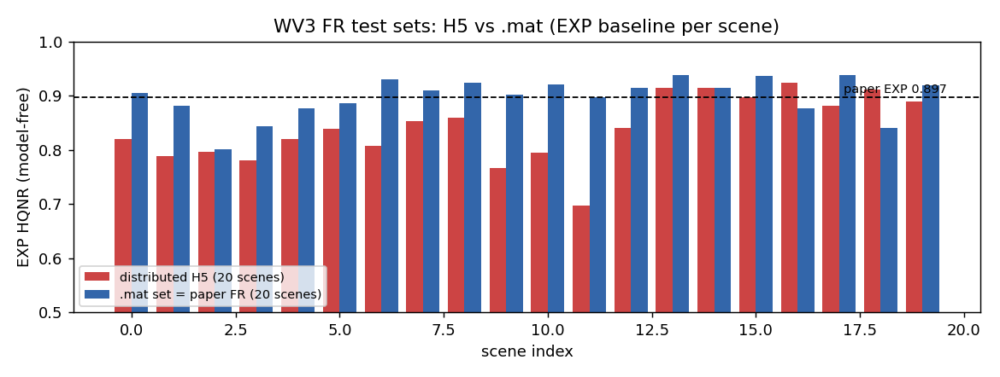
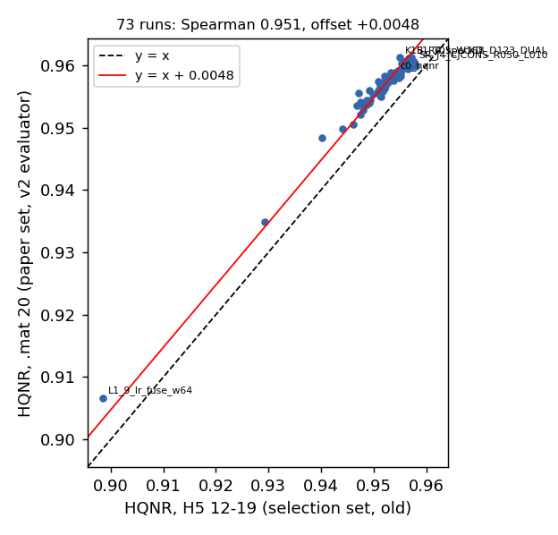
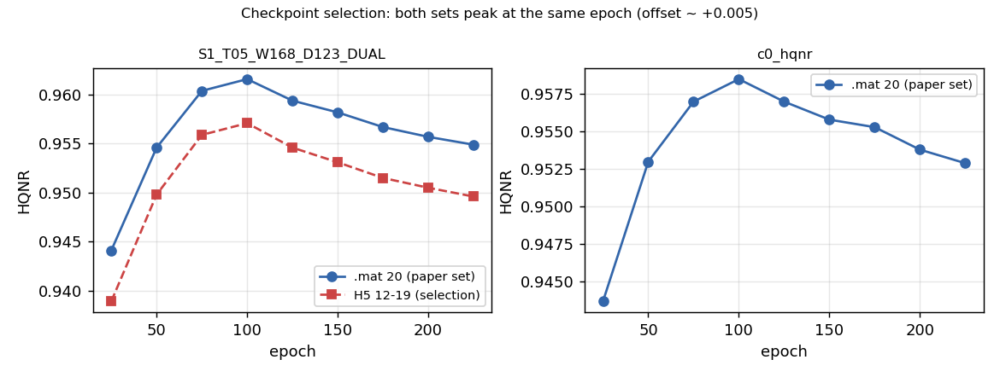

# 2026-09-08 — 지표 v2 보고서 + 아키텍처 고정 다중 데이터셋 3-seed 기동

이 날의 두 문건을 하나로 합쳤다.

| 갈래 | 결론 |
|---|---|
| **지표 v2 — 시트가 논문과 비교 가능한가** | **세 가지가 달랐고 전부 고쳤다.** ① **FR 테스트셋이 논문과 다른 장면**(논문은 PanCollection `.mat` 20장, 우리는 배포 H5 12-19 8장, 겹침 6장) ② SCC·SSIM 관례가 MATLAB 과 달랐다(SCC 약 +0.004, SSIM 약 +0.002 높았음) ③ MTF 커널 정규화·경계·ddof·캐시·논문 기준행 오기. 고친 뒤 **EXP·CANConv anchor 가 논문 값과 평균·N−1 표준편차까지 일치** |
| **ARCH W168·d123 다중 데이터셋 3-seed** | 구조 고정, 데이터셋만 WV3/QB/GF2 × seed 3벌 + WV2 zero-shot. **QB 학습셋 결함 발견(F-3)** — `train_qb.h5`/`valid_qb.h5` 의 `ms` 가 패치 67~70% 에서 `gt` 대비 LR 1px 어긋남 → QB 재시작(`*_msfix.h5`), 배포 ms 로 학습한 run 은 `*_msbug` 로 격리 |

> **후속**: 이 캠페인은 09-09 19:57 에 중지됐다(GF2×3 완료, QB S2025 중단, 6벌 미실행).
> 새 mainline 은 W96·D124 → [2026-09-09](2026-09-09_alignment-analysis-and-new-baseline.md).
> **best 선택 세트도 09-09 부터 논문 20장 전체**로 바뀌었다 — 이 문서가 "H5 12-19 를 그대로 둬도 된다"고
> 한 판단은 사용자 결정으로 뒤집혔고, 그 전 run 은 `*_sel1219` 로 격리된다.

---

## 지표 v2 보고서 — 시트의 수치는 논문과 비교 가능한가 (2026-09-08)

> 원문: `2026-09-08_metric-v2-report.md`

> 대상 독자: 논문 비교표를 만들 사람. 세부 근거·재현 명령은 [2026-09-07 문서의 "지표 비교가능성 감사" 절](2026-09-07_alignment-shift-robust-and-metric-v2.md) 에 있다.
> 이 문서는 무엇이 문제였고 무엇을 바꿨으며 기존 결론이 어떻게 되는지를 정리한 것이다.

### 요약

PAN-Crafter(ICCV 2025)·U-Know-DiffPAN(CVPR 2025)의 Table 과 우리 시트를 나란히 놓을 수 있는지 코드 수준에서 검증했다.
**세 가지가 달랐고 전부 고쳤다.** 고친 뒤 모델과 무관한 기준선(EXP)과 CANConv 배포 가중치가 논문 값과 평균·표준편차까지 맞는다.

| # | 문제 | 크기 | 조치 |
|---|---|---|---|
| 1 | **FR 테스트셋이 논문과 다른 장면이었다.** 논문은 PanCollection `.mat` 형식 20장, 우리는 배포 H5 20장 중 12-19(8장). 겹치는 장면 6장 | 시트 FR 값 전체가 논문과 비교 불가였음. 같은 run 을 논문 세트로 재면 HQNR +0.005 안팎, run 마다 다름 | `.mat` 세트를 받아 h5 로 만들고(`build_fr_paperset.py`) 전 run 을 다시 잼(`eval_fr_paperset.py`). 시트 FR 열은 이 값만 |
| 2 | **SCC·SSIM 구현 관례가 MATLAB 과 달랐다** | SCC 약 +0.004, SSIM 약 +0.002 높았음 (방법 간 차이와 같은 크기) | SCC 를 DLPan `SCC.m` 그대로(zero-padding), SSIM 을 Gaussian 11×11 σ1.5 로 |
| 3 | 2차 검증에서 잡힌 미세 차이: MTF 커널 정규화(HQNR −3e-4), imresize 경계(−2e-5), 표준편차 N 대 N−1, 캐시가 코드·데이터 변경을 모름, 논문 기준행 오기(QB 행에 WV2 값, GF2 D_λ/D_s 뒤바뀜) | HQNR 3~4e-4, ±값 2.6%, 기준행 오류 | `genMTF.m` 충실 재구현, symmetric 경계, ddof=1, JSON provenance(버전·해시), 기준행 교정 |

**기존 결론의 운명.** 방향성 결론은 유지되고, HQNR 0.005 안쪽의 세부 순위는 재확인 대상이다(§6).
best checkpoint 선택 기준(H5 12-19)은 그대로 두어도 된다 — 논문 세트에서도 같은 epoch 가 정점이다.

---

### 1. 무엇을 확인하려 했나

시트(`gspread/gspread_upload.py`)에 오르는 RR 8개·FR 3개 지표가 두 논문의 Table 과 같은 코드·같은 데이터로 잰 값인지.
두 논문 모두 MATLAB DLPan-Toolbox 프로토콜을 쓴다고 밝혔고(PAN-Crafter README 명시, U-Know 는 `.mat` 저장 후 MATLAB),
우리는 MATLAB 없이 그 프로토콜을 파이썬으로 옮긴 것을 쓴다. 검증 수단은 두 가지였다.

- **코드 대조**: DLPan MATLAB 원본(`indexes_evaluation.m`, `indexes_evaluation_FS.m`, `q2n.m`, `SCC.m`, `D_lambda_K.m`, `D_s.m`, `genMTF.m`)과 우리 구현을 한 줄씩.
- **anchor 대조**: 모델과 무관한 EXP(입력 lms 를 그대로 출력으로) 와 CANConv 배포 가중치를 우리 평가기로 재서 논문의 같은 행과 비교.

### 2. 발견 1 — FR 테스트셋이 논문과 달랐다

PanCollection 은 같은 테스트셋을 파이썬용 H5 와 MATLAB 용 `.mat` 두 형식으로 배포하고 README 는 "같은 데이터" 라고 쓴다.
Google Drive 에서 둘 다 받아 화소 단위로 대조하니 **WV3 full-resolution 만 서로 다른 20장**이었다(RR 은 동일).

*장면별 EXP HQNR(모델 무관). 빨강 = 배포 H5 20장, 파랑 = `.mat` 20장(논문 세트). H5 는 앞 12장이 해안 도시로 크게 어렵고, .mat 는 20장 전부 건조 시가지다. H5 12-17 여섯 장만 .mat 에 화소 동일하게 존재한다.*

우리가 8월부터 써 온 "H5 12-19" 는 논문과 평균이 비슷해 보였을 뿐 같은 세트가 아니었다. 표준편차가 그것을 드러냈다.

| anchor | D_λ | D_s | HQNR |
|---|---:|---:|---:|
| EXP · **`.mat` 20장 (v2 평가기)** | **0.0232 ± 0.0066** | **0.0813 ± 0.0318** | **0.8975 ± 0.0362** |
| EXP · 논문 행 | 0.0232 ± 0.0066 | 0.0813 ± 0.0318 | 0.897 ± 0.036 |
| EXP · H5 12-19 (옛) | 0.0246 ± 0.0068 | 0.0811 ± **0.0199** | 0.8963 |
| CANConv 배포 가중치 · **`.mat` 20장 (v2)** | **0.0196 ± 0.0086** | **0.0299 ± 0.0074** | **0.9511 ± 0.0126** |
| CANConv · 논문 행 | 0.0196 ± 0.0083 | 0.0301 ± 0.0074 | 0.951 ± 0.013 |
| CANConv · H5 12-19 (옛) | 0.0253 ± 0.0108 | 0.0261 ± 0.0035 | 0.9493 ± 0.0113 |

EXP 는 세 지표의 평균·표준편차가 소수 넷째 자리까지 같다. **데이터와 평가기가 모두 논문과 같다**는 뜻이다.
PanCollection 의 2022-12-11 갱신("FR 예제를 더 다양한 장면으로")이 H5 에만 적용된 것으로 보인다.

**다시 잴 수 있었던 이유.** FR 추론에 필요한 입력은 PAN·MS·lms(배포됨)와 lpan 뿐이고, lpan 은 F-1 때 역추정한
레시피로 만든다(RMSE 0.2~0.5 DN, 출력 영향 0.04%). 학습을 다시 할 필요 없이 best checkpoint 를 20장에 한 번 추론했다.

### 3. 발견 2 — RR 구현 관례

CANConv 배포 가중치를 anchor 로 두 논문의 CANConv 행(PSNR 37.441 / SSIM 0.973 / SCC 0.985 / SAM 2.927 / ERGAS 2.163 / Q8 0.918)과 대조했다.

| 지표 | 옛 구현 | **v2** | 논문 CANConv 행 | 원인 |
|---|---:|---:|---:|---|
| SCC | 0.9897 | **0.9854** | 0.985 | `SCC.m` 은 `imfilter` zero padding. scipy reflect 패딩은 잘린 가장자리 1px 링에서 +0.004 |
| SSIM | 0.9751 | **0.9732** | 0.973 | skimage 기본 7×7 균일창 → Wang/MATLAB 의 11×11 Gaussian σ1.5 |
| PSNR | 37.472 | 37.472 | 37.441 | 통합 MSE 가 맞음. 밴드별 평균은 +1.5 dB (Jensen) |
| SAM / ERGAS / Q8 | 2.921 / 2.170 / 0.9188 | 동일 | 2.927 / 2.163 / 0.918 | MATLAB 원본 포팅. 잔차는 재평가된 CANConv 출력 차이 |

SCC 교정은 절대값을 바꾼다. 우리 best 들의 SCC 는 0.991 이 아니라 **0.988** 이고 논문 0.988 과 동급이다.
146 run 에서 두 정의의 순위 상관은 0.992 라 상대 판정은 거의 유지된다. SSIM 은 방법 간 차이(0.003)와 관례 차이(0.002)가
같은 크기라 계속 포화 지표로 취급한다.

### 4. 발견 3 — 2차 검증에서 잡힌 것

사용자 검증 보고서(8건)를 재현해 반영했다. 전부 "부동소수점" 이 아니라 **알고리즘 차이**였다.

| 항목 | 내용 | 영향 |
|---|---|---|
| MTF 커널 | DLPan 공식 파이썬 포트는 1-D Kaiser 창을 한 축에만 곱하고 음수를 자른 뒤 sum=1 로 정규화한다. MATLAB `fwind1` 은 Huang 회전 2-D 창을 곱할 뿐 정규화하지 않는다(DC 이득 0.9988). 처음 "9e-7 무시 가능" 이라 한 것은 비교 코드에 정규화가 남아 있던 오류 | D_λ +2.0e-4(c0) ~ +3.6e-4(W168), HQNR −2~4e-4. `genMTF.m` 을 직접 재구현해 교체 |
| imresize 경계 | MATLAB 은 symmetric(`aux=[1:n n:-1:1]`), 우리는 replicate(clamp) | D_s +2e-5. 교체 |
| 표준편차 | numpy 기본 N, MATLAB 기본 N−1 (20장에서 2.6%) | ±값 전부 ddof=1. EXP anchor 가 네 자리까지 맞게 된 것이 이 교정 |
| 캐시 | `fr_mat20.json` 이 checkpoint 이름·시각만 보고 코드·데이터·lpan·config 변경을 몰랐다 | 평가기 버전·입력 h5/lpan/config sha256 을 넣고 하나라도 다르면 재계산. 시트도 검증 안 된 JSON 은 쓰지 않음 |
| 논문 기준행 | 시트의 QB 행이 WV2(unseen) 값, GF2 는 D_λ/D_s 뒤바뀜 | PDF 대조 후 교정, WV2 행 신설 |
| 지원 범위 | 새 FR 평가기가 default/kd/teacher/sr 만 지원 | uvs·mutual 추가. align(GA 9벌)은 논문 세트용 shift cache 가 없어 제외(캠페인 종료·전부 실패 판정) |

### 5. 조치

**코드** — `tools/metrics/eval_fr.py`(genMTF 충실 커널, symmetric 경계, N−1), `tools/eval_dlpan.py`(SCC·SSIM),
`tools/build_fr_paperset.py`·`tools/eval_fr_paperset.py`(논문 세트 h5, run 별 `results/fr_mat20.json`, provenance),
`gspread/gspread_upload.py`(FR 열 = 논문 세트만, 기준행 교정, batch 쓰기, 헤더 불일치 guard),
`gspread/apply_layout.py`(옛 탭 순서·구분행 복원), `tools/metric_v2_prepare.sh`(다른 서버 원샷). 커밋 `03f6681`.

**시트** — 옛 탭은 `WV3-s1_v1`·`WV3-s2_v1`·`WV3-s3(5090)_v1` 로 보존. 새 `WV3-s1` 은 옛 탭과 같은 65 run·같은 순서·같은
구분행(S1 격자에 라벨 하나 추가)이고 값만 v2. 옛 탭에 없던 84 run 은 `WV3-s1-extra`. FR 열은 사용자 결정으로 논문 세트
(FR·paper mat20)만 남겼다. 학습 중 best 선택은 종전대로 H5 12-19 를 쓰되 시트에는 올리지 않는다.

**운영** — 실행 중이던 shift-robust 미세조정 체인(2/4)은 지표 정리에 집중하기 위해 중단했다(watchdog 해제).
이후 체인이 끝낸 run 은 `tools/_upload.sh` 가 논문 세트 평가를 먼저 돌린 뒤 올린다.

### 6. 영향 — 기존 결론은 어떻게 되나

*HQNR 로 선택한 73 run. 가로 = 옛 선택 세트(H5 12-19) best 값, 세로 = 논문 세트(v2). Spearman 0.951, 오프셋 +0.0048 ± 0.0012 (범위 +0.002 ~ +0.008).*

| | 값 |
|---|---:|
| 순위가 뒤집히는 쌍 | 전체 9.0% · H5 차이 < 0.005 인 쌍은 13% |
| 장면 표본 표준오차 (per-scene sd 중앙값 0.011) | 8장 ≈ 0.004 · 20장 ≈ 0.0024 |
| 논문 세트 상위 (구분되지 않음) | K1B_R4_specKD 0.9612 · S1_T05_W168_D123 0.9612 · S1_T05_W176_D122 0.9612 · K0_R4_base 0.9607 · c3b_btl 0.9605 · SR_J4 λ0.1 0.9605 |

- **유지되는 것**: jitter 가 후반 D_s 붕괴를 없앤다, MS-only 는 4–6M 에서 붕괴한다, LR-Fuse 는 크게 열세다, 재구성 teacher(7.17M)가
  논문 행과 같은 자리(0.9588 vs 0.958)에 온다. 이런 방향성 결론은 세트를 바꿔도 그대로다.
- **재확인 대상**: HQNR 0.005 안쪽 차이로 내린 세부 순위. 예컨대 SR 캠페인의 H5 1~3위(J4 두 seed·J2)는 논문 세트에서
  6~10위이고, H5 4위였던 anchor W168 이 1위다. "jitter 의 best 는 동급" 이라는 결론은 그대로지만 그 안의 순서는 어느 세트에서든
  표본 잡음(±0.002~0.004)이었다. KD student 선정도 논문 세트 열로 다시 읽어야 한다.
- **선택 기준은 유효하다**: epoch 25~225 를 모두 논문 세트에 재평가하니 두 곡선이 +0.005 오프셋으로 평행하고 정점이 같다.

*S1_T05_W168_D123_DUAL(왼쪽): 선택 세트와 논문 세트 모두 epoch 100 이 정점. c0_hqnr(오른쪽): 논문 세트 정점 epoch 100, H5 로 고른 epoch 115 가 0.9590.*

- **정의 변경의 부수 효과**: train.py 의 선택 지표가 같은 MTF 커널을 쓰므로 이후 run 의 `best_hqnr` 는 이전 run 보다 약 3e-4 낮다.
  정의 차이이지 성능 차이가 아니다. 2026-09-07 이전 문서의 SCC 는 약 +0.004, SSIM 은 약 +0.002 높은 옛 정의다.

### 7. 남은 불확정

| 항목 | 상태 |
|---|---|
| PSNR·SSIM | DLPan 프로토콜 밖. 논문이 코드를 밝히지 않아 관례를 anchor 로 추정한 것. ±0.001~0.002 는 남는다 |
| MATLAB 실행 | 하지 않았다. "재구현 + anchor 검증" 이지 비트 동일이 아니다. 닫으려면 MATLAB 에서 `indexes_evaluation*.m` 에 우리 `.mat` 출력을 넣어 봐야 한다 |
| lpan | 저자 파일이 아닌 레시피 생성본 (출력 영향 0.04%) |
| align 9벌 | 논문 세트 값 없음 |
| s2·s3 | 아직 옛 정의. `./tools/metric_v2_prepare.sh` 한 번으로 재측정·업로드·순서 복원 (SETUP.md §5) |

### 8. 앞으로의 규칙

1. 논문 비교표의 FR 은 **시트 FR·paper mat20 열(= `results/fr_mat20.json`)** 만 쓴다. RR 은 PSNR·SSIM·SAM·ERGAS·SCC·Q8 (RMSE·CC 제외).
2. 판정은 종전대로 HQNR → SCC. 0.005 안쪽 차이는 "구분되지 않는다" 로 끝낸다(20장 표준오차 0.0024).
3. 표 각주: "DLPan-Toolbox 프로토콜의 Python 재구현(EXP·CANConv anchor 로 검증), FR 은 PanCollection .mat 테스트셋 20장, PSNR 통합 MSE, SSIM Gaussian 11×11, ± 는 N−1".
4. 평가기를 바꾸면 `EVAL_VERSION` 을 올리고 전 run 을 다시 잰다 — 캐시는 버전·해시가 전부 같을 때만 쓴다.

### 부록 A. 평가 방식 전후

| 항목 | 이전 (`_v1`) | v2 |
|---|---|---|
| FR 데이터 | 배포 H5 12-19 (8장) | PanCollection `.mat` 20장 |
| HQNR 집계 | (1−평균D_λ)(1−평균D_s) | 장면별 (1−D_λ)(1−D_s) 평균 |
| MTF 커널 | DLPan 파이썬 포트 (정규화) | `genMTF.m` 충실 (정규화 없음) |
| imresize 경계 | replicate | symmetric |
| SCC | scipy Sobel reflect | `SCC.m` zero padding |
| SSIM | skimage 7×7 균일창 | Gaussian 11×11 σ1.5 |
| PSNR · SAM · ERGAS · Q2n · 크롭 21 · 블록 32 | 동일 | 동일 |
| ± | N | N−1 |
| 캐시 | checkpoint 이름·시각 | + 평가기 버전·입력·lpan·config 해시 |
| best 선택 | H5 12-19 | 동일 (시트에는 미표시) |

### 부록 B. 핵심 run (논문 세트, v2)

| run | 세팅 | HQNR | ±sd | D_λ | D_s |
|---|---|---:|---:|---:|---:|
| ■ PAN-Crafter 논문 | | 0.958 | 0.009 | 0.016 | 0.027 |
| □ CANConv 배포 가중치 | anchor | 0.9511 | 0.0126 | 0.0196 | 0.0299 |
| c0_hqnr | 재구성 teacher 7.17M | 0.9588 | 0.0098 | 0.0169 | 0.0248 |
| wv3_baseline | 배포 코드 9.97M | 0.9551 | 0.0122 | 0.0191 | 0.0263 |
| s1_A1 | 11ch·nocrop·LN | 0.9539 | 0.0066 | 0.0160 | 0.0306 |
| S1_T05_W168_D123_DUAL | W168 d123 dual | 0.9612 | 0.0107 | 0.0181 | 0.0211 |
| S1_T05_W176_D122_DUAL | W176 d122 dual | 0.9612 | 0.0101 | 0.0167 | 0.0225 |
| K1B_R4_specKD | R4 student 2.1M + spectral KD | 0.9612 | 0.0146 | 0.0173 | 0.0219 |
| K0_R4_base | R4 base | 0.9607 | 0.0102 | 0.0185 | 0.0212 |
| SR_J4 λ0.1 / seed1234 | clean+jitter | 0.9605 / 0.9599 | 0.0112 / 0.0094 | | |
| SR_J2 / SR_J1 | jitter MS-only / 두 mode | 0.9598 / 0.9595 | 0.0094 / 0.0106 | | |
| R4_w96_d124_noattn | student 후보 | 0.9597 | 0.0126 | 0.0190 | 0.0218 |
| K3 / K4 | U-Know+GT var / +SiS | 0.9593 / 0.9591 | | | |
| d122 | | 0.9585 | 0.0102 | 0.0181 | 0.0238 |
| SR_J3 | blur 대조 | 0.9540 | 0.0101 | 0.0195 | 0.0270 |
| c8_c4w96 | w96 attn0 | 0.9528 | 0.0171 | 0.0185 | 0.0293 |
| L1_9_lr_fuse_w64 | LR-Fuse | 0.9067 | 0.0367 | 0.0333 | 0.0624 |

전체 값은 시트 `WV3-s1`·`WV3-s1-extra` 와 각 run 의 `results/fr_mat20.json`.

---

## WIP — 아키텍처 고정(W168 d123 dual) 다중 데이터셋 3-seed (2026-09-08 기동)

> 원문: `2026-09-08_WIP_arch-w168-multiset-3seed.md`

계획: [research_log/2026-09-08_arch-w168-multiset-3seed-plan.md](../research_log/2026-09-08_arch-w168-multiset-3seed-plan.md).
구조는 `S1_T05_W168_D123_DUAL` 그대로, 데이터셋만 WV3 / QB / GF2 × seed 2025·1234·7777, WV3 checkpoint 의 WV2 zero-shot.
지표 v2(논문 세트 .mat 20장, `results/fr_mat20.json`). 각 서버가 같은 큐를 돈다 — 시트 탭 `QB-<서버>`·`GF2-<서버>`·`WV2-<서버>`·`WV3-<서버>`.

| 서버 | 기동 | 큐 | 상태 |
|---|---|---|---|
| s1 | 09-08 10:41 → 18:58 재기동(F-3) → 09-09 09:2x 재기동(선택 20장) | GF2×3 → QB×3(ms 복구본) → WV3×3 (9 run, ≈3.4h/run) | 진행 중 |
| s2 / s3 | pull 후 `./tools/arch_multiset_prepare.sh` | 동일 | 대기 |

기동 시점에 없는 것: GF2 논문 세트 4장·WV2 논문 세트·QB/GF2/WV2 RR .mat(Drive 속도제한, 재시도 중). GF2·WV2 의 FR 열은
세트가 만들어진 뒤 `python tools/eval_fr_paperset.py --all` + `gspread_upload.py --all --replace` 로 채운다.

결과는 요청 시 채운다(상시 tracking 안 함).

### 2026-09-08 18:xx — QB 학습셋 결함 발견, QB 재시작 (KNOWN_ISSUES F-3)

QB 만 학습이 불안정했다: RR ERGAS 가 eval 마다 3.9~6.5 를 오가고(변동계수 12~14%, WV3 는 4%), 같은 config·seed 인데
s1 4.79 / s2 6.83 / s3 5.28. 원인은 데이터 — `train_qb.h5`/`valid_qb.h5` 의 `ms` 가 패치의 67~70% 에서 `gt` 대비
LR 1픽셀(HR 4px) 어긋나 있다(데시메이션 위상 (1,2)/(2,1)). WV3·GF2 학습셋과 QB 테스트셋은 정상(MAD 0.00).
`tools/repair_qb_ms.py` 로 Wald 재생성한 `*_msfix.h5` 로 QB 세 seed 를 다시 돌린다. 배포 ms 로 학습한 QB run 은
`*_msbug` 로 치웠고 시트·배치에서 제외된다 — **s2·s3 의 QB 행(ARCH_..._QB_*)도 무효**, pull 후 `arch_multiset_prepare.sh`
가 자동으로 격리·복구한다. 첫 QB run(배포 ms) 참고값: 논문 세트 HQNR 0.902 / RR ERGAS 4.79 (논문 0.920 / 3.570).

### 2026-09-08 20:xx — 센서별 평가가 논문과 같은지 확인 (KNOWN_ISSUES F-2 표)

네 센서 `.mat` 테스트셋을 전부 받아 H5 와 대조: RR 은 네 센서 모두 동일, FR 은 WV3·QB 만 다르고(논문 세트로 교체) GF2·WV2 는
동일. 어느 센서도 FR 부분집합을 쓰지 않는다(20장 전체). CANConv 배포 가중치를 우리 평가기로 재서 두 논문의 CANConv 행과
대조(`work_dir/_ref_cannet_{qb,gf2,wv2}`, 시트 각 탭의 □ 행):

| | HQNR (우리 / 논문) | D_λ | D_s | PSNR | SSIM | SCC | Q2n | SAM | ERGAS |
|---|---|---|---|---|---|---|---|---|---|
| QB | 0.8941 / 0.893 | 0.0393 / 0.039 | 0.0691 / 0.070 | +0.41% | +0.04% | −0.01% | +0.01% | −1.10% | −0.54% |
| GF2 | 0.9189 / 0.919 | 0.0194 / 0.019 | 0.0629 / 0.063 | +0.39% | +0.01% | +0.06% | −0.06% | −1.27% | −2.57% |
| WV2 (wv3 가중치 zero-shot) | 0.8770 / 0.876 | 0.0690 / 0.068 | 0.0576 / 0.060 | +0.38% | +0.19% | −0.04% | −0.26% | +0.01% | +0.12% |

FR 세 지표와 RR 의 PSNR·SSIM·SCC·Q2n 이 논문 자릿수에서 맞는다. SAM·ERGAS 의 −1~−2.6% 는 WV3 때와 같이 "배포 가중치 ≠
논문 표의 재학습 출력" 차이다(평가기가 아니라 모델 출력). 논문 Table 1/2/3 의 데이터셋별 결과와 같은 데이터·같은 프로토콜로
비교할 수 있다.

### 2026-09-08 21:xx — JQM 추가 (Palubinskas 2015, `tools/metrics/jqm.py`)

시트 FR·paper 에 JQM↑ 열을 넣었다(논문 세트 mat 에서 계산, 재추론 없음). 정의는 논문 Eq.4/6/8/9/11 그대로이고 논문이 정하지 않은
선택 — 전역 CMSC 통계 · lpf = genMTF(센서) + (2,2) 데시메이션 · 분광 가중 w = NNLS(MTF_PAN↓PAN ~ MS) · R = 2^L−1 — 은 모듈 docstring
에 적었다. 두 논문은 JQM 을 보고하지 않으므로 대조값은 없고, **판정 기준은 그대로 HQNR → SCC** 다.

실측 성질: d1·d2 항은 ~1e-4 이하라 CMSC ≈ ρ⁺ 이고, QHR 은 사실상 PAN–intensity 상관이다. 그래서 PAN 구조를 강하게 주입한 출력이
높게 나온다 — WV3 139 run 에서 **Spearman(HQNR, JQM) = −0.56**, LR-Fuse(HQNR 0.907, 최하위)가 JQM 0.988 로 최상위. QLR 만 보면
LR-Fuse 가 최하(0.9878)로 상식과 맞는다. 즉 JQM 은 HQNR 과 다른 것을 재며(공간 충실도 편향), 단독 순위 근거로 쓰면 안 된다.

### 2026-09-09 — 선택 프로토콜 변경: 논문 세트 20장 전체 (12-19 부분집합 폐기), 캠페인 재시작

사용자 지시: "다른 데이터셋 HQNR 잴 때 20장 전체로, 부분집합 8장은 없애라, 논문을 따라라." 학습 중 best 선택도 논문 세트
(.mat 20장, `full_examples_mat20`)로 바꿨다 — `fr_select_indices` 기본 `0-19`, config 의 FR feeder 를 논문 세트로. 선택 세트 = 보고
세트가 됐으므로 no-reference 지표의 선택 편향은 남는다(논문들도 FR 검증 split 을 밝히지 않았다).
그 전에 H5 12-19 로 고른 run(GF2 seed 2025·1234·7777, QB seed 2025, 진행 중이던 QB 1234)은 `*_sel1219` 로 격리해 시트·배치에서
뺐고, 큐 9벌(GF2×3 → QB×3 → WV3×3, WV3 seed 2025 도 새 프로토콜로 새로)을 처음부터 다시 돌린다(≈31h). 논문 세트로 매 eval
20장을 재므로 run 당 약 12분 늘어난다.

JQM 은 SIPSA-Net 보충자료 규약(QLR 밴드 균등평균, QHR 볼록 가중 intensity, v=0.5)으로 바꿨다 — SRF 가 없어 NNLS 정규화 대체
가중치("SRF 대체 JQM 변형"). 입력 [0,R] 클립·볼록 가중으로 [0,1] 을 보장한다(검증 지적: 합이 제한되지 않은 회귀 가중치는 1 을
넘긴다). WV3 139 run Spearman(HQNR, JQM) = −0.53 로 여전히 공간 편향이다 — 참고 열.
