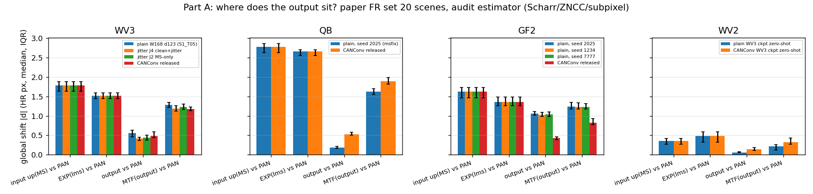
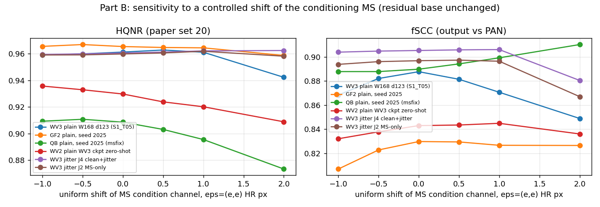

# 2026-09-09 — 학습만으로 정렬 문제가 얼마나 풀리는가: 재구성 loss 만으로 학습한 W168·d123 모델의 출력 기하

> 질문: jitter branch(shift-robust, `research_log/s1_w168_d123_shift_robust_alignment_30h_plan.md`) 없이
> **단순 재구성 loss 로만 학습한 모델**(`S1_T05_W168_D123_DUAL` 구조 — W168 · depth [1,2,3] · dual MARs ·
> 11ch · nocrop · attention 없음 · 50K)은 `research_log/2026-09-03_alignment-audit-s2-detail.md` 가 잰
> MS–PAN 어긋남을 어느 정도 스스로 해결하는가. 학습이 끝난 모든 데이터셋(WV3 · QB · GF2 · WV2 zero-shot)에서 본다.
>
> 실행: 전부 재구성본(`fixed` 계열) · 측정: 지표 v2(`py`, DLPan 프로토콜 재구현) · FR 세트: 논문 `.mat` 20장(`fr_mat20`).
> 도구: `tools/align_after_training_diag.py` (Part A/B) · CSV `outputs/align_after_training/` · 요약 `outputs/align_after_training/summarize.py`.

## 요지

1. **구조(edge)는 학습만으로 PAN 을 따라간다.** 출력의 전역 shift(PAN 기준, HR px 중앙값)는 입력 up(MS) 의
   어긋남 대비 WV3 1.79 → **0.55**, QB 2.78 → **0.18**, WV2 0.36 → **0.06** 으로 줄었다(20장 중 19~20장에서 감소).
   **GF2 는 절반만** 줄었다(1.62 → **1.04**, 3 seed 전부 1.03~1.06). CANConv 배포 가중치도 같은 정도(0.4~0.5)라
   이것은 "PAN 고주파를 복사하는 잔차 구조"의 일반 성질이지 우리 모델만의 것이 아니다.
2. **색(저주파)은 해결되지 않았다.** 출력을 MTF 로 다시 흐리면 PAN 에서 여전히 WV3 **1.29** · GF2 **1.23** ·
   QB **1.62** · WV2 0.21 px 떨어져 있다 — 입력 어긋남의 24~42% 만 이동했고, 그만큼 MS 격자에서도
   0.7~1.0 px 벗어났다. 즉 **출력 안에서 구조와 색의 기하가 ~1 px 이상 어긋난 상태**(edge 는 PAN, 색은 MS 와 PAN 사이).
   jitter 학습본(J2/J4)도 CANConv 도 정확히 같다(1.18~1.23). 학습·jitter 어느 쪽도 이 축은 건드리지 못했다.
3. **입력을 정렬해 주면 출력의 PAN 일관성은 확실히 좋아진다** — 장면별 측정 어긋남만큼 조건 MS 를 옮겨 넣으면
   (α=+1) fSCC 가 WV3 **+0.020**, GF2 **+0.037**, QB +0.010 오르고 δ_out 은 0.55 → 0.32(WV3) 로 준다.
   정렬 문제는 실재하고, 출력 품질에 여지가 남아 있다.
4. **그러나 HQNR 은 그 개선을 벌점 준다.** 같은 α=+1 에서 HQNR 은 WV3 −0.008 · GF2 −0.012 · QB −0.023
   (D_s 가 매번 오른다). 반대로 **어긋남을 2배로 하면 HQNR 이 오르는 경우가 있다**(GF2 plain +0.003,
   WV3 J4 +0.004 = 0.9647 로 이 문서 전체 최고). D_s 의 기준쌍(MS vs MTF↓PAN) 자체가 어긋나 있어
   PAN 에 정렬된 출력일수록 |Q(fused,PAN) − Q(MS,PAN_LR)| 이 커지는 기전이다.
   **GF2 대조**: 우리 plain 은 HQNR 0.965 / fSCC 0.830 / δ_out 1.04, CANConv 는 HQNR 0.919 / fSCC 0.924 / δ_out 0.43
   — HQNR 이 0.046 좋다고 말하는 모델이 PAN 을 훨씬 덜 따른다.
5. **결론**: "단순 학습이 정렬을 조금 해결했는가" 에 대한 답은 **구조는 예(대부분), 색은 아니오** 다. 그리고 정렬 축의
   개선은 HQNR 로는 보이지 않거나 거꾸로 보이므로, 정렬 실험의 판정에는 **fSCC 와 δ_out(출력 vs PAN 전역 shift)** 를
   나란히 둬야 한다. HQNR 우선 판정 규칙 자체를 바꾸자는 것이 아니라, 이 축에서 HQNR 이 무엇을 재지 못하는지를 확정한 것이다.
   기존 shift-robust 캠페인의 "best HQNR 동급" 결론도 이 기전 위에 있다 — 같은 run 을 fSCC 로 보면 J4 +0.018, δ_out 0.55 → 0.42 다.

## 0. 대상과 방법

### 0.1 대상 모델 (전부 논문 FR 세트 20장 출력 `results/full_best_hqnr_mat20.mat`)

| 센서 | run | 설명 | HQNR(v2) | 비고 |
|---|---|---|---:|---|
| WV3 | `S1_T05_W168_D123_DUAL` | plain, 재구성 loss 만 | 0.9612 | 시트 값과 동일 |
| GF2 | `ARCH_W168_D123_DUAL_GF2_S{2025,1234,7777}_sel1219` | plain, 3 seed | 0.9654 / 0.9588 / 0.9589 | best 선택은 옛 H5 12-19 기준(`_sel1219`), 평가는 mat20 |
| QB | `ARCH_W168_D123_DUAL_QB_S2025_sel1219` | plain, 학습셋 ms 복구본(F-3) | 0.9086 | 단일 seed |
| WV2 | `S1_T05_W168_D123_DUAL_zs_wv2` | WV3 checkpoint zero-shot | 0.9297 | |
| WV3 | `SR_J4_CJCONS_R050_L010_W168_D123_DUAL` | 대조: clean+jitter 두 branch + consistency | 0.9605 | shift-robust 캠페인 |
| WV3 | `SR_J2_C2RAND_MSONLY_R050_W168_D123_DUAL` | 대조: MS mode 만 ±0.5px jitter | 0.9598 | 〃 |
| WV3/QB/GF2/WV2 | `_ref_cannet*` | 대조: CANConv 배포 가중치 (컨테이너 출력) | 0.9511 / 0.8941 / 0.9189 / 0.8770 | 외부 anchor |

### 0.2 Part A — 출력은 어디에 있는가 (저장된 출력만, 추론 없음)

audit 과 같은 추정기(`align/estimator.py`: Scharr → median/MAD 정규화 → 참조 상위 30% edge 마스크 → 정수 ZNCC 탐색 →
quadratic 부화소; HR 격자라 탐색 ±4 px)로 장면마다 전역 shift 를 잰다. 부호 규약은 audit 그대로
(`aligned[y,x] = moving[y+dy, x+dx]`, 참조 ← 이동). audit 이 지적한 해상도 편향(선명한 PAN vs 매끄러운 up(MS))을 피하려고
저주파 쌍은 PAN 을 PAN MTF(GNYQ_PAN)로 흐린 `PAN_b` 와 비교한다.

| 기호 | 참조 ← 이동 | 뜻 |
|---|---|---|
| δ_in | PAN_b ← up(MS) (bicubic, 모델의 실제 입력 `ms_base`) | 모델 입력의 어긋남 (audit pair C 의 PAN 격자판) |
| δ_exp | PAN_b ← lms (interp23tap, EXP) | 같은 것의 데이터셋 lms 판 |
| **δ_out** | PAN ← 출력(밴드 평균) | 출력의 **구조**가 PAN 기하에 있는가 (0 이면 정렬) |
| **δ_out_low** | PAN_b ← MTF_MS(출력) | 출력의 **저주파(색)**가 PAN 기하에 있는가 |
| δ_out←MS | up(MS) ← MTF_MS(출력) | 출력 저주파가 MS 격자에서 얼마나 옮겨갔는가 |
| block | 64 px 블록 국소 추정 |δ| 중앙값 (in / out) | 전역치가 국소에서도 성립하는지 |

fSCC 는 `utils.SCC_full_numpy`(출력 vs PAN, 옛 정의·상대 비교용). 장면별 D_λ/D_s/HQNR 은 각 run 의 `fr_mat20.json`.

### 0.3 Part B — 조건 MS 를 통제 이동한 추론

shift-robust 캠페인의 jitter 경로 그대로(`sr/forward.sr_infer`, `translate_hr`): **조건 채널의 MS 만** ε(HR px) 옮기고
잔차 base(`ms_base`, M-frame)는 두지 않는다. plain 모델은 `SRModel(backbone)` 로 감싸 같은 경로를 탄다
(ε=0 이 시트 HQNR 을 소수 4자리까지 재현한다 — 0.9612 / 0.9654 / 0.9086 / 0.9297 / 0.9605 / 0.9598).

- uniform: ε=(e,e), e ∈ {0, ±0.5, ±1, +2}
- **alpha**: 장면별 δ_in × α. **α=+1 이면 조건 MS 가 PAN 에 정렬**된 입력, α=−1 이면 어긋남 2배, α=+0.5 는 절반 보정.

지표는 HQNR(D_λ·D_s, `tools/metrics/eval_fr.py`, 20장 평균) · fSCC · δ_out.

## 1. Part A — 출력은 어디에 있는가



|δ| 중앙값(HR px, 20장). 굵은 열이 판정 열.

| 센서 | 모델 | HQNR | fSCC out / EXP | δ_in | δ_exp | **δ_out** | **δ_out_low** | δ_out←MS | block in / out | \|δ_out\|<\|δ_in\| |
|---|---|---:|---:|---:|---:|---:|---:|---:|---:|---:|
| WV3 | plain W168 d123 (S1_T05) | 0.9612 | 0.8878 / 0.7543 | 1.79 | 1.52 | **0.55** | **1.29** | 0.74 | 1.89 / 0.63 | 20/20 |
| WV3 | jitter J4 clean+jitter | 0.9605 | 0.9054 / 0.7543 | 1.79 | 1.52 | **0.42** | **1.19** | 0.76 | 1.89 / 0.37 | 20/20 |
| WV3 | jitter J2 MS-only | 0.9598 | 0.8969 / 0.7543 | 1.79 | 1.52 | **0.44** | **1.23** | 0.74 | 1.89 / 0.41 | 20/20 |
| WV3 | CANConv 배포 | 0.9511 | 0.8723 / 0.7543 | 1.79 | 1.52 | **0.49** | **1.18** | 0.80 | 1.89 / 0.40 | 20/20 |
| QB | plain seed 2025 (msfix) | 0.9086 | 0.8898 / 0.6436 | 2.78 | 2.66 | **0.18** | **1.62** | 0.98 | 2.39 / 0.24 | 20/20 |
| QB | CANConv 배포 | 0.8941 | 0.7630 / 0.6436 | 2.78 | 2.66 | **0.53** | **1.89** | 0.91 | 2.39 / 0.46 | 20/20 |
| GF2 | plain seed 2025 | 0.9654 | 0.8298 / 0.7287 | 1.62 | 1.36 | **1.06** | **1.24** | 0.80 | 1.76 / 1.07 | 19/20 |
| GF2 | plain seed 1234 | 0.9588 | 0.8397 / 0.7287 | 1.62 | 1.36 | **1.03** | **1.23** | 0.80 | 1.76 / 1.09 | 19/20 |
| GF2 | plain seed 7777 | 0.9589 | 0.8386 / 0.7287 | 1.62 | 1.36 | **1.04** | **1.23** | 0.78 | 1.76 / 1.04 | 19/20 |
| GF2 | CANConv 배포 | 0.9189 | 0.9236 / 0.7287 | 1.62 | 1.36 | **0.43** | **0.82** | 0.78 | 1.76 / 0.39 | 20/20 |
| WV2 | plain WV3 ckpt zero-shot | 0.9297 | 0.8430 / 0.7306 | 0.36 | 0.49 | **0.06** | **0.21** | 0.32 | 0.26 / 0.12 | 19/20 |
| WV2 | CANConv WV3 ckpt zero-shot | 0.8770 | 0.8049 / 0.7306 | 0.36 | 0.49 | **0.15** | **0.32** | 0.61 | 0.26 / 0.17 | 18/20 |

방향(중앙값, dy,dx). 출력 저주파의 잔여 어긋남은 입력과 **같은 방향**이다 — 부분 보정이지 다른 곳으로 간 것이 아니다.

| 센서 | 모델 | δ_in | δ_out | δ_out_low |
|---|---|---|---|---|
| WV3 | plain | (−1.64, +0.62) | (−0.37, +0.38) | (−0.95, +0.90) |
| WV3 | J4 / J2 / CANConv | 〃 | (−0.28,+0.29) / (−0.27,+0.35) / (−0.40,+0.27) | (−0.87,+0.83) / (−0.89,+0.86) / (−0.86,+0.82) |
| QB | plain / CANConv | (−2.50, +1.25) | (−0.12,+0.14) / (−0.34,+0.41) | (−1.25,+1.05) / (−1.39,+1.30) |
| GF2 | plain ×3 / CANConv | (−1.56, +0.28) | (−0.78~−0.83, +0.55~+0.67) / (−0.41,−0.07) | (−0.98,+0.72~0.76) / (−0.72,+0.37) |
| WV2 | plain zs / CANConv zs | (−0.16, −0.17) | (−0.02,0.00) / (−0.11,+0.08) | (+0.07,+0.10) / (+0.21,+0.26) |

읽기:

- **입력 어긋남은 audit 과 일치한다.** δ_in 1.79 / 2.78 / 1.62 / 0.36 은 audit 의 PAN 격자 FR(bicubic) 1.51 / 2.51 / 1.60 / 0.32 와
  순위·크기가 같다(+0.2 px 는 PAN blur 커널 차이). 센서 안에서는 장면 간 편차가 작다(IQR ±0.1) — FR 어긋남은 장면이 아니라
  센서(등록) 수준이다. 그래서 장면별 |δ_in| 과 D_s·HQNR 의 Spearman 은 어느 run 에서도 유의하지 않다(−0.31 ~ +0.28, n=20).
- **구조: WV3 −69%, QB −94%, WV2 −83%, GF2 −36%.** 블록 국소 추정도 같은 값(WV3 1.89 → 0.63, QB 2.39 → 0.24, GF2 1.76 → 1.07).
  GF2 만 plain 3 seed 가 모두 1 px 남고 CANConv 는 0.43 — GF2 에서 우리 구조가 PAN 을 덜 따르는 것은 seed 가 아니라 구조·학습의 성질이다
  (fSCC 도 0.83~0.84 vs CANConv 0.924). 원인은 이 문서 범위 밖(가설: GF2 는 MS 가 상대적으로 선명해 잔차 base up(MS) 의 edge 가
  출력에 남는다 — base 누출).
- **색(저주파): 입력 대비 WV3 −28%, GF2 −24%, QB −42%, WV2 −42% 만 이동.** 모든 모델(plain·jitter·CANConv)이 1.2~1.9 px(WV2 0.2~0.3)
  를 남긴다. 출력은 PAN 기하의 edge 위에 MS 와 PAN 사이 어딘가의 색을 얹은 상태다. 이것이 audit 이 문제 삼은 "정렬 문제"의
  학습 후 잔여이고, jitter 학습은 이 축을 전혀 바꾸지 않았다(1.29 → 1.19/1.23).

## 2. Part B — 조건 MS 를 옮기면



### 2.1 uniform ε — 민감도 (Δ = ε=0 대비)

| 센서 | 모델 | ΔfSCC ±0.5 | ΔfSCC ±1 | ΔfSCC +2 | ΔHQNR ±0.5 | ΔHQNR ±1 | ΔHQNR +2 | δ_out (0 → +2) |
|---|---|---|---|---:|---|---|---:|---|
| WV3 | plain | −0.006 / −0.006 | −0.017 / −0.019 | −0.039 | +0.0015 / −0.0014 | −0.0001 / −0.0021 | −0.019 | 0.55 → 0.76 |
| WV3 | J4 | +0.001 / −0.001 | +0.001 / −0.001 | −0.025 | +0.0007 / −0.0006 | +0.0016 / −0.0011 | **+0.0019** | 0.40 → 0.40 |
| WV3 | J2 | +0.001 / −0.001 | −0.000 / −0.003 | −0.030 | +0.0008 / −0.0007 | +0.0020 / −0.0008 | −0.0017 | 0.44 → 0.42 |
| GF2 | plain | −0.000 / −0.007 | −0.003 / −0.023 | −0.003 | −0.0007 / +0.0015 | −0.0010 / +0.0001 | −0.0067 | 1.03 → 0.80 |
| QB | plain | +0.004 / −0.002 | +0.009 / −0.002 | **+0.021** | −0.0055 / +0.0022 | −0.0131 / +0.0007 | −0.035 | 0.18 → 0.08 |
| WV2 | zero-shot | +0.001 / −0.005 | +0.002 / −0.011 | −0.007 | −0.0059 / +0.0032 | −0.0096 / +0.0060 | −0.021 | 0.02 → 0.21 |

- plain 은 조건을 0.7 px(±0.5 대각) 만 흔들어도 fSCC −0.006, 1.4 px 에 −0.018, 2.8 px 에 −0.039. **δ_out 은 0.55 → 0.76 밖에 안 움직인다** —
  구조는 조건 MS 를 따라가지 않고 PAN 에 붙어 있으며, 손실은 구조가 아니라 텍스처·색의 일관성에서 난다.
- jitter 학습본은 학습 범위(±0.5)와 그 2배(±1)까지 fSCC 변화 ±0.001 로 사실상 무감각하고, 2.8 px 에서야 무너진다. shift-robust 계획이
  의도한 성질이 정확히 그 범위에서 성립한다.
- HQNR 은 ±1 px 안에서 어느 모델도 ±0.002 를 넘지 않는다 — **HQNR 은 이 범위의 조건 어긋남을 거의 못 본다** (fSCC 는 본다).
- QB 는 어느 방향으로 흔들어도 fSCC 가 오른다(단일 seed, 해석 보류 — 조건이 PAN 과 안 맞을수록 PAN 구조에 더 기대는 것으로 보인다).

### 2.2 alpha — 정렬해 주기(+1) vs 어긋남 2배(−1)

| 센서 | 모델 | α=+1 (조건 MS 를 PAN 에 정렬) | | | α=−1 (어긋남 2배) | | α=+0.5 | |
|---|---|---:|---:|---|---:|---:|---:|---:|
| | | ΔHQNR | ΔfSCC | δ_out | ΔHQNR | ΔfSCC | ΔHQNR | ΔfSCC |
| WV3 | plain | **−0.0081** (D_s 0.0211→0.0254) | **+0.0198** | 0.55 → 0.32 | −0.0090 | −0.0447 | −0.0050 | +0.0191 |
| WV3 | J4 | −0.0028 | +0.0056 | 0.40 → 0.35 | **+0.0042** (0.9647, D_s 0.0172) | −0.0160 | −0.0014 | +0.0043 |
| WV3 | J2 | −0.0033 | +0.0106 | 0.44 → 0.37 | +0.0004 | −0.0261 | −0.0013 | +0.0075 |
| GF2 | plain | **−0.0124** (D_s 0.0162→0.0258) | **+0.0367** | dy −0.78 → +0.16 (dx 그대로 +0.74) | **+0.0033** (D_s 0.0112) | −0.0255 | −0.0057 | +0.0204 |
| QB | plain | **−0.0231** (D_s 0.0550→0.0644) | +0.0103 | 0.18 → 0.21 | −0.0305 | +0.0148 | −0.0030 | +0.0026 |
| WV2 | zero-shot | +0.0016 | −0.0007 | — | −0.0027 | −0.0014 | +0.0010 | −0.0002 |

- **정렬해 주면 PAN 일관성이 뚜렷이 좋아진다**: plain WV3 fSCC +0.020(J4 학습이 얻은 +0.018 과 같은 크기), GF2 +0.037, δ_out 도 준다.
  절반만 보정해도(α=+0.5) 이득의 대부분이 나온다(WV3 +0.019, GF2 +0.020). WV2 는 δ_in 이 0.36 px 뿐이라 전부 노이즈 안.
- **같은 조작에 HQNR 은 어긋남이 있는 세 센서 모두에서 내려가고(D_s 매번 상승), 어긋남을 2배로 하면 GF2 plain 과 WV3 J4 에서 오른다.**
  GF2 의 D_s 는 0.0258(정렬) ↔ 0.0162(그대로) ↔ 0.0112(2배) 로 **어긋날수록 단조 감소**한다.
- GF2 α=+1 에서 dy 는 잡히고 dx(+0.74)는 그대로다 — GF2 잔여 δ_out 의 dx 성분은 조건 MS 가 아니라 다른 경로(잔차 base 추정)에서 온다.

## 3. 해석 — 왜 HQNR 은 정렬 개선을 벌점 주는가

D_s 는 장면마다 밴드별 |Q(fused_k, PAN) − Q(MS_k, PAN_LR)| 의 평균이다. 기준쌍 (MS_k, PAN_LR) 은 데이터의 어긋남을 그대로 안고 있어
Q 가 낮다. 출력이 PAN 에 잘 정렬될수록 Q(fused_k, PAN) 은 오르고 차이는 벌어진다 — **D_s 는 출력이 MS–PAN 어긋남을 재현할 때
최소**가 된다. 결과의 이해:

| | 우리 plain (GF2) | CANConv (GF2) |
|---|---:|---:|
| HQNR | **0.9654** | 0.9189 |
| D_s | **0.0162** | 0.0629 |
| fSCC (출력 vs PAN) | 0.8298 | **0.9236** |
| δ_out (HR px) | 1.04 | **0.43** |
| δ_out_low | 1.24 | **0.82** |

HQNR 이 0.046 좋다고 말하는 모델이 PAN 을 훨씬 덜 따르고, 색도 덜 옮겼다. 우리 GF2 HQNR 이 논문 표(0.964)에 닿은 것의 일부는
**정렬을 덜 고쳐서** 얻은 것일 수 있다. CLAUDE.md 의 "D_s·HQNR 은 단독 해석 금지" 가 정렬 축에서는 부호까지 뒤집힌다는 것을
통제 실험으로 확인한 셈이다.

따라서

- **HQNR 선택 checkpoint 는 정렬을 고치지 않는 쪽으로 편향**될 수 있다. 정렬 개선을 목표로 하는 실험(jitter·correlator·shift 모듈)은
  HQNR 로 판정하면 개선이 0 이거나 음으로 나온다. shift-robust 캠페인의 "best HQNR 동급" 은 그 예다 — 같은 run 이 fSCC +0.018, δ_out −0.13.
- 판정 규칙(HQNR → SCC)은 그대로 두더라도, **정렬 축의 문서에는 fSCC 와 δ_out(Part A 표) 를 반드시 병기**해야 한다.
  이 도구가 그 값을 저장된 출력만으로 낸다(추론 불필요, run 당 30초).
- 정렬을 실제로 고치는 방법이 나오면 D_s 가 오르는 것은 예정된 일이다. 그때 HQNR 이 내려가는 것을 "품질 저하" 로 읽으면 안 된다.

## 4. 질문에 대한 답

**"단순 recon loss 로 학습한 모델은 정렬 문제를 어느 정도 해결했는가?"**

- 구조: **예, 대부분.** WV3·QB·WV2 에서 출력 edge 는 PAN 에서 0.06~0.55 px 안에 있다(입력 0.36~2.78). GF2 는 절반(1.04 px 잔여).
  다만 이것은 PAN 고주파를 잔차로 얹는 구조가 주는 것이라 CANConv 도 같다 — 학습이 "정렬을 배운" 것이 아니라 PAN 을 복사한 것이다.
  Part B 가 이를 뒷받침한다: 조건 MS 를 2.8 px 옮겨도 출력 구조는 0.2 px 밖에 안 움직인다.
- 색: **아니오.** 출력의 저주파는 입력 어긋남의 24~42% 만 PAN 쪽으로 옮겨가고, 1.2~1.9 px 가 남는다. 구조와 색이 한 이미지 안에서
  ~1 px 어긋난 채다. jitter 학습도 이 축은 못 바꿨다.
- 여지: 입력을 정렬해 주는 것만으로 fSCC +0.02~0.04 가 나온다. 정렬은 풀 가치가 있는 문제다. 단, 그 이득을 HQNR 로는 볼 수 없다.

## 5. 한계·주의

- δ_out 은 잔차 구조에서 어느 정도 자동으로 작다(PAN 고주파 복사). 정보량은 δ_out_low 와 Part B 에 있다.
- PAN_b 기반 쌍(δ_in·δ_exp·δ_out_low)에는 audit §3(b) 의 스펙트럼 하한이 똑같이 들어간다. 같은 쌍끼리(δ_in ↔ δ_out_low) 비교하라.
- Part B 는 조건 채널만 옮긴다(잔차 base 고정, M-frame). 학습 시 jitter 와 같은 조작이지만 "입력 데이터를 정렬한 것" 과는 다르다 —
  base 까지 옮기면 출력 저주파가 통째로 이동해 D_λ 도 달라진다. 그 실험은 하지 않았다.
- GF2·QB plain 은 `_sel1219`(H5 12-19 로 best 선택) 이고 QB 는 단일 seed 다. 본 분석은 저장된 mat20 출력에 대한 것이라 선택 프로토콜과 무관하다.
- 장면별 상관(Spearman)은 FR 어긋남이 센서 수준 상수라 분산이 없어 판별력이 없다. RR 세트나 합성 shift 로 해야 의미가 있다.
- 추정기의 PAN blur 는 `tools/metrics/jqm._pan_kernel`(GNYQ_PAN) 이고 audit 의 열화 경로와 완전히 같지는 않다(+0.2 px 차이).

## 6. 재현

```bash
export PANCRAFTER_DLPAN=/home/knuvi/Desktop/song/DLPan-Toolbox
python tools/align_after_training_diag.py --part A --run S1_T05_W168_D123_DUAL --run ARCH_W168_D123_DUAL_GF2_S2025_sel1219 ...   # CPU, run 당 ~30 s
python tools/align_after_training_diag.py --part B --alpha "1;-1;0.5" --run S1_T05_W168_D123_DUAL ...                            # GPU, run 당 ~5 min
python outputs/align_after_training/summarize.py     # 표 + results_log/assets/0909_align_after_training_{A,B}.png
```

CSV: `outputs/align_after_training/<run>_A.csv`(장면별 δ·D_λ/D_s/HQNR·fSCC), `<run>_B.csv`(ε 별 HQNR·D_λ·D_s·fSCC·δ_out).
