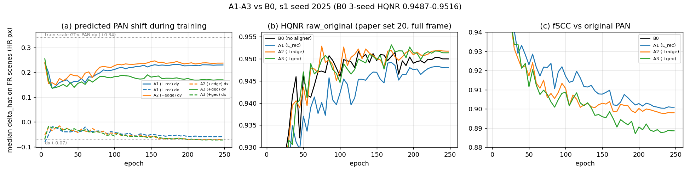
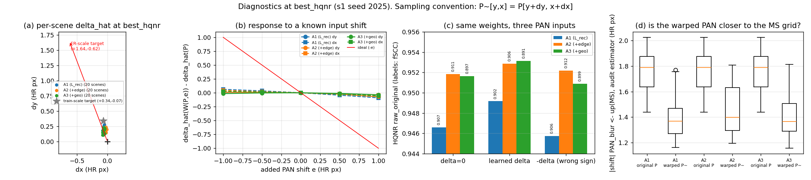
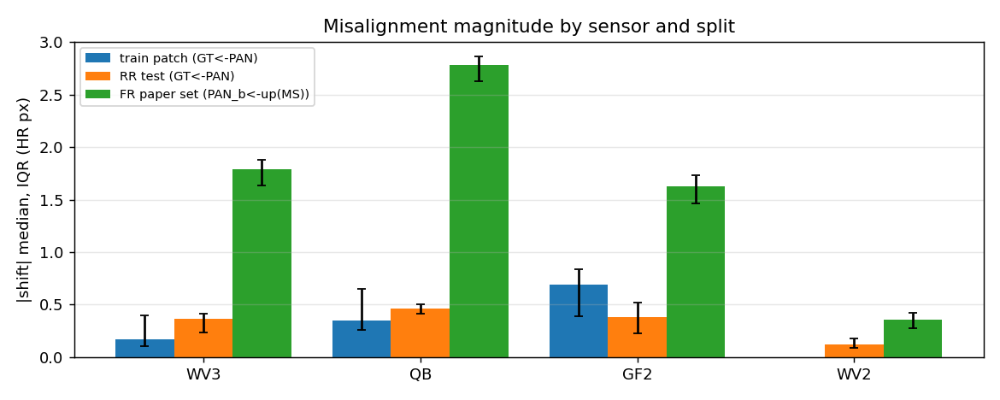
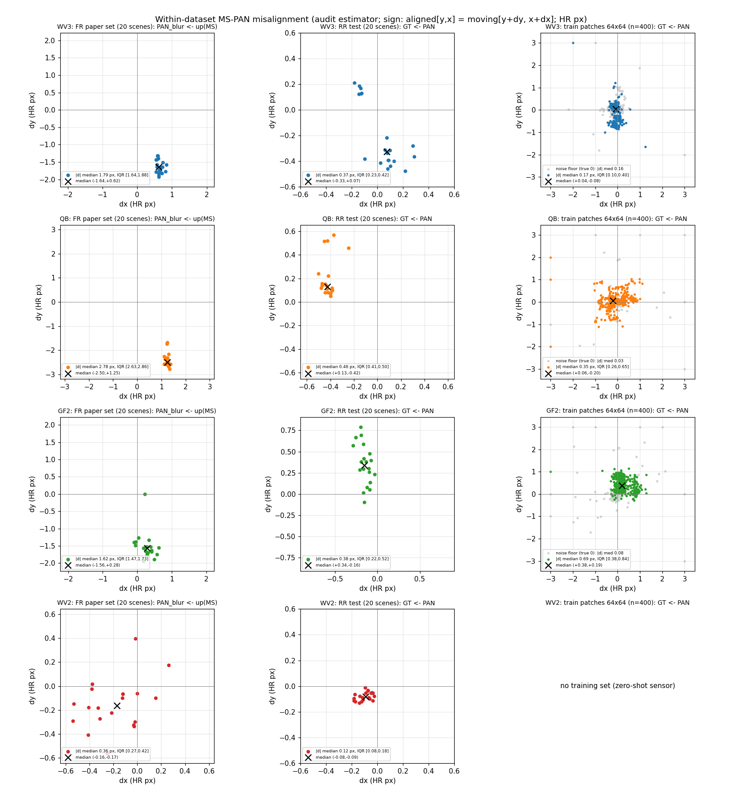
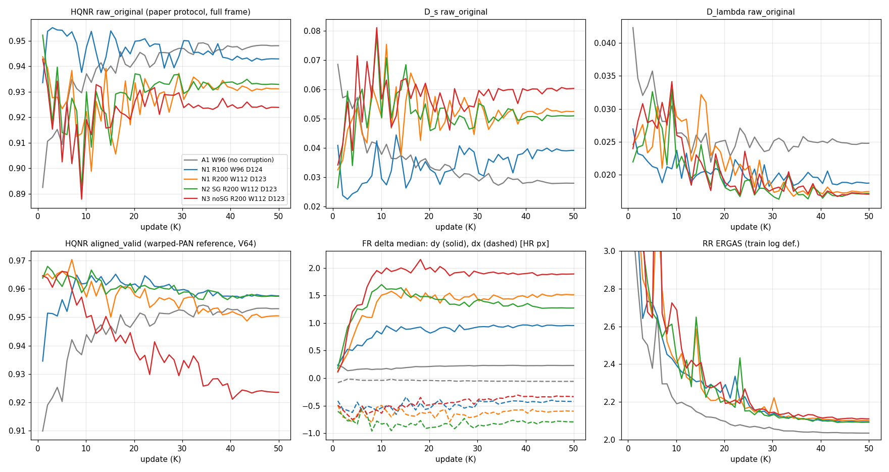
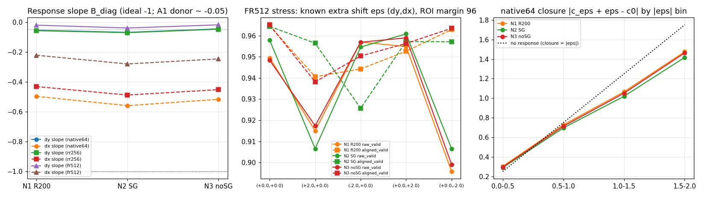
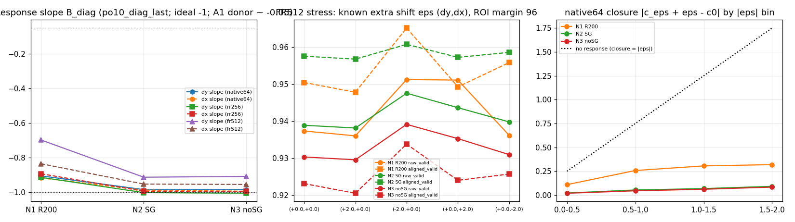

# 2026-09-10 — A1–A3 PAN 앞단 전역 정합, s1 block(seed 2025) 결과: 방향은 의도대로, 크기는 상수 bias

> 명세 `research_log/PAN_A1_A3_Global_PAN_Alignment_W96_D124_2026-09-09_v2.md` · 구현 노트 `research_log/2026-09-09_pa-a1-a3-implementation.md`.
> 실행: 재구성본(`fixed`), B0 = `BASE_W96_D124_MSPAN_WV3_S2025`(W96·D124 · MS+PAN 9ch · 단일 task), A1/A2/A3 = 같은 config + aligner.
> 측정: 지표 v2(`py`), FR = 논문 세트 `.mat` 20장(`fr_mat20`) raw_original(원 PAN·전체 프레임) — 시트 값과 같다. 진단은 `tools/pa_diag.py`.
> s1 한 block(seed 2025)만 끝났다. s2(1234)·s3(7777) block 이 와야 대응 차이의 방향 일관성을 말할 수 있다(명세 §12).

## 요지

1. **aligner 는 의도한 방향으로 PAN 을 옮긴다.** 세 case 모두 Δ̂ = (+0.18~+0.23, −0.04~−0.07) HR px — 센서 어긋남의 부호(PAN 을 MS 프레임 쪽으로)와 일치.
   warp 한 PAN 은 MS 격자에 실제로 가까워졌다(audit 추정기 |δ| 1.79 → 1.36~1.40 px). 같은 가중치에 Δ=0 을 넣으면 HQNR 이 내려가고(−0.001~−0.003), −Δ 를 넣으면 더 내려간다.
2. **그러나 aligner 는 "추정기" 가 아니라 상수 bias 다.** 입력 PAN 을 ±1 px 옮겨도 Δ̂ 는 거의 안 움직인다(기울기 −0.02~−0.09, 이상값 −1). 장면·타일 간 편차 0.02 px.
   학습 patch(64²)에선 평균 ≈ 0(±0.09), FR 512² 에선 +0.23. §7 에서 잰 대로 WV3 학습 patch 의 GT–PAN 어긋남 자체가 중앙값 0.17 px(추정기 하한 0.16)로 거의 없고
   FR 은 1.79 px 이므로, +0.23 은 실제 어긋남에 대한 **약한(13%) 반응**이다(128² 타일에서도 같은 값 → 입력 크기 효과가 아니다). 보정량은 FR 어긋남의 약 1/8.
3. **HQNR 로는 B0 와 구분되지 않는다.** 같은 block 대응 차이: A1 −0.0024, A2 +0.0013, A3 +0.0015. B0 3 seed 폭 0.9487~0.9516(N−1 sd 0.0017) 안이다.
   fSCC 는 A2 +0.004, A3 −0.011. RR ERGAS 는 A1 2.046 · A3 2.050 < B0 2.079 (A2 2.141 은 ep 75 조기 선택 탓; last 는 2.030).
4. **왜 상수인가 (해석).** 학습 데이터의 GT–PAN 어긋남은 센서 상수 0.37 px 이고 B0 골격이 이미 흡수한다(09-09 문서 §8). L_rec 가 aligner 에 주는 것은 "평균을 조금 옮겨라" 뿐이라
   변동을 배울 신호가 없다. A3 의 L_geo 는 aligner gradient 를 rec 의 0.75배까지 줬지만 결과는 같다. 합성 검사(§9.4, e~U(−2,2)²)에서는 같은 모듈이 corr 0.997·오차 0.08 px 로
   배우므로 모듈 용량의 문제가 아니라 **학습 분포에 변위 변동이 없는 것**이 원인이다.
5. **A2 의 이득은 정합이 아니라 edge loss 의 정규화일 가능성**이 크다(Δ̂ 는 A1 과 같고 fSCC 만 +0.004). 명세 §11.5 의 대조군(B0 + edge, aligner 없음)이 있어야 가른다.

## 1. 결과표 (best_hqnr = best_raw, 논문 세트 20장)

| run | best ep | **HQNR** raw_original | D_λ | D_s | fSCC(원 PAN) | raw_valid HQNR | aligned_valid HQNR / fSCC(P̃) | Δ̂ median (dy,dx) | RR ERGAS | RR SCC |
|---|---:|---:|---:|---:|---:|---:|---:|---|---:|---:|
| B0 seed 2025 | 125 | **0.9516** | 0.0244 | 0.0247 | 0.9018 | 0.9568 | = raw_valid | (0, 0) | 2.0789 | 0.9906 |
| B0 seed 1234 | 155 | 0.9488 | 0.0230 | 0.0289 | — | — | — | — | 2.0672 | 0.9908 |
| B0 seed 7777 | 220 | 0.9487 | 0.0238 | 0.0283 | — | — | — | — | 2.0424 | 0.9911 |
| A1 L_rec | 170 | 0.9492 | 0.0243 | 0.0272 | 0.9018 | 0.9544 | 0.9543 / 0.9166 | (+0.23, −0.06) | 2.0458 | 0.9911 |
| A2 +0.1·L_edge | 75 | **0.9529** | 0.0224 | 0.0253 | 0.9058 | 0.9584 | 0.9578 / 0.9208 | (+0.20, −0.04) | 2.1413 | 0.9899 |
| A3 +0.01·L_geo | 170 | **0.9531** | 0.0213 | 0.0261 | 0.8906 | 0.9585 | 0.9579 / 0.9064 | (+0.18, −0.07) | 2.0497 | 0.9910 |

- raw_valid − raw_original ≈ +0.005 (영역 효과, 네 run 공통) · aligned_valid − raw_valid ≈ −0.0005 (reference 효과, 미미). aligned_valid 의 fSCC 가 raw 보다 0.015 높은 것은 SR 의 구조가 P̃ 를 따른다는 뜻이다.
- last(50K) 는 셋 다 0.9514~0.9517 로 수렴, B0 last 0.9500. best_aligned 는 세 run 모두 best_raw 와 같은 step 이 뽑혔다.
- 적격성: 전 epoch·전 장면 |Δ̂| ≤ 0.3 px 로 support 문제 없음(valid fraction 0.9084 = (61/64)² 고정).

## 2. 학습 중 변화

- (a) Δ̂(FR 20장 중앙값)는 ep 5 에 +0.25 로 튀었다가 ep 15 에 +0.14 로 내려온 뒤 천천히 +0.18~0.24 로 올라 고정된다. dx 는 −0.04 → −0.07. 학습 규모 목표(+0.34, −0.07)의 방향과 같고 크기는 2/3.
- (b) HQNR 은 넷 다 ep 80~100 에 0.95 근처 plateau. A1 만 초반 느리다(ep 50~120 에서 −0.005). 후반 붕괴 없음.
- (c) fSCC(원 PAN 기준)는 넷 다 학습 내내 단조 감소(0.97 → 0.90) — PAN 디테일을 MS 프레임 쪽으로 옮겨 얹을수록 원 PAN 과의 구조 상관이 떨어지는 알려진 기전(09-09 문서 §3). A3 가 가장 낮다(0.889).

## 3. 진단 (best_hqnr, 같은 가중치)

| 진단 | A1 | A2 | A3 | 읽기 |
|---|---|---|---|---|
| (a) 장면별 Δ̂ 산포 (dy, dx IQR) | 0.02 / 0.01 | 0.02 / 0.01 | 0.02 / 0.01 | 장면·타일에 무관한 **상수** |
| (b) 입력 shift e 에 대한 반응 기울기 dy / dx (이상 −1) | −0.05 / −0.09 | −0.04 / −0.05 | −0.02 / −0.05 | 부호는 맞지만 크기 5% 이하 — 추정하지 않는다 |
| (c) HQNR: Δ=0 → learned → −Δ | 0.9466 → **0.9492** → 0.9457 | 0.9518 → **0.9529** → 0.9522 | 0.9516 → **0.9531** → 0.9509 | learned > zero > wrong: 방향은 유효 |
| (c) fSCC: Δ=0 → learned → −Δ | 0.907 → 0.902 → 0.906 | 0.912 → 0.906 → 0.912 | 0.897 → 0.891 → 0.900 | PAN 을 옮기면 원 PAN 기준 fSCC 는 내려간다(D_s 기전) |
| (d) audit \|δ\| PAN_b←up(MS): 원본 → P̃ | 1.79 → 1.37 | 1.79 → 1.40 | 1.79 → 1.36 | 보정 PAN 이 MS 격자에 0.4 px 가까워짐 = 어긋남의 23% |
| aligner gradient 출처 (rec : aux, 말기) | 5e-4 : 0 | 7e-4 : 5e-5 | 7e-4 : 5e-4 | A3 의 L_geo 는 실제로 aligner 를 밀지만 결과 Δ̂ 는 오히려 작다(0.18) |
| 학습 patch 위 Δ̂ (EMA, 말기) | (+0.01, 0.00) ± 0.09 | (+0.01, 0.00) ± 0.09 | (0.00, 0.00) ± 0.10 | 학습 patch 의 실제 어긋남이 ≈ 0 (§7) 이므로 맞는 출력. FR 의 +0.23 은 1.79 px 어긋남에 대한 약한 반응 |

## 4. 의도와의 대조

| 명세가 답하려던 것 | 이번 block 의 답 |
|---|---|
| A1: 복원 loss 만으로 앞단 정합이 학습되는가 | 방향은 맞는 **고정 offset** 이 학습된다. 장면별 정합량 추정은 학습되지 않았다(§12.3 "Δ≈상수·입력 shift 무반응" 행). HQNR 은 B0 대비 −0.0024(seed 폭 안) |
| A2: 출력 edge supervision 이 돕는가 | HQNR +0.0013·fSCC +0.004 이나 Δ̂ 는 A1 과 같다 → edge loss 의 복원 정규화로 읽는 것이 먼저. B0+edge 대조군 필요(§11.5) |
| A3: 보정 PAN–GT 구조 loss 가 aligner 를 감독하는가 | gradient 는 준다(rec 의 0.75배)지만 Δ̂ 를 키우지도, 입력 의존성을 만들지도 못했다. fSCC 는 가장 낮다(−0.011) |

**왜 그런가.** 학습셋(64² patch)의 GT–PAN 어긋남은 WV3 에서 중앙값 0.17 px(추정기 하한 0.16, §7)로 사실상 없고, RR 테스트도 0.37 px 의 센서 상수이며 B0 골격이 그 몫을 이미
잔차 안에서 흡수한다(출력이 GT 위에 0.01 px, 09-09 문서 §8). 그래서 loss 가 aligner 에게 요구하는 것은 상수 하나뿐이고, 변동을 배울 표본이 없다. 반면 §9.4 합성 검사(같은 모듈, e~U(−2,2)²)는 corr 0.997·오차 0.08 px 로 통과했으니
모듈이 못 배우는 것이 아니다. FR 에서 필요한 1.79 px 는 학습 분포 밖이다(Wald 규모 불일치, 필요량의 1/4 규모에서만 학습).

## 5. 판정과 다음

- **판정(HQNR→SCC)**: 세 case 모두 B0 와 동급(차이 ≤ 0.0024, B0 seed sd 0.0017). 정렬 축 지표로는 A1/A3 가 fSCC 를 잃고 A2 만 +0.004. 어느 case 도 winner 가 아니다.
  s2·s3 block 이 끝나면 대응 차이 3개의 방향 일관성으로 다시 본다(명세 §12.1).
- **의도 대비**: "PAN 을 MS 프레임으로 옮기는 앞단" 은 부호·효과 방향 모두 성립했지만, 학습된 것은 입력과 무관한 0.2 px 상수다. 명세 §12.3 의 "고정 phase 보정 또는 bias 만 학습" 에 해당한다.
- **다음 후보(결정 아님)**: (i) 학습 PAN 에 크기를 아는 무작위 전역 shift 를 넣어 변동을 만들고 그 shift 를 되돌리도록 감독(명세 §4.4·기준 문서 §4.2 "추가 corruption" 후보) — 합성 검사가 바로 그 조건이고 통과했다;
  (ii) B0 + edge loss(aligner 없음) 대조군으로 A2 의 이득을 귀속; (iii) 상수 offset 만 필요하다면 aligner 대신 고정 PAN shift(예: +0.23 px)를 넣은 대조로 같은 HQNR 이 나오는지 확인.

## 6. 재현

`work_dir/PA_A{1,2,3}_*_W96_D124_9CH_S2025/{checkpoint_metrics.csv, scene_metrics.csv, delta_predictions.csv, train_log.jsonl, gradient_diagnostics.jsonl, results/pa_diag.json}`,
B0 공통 V 재평가 `work_dir/BASE_W96_D124_MSPAN_WV3_S2025/results/pa_diag.json`. 그림 `outputs/pa/report_figs.py`(입력 shift 반응 곡선 `outputs/pa/shift_response_curves.json`).

## 7. 추기 — 데이터셋 안의 어긋남 분포 (WV3 · QB · GF2 · WV2, split 별)

같은 audit 추정기(Scharr-ZNCC-quadratic, `align/estimator.py`)로 센서 × split 마다 쟀다. 단위는 PAN(HR) 격자 px, 부호는 `aligned[y,x] = moving[y+dy, x+dx]`.
FR 은 모델 입력 쌍(PAN_b ← bicubic↑MS, 논문 세트 20장), RR 은 GT ← PAN(테스트 20장, GT 는 원 MS 라 LRMS 와 정합), train 은 GT ← PAN(64² patch 무작위 400장)이다.
train 의 **노이즈 하한**은 같은 GT 의 짝수/홀수 band 평균 쌍(기하 동일, 참값 0)으로 잰 값이다. 스크립트 `outputs/pa/misalign_dist.py`, 원자료 `outputs/pa/misalign_dist.json`.

| 센서 | split | n | (dy, dx) 중앙값 | \|δ\| 중앙값 | IQR | p5–p95 | 부호 일치 dy / dx | 노이즈 하한 \|δ\| |
|---|---|---:|---|---:|---|---|---|---:|
| WV3 | FR 논문 세트 | 20 | (−1.64, +0.62) | **1.79** | [1.64, 1.88] | [1.44, 1.98] | 1.00 / 1.00 | — |
| WV3 | RR 테스트 | 20 | (−0.33, +0.07) | 0.37 | [0.23, 0.42] | [0.18, 0.47] | 0.70 / 0.65 | — |
| WV3 | train patch | 400 | (+0.04, −0.08) | 0.17 | [0.10, 0.40] | [0.04, 0.76] | 0.67 / 0.82 | 0.16 |
| QB | FR 논문 세트 | 20 | (−2.50, +1.25) | **2.78** | [2.63, 2.86] | [2.12, 2.98] | 1.00 / 1.00 | — |
| QB | RR 테스트 | 20 | (+0.13, −0.42) | 0.46 | [0.41, 0.50] | [0.40, 0.68] | 1.00 / 1.00 | — |
| QB | train patch (msfix) | 400 | (+0.06, −0.20) | 0.35 | [0.26, 0.65] | [0.13, 1.12] | 0.62 / 0.65 | 0.03 |
| GF2 | FR 논문 세트 | 20 | (−1.56, +0.28) | **1.62** | [1.47, 1.73] | [1.22, 1.95] | 1.00 / 0.85 | — |
| GF2 | RR 테스트 | 20 | (+0.34, −0.16) | 0.38 | [0.22, 0.52] | [0.14, 0.72] | 0.95 / 1.00 | — |
| GF2 | train patch | 400 | (+0.38, +0.19) | 0.69 | [0.38, 0.84] | [0.18, 1.00] | 0.94 / 0.81 | 0.08 |
| WV2 | FR 논문 세트 | 20 | (−0.16, −0.17) | 0.36 | [0.27, 0.42] | [0.13, 0.61] | 0.85 / 0.85 | — |
| WV2 | RR 테스트 | 20 | (−0.08, −0.09) | 0.12 | [0.08, 0.18] | [0.07, 0.21] | 1.00 / 1.00 | — |

**읽기.**

1. **FR(실제 평가 조건)에서는 센서 상수가 지배한다.** WV3·QB·GF2 는 20장 전부 같은 부호이고 IQR 폭이 중앙값의 6~15%(0.1~0.25 px)다. p5–p95 로 봐도 장면 간 편차는 ±0.2~0.4 px.
   GF2 에는 거의 정합된 장면이 하나 있다(|δ| 0.21, 나머지 19장 1.2~1.95). WV2 만 방향이 흩어진다(0.06~0.61 px, 부호 일치 0.85) — 어긋남 자체가 작아 방향이 잡음 수준이다.
   → "장면마다 정합량을 예측" 해서 얻을 수 있는 것은 센서 상수 위의 ±0.2~0.4 px 뿐이다. 그 상수는 논문 세트 20장 중앙값으로 한 번에 잰다.
2. **RR·train 의 어긋남은 FR/4 가 아니다 — 방향까지 다르다.** 크기는 |RR|/|FR| = 0.17~0.33 으로 1/4 근처지만, 방향은 WV3 (−0.33,+0.07) vs FR 의 PAN→MS/4 (+0.41,−0.16), GF2 (+0.34,−0.16) vs (+0.39,−0.07), QB (+0.13,−0.42) vs (+0.62,−0.31) 로
   축별 부호가 뒤집힌다. Wald 열화(PAN 을 내리는 MTF·decimation 의 sampling phase)가 원 MS–PAN 등록 오차와 합쳐져 다른 상수가 되는 것이다.
   → RR 에서 배운 "PAN 을 옮기는 양" 은 FR 에서 방향조차 맞지 않을 수 있다. 어제 §8 에서 골격이 RR 어긋남을 완전히 흡수한다고 본 것(출력이 GT 위)은 그대로이나, 그것이 FR 에서 유리한 방향이라는 뜻은 아니다.
   이번 aligner 가 FR 에서 (+0.23, −0.06) 을 낸 것은 RR 에서 배운 상수가 아니라(학습 patch 에서는 ≈0) FR 입력의 실제 어긋남에 대한 약한 반응이다.
3. **RR·train 안에는 두 덩어리가 있다.** WV3 RR 20장은 (−0.37,+0.11) ×14 와 (+0.16,−0.14) ×6, train patch 는 (+0.10,−0.09) ×291 과 (−0.57,−0.05) ×108 로 갈린다(2-means, 중심 거리 0.6~0.7 px).
   QB train 도 (−0.04,−0.34) ×255 / (+0.21,+0.36) ×141, GF2 RR 은 dy 가 0~0.8 로 늘어선다. 원본 영상(strip)마다 잔여 등록 오차가 다른 것으로 보인다.
   → 학습 분포에 "영상 단위" 변동이 0.5~0.7 px 있기는 하다. 그러나 이번 aligner 는 그것도 배우지 않았다(학습 patch 위 Δ̂ 표준편차 0.09, 노이즈 하한 0.16 아래).
   64² patch 하나에서 0.5 px 를 구분하는 것은 추정기 하한(WV3 0.16, GF2 0.08) 근처라 신호가 약하고, L_rec 는 그 구분에 보상을 주지 않는다.
4. **train patch 의 값은 하한과 같이 읽어야 한다.** WV3 train 의 0.17 은 하한 0.16 과 같아 "어긋남이 없다" 가 답이고, QB 0.35·GF2 0.69 는 하한(0.03·0.08)보다 훨씬 커서 실제 값이다.
   WV3 의 하한이 큰 것은 8 band 짝수/홀수 평균(가시광 vs NIR)의 스펙트럼 차이 때문이다.

**정리.** 센서당 상수 하나가 FR 어긋남의 90% 이상을 설명하고, 그 상수는 RR/train 에서 관측되는 상수와 다르다(크기 4~6배, 방향 상이). 장면·영상 단위 변동은 FR ±0.2~0.4 px, train 0.5~0.7 px 규모다.
따라서 "매 영상 예측" 의 가치는 그 잔여 변동에 한정되고, 지금 학습 방식으로는 그 잔여마저 배우지 못했다. FR 규모의 상수를 넣는 대조(§5 (iii))가 먼저다.

## 8. 추기 [WIP] — PO10: PAN 추가 변위 + offset consistency, s1 기동

명세 [`research_log/PAN_OffsetConsistency_10GPUh_W96_D124_2026-09-10.md`](../research_log/PAN_OffsetConsistency_10GPUh_W96_D124_2026-09-10.md), 구현·검토 노트
[`research_log/2026-09-10_po10-implementation.md`](../research_log/2026-09-10_po10-implementation.md). A1 골격·init 그대로, 학습 update 를 native/corrupt 1:1 로 교대하고
corrupt 에서는 PAN 에만 원판 R=1 HR px(audit 부록 E train P90 0.25 LR px × 4) 무작위 변위 ε 를 넣는다. aligner 는 고정 내부 view(4 px crop)만 본다.

| 실행명 | case | loss | 예산 |
|---|---|---|---|
| `PO10_N1_REC_W96_D124_WV3_S2025` | N1 | L_rec (offset loss 계수 0, 진단값만) | 필수 |
| `PO10_N2_OFFSG_W96_D124_WV3_S2025` | N2 | L_rec + 0.01·\|ĉε + ε − sg(ĉ0)\| (5K ramp) | 필수 |
| `PO10_N3_OFFNOSG_W96_D124_WV3_S2025` | N3 | 같은 loss, stop-gradient 없음 | 예산 gate 통과 시 (used + 1.2×proj + 1 h ≤ 10 h) |

판정(§13.3): 반응 B≈−I(추가 변위 상쇄)와 native 품질(세 view HQNR·fSCC) 두 축. 핵심 대응은 N2−N1, N3−N2. 과거 A1(전체 view)은 배경 기준.

**추기(13:5x) — R100 → R200 전환** ([변경 명세](../research_log/PAN_OffsetConsistency_ChangeNote_R100_to_R200_2026-09-10.md), 사용자 지시 "다음 실험부터"):
위 표의 R100(b=1.0) 은 **N1 만 완주**시켜 기록으로 보존하고 N2/N3 는 실행하지 않는다. 다음 실험부터 b=2.0 (FR 입력 통계 참고, `_R200_FRSTAT` 접미사) 로
`PO10_N1_REC / N2_OFFSG / N3_OFFNOSG _W112_D123_..._R200_FRSTAT` 세 run 을 새로 학습한다(주 비교). **골격도 W112·D123 으로 바꾼다**(사용자 결정) — B0/A1/R100(W96·D124)과는 골격이 달라 직접 대응하지 않고 block 안 N2−N1·N3−N2 만 본다.
상세는 구현 노트 §7. 시트에는 HQNR↑(전체 프레임)과 HQNR(V64)↑(가장자리 64 px 제외) 두 열이 모두 오른다.
결과·진단은 run 폴더 `checkpoint_metrics.csv`, `offset_response_*.csv`, `interpolation_controls.json`, `results/{pa_diag,po10_diag}.json`, 예산은 `work_dir/_po10_budget/ledger.json`.

## 9. 추기 [WIP] — s2: W112·D123 GT-anchored KD · 출력 통계 variance · aligner 재사용 (구현 완료, s2 기동 대기)

계획 묶음 `research_log/PAN_S2_W112_KD_Variance_Plan_and_References_2026-09-10/` 를 현 workspace 기준으로 검토·구현했다 — 검토표·구현 지도·gate·실행 절차는
[구현 노트](../research_log/2026-09-10_s2-w112-kdv-implementation.md). 실행: `trainer: kdv`(`train_kdv.py`, `kdv/`), config `config/S2W112_*.yaml`(`tools/gen_kdv_configs.py`),
큐 `config/queues/kdv_s2.txt`, 기동 `./tools/kdv_prepare.sh`(s2). 시트 범주 ⑳ KDV(`S2W112D123_*`).

| Q | run | 세팅 (aligner / rec / stat) | 역할 |
|---|---|---|---|
| Q00 | `S2W112D123_NOALIGN_IA_AID_N0_OFF_G0_s1234_v01` | aligner·sampler 없음 / L1 / — | W112 독립 baseline |
| Q01 | `S2W112D123_T112DFR_IA_AFR_N0_OFF_G0_s2025_v01` | donor aligner frozen / L1 / — (seed 2025) | **Teacher** `T112_v01` |
| Q02 | `S2W112D123_A1_IA_AFR_N0_OFF_G0_s1234_v01` | donor frozen / L1 / — | GT-only 기준, λ_V pilot |
| Q03 | `S2W112D123_A1_IA_AFR_R1_OFF_G0_s1234_v01` | donor frozen / (1+d_T)·L1 / — | hard 재가중 |
| Q04 | `S2W112D123_A1_IA_AFR_R3_OFF_G0_s1234_v01` | donor frozen / adaptive hard+soft / — | adaptive rec 기준 |
| Q05 | `S2W112D123_A1_IA_AFR_R3_GVH_G0_s1234_v01` | donor frozen / adaptive / GT gradient-variance 5×5 (H) | GT 통계 |
| Q06 | `S2W112D123_A1_IA_AFR_R3_GVAD_G0_s1234_v01` | donor frozen / adaptive / GV adaptive (AD) | 첫 주력 후보 |
| Q07 | `S2W112D123_A1_IA_AFT_R3_GVAD_G0_s1234_v01` | donor 초기화 후 학습 / adaptive / GV-AD | aligner fine-tune |
| Q08 | `S2W112D123_A1_IA_ASC_R3_GVAD_G0_s1234_v01` | 독립 초기화 학습 / adaptive / GV-AD | 초기값 제약 |

공통: **W112·D123**(2.6589 M; 계획 원안 D124 를 사용자 결정으로 D123 — s1 PO10 R200 과 같은 골격) · MS+PAN 9ch · 단일 HRMS · AdamW 1e-4/wd0.01 cosine · batch 48 · 50K · fp32 · I-A(native 입력) · donor = s1 `PA_A1_REC_W96_D124_9CH_S2025` aligner(asset).
판정: 시트 HQNR↑(best_raw, raw_original) → SCC(ERGAS 참고). 핵심 대응: R3−R1(output target KD), R3 vs N0, GV-AD vs GV-H(Teacher 통계 KD), A-FT/A-SC vs A-FR(aligner 정책). Teacher 는 seed 2025 라 Q02(seed 1234) 와의 차이가 seed 변동의 하한 참고값.
이동량 covariance KD(G1–G5·G-STRUCT, 계획 §11)도 구현했으나 **실행 보류 큐**(`config/queues/kdv_s2_geomkd.txt`)에 두었다 — PO10 N2/N3·Q07/Q08 결과 뒤 기동(구현 노트 §9). addendum 의 TRI-A/B/C(GT 방향 band gate·통계 성분 gate·Teacher 민감도 감쇠)도 구현·gate 통과했고 큐 `config/queues/kdv_s2_triabc.txt`(22 run, P1 → MASS/SHUFFLE/GV-WH 대조 순)에 두었다 — 본 큐 뒤 기동(구현 노트 §10). s1 dry run(300 updates, depth 결정 전 D124 골격) 으로 전체 경로(calibration·KD·통계·세 view·best_rr_val·export·시트 evaluator)를 확인했다(구현 노트 §6).

## 10. 추기 — PO10 결과: PAN 추가 변위 + offset consistency (R100 W96·D124 N1, R200 W112·D123 N1/N2/N3, s1 seed 2025)

§8 의 WIP 를 결과로 닫는다. 체인은 2026-09-10 20:19 에 끝났다(예산 ledger: gate 0.3 h + N1 R100 1.52 h + R200 N1 1.73 / N2 1.62 / N3 1.63 h, 폐기분 1.65 h; N3 는 예산 gate 통과).
평가는 전부 `py`(저장소 evaluator 2026-09-10.5, 논문 세트 .mat 20장), 학습 중 값은 `checkpoint_metrics.csv`(같은 evaluator·h5 float64 참조). 명세 `research_log/PAN_OffsetConsistency_10GPUh_W96_D124_2026-09-10.md`, 변경 `…ChangeNote_R100_to_R200…`, 구현 노트 `research_log/2026-09-10_po10-implementation.md`.

### 10.1 요지
- **corruption 학습은 aligner 를 "반응하게" 만들었지만, 논문 프로토콜 HQNR 은 수렴점에서 오히려 내려갔다.** 50K 시점 raw HQNR: A1(변위 없음) 0.948 → N1 R100 0.943 → R200 N1 0.931 / N2 0.933 / N3 0.924. D_λ 는 좋아지고(0.025 → 0.017) **D_s 가 나빠진다**(0.028 → 0.05–0.06).
- 원인은 출력 프레임이다. FR 장면에서 aligner 의 native 보정 Δ̂ 중앙값이 A1 의 (+0.22, −0.05) px 에서 R200 은 **(+1.5, −0.6) px 규모**(N1 +1.51/−0.60, N2 +1.27/−0.79, N3 +1.89/−0.33)로 커졌다. 이는 §7 에서 잰 WV3 FR MS–PAN 어긋남(1.79 px, 방향 일치)과 같은 규모다 — 즉 PAN 을 MS 프레임으로 실제로 옮긴다. 그러면 출력은 MS 프레임에 놓이고, **원 PAN 을 참조하는 D_s 는 그 1.5 px 를 불일치로 센다.** 같은 출력의 aligned_valid HQNR(warp 한 PAN 참조)은 0.95–0.96 으로 A1 과 같거나 높다(N3 만 0.924 로 과보정).
- **시트의 best_hqnr 값(N1 R100 0.9551, R200 N2 0.9522 …)은 방법의 품질이 아니다.** 세 R200 run 모두 best 가 **첫 평가(step 1,010, RR ERGAS 3.8–4.1)** 이고 R100 도 step 3,030(ERGAS 2.64)이다 — 출력이 흐릴수록 D_s 가 작아지는 알려진 기전(CLAUDE.md "D_s·HQNR 단독 해석 금지")이 선택을 잡았다. 판정에는 수렴점(마지막 평가)과 aligned_valid 를 함께 본다.
- **반응(response)**: 수렴점(50K) 에서 알려진 추가 변위 ε 에 대한 기울기 B_diag(이상 −1; A1 donor −0.02~−0.09)가 **N2(SG) (−0.98, −0.99), N1 (−0.90, −0.92)** (train 64²; FR 512² 에서도 −0.7~−0.95), closure 0.06–0.3 px — corruption 학습이 aligner 를 실제 변위 추정기로 만들었다(§10.5). 시트의 best_hqnr checkpoint(step 1,010) 에서는 x 축 −0.5·y 축 0 에 불과했다(§10.3). N3(no-SG)는 Δ̂ 가 가장 크며 aligned_valid 가 학습 후반에 계속 떨어진다(과보정 방향의 drift).
- R200 은 반경(1→2)과 골격(W96·D124 → W112·D123)을 함께 바꿨으므로 R100 과의 차이를 한 요인으로 돌리지 않는다.

### 10.2 수치 (best_hqnr = 시트, 수렴점 = 50K 마지막 평가)

| run | best step | HQNR↑(시트, best) | HQNR(V64)↑ | D_λ | D_s | JQM | RR ERGAS@best | **HQNR @50K** | D_s @50K | D_λ @50K | aligned_valid @50K | FR Δ̂ 중앙값 @50K (dy,dx) |
|---|---:|---:|---:|---:|---:|---:|---:|---:|---:|---:|---:|---|
| B0 W96·D124 (aligner 없음) | — | 0.9516 | 0.9568 | 0.0244 | 0.0247 | 0.9772 | 2.079 | — | — | — | — | — |
| A1 W96·D124 (aligner, 변위 없음) | 34,340 | 0.9492 | 0.9544 | 0.0243 | 0.0272 | 0.9771 | 2.046 | 0.9480 | 0.0279 | 0.0248 | 0.9543 | (+0.22, −0.05) |
| N1 R100 W96·D124 (b=1) | 3,030 | 0.9551 | 0.9607 | 0.0230 | 0.0224 | 0.9691 | 2.642 | 0.9429 | 0.0391 | 0.0188 | 0.9576 | (+0.95, −0.42) |
| N1 R200 W112·D123 (b=2) | 1,010 | 0.9437 | 0.9498 | 0.0246 | 0.0325 | 0.9599 | 4.001 | 0.9311 | 0.0524 | 0.0175 | 0.9505 | (+1.51, −0.60) |
| N2 SG R200 W112·D123 | 1,010 | 0.9522 | 0.9581 | 0.0220 | 0.0264 | 0.9631 | 3.791 | 0.9329 | 0.0509 | 0.0172 | 0.9574 | (+1.27, −0.79) |
| N3 noSG R200 W112·D123 | 1,010 | 0.9428 | 0.9486 | 0.0240 | 0.0341 | 0.9594 | 4.140 | 0.9238 | 0.0603 | 0.0171 | 0.9235 | (+1.89, −0.33) |

RR ERGAS 수렴값(학습 로그 정의)은 A1 2.03 / R100 2.09 / R200 2.09–2.11 로 거의 같다 — 복원 품질은 유지되고 프레임만 옮겨간 것.

위: 학습 중 곡선. 왼쪽 위 raw HQNR 은 R200 이 처음 평가(≈1K) 뒤 내려가 0.93 에서 평탄, 아래 왼쪽 aligned_valid 는 N1/N2 가 0.95–0.96 유지. 아래 가운데 FR Δ̂ 중앙값의 drift(실선 dy, 점선 dx).

### 10.3 반응·stress 진단 (`po10_diag`, best_hqnr checkpoint = step 1,010 — 초기 checkpoint 라는 점 주의; 수렴점 진단은 §10.5)

| run | B_diag (dy, dx) native64 | rr256 | fr512 | closure 평균 (native64, |ε| 평균 1.33) | MS swap / const 대조 B_diag |
|---|---|---|---|---:|---|
| N1 R200 | (−0.06, −0.50) | (−0.06, −0.43) | (−0.02, −0.22) | 0.944 | ≈0 / ≈0 |
| N2 SG | (−0.07, −0.56) | (−0.07, −0.49) | (−0.04, −0.28) | 0.905 | ≈0 / ≈0 |
| N3 noSG | (−0.05, −0.52) | (−0.05, −0.45) | (−0.02, −0.25) | 0.932 | ≈0 / ≈0 |

- MS 를 다른 장면으로 바꾸거나 상수로 두면 반응이 0 → 반응은 PAN–MS 관계에서 나온다(interpolation/padding 단서 아님). bilinear kernel 로 바꿔도 같은 기울기(−0.55). border vs reflection padding 차 0.
- FR512 stress(ROI margin 96, 20/20 장면 적격): ε=(+2,0) 또는 (0,−2) 에서 raw_valid HQNR 이 0.95 → 0.90–0.92 로 떨어지고 aligned_valid 는 0.94–0.96 을 유지한다(부분 보상). 반대 부호(−2,0)/(0,+2)는 떨어지지 않는다 — 센서 어긋남과 같은 방향의 추가 변위는 "이미 있던" 어긋남을 줄이기 때문.
- closure vs |ε| 구간: 0–0.5 px 에서 0.29(=무반응선), 1.5–2 px 에서 1.45(무반응선 1.75) — 작은 변위에는 반응이 없고 큰 변위에 x 축만 부분 반응.

### 10.4 판정과 다음
- 명세 §13.3 의 두 축 중 **반응 축은 수렴점에서 성공**(§10.5: B ≈ −I, closure 0.06 px; §10.3 의 초기 checkpoint 는 x 축 −0.5·y 축 0 이었다), **native 품질 축은 논문 프로토콜로는 후퇴**. 후퇴의 기전이 "출력이 MS 프레임으로 옮겨감"이라 **논문 프로토콜(원 PAN 참조 D_s)로는 정합 방법을 평가할 수 없다**는 §4·§5 의 논점이 수치로 확인됐다. 어느 프레임을 정답으로 볼지는 방법 설계의 결정이지 지표가 정하는 것이 아니다.
- N2(SG) 가 세 case 중 일관되게 낫다(closure·반응·50K HQNR·aligned_valid). N3(no-SG) 는 과보정 drift 로 불리 — no-SG 는 채택하지 않는다.
- s2 KDV 캠페인의 aligner donor: 현재 큐는 A1 donor(무반응)다. §10.5 의 수렴점 진단에 따라 **N2 R200 `last` aligner(내부 view margin 4)** 를 I-N donor 로 쓰는 cohort 를 추가한다(반응 ≈ −1, closure 0.06 px).
- 시트에는 R100 N1·R200 N1/N2/N3 4 행이 올라갔다(⑲ PO10). 비교표에 인용할 때는 best 가 초기 checkpoint 라는 점을 반드시 적는다.

### 10.5 수렴점(last, 50K) checkpoint 의 반응 진단 — 결론이 바뀐다
`po10_diag --ckpt last` (50K 정확한 마지막 update; 결과 `results/po10_diag_last.json`, best_hqnr 진단은 `po10_diag_best_hqnr.json` 으로 보존). **§10.3 의 초기 checkpoint 와 전혀 다르다.**

| run | B_diag native64 (dy, dx) | rr256 | fr512 | closure native64 (px) | closure fr512 | stress ε=(+2,0) raw_valid / aligned_valid | ε=(0,−2) raw / aligned |
|---|---|---|---|---:|---:|---|---|
| N1 R100 W96·D124 | (진단 미완) | | | | | | |
| N1 R200 | (-0.90, -0.92) | (-0.91, -0.89) | (-0.70, -0.83) | 0.26 | 0.32 | 0.9360 / 0.9478 | 0.9361 / 0.9558 |
| N2 SG R200 | (-0.98, -0.99) | (-1.00, -0.99) | (-0.91, -0.95) | 0.06 | 0.10 | 0.9381 / 0.9567 | 0.9398 / 0.9585 |
| N3 noSG R200 | (진단 미완) | | | | | | |

- **수렴점의 R200 aligner 는 알려진 추가 변위를 거의 완전히 상쇄한다**: N2(SG) B_diag ≈ (−0.98, −0.99) (train 64²), (−1.00, −0.99) (RR 256²), (−0.91, −0.95) (FR 512²), closure 0.06 px — 이상값 −1 에 근접. N1(offset loss 없음, corruption 만)도 (−0.90, −0.92). y 축 무반응은 초기 checkpoint 의 현상이었다.
- 따라서 §10.1 의 FR Δ̂ drift(+1.3~+1.5 px)는 "실제 센서 어긋남을 재는" 방향으로 읽는 것이 맞다: aligner 가 PAN 을 MS 프레임으로 옮기는 능력을 얻었고, 그 결과가 논문 프로토콜의 D_s 에 불리하게 작용했다.
- stress: ε=(+2,0) 을 얹어도 raw_valid HQNR 이 0.936–0.938(무변위 0.93 대비 유지), aligned_valid 0.948–0.957 — 초기 checkpoint(0.907–0.915) 와 달리 보상이 된다.
- 시트의 `best_hqnr`(step 1,010) 로 진단한 §10.3 값을 aligner 능력으로 인용하면 안 된다. 정합 능력은 last 로, 논문 프로토콜 품질은 두 checkpoint 를 나누어 적는다.

(N3 의 last 진단은 작성 시점에 진행 중이라 그림·표에서 빠져 있다 — `results/po10_diag_last.json` 생성 뒤 `python outputs/po10/report_figs.py --diag po10_diag_last --suffix _last` 로 갱신)

**KDV donor 결정에의 함의**: s2 KDV 의 I-N donor 로 **N2 R200 `last` aligner(내부 view margin 4)** 를 쓸 근거가 생겼다. 반응이 등방적(dy·dx 모두 ≈ −1)이라 G-EQ 는 높은 precision(closure 0.06 px → Π ≈ 1/(0.06²+0.05²) 규모)을 주고, C-DIAG(EQ) 의 Σ 도 등방·작은 값이 된다. 다만 native FR 보정이 1.3 px 로 커서 이 donor 를 frozen 으로 쓰면 Student 출력도 MS 프레임에 놓인다 — 논문 프로토콜 HQNR 로 비교할 때 A1 donor cohort 와 섞어 순위 매기지 않는다(별도 cohort, `teacher_id`·donor 분리 기록).

### 10.6 시트의 HQNR(V64) 가 뜻하는 것 (질문에 대한 답)
- **HQNR(V64) = 같은 출력·같은 원 PAN 참조로, 프레임 가장자리 64 px 를 뺀 고정 내부 영역 V = [64:H−64]² (512² → 384², 32 px 블록 정렬) 에서 계산한 HQNR.** MTF 필터·저해상도 PAN 생성은 전체 프레임에서 하고 마지막에 잘라내므로 위상·블록 타일링이 전체 프레임 계산과 같다(`pa/evalviews.raw_views`).
- **shift 나 예측값에 따라 달라지는 마스킹이 아니다.** 어느 run 이든 같은 V 를 자른다. 그래서 aligner 가 없는 과거 run(B0·W168·KD…)에도 정의되고, 2026-09-10 에 evaluator 를 2026-09-10.5 로 올리며 시트 전 행(166행)에 같이 채웠다. 이유: 정합 방법은 PAN 을 sampling 하면서 가장자리에 복제 테두리를 만들므로, 그 영역을 뺀 동일 영역에서 모든 run 을 비교하기 위한 보조 열이다.
- 비교 기준은 여전히 **HQNR↑(전체 프레임, 논문 프로토콜)** 이고 V64 는 보조다. 위 §10.2 에서 보듯 V64 는 전체 프레임보다 0.005 정도 높을 뿐 순위를 바꾸지 않는다.
- **"warp 한 PAN 을 참조로 쓰는" aligned_valid 는 시트에 올리지 않는다.** 참조 자체가 바뀌어 논문 프로토콜과 비교 불가이기 때문이며, run 폴더의 `checkpoint_metrics.csv`·`results/pa_diag.json` 에만 있다. 정합 방법의 프레임 문제(§10.1)에 답하는 것은 V64 가 아니라 이 aligned_valid 다.
