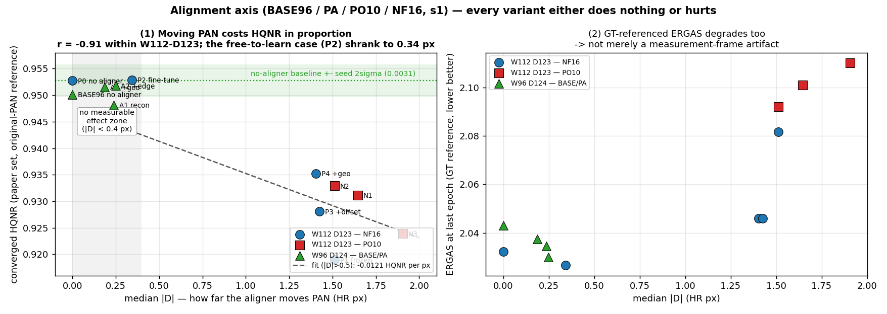

# 2026-09-12 — 정합 축 종합 판정 (s1): 네 캠페인 17벌, **PAN 을 옮기는 접근은 성립하지 않는다**

대상: `BASE96`(W96·D124 3 seed) · `PA`(A1–A3) · `PO10`(N1–N3, R200 W112·D123) · `NF16`(P0–P4 + s7777 2벌).
전부 s1 · WV3 · 50K · 재구성본(`fixed`). 2026-09-09 ~ 09-11, 무장애 완주.

> **판정 = best checkpoint HQNR(논문 세트 `.mat` 20장, 원 PAN 기준) → SCC.**
> ERGAS·SAM 은 §5 참고 지표. **판정선은 이번에 처음 실측했다 — 2σ = 0.0031** (§2).
> 측정: 지표 v2(`py`, DLPan 프로토콜 재구현), FR = `fr_mat20`.

---

## 1. 어떤 실험이었나

"PAN–MS 미세 정합오차가 학습을 방해한다" 는 가설 하나를 네 번 다르게 공격했다.
전부 **PAN 을 앞단에서 옮겨(warp) MS 프레임에 맞추는** 방식이다.

| 캠페인 | 골격 | 무엇을 했나 |
|---|---|---|
| **BASE96** | W96·D124 | 정합 없음. seed 2025·1234·7777 — 기준선이자 시드 분산 측정 |
| **PA** A1–A3 | W96·D124 | 학습되는 global shift CNN 이 PAN 만 sampling. A1 recon / A2 +edge / A3 +geo |
| **PO10** N1–N3 | W112·D123 | 학습 PAN 에 원판 R=2 무작위 변위를 주고 offset consistency 로 감독 |
| **NF16** P0–P4 | W112·D123 | PO10 N2 의 `last` aligner 를 이식. P0 없음 / P1 frozen / P2 fine-tune / P3 +offset 연습 / P4 +GT geometry |

각 실험이 답해야 할 것은 같다 — **정합을 하면 HQNR 이 오르는가.**

## 2. 부산물이 먼저 — 판정선을 드디어 측정했다

[2026-09-04](2026-09-04_placement-and-band-invalidation.md) 이 "공식 HQNR 의 시드 반복이
한 번도 없었다, 그게 지금 가장 필요한 실험" 이라고 적었다. 이번에 **세 경로로 독립 측정**됐다.

| 출처 | 값 | sd | **2σ** |
|---|---|---:|---:|
| BASE96 W96·D124 3 seed (best) | 0.95161 / 0.94884 / 0.94867 | 0.00165 | 0.00331 |
| BASE96 3 seed (수렴) | 0.95010 / 0.94633 / 0.94829 | 0.00189 | 0.00377 |
| NF16 P3 2 seed | 0.94625 / 0.94442 | 0.00130 | 0.00259 |
| NF16 P4 2 seed | 0.94265 / 0.94037 | 0.00161 | 0.00322 |
| **통합** | | **0.00153** | **0.0031** |

**판정선 = 0.0031.** 09-04 가 추정한 상한 0.0027 과 정합하고, 종전 0.011 은 **3.5배 과대**였음이
확정됐다. `CLAUDE.md` 의 "HQNR 시드 2σ ≈ 1.18%" 는 이 값으로 대체해야 한다.

## 3. 결과 — 정합량과 HQNR 은 단조 반비례한다

aligner 가 **PAN 을 실제로 얼마나 옮겼는지**(`pa_diag.json` 의 median |Δ|, HR px)를 x 축에 놓으면
네 캠페인이 하나의 곡선 위에 놓인다.

| case | \|Δ\| px | 수렴 HQNR | vs 무정합 | 판정 |
|---|---:|---:|---:|---|
| **NF16 P0** 정합 없음 | 0.000 | **0.95272** | 기준 | — |
| **NF16 P2** fine-tune | **0.344** | **0.95290** | +0.0002 | **구분되지 않음** |
| NF16 P4 +geo | 1.404 | 0.93526 | −0.0175 | **손해** (11.4σ) |
| NF16 P3 +offset | 1.426 | 0.92807 | −0.0247 | **손해** (16.1σ) |
| NF16 P1 frozen | 1.511 | 0.91896 | −0.0338 | **손해** (22.1σ) |
| PO10 N2 | 1.511 | 0.93291 | −0.0198 | **손해** |
| PO10 N1 | 1.647 | 0.93113 | −0.0216 | **손해** |
| PO10 N3 | 1.906 | 0.92389 | −0.0288 | **손해** |

| case (W96·D124) | \|Δ\| px | 수렴 HQNR | vs BASE96 S2025 | 판정 |
|---|---:|---:|---:|---|
| **BASE96** S2025 정합 없음 | 0.000 | 0.95010 | 기준 | — |
| PA A3 +geo | 0.187 | 0.95150 | +0.0014 | 구분되지 않음 |
| PA A1 recon | 0.238 | 0.94811 | −0.0020 | 구분되지 않음 |
| PA A2 +edge | 0.249 | 0.95178 | +0.0017 | 구분되지 않음 |

**W112·D123 안에서 r(|Δ|, HQNR) = −0.912**, 회귀 기울기 **−0.0169 HQNR / px**.
Δ=0 절편 0.9550 은 무정합 실측(0.9527)과 맞는다.

### 3.1 두 영역으로 갈린다

- **|Δ| < 0.4 px — 아무 일도 일어나지 않는다.** PA 3벌(0.19~0.25)과 NF16 P2(0.344)가
  전부 판정선 안이다. W96 구간만 보면 r = +0.04 로 **기울기 자체가 없다.**
- **|Δ| > 1.4 px — 옮긴 만큼 잃는다.** 예외 없이 −0.018 ~ −0.034.

**중간이 없다.** 정합이 도움이 되는 구간은 관측되지 않았다.

### 3.2 가장 결정적인 한 줄 — P2 는 스스로 정합을 포기했다

P1·P2 는 **같은 donor aligner 에서 출발**한다(|Δ| = 1.511). 차이는 얼리느냐 학습시키느냐뿐이다.

| | aligner | 학습 후 \|Δ\| | 수렴 HQNR |
|---|---|---:|---:|
| P1 | **frozen** (donor 그대로) | 1.511 (L2 변화 0.0000) | 0.91896 |
| P2 | **fine-tune** (자유) | **0.344** (−77%) | **0.95290** |

**자유롭게 학습시키면 aligner 는 자기 자신을 되돌린다.** 4.4배 줄여 무정합 수준으로
돌아왔고, 그제서야 HQNR 이 회복됐다. 최적화가 내놓은 답이 "가급적 옮기지 말라" 였다.

## 4. 어떤 분석이 나왔나

**① 측정 프레임 착시가 아니다.** 처음엔 "논문 프로토콜의 D_s 가 원 PAN 을 기준으로 재니
PAN 을 옮기면 당연히 벌점" 이라는 해석이 가능해 보였다. **GT 기준 지표로 확인해 기각했다** —
`r(|Δ|, ERGAS) = +0.81`(W112 구간), 변동폭 2.027 → 2.110. GT 대비 복원 자체가 나빠진다.
프레임 문제였다면 ERGAS 는 평평해야 했다.

**② 그래서 이 축은 기법의 문제가 아니라 전제의 문제다.** 네 캠페인이 서로 다른 장치를 썼다 —
학습되는 shift CNN(PA), 무작위 변위 + consistency(PO10), donor 이식 + 4가지 운용(NF16).
**전부 같은 곡선 위에 떨어졌다.** 장치를 바꿔도 결과는 |Δ| 하나로 결정된다.
정합을 더 잘하는 방법을 찾는 문제가 아니라, **PAN 을 옮기는 것 자체가 손해**인 것이다.

**③ 왜 그런가 (해석).** [2026-09-09](2026-09-09_alignment-analysis-and-new-baseline.md) 가
이미 잰 대로, 학습만으로도 출력의 구조(edge)는 PAN 을 따라간다(WV3 1.79 → 0.55 px).
**모델이 이미 정합을 흡수하고 있다.** 여기에 앞단에서 PAN 을 또 옮기면 이중 보정이 되고,
모델이 학습한 잔차 구조와 어긋난다. P1(frozen)이 최악(−0.034)인 것이 이 해석과 맞는다 —
모델은 적응할 기회조차 없이 이미 옮겨진 PAN 을 받는다.

**④ 유의미한 접근이었나 — 가설로서는 그렇고, 결과로는 기각이다.**
전제(PAN–MS 어긋남이 실재)는 측정으로 확인된 사실이었고, 네 가지 공격은 서로 독립적이며
대조군(P0·BASE96)과 seed 반복을 갖춘 제대로 된 설계였다. **잘 설계된 실험이 가설을 깨끗이
falsify 한 경우**다. 다만 비용은 컸다 — 약 30 GPU-h. 09-10 시점에 이미 나온
"aligner 가 입력 무반응 상수" 신호를 더 일찍 중단 근거로 썼다면 NF16 16 GPU-h 중
상당 부분을 아꼈을 수 있다.

**⑤ 다음 — 이 축을 닫는다.**
1. **PAN 을 옮기는 접근은 종료한다.** PA·PO10·NF16 계열 후속(반복 pair 포함)을 열지 않는다.
   이것으로 "PAN 을 흔들면 나빠진다" 는 **네 번째 독립 확인**이다
   (앞선 셋: G1 correlator · local alignment · 추론 시 정렬, [09-07](2026-09-07_alignment-shift-robust-and-metric-v2.md)).
2. **정합이 필요하면 MS 조건 입력 쪽만 건드린다.** 유일하게 성공한 적이 있는 방향이다 —
   MS jitter 는 후반 붕괴를 없앴다(final HQNR +0.005~0.006, [09-07](2026-09-07_alignment-shift-robust-and-metric-v2.md)).
3. **판정선 0.0031 을 전면 적용한다.** 0.011 로 "구분되지 않는다" 했던 과거 결론은
   소급 재검토 대상이다(09-04 가 예고한 그대로).
4. 남은 여력은 **정합이 아닌 축**(NA104 의 KD·출력통계, KDV)으로 돌린다.

## 5. 참고 지표 — 판정에 쓰지 않음

| case | ERGAS↓ (마지막) | SCC↑ (마지막) |
|---|---:|---:|
| NF16 P0 정합 없음 | 2.032 | 0.99126 |
| NF16 P2 fine-tune | **2.027** | **0.99138** |
| NF16 P3 / P4 | 2.046 / 2.046 | 0.99112 / 0.99114 |
| NF16 P1 frozen | 2.082 | 0.99060 |
| PO10 N1 / N2 / N3 | 2.101 / 2.092 / 2.110 | 0.99044 / 0.99057 / 0.99048 |
| BASE96 S2025 | 2.043 | 0.99113 |
| PA A1 / A2 / A3 | 2.035 / 2.030 / 2.037 | 0.99124 / 0.99134 / 0.99121 |

SCC 는 0.9904~0.9914 로 포화라 (σ 배수는 sd 0.00153 기준) tie-break 가 되지 않는다. ERGAS 는 HQNR 과 같은 방향이다(§4-①).

## 6. 배제한 것

| 가설 | 검증 | 결과 |
|---|---|---|
| 논문 프로토콜이 PAN 이동을 구조적으로 벌해서 생긴 착시 | GT 기준 ERGAS·SCC 대조 | **아니다** — 같이 나빠진다(r=+0.81 / −0.84) |
| 골격(W96 vs W112) 차이가 만든 상관 | 골격별로 분리해 재계산 | **아니다** — W112 안에서 r=−0.91 |
| P1 이 유독 나쁜 건 구현 오류 | aligner 파라미터 L2 = 0.0000 (frozen 정상 동작) | **아니다** — 의도대로 동작 |
| PO10 의 best 가 낮은 건 학습 실패 | best 가 ep5·ERGAS 3.8~4.1 = 퇴화 체크포인트 | **선택 문제** — 수렴값(0.923~0.933)이 진실 |
| 시드 운이 나빴다 | P3·P4 를 seed 7777 로 반복 | **아니다** — 두 seed 차 0.0018~0.0023, 손해 폭의 1/10 |
| aligner 가 학습이 덜 됐다 | P2 는 자유 학습 후 Δ 를 77% **줄였다** | **아니다** — 학습할수록 정합을 포기한다 |

## 7. 운영

- 17벌 무장애. NF16 7벌은 16 GPU-h 예산 안에서 완주(P0 1.7h 뒤 P1~P4·반복 pair).
- **NF16 P0 만 `eval_epoch: 5`**, P1 이후는 10 이다([09-11 결정](2026-09-11_sheet-cleanup-and-hqnr-views.md) 이후).
  P0 는 후보 checkpoint 가 2배라 기준선이 미세하게 유리하다 — 위 표의 **수렴값(마지막 5 eval 평균)은
  이 비대칭에 영향받지 않는다.** best 로 대조할 때만
  `python tools/best_on_grid.py --grid 10 NF16_P0_W112_D123_WV3_S1234_N2LAST_v1` 로 맞춘다
  (P0: 0.95316@ep165 → 0.95275@ep240, −0.00041).
- 진단 출처: `work_dir/<run>/results/pa_diag.json` 의 `training_records.last`
  (`delta_norm_median`, `raw_original.*`). 그림 재현은 이 문서와 같은 커밋의 스크립트.
