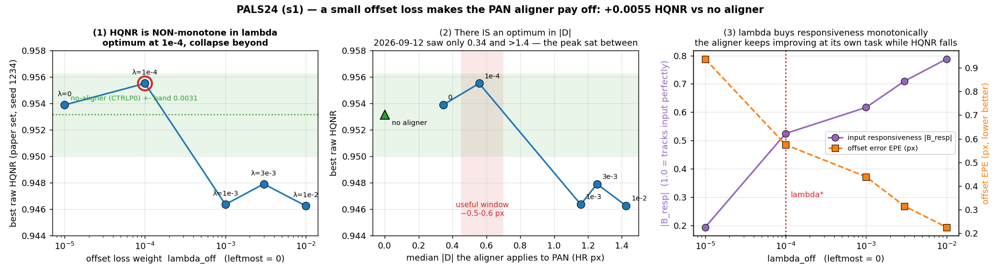

# 2026-09-13 — PALS24 λ_off 스윕 (s1): **정합 축 첫 양성 결과** — 작은 offset loss 가 aligner 를 쓸모 있게 만든다

계획 [`PAN_P2_P3_LambdaSweep_MetricAware_24GPUh_Plan_2026-09-12_v2`](../research_log/PAN_P2_P3_LambdaSweep_MetricAware_24GPUh_Plan_2026-09-12_v2.md) ·
노트 [`2026-09-12_pals24-implementation`](../research_log/2026-09-12_pals24-implementation.md).
s1 · WV3 · 50K · 재구성본(`fixed`) · W112·D123(2.6589 M) · 9벌 완주(무장애, 14.2/24 GPU-h).
집계 `tools/pals24_report.py`.

> **판정 = best_raw 의 raw_original HQNR(논문 세트 `.mat` 20장, 원 PAN 기준) → fSCC.**
> 판정선 **0.0031** (HQNR 에만). `aligned_*`·V64·last 는 진단이고 판정에 쓰지 않는다.
> 약명: `CTRLP0` aligner 없음(=NF16 P0) · `L000` λ_off 0(=NF16 P2) · `L1E4/L1E3/L3E3` λ 1e-4/1e-3/3e-3 · `L1E2` λ 0.01(=NF16 P3).

---

## 1. 어떤 실험인가

[09-12 정합 축 판정](2026-09-12_s1_alignment-axis-verdict.md)은 "입력 PAN 을 warp 하는 구현" 을 기각했다.
그 근거는 |Δ| 가 **0.34 px(NF16 P2)** 아니면 **1.4 px 이상(P1·P3·P4·PO10)** 인 점만 관측한 것이었다.
PALS24 는 **그 사이를 채운다** — NF16 P2(λ_off 0)와 P3(λ_off 0.01) 사이에서 **λ_off 만** 바꾼다.

| stage | 무엇을 | seed |
|---|---|---|
| 1 탐색 | λ_off ∈ {1e-4, 1e-3, 3e-3} 신규 3벌 + NF16 P0·P2·P3 재사용 | 1234 |
| — 선택 | 규칙(raw best HQNR → fSCC → 더 작은 λ)으로 **λ\* 를 한 번 고정** | → **λ\* = 1e-4** |
| 2 확인 | `CTRL-P0` · `L000`(λ 0) · **λ\*** 를 대응 비교 | 7777 · 2025 |

λ 외 모든 것이 같다. seed 1234 의 P0/P2/P3 는 NF16 것을 재학습 없이 재사용했다.

## 2. 결과

### 2.1 λ 에 대해 **비단조** — 1e-4 에서 정점

seed 1234 (탐색), best_raw HQNR:

| case | λ_off | **HQNR** | vs 무정합 | \|Δ\| (px, last) | 입력반응 \|B_resp\| | offset EPE |
|---|---:|---:|---:|---:|---:|---:|
| CTRLP0 (aligner 없음) | — | 0.95316 | — | 0.000 | — | — |
| L000 | 0 | 0.95389 | +0.00073 | 0.344 | 0.194 | 0.937 |
| **L1E4 (λ\*)** | **1e-4** | **0.95552** | **+0.00236** | **0.557** | **0.525** | 0.575 |
| L1E3 | 1e-3 | 0.94636 | −0.00680 | 1.157 | 0.617 | 0.439 |
| L3E3 | 3e-3 | 0.94791 | −0.00525 | 1.253 | 0.710 | 0.315 |
| L1E2 (=NF16 P3) | 1e-2 | 0.94625 | −0.00691 | 1.426 | 0.788 | 0.226 |

**09-12 의 2영역 그림(≤0.4 px 무해 / ≥1.4 px 손해)에는 정점이 빠져 있었다.**
그 사이 **\|Δ\| ≈ 0.5~0.6 px** 에 이득 구간이 있다.

### 2.2 λ 는 aligner 를 계속 **더 잘하게** 만든다 — 그게 문제다

λ 가 커질수록 offset EPE 는 단조 감소(0.937 → 0.226)하고 입력반응은 단조 증가(0.194 → 0.788)한다.
**aligner 는 자기 과제를 점점 잘 푼다.** 그런데 HQNR 은 λ=1e-4 를 넘으면 무너진다.
→ **"정합을 잘하는 것" 과 "HQNR 이 좋은 것" 이 λ>1e-4 에서 갈라진다.** 09-12 §2 의 프레임
문제(D_λ↔LRMS / D_s↔원 PAN 이 1.79 px 어긋남)가 그대로 재현된 것이고, λ\* 는 그 갈림 직전이다.

### 2.3 seed 확인 — 3/3 양성, 확인 seed 둘 다 판정선 초과

| seed | 역할 | λ\* | L000 | CTRLP0 | λ\*−L000 | **λ\*−P0** |
|---|---|---:|---:|---:|---:|---:|
| 1234 | 탐색·선택 | 0.95552 | 0.95389 | 0.95316 | +0.00163 | **+0.00236** |
| 7777 | 확인 | 0.95542 | 0.95222 | 0.95081 | +0.00320 | **+0.00461** |
| 2025 | 확인 | 0.95698 | 0.95547 | 0.95068 | +0.00151 | **+0.00630** |

- **λ\* vs 무정합: 3 seed 평균 +0.00442**(판정선의 1.4배), **부호 3/3 일관**,
  **확인 seed(7777·2025) 평균 +0.00546 이고 둘 다 판정선 초과.** → **성립.**
- λ\* vs L000: 평균 +0.00211, 부호 3/3 일관이나 **판정선 초과는 1/3** → **방향만 확인, 크기는 미확정.**

### 2.4 이득의 분해

| 단계 | 평균 | seed 별 | 지위 |
|---|---:|---|---|
| aligner 도입 (P0 → λ 0) | +0.00231 | +0.00073 / +0.00141 / +0.00479 | 밴드 이내, 편차 큼 |
| offset loss (λ 0 → λ\*) | +0.00211 | +0.00163 / +0.00320 / +0.00151 | 밴드 이내, 편차 작음 |
| **합 (P0 → λ\*)** | **+0.00442** | +0.00236 / +0.00461 / +0.00630 | **밴드 초과** |

**둘 중 하나만으로는 부족하고 합쳐야 넘는다.** 어느 쪽이 주된 기여인지는 이 표본으로 가르지 못한다.

### 2.5 D_λ·D_s 분해 — 양쪽 다 좋아졌다

| seed | | D_λ | D_s |
|---|---|---:|---:|
| 1234 | CTRLP0 → λ\* | 0.02150 → 0.02162 | 0.02592 → **0.02336** |
| 7777 | CTRLP0 → λ\* | 0.02304 → **0.02205** | 0.02678 → **0.02304** |
| 2025 | CTRLP0 → λ\* | 0.02384 → **0.01990** | 0.02613 → **0.02359** |

**D_s 가 3 seed 전부 개선**됐다(−0.0026 ~ −0.0037). 09-12 가 "PAN 을 옮기면 D_s 는 반드시 나빠진다" 고
쓴 것은 **\|Δ\|≥1.4 px 구간의 성질**이었고, 0.5~0.6 px 에서는 반대다.

### 2.6 대가 — fSCC 는 일관되게 내려간다

| seed | CTRLP0 | λ\* | Δ |
|---|---:|---:|---:|
| 1234 | 0.89980 | 0.87547 | −0.0243 |
| 7777 | 0.89313 | 0.88410 | −0.0090 |
| 2025 | 0.89661 | 0.87856 | −0.0181 |

판정 규칙상 HQNR 이 갈렸으므로 fSCC 는 tie-break 에 쓰이지 않는다. 다만 **출력–PAN 상관은
분명히 떨어진다** — 기록해 둔다.

## 3. 어떤 분석이 나왔나

**① 정합 축에서 처음으로 판정선을 넘는 이득이 나왔다.**
λ\*(aligner + λ_off 1e-4)가 무정합 대비 **+0.0044**(3 seed 평균), 확인 seed 둘 다 초과.
이 저장소에서 HQNR 을 판정선 너머로 **올린** 구조/손실 변경은 드물다.

**② 09-12 결론을 정정한다 — "PAN 을 옮기면 반드시 잃는다" 는 너무 넓었다.**
그 문서의 회귀(−0.0169/px)는 \|Δ\|>0.5 구간만 적합한 것이었고, 0.34 와 1.4 사이가 비어 있었다.
PALS24 가 그 구간을 채워 **정점(≈0.55 px)** 을 찾았다. 정정된 그림:

| \|Δ\| | 거동 |
|---|---|
| 0 ~ 0.4 px | 무해·무익 (PA 3벌, L000) |
| **0.45 ~ 0.7 px** | **이득 구간** (λ\*: +0.0044, D_s 개선) |
| ≥ 1.1 px | 손해, \|Δ\| 에 비례 (L1E3·L3E3·L1E2·PO10·NF16 P1/P3/P4) |

**③ 왜 좁은 창이 있는가 (해석).** λ 가 작을 때 aligner 는 **어긋남의 일부만**(0.55/1.79 ≈ 31%)
보정한다. 부분 보정은 출력을 MS 쪽으로 조금만 당기므로 D_λ 는 얻고 D_s 는 아직 잃지 않는다.
λ 를 더 키워 **정확히** 보정할수록(EPE 0.23) 출력이 원 PAN 프레임을 완전히 떠나 D_s 가 무너진다.
즉 **"덜 정확한 정합" 이 이 프로토콜에서는 더 낫다.** 09-12 §2 의 프레임 불일치가 그 이유다.
(해석이며, 이 표본으로 확정된 것은 §2.1~2.5 의 관측이다.)

**④ 남은 불확실성 — 정직하게.**
- **λ\* vs L000 은 미확정**(판정선 초과 1/3). "offset loss 가 핵심" 이라고 말할 수 없다.
  확실한 것은 **"aligner + 작은 offset loss" 묶음이 무정합보다 낫다**는 것뿐이다.
- **λ\* 선택은 seed 1234 한 벌**에서 했다. 1e-4 가 진짜 최적점인지, 그저 그 seed 에서 최고였는지는
  모른다. 정점 주변(3e-5, 3e-4)이 비어 있다.
- selected_update 가 seed 마다 18180~40400 으로 흩어진다. checkpoint 선택 노이즈가 남아 있다.

**⑤ 다음.**
1. **정점 해상도를 올린다** — λ ∈ {3e-5, 3e-4} 를 seed 3벌로. 정점이 평평하면 λ\* 는 견고하고,
   뾰족하면 seed 1234 의 우연일 수 있다. 예산 9.8 GPU-h 남아 있어 6벌(≈7 h) 가능.
2. **\|Δ\| 를 직접 제어해 본다** — λ 로 간접 조절하는 대신 하드 캡(0.55 px)을 걸어
   "이득이 \|Δ\| 크기 때문인가, offset loss 라는 정규화 때문인가" 를 가른다.
   [PAN_Aligner_Directions](../research_log/PAN_Aligner_Directions_2026-09-12.md) C 안의 변형이다.
3. **Δ 주입(warp 없음, 같은 문서 B 안)은 여전히 유효한 대조군**이다 — λ\* 의 이득이
   "이동" 때문인지 "Δ 정보" 때문인지 가른다.

## 4. 참고 지표 — 판정에 쓰지 않음

| case (seed 1234) | RR ERGAS↓ |
|---|---:|
| CTRLP0 | 2.043 |
| L000 | 2.029 |
| **L1E4 (λ\*)** | **2.025** |
| L1E3 | 2.195 |
| L3E3 | 2.648 |
| L1E2 | 2.602 |

ERGAS 도 λ\* 에서 최소다 — HQNR 과 같은 방향이다. λ≥1e-3 의 급등(2.20~2.65)은
best 가 이른 update(2020~10100)에서 뽑힌 탓도 있다(§2.1 표의 selected_update).

## 5. 배제한 것

| 우려 | 검증 | 결과 |
|---|---|---|
| 이득이 시드 운이다 | 확인 seed 2벌 대응 비교 | **아니다** — 3/3 부호 일관, 확인 2/2 판정선 초과 |
| 판정선 0.0031 이 이 골격에 안 맞는다 | 이번 CTRLP0 3 seed 로 재측정 | sd 0.00140 → **2σ 0.00279**, 기존 추정과 정합 |
| offset loss 가 U-Net 으로 새어 이득을 만든 것 | `off_unet_grad_absent` = True (전 step·전 seed) | **아니다** — offset gradient 는 aligner 에만 |
| λ\* 가 그냥 λ 축의 노이즈 | λ 축이 비단조이고 1e-3·3e-3·1e-2 가 전부 크게 음수 | 정점은 실재 (단 해상도 부족, §4-④) |
| 평가기 재현 문제 | `metric_reproduction_abs_err` = 0 (재사용 run) | 정상 |

## 6. 운영

- 9벌 무장애, **14.20 / 24.0 GPU-h** 사용(run 12.93 · diag 1.18 · gate 0.10), **9.80 h 미사용**.
- seed 1234 의 CTRLP0/L000/L1E2 는 NF16 P0/P2/P3 재사용(재학습 없음).
  **NF16 P0 는 `eval_epoch 5`** 라 후보가 2배다 — 위 표의 P0(1234) 0.95316 은 그 값이고,
  10 격자 재선택값은 0.95275 다(`tools/best_on_grid.py --grid 10`). 어느 쪽을 써도 λ\* 우위의 부호는 같다.
- stage 2 는 `tools/campaign_gate.py` 의 `pals24` gate 가 열었다.
  **캠페인이 끝났으므로 `work_dir/campaign_gates_enabled.txt` 에서 `pals24` 를 지울 것** (아직 남아 있다).
