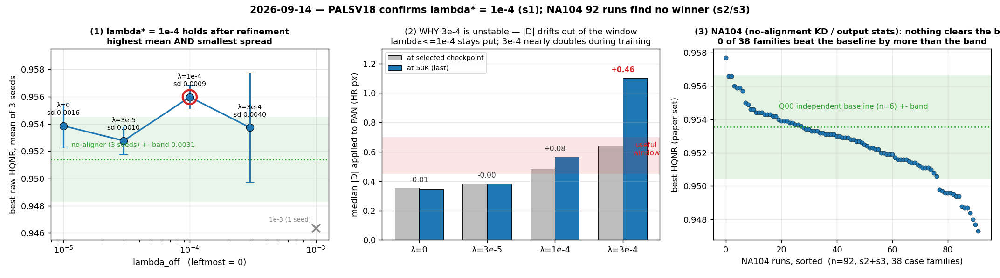

# 2026-09-14 — λ\* = 1e-4 확정 (PALSV18, s1) · NA104 92벌 전부 기준선 미달 (s2·s3)

두 캠페인이 같은 날 끝났고 결론이 정반대다. 서버가 다르지만 **판정선·프로토콜이 같아** 한 문서에 둔다
(교차 분석이므로 파일명에 서버 토큰을 두지 않는다 — [CONVENTION](CONVENTION.md) §1).

| 캠페인 | 서버 | 규모 | 결론 |
|---|---|---|---|
| **PALSV18** — λ 정밀화 + 정합 검증 | s1 | 6벌 신규 + 대조 9벌 재사용 (13.8/18 GPU-h) | **λ\* = 1e-4 확정.** 정점 위쪽 불안정의 **기전**도 규명 |
| **NA104** — 정합 없는 KD·출력통계 | s2·s3 | **92벌 · 38 case family** | **기준선을 판정선만큼 넘은 family 0개** |

> 판정 = best_raw 의 raw_original HQNR(논문 세트 `.mat` 20장, 원 PAN 기준) → fSCC.
> **판정선 0.0031** (HQNR 에만). `aligned_*`·V64·last 는 진단.
> 계획 [`PALSV18`](../research_log/PAN_L1E4_Refinement_AlignmentValidation_S1_18GPUh_2026-09-13.md) ·
> [`NA104 20H`](../research_log/01_S2_20H_PRIORITY.md). 집계 `tools/palsv18_report.py`.

---

## 1. PALSV18 (s1) — λ\* = 1e-4 가 정밀화 후에도 남았다

[09-13](2026-09-13_s1_pals24-lambda-sweep.md)의 미확정 사항이 "λ\* 선택이 seed 1234 한 벌이고
정점 주변(3e-5·3e-4)이 비어 있다" 였다. 그 두 점을 **각 3 seed** 로 채웠다.

### 1.1 결과 — 평균도 최고, 산포도 최소

| λ_off | 3 seed 평균 HQNR | **sd** | vs 무정합 | 부호 일관 | 판정선 초과 |
|---|---:|---:|---:|:---:|:---:|
| — (aligner 없음) | 0.95140 | 0.00114 | — | — | — |
| 0 (L000) | 0.95386 | 0.00163 | +0.00246 | — | — |
| 3e-5 (L3E5) | 0.95277 | 0.00101 | +0.00137 | 예 | **0/3** |
| **1e-4 (L1E4)** | **0.95597** | **0.00087** | **+0.00457** | **예** | **2/3** |
| 3e-4 (L3E4) | 0.95374 | **0.00402** | +0.00234 | **아니오** | 1/3 |
| 1e-3 (1 seed) | 0.94636 | — | −0.00504 | — | — |

**두 방향 모두에서 1e-4 가 최고다.** 아래쪽(3e-5)은 이득이 판정선 안으로 줄고, 위쪽(3e-4)은
평균이 떨어지면서 **sd 가 4.6배**로 커지고 **부호가 뒤집힌다**(+0.0052 / +0.0026 / −0.0008).

### 1.2 왜 3e-4 가 불안정한가 — |Δ| 가 학습 중 창을 벗어난다

이번에 규명된 기전이다. 같은 run 의 **선택 시점 |Δ| 와 50K 시점 |Δ|** 를 비교하면:

| λ_off | 선택 시점 \|Δ\| | 50K \|Δ\| | 드리프트 | 유용창(0.45~0.7) |
|---|---:|---:|---:|---|
| 0 | 0.354 | 0.345 | −0.01 | 창 아래 고정 |
| 3e-5 | 0.384 | 0.382 | −0.00 | 창 아래 고정 |
| **1e-4** | 0.483 | 0.566 | **+0.08** | **창 안 유지** |
| 3e-4 | 0.641 | **1.103** | **+0.46** | **창 밖으로 이탈** |

λ ≤ 1e-4 는 |Δ| 가 학습 내내 제자리다. **3e-4 부터는 계속 커져 50K 에 거의 2배**가 된다.
best checkpoint 가 그 드리프트 **도중** 어디를 잡느냐가 seed 마다 달라지고, 그게 sd 0.0040 의 정체다.

→ **λ\* = 1e-4 는 "|Δ| 를 유용창 안에 붙들어 두는 가장 큰 λ" 다.** 09-13 이 경험적 정점으로만
제시한 값에 기전이 붙었다.

### 1.3 정합 능력은 λ 와 함께 계속 좋아진다 (재확인)

| λ_off | 입력반응 \|B_yy\| | offset EPE (px) |
|---|---:|---:|
| 0 | 0.197 | 0.749 |
| 3e-5 | 0.237 | 0.713 |
| 1e-4 | 0.508 | 0.474 |
| 3e-4 | 0.655 | 0.365 |
| 1e-2 | 0.793 | 0.180 |
| donor(N2) | **0.910** | **0.093** |

**aligner 가 가장 정확한 지점(donor, EPE 0.093)이 HQNR 은 최악**이다(09-12: 0.9329).
09-13 의 "정합을 잘하는 것과 HQNR 이 좋은 것이 갈라진다" 가 λ 축 전체에서 재확인됐다.

### 1.4 개입 대조(V4) — 장면별 적응은 이득의 원인이 아닌 듯하다

L3E4 seed 1234 의 best checkpoint 에서:

| 개입 | raw HQNR |
|---|---:|
| 학습된 Δ 그대로 | 0.9579 |
| **장면 셔플**(Δ 를 엉뚱한 장면에) | **0.9578** |
| Δ = 0 | 0.9465 |
| 부호 반전 | 0.9416 |
| 상수 보정 | 0.9470 |

**장면 셔플이 학습된 Δ 와 사실상 같다**(−0.0001). 즉 **"어느 장면에 얼마"** 가 아니라
**"전체적으로 이 정도 옮긴다"** 가 이득의 실체로 보인다. Δ=0·부호반전은 확실히 나쁘므로
**이동 자체는 필요하다.**

> **한계**: 이 대조는 **1 case · 1 seed** 에서만 돌았다(L3E4·1234). λ\* 에서 반복하지 않았다.
> 확정 주장이 아니라 다음 실험의 가설이다.

## 2. NA104 (s2·s3) — 92벌에서 아무것도 나오지 않았다

정합 모듈이 **전혀 없는** W104·D122 골격에서 GT-anchored KD · 출력통계 · 방향 gate 를
38 case family 로 분해한 캠페인이다.

| | |
|---|---|
| 독립 baseline `Q00` (2 서버 × 3 seed) | **0.95355** ± sd 0.00169 |
| 전체 92벌 산포 | 0.9473 ~ 0.9577 (폭 0.0104 = 판정선의 3.4배) |
| **Q00 평균 대비 판정선 초과 family** | **0 / 38** |
| 판정선 안에 드는 run 비율 | **83%** |

최상위(`Q02` 0.9577 · `Q09` 0.9566 · `Q06` 0.9566)도 baseline 평균 대비 +0.0022~+0.0042 인데,
전부 **단일 seed** 값이고 Q00 자체의 seed 산포(sd 0.0017, 2σ 0.0034)에 묻힌다.

**해석**: 이 골격에서 KD·출력통계·방향 gate 어느 조합도 독립 학습을 넘지 못했다.
[09-01 KD 캠페인](2026-09-01_kd-se-msonly-campaigns.md)의 결론("Teacher 가 Student 보다
HQNR 이 낮아 넘겨받을 것이 없다")이 **골격을 바꾸고 case 를 38개로 늘려도 유지**된다.

> **한계**: s2·s3 의 `work_dir` 을 이 서버에서 볼 수 없어 **시트의 HQNR 값만으로** 판정했다.
> seed 대응 비교·진단(θ, 통계 loss 거동)은 각 서버에서 해야 한다. 위 판정은
> "**판정선을 넘는 승자가 없다**" 까지이고, family 간 미세 순위는 다루지 않는다.

## 3. 종합 — 두 축의 대비

| | 정합 축 (s1) | 비정합 KD·통계 축 (s2·s3) |
|---|---|---|
| 규모 | PA·PO10·NF16·PALS24·PALSV18 ≈ 32벌 | NA104 92벌 |
| 결과 | **+0.0046 (판정선 1.5배), 3 seed 부호 일관** | **0/38 family** |
| 상태 | λ\* = 1e-4 확정, 기전 규명 | 신호 없음 |

**지금 살아있는 유일한 레버는 PAN aligner + λ_off 1e-4 다.**

## 4. 남은 불확실성

1. **λ\* vs L000 은 여전히 미확정** — 평균 +0.00211, 판정선 초과 1/3.
   "offset loss 가 핵심" 이라고 말할 수 없다. 확정된 것은 **묶음이 무정합보다 낫다**는 것뿐이다.
2. **fSCC 는 일관되게 하락**한다 (λ\*: 0.8755~0.8841 vs 무정합 0.8931~0.8998).
   HQNR 이 갈렸으므로 판정에는 안 쓰이지만, 출력–PAN 상관이 떨어지는 것은 사실이다.
3. **장면별 적응 무용(§1.4)은 1 case·1 seed** 근거다.
4. **정합 검증 V2–V4 는 일부 case 만** 돌았다(표 B·C 의 빈 칸). `blur_status` 는
   `unmatched_blur_control` 로 대조가 성립하지 않았다.

## 5. 다음 — 우선순위

1. **§1.4 를 λ\* 에서 반복한다** (장면 셔플 · Δ=0 · 부호반전, 3 seed).
   셔플이 λ\* 에서도 무해하면 **aligner 를 상수 보정으로 대체**할 수 있다는 뜻이고,
   그건 모듈을 통째로 없애는 단순화다. 비용 ≈ 0 (학습 없이 checkpoint 개입).
2. **λ\* vs L000 을 seed 3벌 더** — 현재 1/3 만 판정선 초과. 이걸 못 넘기면
   "offset loss" 가 아니라 "aligner 존재" 가 이득이라는 뜻이고, 설계가 달라진다.
3. **NA104 는 축소한다.** 92벌에서 0/38 이면 case 를 더 늘릴 근거가 없다.
   s2·s3 자원을 정합 축(1·2번)의 seed 반복으로 돌리는 편이 낫다.

## 6. 참고 지표 — 판정에 쓰지 않음

| case (3 seed 평균) | D_λ | D_s |
|---|---:|---:|
| 무정합 | 0.02279 | 0.02628 |
| λ 0 | 0.02258 | 0.02411 |
| **λ\* 1e-4** | **0.02119** | **0.02333** |
| λ 3e-4 | 0.02359 | 0.02320 |

λ\* 에서 **D_λ·D_s 가 동시에 최저**다 — 09-13 에서 본 "부분 보정이 D_λ 를 얻고 D_s 는 아직
안 잃는다" 가 3 seed 평균에서도 유지된다.

## 7. 운영

- PALSV18 **13.80 / 18 GPU-h**(run 9.17 · reserved 3.10 · diag 1.42), **4.20 미사용**, 6/6 무장애.
- 대조군 P0/L000/L1E4 × 3 seed 는 NF16·PALS24 재사용(재학습 없음).
- **`work_dir/campaign_gates_enabled.txt` 에 `pals24` 가 아직 남아 있다** (09-13 보고서에서도 지적).
  PALSV18 은 조건부 gate 를 쓰지 않으므로 지금 지워도 안전하다.
