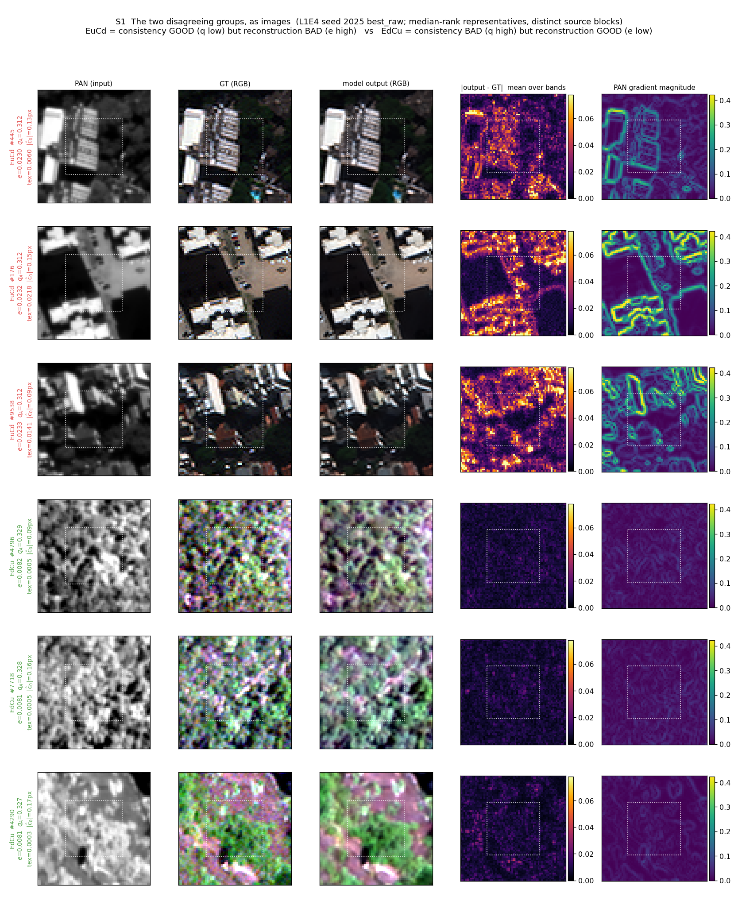
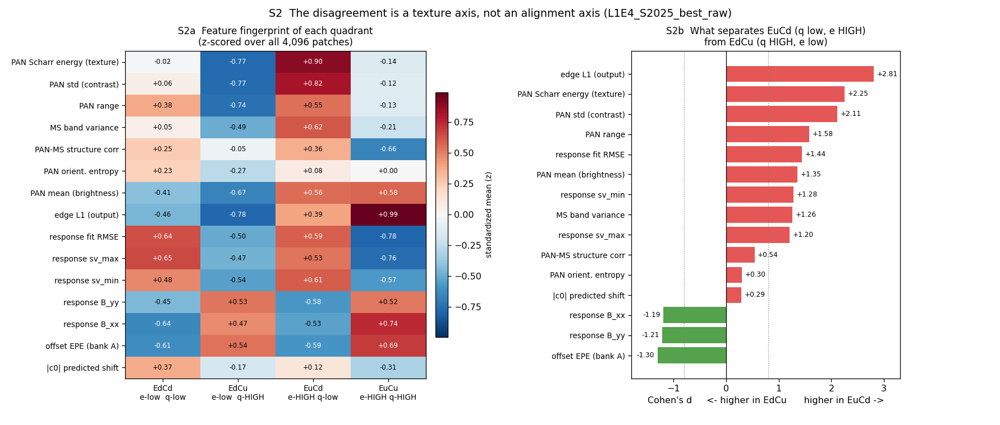
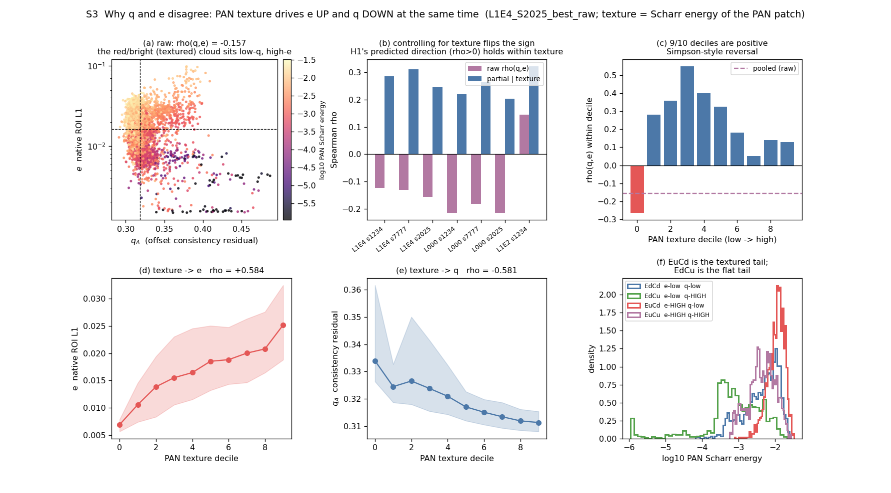
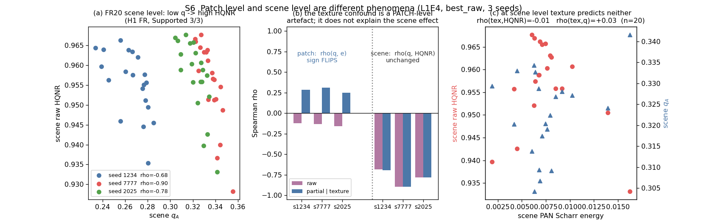
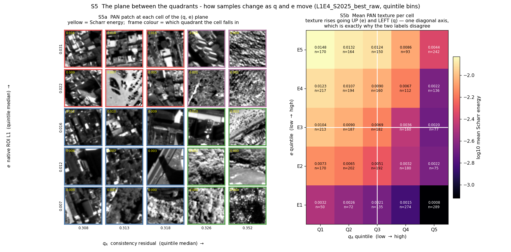
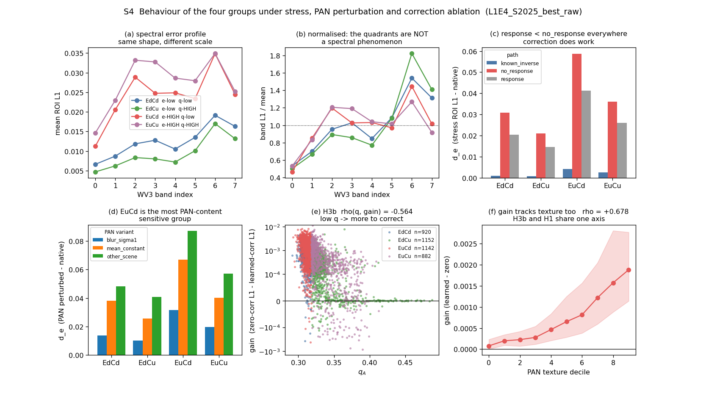

# EQREC4-S1-v1 (s1, 2026-09-15) — 판정 결과 + sample·feature 시각화 보완

그날 s1 문건. 아래 **§A 보완**(03:00 판정 뒤 추가한 sample 수준·feature 수준 자료)과
**§B 원문**(03:00 판정 문건 그대로)으로 이루어진다.

| | |
|---|---|
| 판정 요지 | q 는 patch 수준 정합 품질의 표지가 아니다 — H1 native·H2 는 3 seed 전부 예측과 반대, H1 FR(scene)은 3/3 지지. q_T Teacher-quality gate **채택 안 함** |
| 보완이 더한 것 | **왜** 반대 방향이 나오는가 — patch 수준에서는 **PAN 텍스처가 교란변수**다. 통제하면 ρ(q,e) 부호가 −0.13 → **+0.28** 로 뒤집힌다(7개 checkpoint 전부) |
| 보완이 바꾼 것 | 원문의 "q 는 scene 수준 난이도/**텍스처**와 함께 움직인다" 중 **scene 수준의 텍스처 귀속은 데이터가 지지하지 않는다** — scene 에서는 통제해도 ρ 가 그대로다(§A.4) |
| 판정 변화 | **없다.** H1–H4 판정, L1E4 유지, q_T gate 미채택 전부 그대로 |

---

# §A 보완 — sample·feature 시각화 (2026-09-15 추가)

원문 §3 의 4분면 표는 집단 평균만 보여 준다. **"q 는 낮은데 e 는 높은" 집단(EuCd)과
그 반대(EdCu)가 실제로 어떤 patch 인가**, 그리고 그 사이가 어떻게 이어지는가를
그림으로 붙인다. 생성기 `tools/eqrec4_visuals.py`(재현: `python tools/eqrec4_visuals.py`).

대상은 원문과 같은 primary **L1E4 seed 2025 best_raw**(λ_off 1e-4, W112·D123 9ch,
N2 R200 last aligner fine-tune), native64 전수 4,096 patch. 학습 없음.

기호(원문과 동일): **e** = native 입력 64² patch 의 ROI L1 복원 오차 ·
**q_A** = axis probe bank 의 offset consistency 잔차 |ĉ_ε+ε−ĉ_0| 평균(**작을수록 일관**) ·
4분면 = e·q_A 각 중앙값으로 자른 것 — EdCd(e↓q↓) / EdCu(e↓q↑) / EuCd(e↑q↓) / EuCu(e↑q↑).
**텍스처** = PAN patch 의 Scharr energy(`pan_scharr_energy`, 원문 표 B 의 texture 열과 같은 양).

## A.1 두 집단은 눈으로 구분된다 — 시가지 대 식생

4분면 안에서 e·q 순위가 **중앙에 가까운** sample 을 source block 이 겹치지 않게 3벌씩 골랐다
(극단 cherry-pick 회피). 점선은 지표를 재는 ROI `[16:48]²`.

- **EuCd**(q 낮고 e 높음) — 건물·도로·주차장. 인공 구조물의 **날카로운 경계**가 가득하다.
  오차도 그 경계 위에 정확히 얹힌다(4열과 5열의 무늬가 같다).
- **EdCu**(q 높고 e 낮음) — 식생·저대비 지표. 경계라 할 것이 없고 오차 지도도 거의 비어 있다.

> 표시 주의: RGB·PAN 은 **patch 별** 2–98 % 스트레치다. EdCu 는 원래 대비가 낮아
> 스트레치가 잡음을 키운 것이지 출력이 잡음인 것이 아니다(4열의 |출력−GT| 가 실제 크기다).

즉 두 집단을 가르는 것은 정합의 좋고 나쁨이 아니라 **장면 종류**다.

## A.2 feature 로 확인 — 분리축은 텍스처다

EuCd 대 EdCu 의 표준화 차이(Cohen's d) 상위는 전부 텍스처·대비 계열이다.

| feature | EuCd | EdCu | Cohen's d |
|---|---:|---:|---:|
| edge L1 (출력 경계 오차) | 0.0121 | 0.0052 | **+2.81** |
| PAN Scharr energy (텍스처) | 0.0119 | 0.0021 | **+2.25** (5.74배) |
| PAN std (대비) | 0.2321 | 0.0879 | +2.11 |
| PAN range | 1.2703 | 0.6435 | +1.58 |
| MS band variance | 0.0256 | 0.0083 | +1.26 (3.07배) |
| aligner 반응 B_xx | −0.4095 | −0.3441 | −1.19 |
| aligner 반응 B_yy | −0.3437 | −0.2920 | −1.21 |
| offset EPE (bank A) | 0.6006 | 0.6496 | −1.30 |

읽기: EuCd 는 텍스처가 **5.7배** 높고, **동시에** aligner 반응이 이상값(−1)에 더 가깝다
(B_yy −0.344 vs −0.292). 텍스처가 있으면 aligner 가 변위를 더 잘 감지해 q 가 낮아지고,
같은 텍스처가 복원을 어렵게 해 e 가 높아진다. **한 원인이 두 지표를 반대로 민다.**

## A.3 그래서 ρ(q,e) 가 음수다 — 텍스처를 통제하면 부호가 뒤집힌다

텍스처를 통제한 편상관(순위 회귀 잔차)으로 재면:

| checkpoint | ρ(q_A, e) 원값 | **텍스처 통제 후** | ρ(tex, e) | ρ(tex, q_A) |
|---|---:|---:|---:|---:|
| L1E4 s1234 | −0.124 | **+0.286** | +0.584 | −0.569 |
| L1E4 s7777 | −0.131 | **+0.312** | +0.587 | −0.598 |
| L1E4 s2025 | −0.157 | **+0.246** | +0.584 | −0.581 |
| L000 s1234 / s7777 / s2025 | −0.214 / −0.182 / −0.215 | **+0.220 / +0.266 / +0.204** | +0.584 | −0.63 ~ −0.64 |
| L1E2 s1234 | +0.145 | **+0.322** | +0.597 | −0.202 |

**7개 checkpoint 전부 통제 후 양수**가 되고, 원값에서 부호가 갈리던 L1E2 까지 같은 쪽으로 모인다.
텍스처 10분위 안에서 따로 재도 **9/10 분위가 양수**다(−0.26 / +0.28 / +0.36 / +0.55 / +0.40 /
+0.33 / +0.18 / +0.05 / +0.14 / +0.13) — 전형적인 Simpson 형 역전이다.

**H1 native 의 원래 예측(q↓ ↔ e↓, ρ>0)은 텍스처를 고정하면 성립한다.**
원문의 "Opposed 3/3" 판정은 그대로 유효하다(그 판정은 통제 없는 주변 상관에 대한 것이다).
바뀐 것은 판정이 아니라 **해석**이다 — q 가 정합 품질과 무관한 것이 아니라,
주변 상관이 텍스처에 가려져 있었다.

## A.4 단, scene 수준은 다른 현상이다 — 여기선 텍스처가 설명하지 못한다

같은 통제를 FR20 **scene** 수준(H1 FR)에 적용하면 **아무것도 변하지 않는다.**

| L1E4 best_raw | ρ(q_A, raw HQNR) | 텍스처 통제 후 | ρ(tex, HQNR) | ρ(tex, q_A) |
|---|---:|---:|---:|---:|
| seed 1234 | −0.683 | −0.696 | −0.092 | −0.041 |
| seed 7777 | −0.898 | −0.898 | +0.038 | +0.048 |
| seed 2025 | −0.782 | −0.782 | −0.011 | +0.030 |

scene 텍스처는 HQNR 과도 q 와도 사실상 무상관(|ρ| ≤ 0.09)이라 교란변수가 아니다.

> **원문에서 바뀌는 문장 하나.** 원문 §1 은 "q 는 **scene 수준 난이도/텍스처**와 함께
> 움직이는 지표" 라고 썼다. patch 수준은 맞지만 **scene 수준의 텍스처 귀속은 이 데이터가
> 지지하지 않는다.** scene 에서 q 와 HQNR 을 잇는 것이 무엇인지는 **아직 모른다** — 판정
> (H1 FR Supported 3/3)과 결론(q_T gate 미채택)은 영향받지 않는다.
> 단서: n=20 이라 검정력이 낮고, 여기 쓴 텍스처는 512² 전체 평균 Scharr energy 라
> "scene 난이도" 를 충분히 대리하지 못할 수 있다.

## A.5 4분면 사이의 중간 — 평면 위에서 patch 가 어떻게 변하나

4분면은 평면을 중앙값으로 두 번 자른 것이라 경계가 인위적이다. (q_A, e) 를 각각 5분위로
잘라 25칸을 만들고 칸마다 대표 PAN patch 를 그 자리에 놓았다.

칸별 평균 텍스처는 **왼쪽 위(q↓ e↑) 0.0148 → 오른쪽 아래(q↑ e↓) 0.0008 로 18.5배** 단조 변한다.
patch 도 시가지 → 저층 혼재 → 농지·수면 → 식생으로 연속적으로 바뀐다.
**텍스처는 q 와 e 를 가로지르는 하나의 대각축**이고, 4분면 라벨은 그 대각축을 직교 격자로
자른 결과다 — 두 라벨이 어긋나는 이유가 이 그림 한 장에 있다.

## A.6 나머지 판정에 붙는 자료

- **(a)(b) 밴드별 오차**: 4분면의 스펙트럼 **모양**은 같고 크기만 다르다(평균으로 정규화하면 겹친다).
  분광 현상이 아니라는 뜻 — 원문 §3 의 해석과 일관.
- **(c) stress**: 어느 집단이든 `response` < `no_response`, `known_inverse` ≈ 0.
  **보정 자체는 작동한다**(원문 H3a Supported 와 같은 방향).
- **(d) PAN 민감도**: EuCd 가 세 변형(blur σ1 · 밴드 평균 상수 · 다른 scene 대체) 모두에서 최대.
  원문 §3 (iv) 의 "q 낮은데 오차 높은 집단이 PAN 내용에 가장 민감" 을 sample 단위로 확인.
- **(e)(f) H3b 재해석**: ρ(q_A, gain) = **−0.564** 인데 ρ(texture, gain) = **+0.678** 로
  텍스처 쪽이 더 강하다. 즉 **H3b 도 q 의 효과가 아니라 텍스처 효과로 읽히는 것이 자연스럽다** —
  "보정이 할 일이 있는 patch" 는 곧 "경계가 많은 patch" 다.
  (원문 H3b Supported 판정은 유지. change-score coupling 주의도 그대로.)

## A.7 이 보완이 바꾸는 것과 바꾸지 않는 것

**바꾸지 않는다**: H1–H4 판정, 표 A–F 수치, L1E4 working reference 유지,
**q_T 를 Teacher-quality gate 로 쓰지 않는다**는 결론. 오히려 근거가 강해진다 —
patch 수준 q 의 신호 상당 부분이 텍스처의 대리값이라면, q 로 sample 을 고르는 것은
"텍스처로 고르는 것" 에 가깝고 그건 이미 K20 에서 HQNR 이득이 없었다(모든 arm 0.9555 → 0.951–0.952).

**바꾼다**: §A.4 의 scene 수준 텍스처 귀속 한 문장.

**새로 생긴 질문**(다음 캠페인 판단용, 이번에 답하지 않음):
1. scene 수준에서 q 와 raw HQNR 을 잇는 것은 무엇인가 — 텍스처가 아니라면.
2. 텍스처를 층화한 뒤 q 로 가중하면(= 텍스처 효과를 제거한 순수 q 가중) K20 결과가 달라지는가.
   현재 EA/EAQ 가중은 텍스처를 통제하지 않는다.
3. 판정은 **HQNR 기준**으로 한다 — A.2–A.6 의 e·q·gain 은 전부 진단량이며 판정 지표가 아니다.

## A.8 한계

- **상관 분해이지 개입이 아니다.** 텍스처를 실제로 바꿔 넣고 q·e 를 다시 재지 않았다.
  원문 §8 의 "개입으로 가르지 않았다" 는 한계는 그대로 남는다.
- 편상관은 **순위 선형** 통제다. 텍스처–e 관계가 강한 비선형이면 잔차에 남는다.
- 텍스처 대리값은 PAN Scharr energy 하나다. 경계 밀도·구조 종류(인공/자연)를 따로 가르지 않았다.
- S1 의 6 patch 는 중앙 대표이지 집단 전체가 아니다. 집단 주장은 S2–S5 의 전수 통계로 한다.
- scene 수준 n=20, 개발에 반복 사용된 FR20 세트다.

---

# §B 원문 — EQREC4-S1-v1 결과 — offset consistency q 는 무엇을 말해 주는가 (s1, 2026-09-15 03:00)

> 2026-09-15 03:00 자동 판정 문건 그대로. 수치·판정 무변경.

계획 `research_log/PAN_S1_EQREC4_Alignment_Cue_Hypotheses_20h_2026-09-14.md` · 구현·운영 노트 `research_log/2026-09-14_eqrec4-implementation.md`(§6 감사 반영, 02:00–03:00 K10/REPORT 수정 포함) ·
자동 보고서 `work_dir/_eqrec4_s1_campaign/report_EQREC4.md`(표 A–F, `hypothesis_verdicts.json`, `verdict_evidence.csv`, 그림 `figures/`).
**전부 py**(`tools/eqrec4` 진단 + `tools/metrics` 평가기; MATLAB 실행 아님). 대상 checkpoint 는 PALS24/NF16 의 `fixed` recipe(W112·D123, 9ch, 새 U-Net + N2 R200 last aligner fine-tune):
**L1E4**(λ_off 1e-4; seed 1234·7777·2025, best_raw 와 last) 가 주 대상, L000(λ_off 0)·L1E2(0.01) 는 대조. 학습은 없고(K10/K20 의 단기 적응 제외) 고정 가중치의 진단이다.

기호: **e** = native(무변위) 입력에서의 64² patch L1 오차 · **q_A** = 축 방향 probe bank(반경 0.25/0.5/1/2 px × 4 축) 로 잰 offset consistency 잔차 |ĉ_ε + ε − ĉ_0| 의 평균(작을수록 aligner 가 자기 변위 예측에 일관) · q_B = 대각 bank ·
4분면 = e 중앙값·q_A 중앙값 기준 EdCd(오차↓·q↓)/EdCu/EuCd/EuCu · source block = 32 연속 patch index 의 proxy(실제 scene id 없음) · FR20 = 논문 세트 `.mat` 20장, HQNR 은 raw-original 전체 프레임.

### 1. 한 줄 결론

**q 는 "정합이 잘 된 sample" 의 표지가 아니다.** 같은 checkpoint 안에서 q_A 가 낮은 sample 은 native 오차가 오히려 높고(H1 native, 3 seed 전부 반대 방향), 추가 변위에도 더 크게 무너진다(H2, 3 seed 전부 반대).
그런데 scene 단위(FR20) 에서는 q_A 가 낮은 scene 이 raw HQNR 이 높다(H1 FR, 3 seed 전부 p<0.05). 즉 q 는 **scene 수준 난이도/텍스처와 함께 움직이는 지표**이지 patch 수준 정합 품질의 지표가 아니다.
learned correction 은 zero correction 보다 낫고(H3a, 3 seed 전부 양) 그 이득의 크기는 q_A 가 낮을수록 크다(H3b) — 이건 "정합이 보정할 것이 있는 patch 에서 보정이 작동한다" 로 읽힌다.
Student 감독 cue 로서의 q 는 **판정 불가**(H4 diag) 이고, 5K 단기 적응(K20) 에서 q 를 넣은 가중은 D-split L1 을 통계적으로 아주 조금 낮추지만 **HQNR 은 모든 arm 이 같이 떨어져(0.9555 → 0.951–0.952) HQNR 기준으로는 아무 arm 도 이득이 없다.**
→ L1E4 채택(기존 working reference) 은 그대로, **q_T 를 Teacher-quality gate 로 쓰는 안은 채택하지 않는다.**

### 2. 가설별 판정 (seed 를 단위로, best_raw·last 가 같은 방향 + source-block bootstrap CI 가 0 을 제외해야 "Supported/Opposed"; 하나라도 어긋나면 unresolved)

| 가설 (예측) | 판정 | L1E4 seed 1234 / 7777 / 2025 (best_raw; last 는 같은 방향) | 범위·주의 |
|---|---|---|---|
| H1 native: q_A↓ ↔ e↓ (ρ>0) | **Opposed** 3/3 | ρ(q_A, e) = −0.115 [−0.152, −0.077] / −0.122 / −0.149 (n 3,584 = B∪C∪D, 112 block) | L000 도 −0.21, **L1E2 는 +0.17/+0.25** — 부호가 λ_off 에 따라 뒤집힌다 |
| H1 FR: scene q_A↓ ↔ raw HQNR↑ (ρ<0) | **Supported** 3/3 | ρ = −0.683 (p 9e-4) / −0.898 (8e-8) / −0.782 (5e-5); last −0.67 / −0.67 / −0.47 (p 0.036) | 20 scene; FR20 은 개발에 반복 사용된 세트 |
| H2: q_A↓ 이면 bank B 추가 변위의 오차 증가 d_e 가 작다 (ρ>0) | **Opposed** 3/3 | ρ(q_A, d_e) r=1 px: −0.378 / −0.481 / −0.517 (r=2: −0.41 / −0.48 / −0.49; r=0.5 도 음) | D split 상세 subset, response 경로, paired valid set |
| H3a: learned correction > zero (paired gain>0) | **Supported** 3/3 | gain = +0.00083 [0.00080, 0.00087] / +0.00115 / +0.00092 L1, 양인 sample 95–96 % (n 4,096, 128 block) | 같은 U-Net 에서 c 를 0 으로 바꾼 것 — P0 와의 인과 비교가 아니다 |
| H3b: q_A 가 gain 크기를 예측 (ρ<0) | **Supported** 3/3 | ρ(q_A, gain) = −0.579 / −0.554 / −0.564 (last −0.59 / −0.52 / −0.63) | change-score coupling(e 와 gain 이 항을 공유) 주의 |
| H4 diag: q 를 더하면 K10 pool utility 예측이 좋아지나 | **Insufficient / unresolved** | Pair A LOO MAE B0 0.000901 → B1(+q) 0.000999 (**나빠짐**), Pair B 0.001289 → 0.001021(좋아짐), A→B 교차 불일치; direction acc 1.0 은 utility 가 전부 양이라 무의미 | source-disjoint 9 pool/pair(§4), 재실행 noise 4.1e-6 |
| H4 exec: K20 5K 적응에서 EAQ < EA, EAQ < EAQ-SHUF (D locked L1) | **Supported** (Pair A) | EAQ−EA = −2.75e-6 [−4.05e-6, −1.58e-6], EAQ−SHUF = −8.4e-7 [−1.19e-6, −5.0e-7]; U−R = −5.4e-5 (32 block) | **HQNR 은 아래 §5 — 모든 arm 이 하락**, 효과 크기는 L1 의 1e-4 % 수준 |
| Hspec: spectral 재조합만으로 q 가 변하나 | descriptive | MS 밴드 상수화/교환이면 q_A 0.28 → 0.49, EPE 0.53 → 0.94 px, ĉ_0 변화 0.48–0.60 px (bilinear 커널·padding·PAN affine 은 무변화) | 표 C; aligner 는 MS 내용에 강하게 의존 |

### 3. 네 집단 (primary L1E4 S2025 best_raw 의 4분면; 전수 4,096 patch, 집단당 882–1,152)

| 집단 | n | e 평균 | q_A 평균 | stress(bank B r=1, D subset 64): response / no_response / known_inverse d_e | PAN 민감도 d_e (blur σ1 / 다른 scene / 평균 상수) | learned−zero gain (core, 자기 4분면) · 양 비율 |
|---|---:|---:|---:|---|---|---|
| EdCd (e↓ q↓) | 920 | 0.0128 | 0.312 | 0.0205 / 0.0308 / 0.0011 | 0.0139 / 0.0483 / 0.0380 | +0.00087 · 0.990 |
| EdCu (e↓ q↑) | 1152 | 0.0099 | 0.338 | 0.0145 / 0.0211 / 0.0008 | 0.0102 / 0.0408 / 0.0258 | +0.00034 · 0.910 |
| EuCd (e↑ q↓) | 1142 | 0.0242 | 0.311 | 0.0413 / 0.0587 / 0.0043 | 0.0315 / 0.0871 / 0.0669 | +0.00167 · 0.992 |
| EuCu (e↑ q↑) | 882 | 0.0273 | 0.340 | 0.0260 / 0.0361 / 0.0026 | 0.0196 / 0.0570 / 0.0403 | +0.00073 · 0.893 |

읽기: (i) 집단 정의상 E↓ 의 e 가 낮은 것은 결과가 아니다. (ii) 어느 집단이든 aligner 가 반응하는 경로(response) 의 오차 증가가 무반응(no_response) 보다 작고 known_inverse 는 거의 0 — 보정 자체는 작동한다(H3a 와 일관).
(iii) q↓ 집단(EdCd·EuCd) 이 learned−zero gain 이 크고 양 비율도 99 % — "보정이 할 일이 있는 patch" 다. (iv) EuCd(오차 높고 q 낮음) 가 stress·PAN 민감도 모두 가장 크다: **q 가 낮은데 오차가 높은 집단은 PAN 내용(다른 scene 대체 d_e 0.087) 에 가장 민감한 집단**이며, 이것이 H1/H2 의 "반대 방향" 을 만든다. 원인(텍스처·경계·spectral) 은 자동 판정하지 않았다 — 표 B 의 texture 열(Scharr energy) 은 EuCd 0.0119 로 다른 집단(0.002–0.0065) 의 2–6 배다.

### 4. K10 — 같은 pool 에 hard 대 soft 추가 항 (Pair A: L1E4 S2025 best ← S1234 20K 후보 Student; Pair B 반대 방향; 64 update, fresh AdamW, C split 128 patch 로 평가)

| pair | cell | pool 수 | U_soft−hard (rel, C L1) 평균 · 양인 pool |
|---|---|---:|---|
| A | EdCd / EdCu / EuCd / EuCu (모두 a_T ≤ 0) | 2 / 3 / 2 / 2 | +0.0036 / +0.0055 / +0.0046 / +0.0072 · 9/9 |
| B | EdCd / EdCu / EuCd / EuCu (모두 a_T > 0) | 2 / 3 / 2 / 2 | +0.0038 / +0.0044 / +0.0049 / +0.0070 · 9/9 |

soft(Teacher 출력 쪽) 추가 항이 hard(GT 재가중) 추가 항보다 C 에서 항상 조금 낫고(재실행 noise 4.1e-6 대비 1,000 배), **cell(= q 4분면) 간 차이는 그 순서가 e/q 와 단조로 맞지 않는다**(EuCu 가 최대). Pair A 는 Teacher 가 Student 보다 나은 sample(a_T>0) 이 14개뿐이라 그 집단에 대한 주장은 불가(계획 §5 의 "Teacher 우위 집단에서도 효과" 는 검증 못 함).
pool 은 source block 을 cell 에 배타 배정해 만들었다(9 pool/pair, block 전역 분리; 02:00–02:12 두 번 수정 — 노트 §6). 다른 cell 에 있는 block 의 sample 은 버려서 pool 에 든 sample 은 432/2,048 이다.

### 5. K20 — 조건부 gate pilot (Pair A; gate 통과: q_A·q_B 재현성 ρ 0.926, label 일치 0.878, 9 pool, utility MAD 0.00145 ≫ noise 4e-6; 5,000 update, D split locked)

| arm (가중) | D L1 (0 → 5000) | raw HQNR FR20 (0 → 5000) | fSCC (0 → 5000) |
|---|---|---|---|
| R (재가중 없음) | 0.01789 → 0.01801 | **0.95552 → 0.95118** | 0.8755 → 0.8553 |
| U (균등 soft) | 0.01789 → 0.01796 | 0.95552 → 0.95193 | 0.8755 → 0.8565 |
| EA (e·a 셀 가중) | 0.01789 → 0.01795 | 0.95552 → 0.95199 | 0.8755 → 0.8567 |
| EAQ (e·a·q 셀 가중) | 0.01789 → 0.01795 | 0.95552 → 0.95210 | 0.8755 → 0.8569 |
| EAQ-SHUF (q 라벨 조건부 섞음) | 0.01789 → 0.01795 | 0.95552 → 0.95205 | 0.8755 → 0.8568 |

**HQNR 기준(판정 규칙 HQNR > SCC > ERGAS)**: 5K 단기 적응은 **모든 arm 에서 raw HQNR 을 0.0034–0.0043 떨어뜨렸고** arm 간 차이(≤0.0009) 는 seed 2σ(≈0.011) 훨씬 안이다. D L1 의 paired 차이(EAQ < EA < U ≪ R, CI 가 0 제외) 는 실재하지만 크기가 1e-6 수준이고 HQNR 로 이어지지 않는다.
따라서 H4 exec "Supported" 는 **D-split L1 에 한정된 진술**이고, 이 실험의 주 지표로는 q 가중이 무엇도 개선하지 않는다. 50K KD 성공 여부는 이 pilot 이 말하지 않는다(계획 §15.4).

### 6. 정합의 세 수준 (표 C 요약; primary S2025 best_raw · S1234 best_raw)

- relative response(bank A, r 평균): 반응 기울기 B_yy/B_xx = −0.32/−0.38 (S2025), −0.42/−0.57 (S1234) — 완전 반응(−1) 의 1/3–1/2. PAN-only/MS-only/common 분해와 bank B 는 보고서 표 C.
- known absolute synthetic error: 합성 변위의 역보정은 bank A r=1 에서 known_inverse d_e ≈ 1e-6(≈0) — 격자 내 보정은 정확하다(calibration OK, OOD 진단은 표 C).
- native before/after proxy(estimator 로 잰 PAN–MS 잔여 변위, 센서 GT 아님): FR20 에서 보정 전 중앙값 1.79 px → 후 1.21 px, 20/20 scene 감소 — 단 estimator 의 2차 독립 검증기가 없어(census 는 같은 estimator 의 gate) **판정에 쓰지 않는다**(`n_both_accepted 0`).

### 7. 소요·운영

| stage | G00 | D10 | D20 | D30 | D30B | D40 | D50 | K10 | K20 | REPORT | 합 |
|---|---:|---:|---:|---:|---:|---:|---:|---:|---:|---:|---:|
| 분 | 0.5 | 22.2 | 0.9 | 75.0 | 4.3 | 63.3 | 1.5 | 6.6 | 45.5 | 0.0 | 220 (3.7 h; 계획 상한 20 h) |

23:07 기동 → 03:00 DONE. 중간에 runner 교체(D30B 삽입, 00:49) · K10 두 번 실패(pool 의 source block 분리 규칙; 02:00·02:05, run 1 산출물은 `_run1_badpools_k10_k20/` 보존) · REPORT 한 번 실패(죽은 줄) — 전부 노트 §6. 판정·표는 마지막 실행(K10 02:07–02:13, K20 02:14–02:59, REPORT 03:00) 의 것이다.

### 8. 한계

- source group 이 index-block proxy 라 bootstrap CI 는 보수적으로 읽는다(G00 `provenance_limited`). FR20 은 개발에 반복 사용된 benchmark. Pair A 의 a_T>0 sample 14개.
- H1/H2 의 "반대 방향" 은 **상관**이다 — q 가 낮은 patch 가 왜 PAN 내용에 더 민감한지(텍스처·경계·spectral) 는 개입으로 가르지 않았다. 표 B 의 texture 와 Hspec(MS 밴드 상수화가 q 를 0.28 → 0.49 로) 이 단서다.
- K20 은 Pair A 하나·5K·D split 고정이다.

### 9. 다음

- q_T gate 는 채택하지 않는다. PAKD50 의 Teacher T0(L1E4 S2025 best_raw) 선택은 이 결과와 무관하게 유지(정합 축 판정은 `2026-09-14_palsv18-lambda-confirmed-and-na104-null.md`).
- s3 에서 같은 캠페인을 돌리면(bundle 이식, 노트 §5) 서버 간 재현만 추가된다 — 새 가설은 없다.
