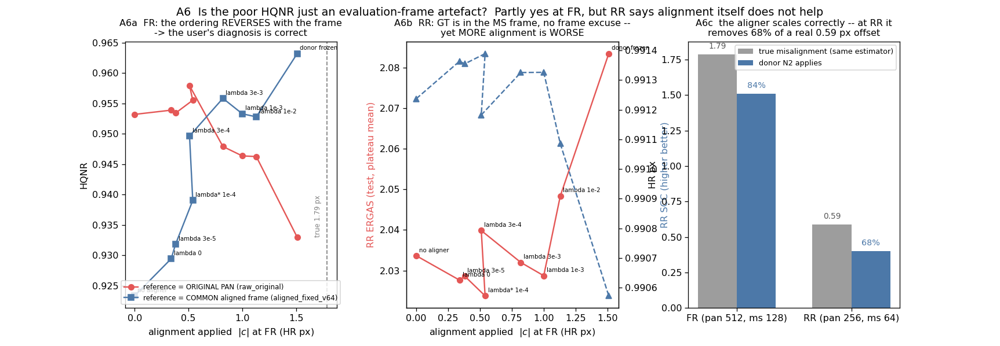
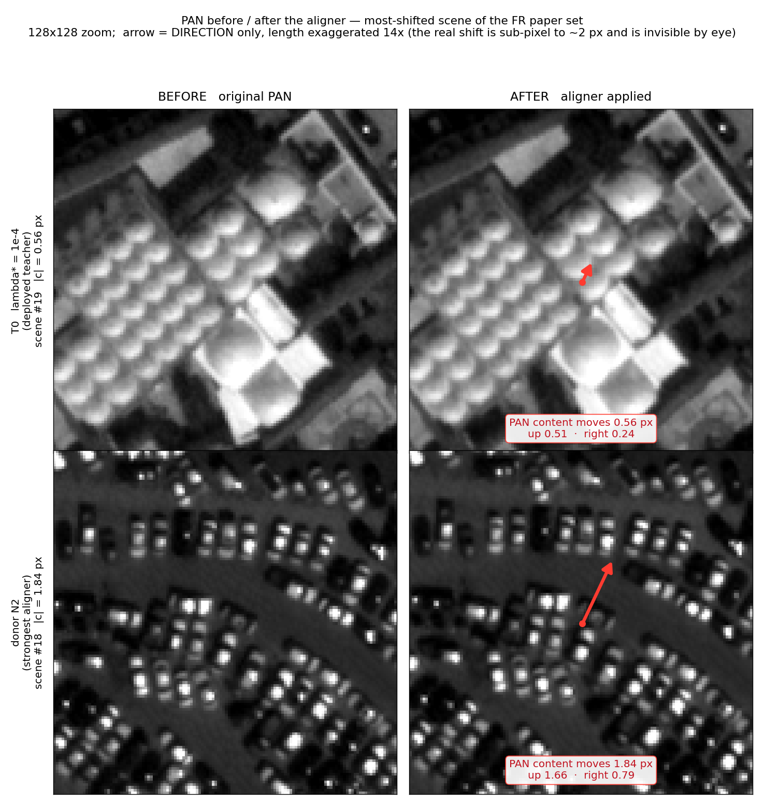

# PAN Aligner 검증 — 이 method 는 유의미하고 정직하고 제안할만한가 (2026-09-17)

기 실험 산출물 기반 감사. 대상은 **가장 최근 Teacher T0 = `PALS24_L1E4_W112_D123_WV3_S2025_N2LAST_R200_v1` / `best_hqnr`**
(step 24240, raw HQNR 0.95698, `assets/pakd50/T0_run`) 과 그 λ_off 사다리·대조군 전체.
근거는 PALS24 · PALSV18(V1–V4) · NF16(P0–P4) · PO10(N2 donor) · EQREC4 의 산출물이고,
**새로 돌린 것은 §6 의 빠진 대조군 하나뿐**이다(`tools/aligner_constant_control.py`, FR20 재평가 3벌).
그림 생성기 `tools/aligner_audit_figures.py`.

판정 지표는 **raw HQNR**(FR 논문 세트 `.mat` 20장, raw_original 전체 프레임), 보조 SCC.
판정선은 실측 2σ = **0.0031**. fSCC·ERGAS·D_λ·D_s·B·|c| 는 **진단량**이다.

기호: **ε** = 학습·검사 때 PAN 에 주입하는 알려진 변위 · **ĉ** = aligner 가 내놓는 보정 벡터 ·
**B_diag** = ĉ(ε) 의 ε 에 대한 응답 기울기(**이상 −1** = 주입한 변위를 정확히 상쇄) ·
**|c|** = native 입력에서 예측한 보정 크기(HR px) · **proxy 실제 오정합** = Scharr-ZNCC 추정기
(`align/estimator.py`) 로 잰 PAN↔MS 잔여 변위 — **센서 GT 가 아니다**.
case 약명: CTRLP0/P0 = aligner 없음 · P1 = donor 동결 · L000/P2 = aligner 있고 λ_off 0 ·
L3E5/L1E4/L3E4/L1E3/L3E3 = λ_off 3e-5/1e-4/3e-4/1e-3/3e-3 · P3 = λ_off 1e-2 · P4 = P3+GT 기하.

---

## 1. 한 줄 결론

**aligner 는 실제로 무언가를 학습한다. 그러나 HQNR 이 그것을 보상하지 않으며, 현재 형태로는 제안할 수 없다.**

세 가지가 동시에 참이다.

1. **학습은 된다** — ε 응답 B 는 λ_off 에 따라 −0.20 → −0.86 으로 단조 제어되고, native 예측은
   proxy 실제 오정합과 scene 단위로 **r = +0.83** 상관한다(방향 cos 0.992, 20/20 scene 개선).
2. **그런데 정합을 잘할수록 HQNR 이 나빠진다** — 가장 잘 정합하는 모델(P1, donor 동결, B −0.91,
   실제 1.75 px 중 1.51 px 보정)의 HQNR 이 **0.93298 로 전 case 중 최악**이고 D_s 는 두 배다.
   HQNR 최적점은 실제 오정합의 **26 %** 만 보정하는 지점이다.
3. **얻은 이득은 scene 적응 때문이 아니다** — 같은 checkpoint 에서 scene 별 예측을 **전역 상수 하나**
   (그 예측들의 평균)로 바꿔도 HQNR 이 그대로다(차이 −0.0004 ~ −0.0001, 3 seed 전부 **음수**).

→ 지금 상태의 서사("PAN 을 MS 프레임으로 정합하면 복원이 좋아진다")는 **데이터가 지지하지 않는다.**
성립하는 것은 훨씬 좁은 진술이다 — "PAN 을 0.45 px 쯤 옮기면 이 지표가 오른다".

> **§13 을 함께 읽을 것** (2026-09-17 추가). 위 2번의 "역전" 은 모델의 결함이 아니라
> **평가 기준 프레임의 성질**임이 확인됐다 — 공통 정합 프레임에서 재면 순위가 단조로 뒤집힌다.
> 다만 GT 가 있는 RR 에서도 정합이 강할수록 복원이 나빠지므로(§13.3), **결론 자체는 바뀌지 않는다.**

---

## 2. 무엇을 어떻게 물었나

| 질문 | 검사 | 근거 |
|---|---|---|
| Q1 ε 로 학습이 제대로 되는가 | 주입 변위에 대한 응답 B_diag, λ 사다리·학습 궤적 | §3 |
| Q2 예측값이 유의미한가 | scene 별 예측 대 proxy 실제 오정합 (상관·크기·분산) | §4 |
| Q3 실제로 개선하는가 | 정합 없음 대비 3-seed 차이, **선택 있는 best 대 선택 없는 last/plateau** | §5 |
| Q4 정직한가 | 정합 능력과 HQNR 의 관계, 다른 지표가 함께 움직이는가 | §7 |
| Q5 제안할만한가 | **빠져 있던 대조군** — scene 별 예측 대 전역 상수 하나 | §6 |

---

## 3. Q1 — ε 기전은 작동한다. 다만 **가르치는** 것이 아니라 **덜 잃게** 하는 것이다

| 모델 | B_diag (이상 −1) | \|c\| px | offset EPE | 해석 |
|---|---:|---:|---:|---|
| **donor N2** (PO10, 무작위 변위 명시 감독) `last` | **−0.93** | 1.511 | 0.093 | 거의 이상적 |
| P1 donor 동결 | −0.92 | 1.511 | 0.107 | 동결하면 보존됨 |
| P2 / L000 (λ_off 0, 공동 미세조정) | **−0.20** | 0.347 | 0.749 | **10K step 안에 붕괴** |
| L3E5 (3e-5) | −0.23 | 0.387 | 0.713 | 거의 회복 못 함 |
| **L1E4 (1e-4 = λ\*)** | **−0.34** (T0) / −0.30 ~ −0.51 | 0.452 | 0.626 | 이상의 **1/3** |
| L3E4 (3e-4) | −0.64 | 0.688 | 0.366 | |
| P3 (1e-2) | −0.78 | 1.138 | 0.211 | donor 에 근접 |

학습 궤적(A1b)이 결정적이다. aligner 는 donor(−0.93)에서 **초기화**되는데, 공동 미세조정 10K step
만에 −0.24 로 무너진다. 그 뒤 λ_off 가 다시 쌓아 올린다 — L1E4 는 50K 에서 −0.53 까지,
L000 은 −0.20 에서 평평하다.

**따라서 offset consistency loss 는 정합을 가르치는 장치가 아니라, donor 가 이미 가진 성질이
복원 손실에 밀려 사라지는 것을 늦추는 정규화 장치다.** 그리고 HQNR 로 고른 λ\* = 1e-4 는
그 성질을 **donor 의 1/3 수준까지만** 남긴 지점이다. 이 사실 자체가 §7 의 복선이다 —
더 잘 정합하는 설정이 있는데 지표가 그것을 고르지 않았다.

---

## 4. Q2 — 예측값은 유의미하다. 단 **심하게 수축**돼 있다

FR20 각 scene 에서 모델 예측 ĉ 와 proxy 실제 오정합을 직접 비교했다(12 checkpoint).

| | 값 |
|---|---:|
| proxy 실제 오정합 (FR20 중앙값) | **1.749 px** |
| 모델 보정량 평균 | 0.660 px = 실제의 **38 %** |
| 보정 후 잔여 | 0.990 px (43 % 감소) |
| 방향 일치 cos(예측, 실제) | **0.992** |
| scene 변동 추종 r | dy **+0.83** · dx +0.68 · \|c\| +0.81 |
| 예측 sd / 실제 sd | dy 0.56 · dx 0.48 |
| 개선된 scene | **20 / 20** (전 checkpoint) |
| T0 의 예측 IQR (dy, dx) | 0.072 / 0.033 px |

**이건 진짜다.** 방향은 거의 완벽하고, scene 간 변동도 r = 0.83 으로 따라간다. 무반응 상수가 아니다
(2026-09-10 PA_A1 의 "입력 무반응 0.2 px" 병리는 해소됐다).

동시에 **회귀-평균형 수축**이 뚜렷하다 — 기울기 0.5 안팎, 크기는 실제의 38 %.
ε 응답 B ≈ −0.34 (이상의 34 %) 와 native 크기 38 % 가 같은 방향을 가리킨다: 이 aligner 는
**일관되게 약 3 배 적게 예측한다.**

그리고 실용적으로 중요한 규모 문제: T0 의 scene 간 예측 sd 는 **0.054 px** 인데 공통 성분은
**0.463 px** 다. 즉 예측의 90 % 는 모든 scene 에 공통인 전역 오프셋이고, scene 적응분은 그 위의
얇은 층이다. 이것이 §6 의 결과를 예고한다.

---

## 5. Q3 — 개선 방향은 일관되지만, **test 세트 선택을 빼면 판정선 안**이다

CTRLP0(정합 모듈 없음) 대비 3-seed 차이:

| case | best ckpt (**같은 FR20 으로 선택**) | last (선택 없음) | plateau (선택 없음) | 시드 부호 |
|---|---:|---:|---:|---|
| L000 (λ 0) | +0.00230 | +0.00184 | +0.00197 | +++ / +++ / +++ |
| L3E5 | +0.00121 | +0.00110 | +0.00112 | +++ / −++ / −++ |
| **L1E4 (λ\*)** | **+0.00441** (밴드 넘음) | **+0.00228** (밴드 안) | **+0.00257** (밴드 안) | +++ / +++ / +++ |
| L3E4 | +0.00219 | **−0.01081** | −0.01058 | +−+ / −−− / −−− |

세 가지를 읽어야 한다.

1. **헤드라인 +0.0044 의 약 40 % 가 체크포인트 선택 인플레이션이다.** 선택을 빼면 +0.0023 으로
   판정선(0.0031) **안**으로 들어간다. 부호는 3/3 일치하므로 저장소 규칙상 *방향*은 주장할 수 있지만,
   **"판정선을 넘는 개선"은 선택을 포함했을 때만 참이다.**
2. **구성요소가 각각은 밴드를 못 넘는다.** aligner 추가(L000 vs CTRLP0) +0.0023, λ_off 추가
   (L1E4 vs L000) +0.0021 — 둘 다 밴드 안. 합쳐야 넘는다. offset consistency loss 에 이득을
   귀속시키는 근거로는 약하다.
3. **λ 가 조금만 커지면 부호가 뒤집힌다.** L3E4 는 best 에서 +0.0022 인데 last 에서 −0.0108 이다.
   이득이 학습 중 **일시적**이고, 그 순간을 test 세트로 집어내고 있다는 뜻이다.

> FR20 은 (a) 체크포인트 선택, (b) λ\* 선택, (c) 최종 보고에 **모두** 쓰였다. hold-out 이 없다.

---

## 6. Q5 — 빠져 있던 대조군: **전역 상수 하나가 scene 별 예측과 동등하다**

PALSV18 의 `constant_calibration` 대조군은 train patch 의 median(|c| = **0.137 px**)을 썼다.
FR scene 예측(0.46–0.56 px)의 1/4 이라 사실상 zero 와 같았고 — 실제로 그 값이 zero 와 붙어 있다 —
그래서 **"scene 별 예측이 단일 전역 상수보다 나은가" 는 검증된 적이 없었다.**

같은 checkpoint·같은 평가 경로에서 적용하는 보정만 바꿔 다시 쟀다(`tools/aligner_constant_control.py`).

| L1E4 best_hqnr | \|c\| | learned − zero | **learned − const_mean** | learned − shuffle |
|---|---:|---:|---:|---:|
| seed 2025 (**= T0 Teacher**) | 0.463 | +0.00691 | **−0.00006** | +0.00008 |
| seed 1234 | 0.557 | +0.00597 | **−0.00043** | +0.00020 |
| seed 7777 | 0.465 | +0.00812 | **−0.00017** | +0.00006 |

`const_mean` = 그 모델이 20 scene 에 내놓은 예측의 **평균 벡터 하나를 전 scene 에 동일 적용**.

**보정을 넣는 것은 크게 중요하다(+0.006 ~ +0.008). 어느 보정인지는 전혀 중요하지 않다.**
전역 상수가 오히려 근소하게 낫고, 세 seed 모두 부호가 음수이며, 차이는 판정선의 1/7 이하다.

이유는 §4 에서 이미 나왔다 — 예측의 scene 간 sd 가 0.054 px 인데 공통 성분이 0.463 px 다.
CNN 이 계산한 scene 적응분은 HQNR 의 분해능 아래에 있다.

> **범위를 정확히 해 둔다.** 이 검사는 *adaptive aligner 로 학습된* 모델에서 **추론 시점의**
> 보정만 바꾼 것이다. "상수로 **학습**해도 같았을 것" 을 보인 것이 **아니다** — 학습 중 aligner 가
> 주는 변동이 U-Net 을 다르게 형성했을 수 있다. 그건 별도 실험이 필요하다(§10).
> 다만 **추론기로서의 scene 적응성은 이득이 증명되지 않았다.**

---

## 7. Q4 — 정직성: **정합을 잘할수록 HQNR 이 나쁘다**

같은 골격(W112·D123)에서 정합 강도만 다른 모델들:

| 모델 | 정합 능력 B | \|c\| px (실제 1.75) | **raw HQNR** | D_λ | D_s | fSCC |
|---|---:|---:|---:|---:|---:|---:|
| **P1 donor 동결 — 가장 잘 정합** | **−0.92** | **1.511 (86 %)** | **0.93298** | 0.02157 | **0.04659** | **0.8132** |
| P3 (λ 1e-2) | −0.78 | 1.138 (65 %) | 0.94625 | 0.02385 | 0.03064 | 0.8466 |
| P4 (P3 + GT 기하) | — | — | 0.94265 | 0.02144 | 0.03669 | 0.8353 |
| P0 / CTRLP0 정합 없음 | — | 0 | 0.95316 / 0.95068 | 0.02150 | 0.02592 | 0.8998 |
| L000 (λ 0) | −0.20 | 0.347 (20 %) | 0.95389 | 0.02271 | 0.02395 | 0.8921 |
| **L1E4 = λ\* (선택된 것)** | −0.34 | **0.452 (26 %)** | **0.95698** | 0.01990 | 0.02359 | 0.8786 |

**관계가 역전돼 있다.** 실제 오정합의 86 % 를 제대로 걷어내는 모델이 최악(−0.024 HQNR,
D_s 두 배)이고, 26 % 만 건드리는 모델이 최고다. 정합이 목적이라면 이 순서가 나올 수 없다.

기전은 2026-09-12 에 확인된 HQNR 의 **프레임 비대칭**이다 — D_λ 는 LRMS(MS 프레임)를,
D_s 는 **원본 PAN**(PAN 프레임)을 참조하는데 둘은 1.79 px 떨어져 있다. PAN 을 MS 쪽으로 옮기면
D_λ 는 좋아지고 D_s 는 원본 PAN 에서 멀어진 만큼 나빠진다. λ\* 는 그 **교환의 최적점**이지
정합의 최적점이 아니다. A3b 가 그대로 보여준다 — HQNR 은 D_s 와 거의 완전한 역관계다.

**함께 움직이지 않는 지표들.** L1E4 3-seed, CTRLP0 대비:

| 지표 | 차이 | 판단 |
|---|---:|---|
| **raw HQNR** (판정) | **+0.00442** | 밴드 넘음 (단 §5) |
| fSCC (원 PAN 참조) | **−0.0171** | 일관되게 악화. aligner 강도와 단조 (0.900 → 0.879 → 0.847 → 0.813) |
| RR SCC (보조 판정) | −0.00027 | SCC 포화 범위(±0.0015) 안 — 지지도 반박도 아님 |
| RR ERGAS (참고) | +0.0235 (+1.15 %) | **선택 epoch 교란** — L1E4 는 18180~40400, CTRLP0 는 33330~42420 에서 뽑혔다. aligner 탓으로 돌릴 수 없다 |

**오르는 것은 선택에 쓴 지표 하나뿐이다.** fSCC 는 확실히 내려간다. 출력의 구조가 원본 PAN 에서
멀어진다는 뜻이고, HQNR 만 보고하면 이게 가려진다.

공정을 위해 남길 것: 같은 checkpoint 안에서 보정을 끄면 **D_λ 와 D_s 가 둘 다** 나빠진다
(L1E4 s1234: ΔD_λ −0.0044, ΔD_s −0.0018). 즉 훈련된 모델은 warp 된 PAN 을 전제로 동작하며,
그 안에서는 보정이 두 성분 모두에 도움이 된다. 역전은 **모델 간** 비교에서만 나타난다.
또 `wrong_sign` 은 zero 보다도 나쁘고(0.9416 vs 0.9465) D_λ 만 크게 악화시킨다 —
**방향에는 실체가 있다.** blur 대조는 적용 불가로 나왔다(warp 이 Scharr 에너지를 줄이지 않음,
energy ratio 1.02) — 즉 **이득이 단순 블러 때문은 아니다.**

---

## 8. 판정 요약

| 질문 | 판정 | 근거 |
|---|---|---|
| ε 로 학습이 되는가 | **된다, 부분적으로** | B 가 λ 로 단조 제어(−0.20→−0.86). 단 donor(−0.93) 를 10K 에 잃고 λ\* 에서 1/3 만 회복 |
| 예측값이 유의미한가 | **유의미하다, 수축된 채로** | r(예측, proxy 실제) = +0.83, cos 0.992, 20/20 개선. 크기는 실제의 38 % |
| 개선이 유의미한가 | **불충분** | 방향 3/3 일치이나 선택 제거 시 +0.0023 = 판정선 안. 구성요소 각각도 밴드 안 |
| 정직한가 | **현재 서사로는 아니다** | 가장 잘 정합하는 모델이 최악(0.93298). HQNR 최적은 26 % 보정 지점. fSCC 는 일관 악화. FR20 3중 사용 |
| 제안할만한가 | **아니다 — 현재 형태로는** | scene 적응성이 전역 상수 하나 대비 이득 없음(3/3, 전부 음수) |

---

## 9. 무엇은 살아남고 무엇은 못 쓰는가

**살아남는 것**
- offset consistency loss 는 **작동하는 기전**이다. B 를 λ 로 예측 가능하게 제어한다. 이건 실재한다.
- aligner 는 **진짜 신호를 학습한다** — proxy 실제 오정합과 r = 0.83, 방향 cos 0.99.
- PO10 의 **명시적 변위 감독(donor N2)** 이 정합 능력의 진짜 출처다. B −0.93, 실제의 86 % 보정.
  정합 자체를 원한다면 **이쪽이 성공 사례**다.
- T0 Teacher 로서의 L1E4 선택은 **이 감사와 무관하게 유지**된다. PAKD50 은 T0 의 절대 성능이 아니라
  Student 에게 물려줄 초기값으로 쓴다.

**못 쓰는 것**
- "PAN 을 MS 프레임으로 정합하면 복원이 좋아진다" 는 인과 서사. §7 의 역전이 정면으로 반박한다.
- "scene 적응 aligner" 라는 기여 주장. §6 이 이득을 보여주지 못한다.
- HQNR 단독 보고. fSCC 를 함께 내지 않으면 교환을 숨기는 것이 된다.
- 선택 포함 수치(+0.0044)를 hold-out 성능처럼 쓰는 것.

---

## 10. 제안 가능한 method 가 되려면 — 필요한 것

우선순위 순. 1–2 는 이번 결론을 뒤집을 수 있는 것들이다.

1. **상수로 *학습*하는 대조군.** §6 은 추론만 바꿨다. `|c|` 를 학습 가능한 **2-파라미터 전역 상수**로
   두고 처음부터 학습한 모델이 aligner CNN 과 동등하다면, CNN 기여는 0 이다. 이게 결정적이다.
2. **hold-out FR 세트.** λ\* 선택과 체크포인트 선택을 FR20 밖에서 하거나, 최소한 20장을 반으로 갈라
   선택/보고를 분리한다. §5 의 +0.0023 이 진짜인지 이것 없이는 모른다.
3. **프레임 비대칭을 피하는 판정.** D_λ 와 D_s 가 1.79 px 다른 프레임을 참조하는 한, "PAN 을 옮기는"
   어떤 방법도 지표를 부분적으로 거래한다. 두 성분을 같은 프레임에서 재는 평가나,
   정합 자체를 재는 독립 지표가 필요하다.
4. **독립 2차 추정기.** 현재 proxy 는 `n_both_accepted = 0` 이다 — census 는 같은 추정기의 gate 이지
   독립 검증이 아니다. 위상 상관(phase correlation) 같은 다른 계열 추정기로 1.75 px 와 r = 0.83 을
   재확인해야 §4 를 근거로 쓸 수 있다.
5. **수축 보정.** 예측이 일관되게 3 배 작다. 출력에 고정 배율을 곱하거나 손실을 다시 잡으면
   정합은 좋아진다 — 다만 §7 대로 HQNR 은 **나빠질** 것이다. 그 실험 자체가 §7 을 직접 검정한다.

---

## 11. 한계

- **proxy 실제 오정합은 센서 GT 가 아니다.** 1.749 px 도, r = 0.83 도 한 추정기의 산물이고
  독립 검증기가 없다(§10.4). §4 전체가 이 가정 위에 있다.
- §6 은 **추론 시점 치환**이다. 학습까지 상수로 바꾼 경우는 검사하지 않았다.
- §7 의 모델 간 비교는 P1/P3/P4 가 **seed 1234 한 벌씩**이다. L1E4/CTRLP0 만 3 seed 다.
  역전의 방향은 크지만(−0.024) 시드 반복이 없다.
- FR20 은 전 캠페인에서 반복 사용된 벤치마크다. 절대 수치의 일반화는 주장하지 않는다.
- 3-seed 는 downstream 초기화 반복이지 독립 test seed 가 아니다(PALSV18 §표 D 와 동일 한계).
- `L3E4 last` 의 −0.0108 같은 값은 |Δ| 가 유용 창(0.45–0.7 px)을 벗어난 결과로, 2026-09-14 의
  기전 설명과 일관된다 — 새 현상이 아니다.

---

## 12. 다음

- **당장 바꿀 것 없음.** PAKD50 은 계속 돈다. T0 유지, λ\* = 1e-4 유지(§9).
- **보고·문서에서 바꿀 것**: aligner 이득을 인용할 때 (a) 선택 포함/제외 두 값을 같이 적고,
  (b) fSCC 를 함께 적는다. 이번 감사 이전 문서를 소급 수정하지는 않는다(규약 §5).
- **제안 여부 판단은 §10.1–10.2 결과를 보고 한다.** 둘 다 비용이 작다 — 상수 학습 대조군 1벌,
  FR20 분할 재선택은 재학습 없이 기존 후보 격자로 가능하다.

---

## 13. 검토 — "평가 프레임이 문제 아닌가" (2026-09-17 추가)

제기된 가설: HQNR 은 D_λ·D_s 로 환산되는데, 모델은 **정합된 PAN** 으로 학습해 놓고
평가는 **원본(misaligned) PAN** 을 기준으로 한다. 맞춘 것을 어긋난 것과 비교하니
잘 나올 수 없는 것 아닌가. RR 도 MS 가 어긋나 있으니 평가 전에 정합을 제거해야 하지 않나.

### 13.1 먼저 — "수축(shrinkage)" 의 의미

예측이 **진실에 비례하되 이득(gain)이 1 보다 작다**는 뜻이다. 무작위 오차가 아니라
**일정 배율의 과소 추정**이다. 서로 독립인 세 측정이 같은 배율을 가리킨다.

| 측정 | 값 | 이상 | 이득 |
|---|---:|---:|---:|
| ε 응답 B_diag (T0) | −0.34 | −1.0 | 0.34 |
| native 보정 크기 / 실제 오정합 | 0.46 / 1.79 px | 1.0 | 0.26 |
| scene 별 예측을 실제에 회귀한 기울기 | ~0.5 | 1.0 | 0.5 |

즉 **예측 ≈ 0.3 × 진실**. 방향은 맞고(cos 0.992), 어느 scene 이 더 어긋났는지 순위도
맞는데(r = 0.83), **크기만 1/3** 이다. "조금 틀렸다" 가 아니라 "체계적으로 덜 움직인다" 다.

원인은 두 손실의 줄다리기다 — 복원 손실은 warp 을 벌하므로 |c| 를 0 쪽으로 끌고,
λ_off 는 반대로 민다. λ\* 는 그 평형점이다. 근거는 §3 의 사다리다(λ 0 → B −0.20,
λ 1e-2 → −0.78). **학습을 더 돌려서 풀리는 문제가 아니다.**

### 13.2 FR 에서는 지적이 맞다 — 프레임을 바꾸면 순위가 뒤집힌다

같은 가중치를 두 기준에서 평가했다. `aligned_fixed_v64` 는 **모든 모델에 동일한** 외부 보정
(동결 N2 donor 의 예측)으로 PAN 을 옮긴 뒤 재는 view 다 — 각 모델이 제 프레임을 고르는 것이 아니다.

> **2026-09-17 정정.** 처음 쓴 표는 `raw_original`(**전체 프레임**)과 `aligned_fixed_v64`(**V64**,
> 가장자리 64 px 제외)를 나란히 놓아 *프레임*과 *평가 영역* 두 가지를 동시에 바꿨다.
> 아래는 **둘 다 V64** 로 맞춰 프레임만 바꾼 것이다. 순위 결론은 그대로다.

| 정합 강도 (seed 1234) | \|c\| px | raw_valid (V64, 원본 PAN 기준) | **aligned_fixed_v64** (V64, 공통 정합 기준) |
|---|---:|---:|---:|
| 정합 없음 | 0.00 | 0.95880 | **0.92333** ← 최악 |
| λ 0 | 0.34 | 0.95929 | 0.92945 |
| λ 3e-5 | 0.38 | 0.95883 | 0.93182 |
| λ\* 1e-4 | 0.54 | 0.96079 | 0.93903 |
| λ 3e-4 | 0.51 | **0.96333** ← 최고 | 0.94963 |
| λ 1e-2 | 1.13 | 0.95213 | 0.95279 |
| donor 동결 | 1.51 | **0.93985** ← 최악 | **0.96319** ← 최고 |

(참고: 전체 프레임 `raw_original` 값은 각각 0.95319 / 0.95389 / 0.95340 / 0.95552 / 0.95792 /
0.94625 / 0.93298 이다 — V64 보다 낮지만 순위는 같다.)

**순위가 완전히 역전되고, 정합 강도에 대해 단조가 된다.** §7 의 "역전" 은 모델의 성질이
아니라 **기준 프레임의 성질**이었다. 지적이 정확하다.

다만 이것을 판정 기준으로 승격할 수는 없다. 두 가지 때문이다.

1. **순환성.** `aligned_fixed_v64` 의 기준 보정은 동결 N2 donor 의 예측이고, **P1 이 바로 그 donor** 다.
   실제로 P1 의 `aligned_fixed` 와 `aligned_self` 가 0.96319 로 **완전히 같다** — 제 프레임에서 평가받는 것이다.
   (나머지 모델은 자기가 만들지 않은 공통 기준으로 재므로 그들 사이의 단조성은 순환이 아니다.)
2. **비교 불가.** 논문 수치는 원본 PAN 기준이다. 프레임을 바꾸면 `fr_mat20` 이 논문과 비교 가능하다는
   존재 이유가 사라진다. "우리가 고른 재정합 위에서의 HQNR" 은 HQNR 이 아니다.

### 13.3 그런데 RR 이 가설을 반증한다

RR 은 **GT 가 있고, 그 GT 는 MS 프레임에 있다**(Wald 프로토콜: GT = 원본 MS, 입력 pan = PAN↓4).
그러므로 PAN 을 MS 쪽으로 옮기는 것은 **GT 프레임 쪽으로 옮기는 것**이다 —
여기엔 프레임 핑계가 없다. 정합이 진짜 이득이라면 RR 은 반드시 좋아져야 한다.

같은 추정기로 RR 의 실제 오정합을 직접 쟀다.

| | 실제 오정합 | donor N2 적용 | 비율 |
|---|---:|---:|---:|
| FR (pan 512, ms 128) | 1.788 px | 1.51 px | 84 % |
| **RR (pan 256, ms 64)** | **0.590 px** | **0.40 px** | **68 %** |

**aligner 는 RR 에서도 제대로 정합한다** — 크기를 scale 에 맞춰 줄이고(1.51 → 0.40),
실제 0.59 px 중 0.40 px 를 올바른 방향으로 걷어낸다. 그런데:

| 정합 강도 (seed 1234, 학습 후반 20 % 평균 — 선택 없음) | \|c\| FR | RR ERGAS ↓ | RR SCC ↑ |
|---|---:|---:|---:|
| 정합 없음 | 0.00 | 2.0336 | 0.99124 |
| λ 0 | 0.34 | 2.0276 | 0.99136 |
| λ\* 1e-4 | 0.54 | **2.0238** | **0.99139** |
| λ 3e-4 | 0.51 | 2.0398 | 0.99118 |
| λ 1e-2 | 1.13 | 2.0484 | 0.99109 |
| **donor 동결** | 1.51 | **2.0834** ← 최악 | **0.99057** ← 최악 |

**GT 가 정의하는 프레임에서, 가장 잘 정합하는 모델이 복원은 가장 나쁘다.**
최적은 λ\* 부근이고 그 너머는 단조 악화다. FR 의 역전과 같은 모양인데, 여기엔 프레임 비대칭이 없다.

RR 에서는 제안하신 처방을 적용할 수도 없다 — GT 는 고정이라 "평가 전에 정합을 제거" 하려면
출력을 되돌리거나 GT 를 옮겨야 하는데, 출력 되돌리기는 2026-09-12 에 이미 실패했다
(P1 을 −Δ 로 되돌리면 0.93298 → 0.89152, D_λ 0.0216 → 0.0705).

### 13.3b 정정 — within-model 로 보면 보정은 **방향까지 실제로 작동한다** (2026-09-17 추가)

§13.3 의 표는 **서로 다른 학습 run** 의 비교라 warp 자체의 효과를 분리하지 못한다. 같은
checkpoint 를 고정하고 추론 시 `delta = α · c_learned` 만 바꿔 다시 쟀다
(`tools/aligner_rr_sweep.py`, RR crop [20:-21], α=0 은 `aligner_enabled=False` — `warp(0)` 은
무보정과 **비트 동일**함을 확인했다: `zero_equivalence_max_abs` 0.0).

| α | T0 \|shift\| | **T0 ERGAS↓** | T0 SCC↑ | P1 \|shift\| | **P1(donor 동결) ERGAS↓** | P1 SCC↑ |
|---:|---:|---:|---:|---:|---:|---:|
| 0.0 (보정 없음) | 0.000 | 2.1686 | 0.98601 | 0.000 | **3.9962** | 0.95061 |
| 0.5 | 0.069 | 2.0941 | 0.98717 | 0.205 | 2.7235 | 0.97636 |
| **1.0 (학습된 예측)** | 0.138 | **2.0694** | **0.98758** | 0.411 | **2.2628** | **0.98386** |
| 2.0 | 0.276 | 2.1197 | 0.98675 | 0.821 | 3.6467 | 0.95297 |
| 3.0 | 0.414 | 2.5522 | 0.97903 | 1.232 | 5.6729 | 0.89607 |
| **−1.0 (역부호)** | 0.138 | **2.4473** | 0.98134 | 0.411 | **5.1591** | 0.91651 |

**두 모델 모두 α = 1 에서 정확히 최소다.**

> **2026-09-17 정정.** 처음에는 "α=−1 이 α=+1 과 크기가 같은데 훨씬 나쁘므로 **방향**이 정보를
> 실어 나른다" 고 썼다. **이 추론은 틀렸다.** 방향을 보려면 *학습점 α=1 로부터의 거리*를 맞춰
> 비교해야 하고, 그 짝은 α=−1 대 α=+3 이다. 실제로 재 보면 곡선은 **α=1 을 중심으로 한 V 자**이고
> 거리만으로 거의 설명된다.
>
> | 학습점 α=1 로부터의 거리 | T0 | P1(donor) |
> |---|---|---|
> | 0 | α=+1 **2.0694** | α=+1 **2.2628** |
> | 1×\|c\| | α=0 2.1686 vs α=+2 2.1197 → **차이 2.3 %** | α=0 3.9962 vs α=+2 3.6467 → **9.6 %** |
> | 2×\|c\| | α=−1 2.4473 vs α=+3 2.5522 → **차이 4.3 %** | α=−1 5.1591 vs α=+3 5.6729 → **10.0 %** |
>
> 같은 거리의 두 점은 2–10 % 안에서 붙어 있는 반면, 거리를 늘리면 T0 는 2.07→2.55(23 %),
> P1 은 2.26→5.67(151 %) 로 벌어진다. **방향이 아니라 학습 동작점으로부터의 이탈량이 지배한다.**
> 따라서 α-sweep 은 **정합의 정확성에 대해 아무것도 말하지 않는다** — aligner 와 U-Net 이 서로
> 맞춰져 있다는 것만 보인다. α=1 이 최소인 것은 U-Net 이 warp 된 PAN 으로 학습됐기 때문이며,
> 학습 때 어떤 warp 을 썼든(물리적으로 틀린 warp 이라도) 최소는 α=1 에 온다.

**§13.3 의 "정합 자체가 복원을 개선한다는 증거는 없다" 는 진술은 — 위 정정을 반영하면 —
과했던 것이 아니라 그대로 유지된다.** α-sweep 은 반례가 아니라 무관한 측정이었다.
다만 within-model 최소가 α=1 이라는 사실만으로 "정합이 복원을 돕는다" 가 되지도 않는다 —
모델이 warp 된 PAN 을 **전제로 학습**됐으니 그것을 빼면 무너지는 것이 당연하다(§7 의 같은 한계).

**추론 불일치를 제거한 between-model 비교**는 각 모델을 **자기 최적 α=1** 에서 보는 것이고,
그러면 T0 2.0694 대 P1 **2.2628** 로 **정합이 더 강한 모델이 여전히 9.4 % 나쁘다**.
즉 §13.3 의 순위는 평가 실수가 아니다. 다만 이것이 "정합이 해롭다" 인지 "큰 변위가 박힌 채
학습하는 것이 더 어려운 문제" 인지는 이 데이터로 가르지 못한다.

**부수로 드러난 취약성.** 보정을 제거했을 때의 손해가 T0 +4.8 % 대 P1 **+77 %** 다.
|c| 가 3 배 커지면 aligner 오작동에 대한 민감도가 **16 배**가 된다. 강한 정합은 aligner 에
강하게 **종속된** 모델을 만든다 — 배포 관점의 위험이다.

**보간 손실 가설은 기각된다.** α≠1 의 벌점이 bicubic 재샘플링의 고주파 훼손 때문일 수 있어
직접 쟀다 — shift 의 소수부를 0 → 0.5 로 바꿔가며 PAN 의 Scharr 에너지 비:

| shift dy (px) | 0.000 | 0.138 (T0) | 0.250 | 0.411 (donor) | 0.500 | 1.000 | 2.000 |
|---|---:|---:|---:|---:|---:|---:|---:|
| Scharr 에너지 비 | 1.0000 | 1.0030 | 1.0068 | 1.0100 | 1.0102 | 0.9962 | 0.9943 |

**깎이지 않는다 — 오히려 최대 +1.0 % 늘어난다**(bicubic 의 음수 lobe 에 의한 overshoot).
따라서 α≠1 의 손해는 재샘플링 열화가 아니라 **디테일이 놓이는 위치가 틀어지는 것**이다.
(PALSV18 의 `blur_energy_match` 대조가 `unmatched_blur_control` 로 나온 것과 같은 결론이다.)

**α 의 의미와 한계.** α 는 추론 시 실제로 적용하는 보정의 배율이다(`delta = α · c_learned`).
U-Net 은 학습 중 **자기가 받던 warp 을 되돌리도록** 학습했으므로, α=1 이 최소인 것은
**학습 구성상 당연**하다 — c 가 물리적으로 옳은지와 무관하다. 즉 α-sweep 은 **정합의 정확성이
아니라 aligner·U-Net 의 상호 일관성**을 측정한다. 옳은지 그른지를 가르는 것은 §13.3b 의
between-model 비교뿐이다.

> 수치 레벨 주의: 이 표의 α=1 (T0 2.0694) 과 §13.3 표의 L1E4 (2.0238) 는 **직접 비교하지 않는다** —
> 전자는 best 체크포인트 1 개를 이 도구의 평가 경로로, 후자는 학습 중 지표의 plateau 평균으로 잰 것이다.
> 각 표 **안에서의** 비교만 유효하다.

### 13.4 검토 결론

| 주장 | 판정 |
|---|---|
| raw_original 이 정합을 D_s 에서 벌한다 | **맞다** — 공통 프레임으로 바꾸면 순위가 단조 역전(§13.2) |
| 그래서 §7 의 "역전" 은 모델 결함이 아니다 | **맞다** — 그 해석을 §7 에 소급 적용한다 |
| 따라서 정합 프레임으로 평가해야 한다 | **아니다** — 순환성·논문 비교 불가(§13.2), 그리고 RR 이 반증(§13.3) |
| RR 도 MS 가 어긋났으니 같은 문제다 | **아니다** — RR 의 GT 가 곧 MS 프레임이라 정합은 GT 쪽으로 가는 것이다. 단 §13.3b 참조: within-model 로는 보정이 방향까지 작동하고, 악화는 **between-model** 진술이다 |

**두 가지가 동시에 참이다: 평가 프레임은 실재하는 문제이고(FR), 정합을 더 많이 넣고 학습한 모델이
자기 최적 보정에서도 복원이 더 나쁘다(RR, §13.3b).** 프레임을 고쳐도 두 번째는 남는다.
단 개별 모델 안에서 보정은 방향까지 실제로 작동한다 — 이 둘을 섞지 않는다.

이것이 §10 의 우선순위를 바꾼다. 가장 정보량이 큰 실험은 이제 **"왜 RR 에서 악화하는가"** 다.
유력한 후보 둘 — (a) 1.79 px 가 센서 오정합이 아니라 추정기가 쓰는 참조 구성
(MTF↓PAN 대 bicubic↑MS)의 **위상 차**일 가능성(과거 interp23tap 위상 수정 전례가 있다),
(b) sub-pixel bicubic warp 이 PAN 고주파를 훼손할 가능성. (b) 는 warp 을 한 번 적용한 PAN 과
원본의 RR 복원을 U-Net 없이 비교하면 바로 갈린다.

---

## 14. 수축의 원인 — 배율이 아니라 **기준(reference)이 어긋나 있다** (2026-09-17 추가)

### 14.1 배율 버그는 아니다

"일관되게 배율이 낮다" 는 관찰은 정확하다. 그러나 **코드의 스케일 오류로는 설명되지 않는다.**
근거는 하나로 충분하다 — **같은 코드·같은 warp·같은 단위로 donor N2 는 이득 0.84~0.93 을 낸다**
(B_diag −0.93, |c| 1.51 / proxy 1.79 = 0.84). ε→ĉ→warp 경로에 고정 배수 오류가 있었다면
donor 도 1 에 못 미쳤어야 한다. **아키텍처·단위 버그는 기각.**

수축은 **공동 미세조정 중에 획득된다**. 이득은 donor 초기값 0.85 에서 10K step 만에 0.20 으로
떨어지고, 그 뒤 λ_off 값에 따라 단조로 회복한다(λ 0 → 0.20, 1e-4 → 0.26~0.30, 1e-2 → 0.65).
즉 **고정된 오보정이 아니라 두 손실이 반대로 당기는 평형점**이다.

### 14.2 어긋난 것은 **배율이 아니라 샘플링 위상**이고, 위치는 aligner 가 보는 MS 다

`pa/model.py` 에서 aligner 의 MS 기준은 `ms_base = F.interpolate(ms, scale_factor=4, mode="bicubic")`
다. 이 기준이 **진짜 MS 기하와 떨어져 있다.** 같은 추정기로 분해했다.

**RR (GT 가 있으므로 진짜 답을 안다)**

| 비교 | 크기 | dy | dx |
|---|---:|---:|---:|
| (1) MTF↓PAN vs **bicubic↑MS** — aligner·추정기가 보는 것 | 0.590 px | −0.241 | −0.419 |
| (2) MTF↓PAN vs **GT**(HR MS, 업샘플 없음) — 복원이 원하는 것 | **0.628 px** | +0.378 | −0.048 |
| (3) GT vs bicubic↑MS — **업샘플 위상만** | **0.677 px** | −0.575 | −0.429 |

**해상도는 어긋나지 않는다 — 어긋나는 것은 sub-pixel 샘플링 위상이다.**
ms 를 ×4 업샘플하면 256² 로 GT 와 **격자 크기가 같다**. 문제는 배율이 아니라, 배포 `ms` 가
decimation 된 sub-pixel 위치와 `F.interpolate(bicubic, align_corners=False)` 가 복원하는 위치가
다르다는 것이다. 추정기 자체의 바닥값과 분리해 확인했다.

| 검사 | 크기 | dy | dx |
|---|---:|---:|---:|
| (a) GT vs MTF-blur(GT) — 같은 내용, 흐림만 = **추정기 바닥값** | 0.211 px | −0.083 | +0.109 |
| (b) GT vs `F.interpolate` ↓4 → ↑4 왕복 — **규약 자기일관성** | 0.260 px | −0.038 | +0.127 |
| (c) GT vs `F.interpolate(배포 ms, ×4)` — **실제 경로** | **0.677 px** | **−0.575** | **−0.429** |

(a)·(b) 는 바닥값 수준인데 (c) 만 세 배 크고 방향이 일정하다. 즉 `F.interpolate` 의 규약은
자기 자신과는 일관되고, **배포 `ms` 의 decimation 위상이 그 규약과 다르다.**
(`up_bicubic` 과 `F.interpolate` 는 같은 경로임을 확인했다 — (c) 와 모델 내부 경로 값이 동일하다.)

(2)+(3) ≈ (1) 로 분해가 닫힌다. 즉 추정기가 보고하던 "오정합" 은 **실제 PAN↔MS 어긋남과
업샘플 위상 편이의 벡터 합**이고, RR 에서는 후자가 더 커서 **방향까지 바뀐다**.

**FR 도 같다**

| 비교 | 크기 |
|---|---:|
| (1) MTF↓PAN vs bicubic↑MS — **1.79 px 의 출처** | 1.788 px |
| (2) MTF↓PAN vs **LMS**(PanCollection 공식 업샘플) | 1.521 px |
| (3) LMS vs bicubic↑MS — 업샘플러 차이만 | **0.711 px** |

### 14.3 aligner 는 자기가 보는 기준에는 정확하다 — 그 기준이 목표가 아닐 뿐

T0 의 RR 예측 방향은 추정기 proxy 와 **cos = +1.000**(둘 다 bicubic↑MS 를 기준으로 삼으므로 당연하다),
실제 PAN↔GT 오정합과는 **cos = −0.398** 이다. 보정 전후를 직접 재면:

| 모델 (RR) | 적용 \|c\| | **PAN↔bicubic↑MS** (aligner 가 보는 것) | **PAN↔GT** (복원이 원하는 것) |
|---|---:|---|---|
| T0 (λ\* 1e-4) | 0.138 px | 0.590 → **0.413** (−30 %, **20/20**) | 0.628 → 0.633 (**−0.005, 사실상 0**) |
| donor N2 | 0.411 px | 0.590 → **0.254** (−57 %, **20/20**) | 0.628 → 0.494 (−21 %, 11/20) |

**aligner 는 설계된 일을 정확히 한다** — PAN 을 bicubic↑MS 에 맞춘다(20/20, 예외 없음).
그런데 그 정렬이 **GT 와의 정합을 거의 개선하지 않는다.** T0 는 0.005 px, donor 도 20 장 중 11 장뿐이다.

### 14.4 그래서 수축이 생긴다

복원 손실 입장에서 이 warp 은 **얻는 것이 없고 보간 비용만 있다.** 따라서 |c| 를 0 쪽으로 민다.
λ_off 는 반대로 민다. **λ\* 는 그 평형점이고, 이득 0.26 은 "복원 손실이 이 보정을 그만큼 할인한다"
는 뜻이다.** 수축은 고쳐야 할 오보정이 아니라, **최적화기가 이 보정이 목적에 봉사하지 않는다고
정확히 보고하고 있는 것**이다.

§13.3 의 RR 결과(정합이 강할수록 복원 악화)와 §5 의 λ=0 정착점(|c| 0.35 px, 0 이 아님)이 전부 같은
그림에 들어맞는다 — 복원이 원하는 PAN 변위는 0.35~0.5 px 수준이고, aligner 가 쫓는 1.5~1.8 px 중
**0.68~0.71 px 는 재샘플링 위상**이다.

### 14.5 "RR 평가 전에 aligner 로 옮기고 비교" 는 합리적인가 — 아니다

세 가지 이유다.

1. **이미 그렇게 하고 있다.** aligner 는 추론 경로 안에 있다. RR 점수는 이미
   "정합된 PAN 으로 만든 출력 대 GT" 다. 더 옮길 단계가 없다.
2. **출력을 GT 쪽으로 되돌리는 변형은 이미 실패했다.** 2026-09-12 에 출력을 −Δ 로 되돌리니
   0.93298 → 0.89152, D_λ 0.0216 → 0.0705 였다. 출력은 "좋은 영상을 통째로 민 것" 이 아니다.
3. **GT 를 옮기는 것은 답을 바꾸는 것이다.** RR 의 존재 이유가 GT 가 프레임을 정의한다는 데 있다.
   모델이 자기 점수 기준 기하를 고르게 하면 §13.2 의 순환성이 그대로 재발한다.

> 다만 **제기하신 문제의식의 올바른 형태는 따로 있다.** 옮겨야 할 것은 평가가 아니라
> **aligner 의 기준**이다. `F.interpolate(bicubic)` 대신 위상이 맞는 HR MS(공식 LMS 또는
> 위상 보정 보간)를 기준으로 주면, aligner 는 재샘플링 위상이 아니라 **실제 오정합**을 쫓게 된다.
> 이것이 지금 가장 값싸고 결정적인 실험이다.

### 14.6 부수 발견 — 확인이 필요한 것

`y = ms_base + res` 이므로 **모델 출력의 저주파 앵커가 `bicubic↑ms`** 인데, 평가의 D_λ 는
h5 의 **공식 LMS** 를 참조한다. 둘은 FR 에서 **0.711 px** 떨어져 있다(§14.2 (3)).
이것은 aligner 만의 문제가 아니라 **B0 baseline 을 포함한 전 모델에 공통**이고, 이 저장소는
과거에 한 번 interp23tap 위상 문제를 고친 전례가 있다(GA 캠페인, KNOWN_ISSUES).

**이번 감사만으로 버그라고 단정하지 않는다** — U-Net 잔차가 이 고정 편이를 흡수하도록 학습됐을 수
있고, 두 업샘플러의 차이가 위상이 아니라 커널 특성 차이일 수도 있다. 다만 **확인 대상**이며,
사실이라면 §10 의 우선순위를 다시 바꾼다.

---

## 15. 예시 — aligner 가 PAN 을 어디로 옮기는가 (2026-09-17 추가)

FR 논문 세트에서 **|c| 가 최대인 scene**(가장 잘 보이는 경우)의 128×128 확대.
확대 창은 PAN 경사 에너지가 가장 큰 곳. 생성기 `tools/aligner_shift_example.py`.

| 모델 | scene | \|c\| | (dy, dx) | 내용이 움직이는 방향 |
|---|---:|---:|---|---|
| **T0** (λ\* 1e-4, 배포 Teacher) | #19 | **0.564 px** | (+0.508, −0.244) | 위 0.51 · 오른쪽 0.24 |
| **donor N2** (가장 강한 aligner) | #18 | **1.839 px** | (+1.661, −0.789) | 위 1.66 · 오른쪽 0.79 |

부호: warp 규약이 `aligned[y,x] = original[y+dy, x+dx]` 이므로 원본 (y+dy, x+dx) 의 내용이
(y,x) 로 온다 — 즉 **내용은 (−dy, −dx) 만큼 움직인다.** 두 모델 다 방향은 같다(위·오른쪽).

**읽는 법**

1. **전/후가 육안으로 구분되지 않는다.** T0 의 0.56 px 는 물론이고 donor 의 1.84 px 도 그렇다.
   화살표는 **방향만** 표시한 것이고 길이는 14 배 과장했다 — 실제 이동은 이 확대에서도 보이지 않는다.
   **이 method 를 눈으로 검증할 수 없다는 것이 이 그림의 요지다.**
2. **두 모델의 방향이 같고 크기만 3.3 배 다르다.** aligner 의 세기(λ_off)가 바꾸는 것은
   *어디로* 가 아니라 *얼마나* 다 — §3 의 응답 사다리(B −0.20 ~ −0.86)와 일관된다.
3. **세로 성분이 가로보다 크다**(T0 2.1 배, donor 2.1 배). 이 때문에 초판에 넣었던 가로 단면
   그래프가 오해를 샀다 — 아래 정정 참조.

> **2026-09-17 정정 (초판 그림·서술).** 처음에는 차분 지도와 가로 경계 단면을 함께 실었고,
> donor 단면에 대해 "값 1.00 이던 밝은 점이 0.13 으로 **주저앉는다**" 고 썼다. **틀린 서술이다.**
> 진폭은 줄지 않았고 내용이 **다른 행으로 옮겨갔을 뿐**이다. donor 는 세로 이동이 크므로
> (dy +1.661) aligned 의 59 행은 원본의 **60.66 행**을 보여준다 — 가로 단면으로는 세로 이동을
> 볼 수 없고, 같은 행끼리는 *다른 내용*을 비교하게 된다. 실측으로 확인했다:
>
> | 검사 | T0 | donor N2 |
> |---|---:|---:|
> | 원본을 `(y+dy, x+dx)` 에서 재샘플 vs aligned | **r = 0.9998** | **r = 0.9996** (최대차 0.033) |
> | 같은 행끼리 | r = 0.97 | r = 0.50 |
> | 가로 성분만 적용 후 `−dx` 로 되밀기 vs 원본 | — | **r = 0.99898** (모양 보존) |
> | 세로 성분만 적용한 행 vs 원본 60.66 행 | — | **r = 0.99978** (같은 내용) |
>
> 즉 **진폭 손실 없는 순수 2D 평행이동**이다. 가로 이동은 곡선 모양을 보존한 채 밀고,
> 세로 이동은 그 행이 보는 내용 자체를 바꾼다. 같은 행 상관이 낮은 것은 **이동이 크다는 증거**이지
> 왜곡의 증거가 아니다. 오해 소지가 큰 차분·단면 패널은 그림에서 제거했다(2026-09-17 사용자 요청).

**한 줄**: aligner 는 PAN 전체를 **한 방향으로 sub-pixel ~2 px 평행이동**시킨다. 배포 Teacher 의
0.56 px 는 확대해도 보이지 않는 크기이고, 그래서 §4·§13 의 정량 검증이 필요했다.
