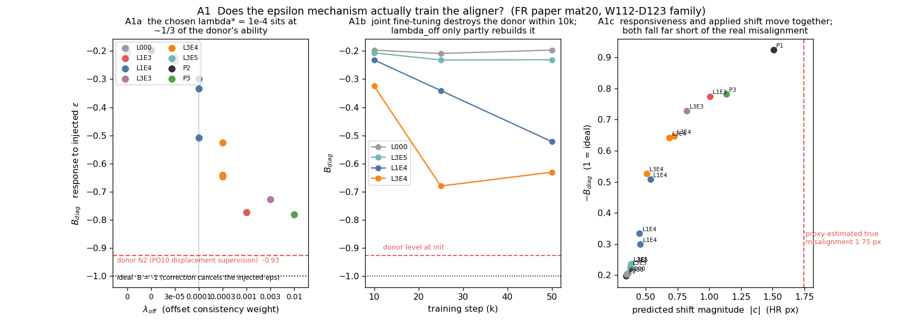
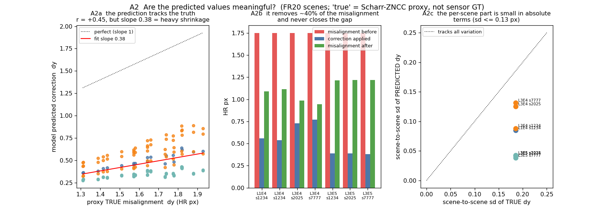
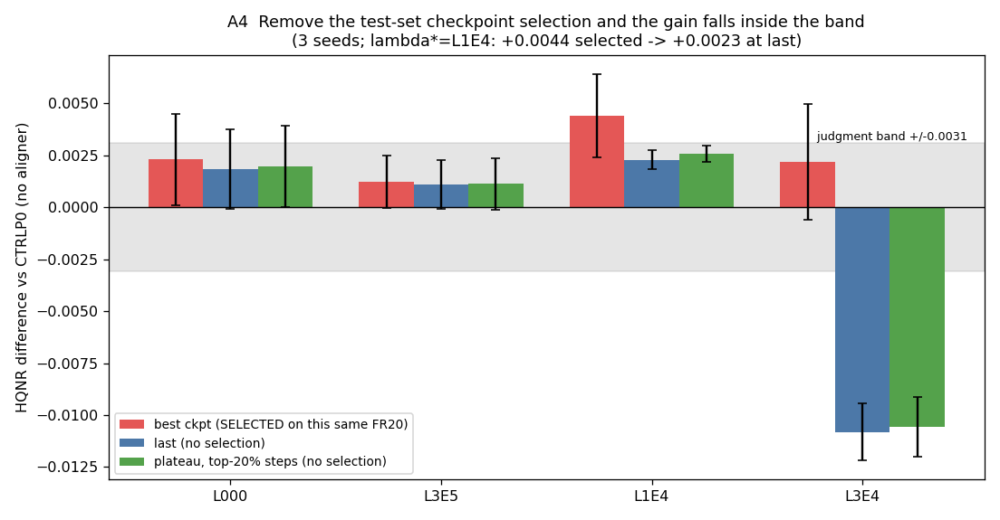
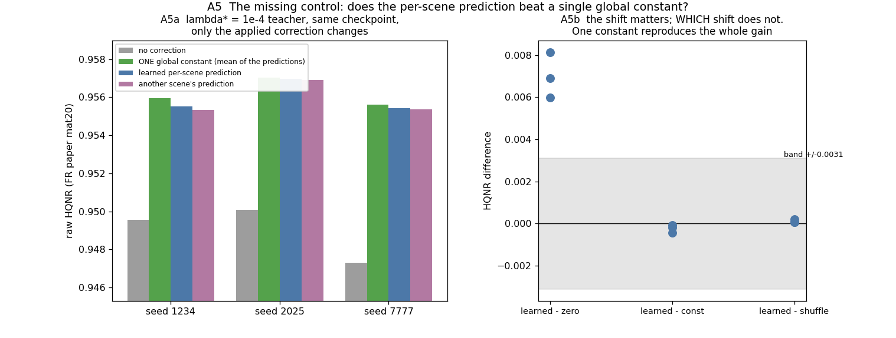
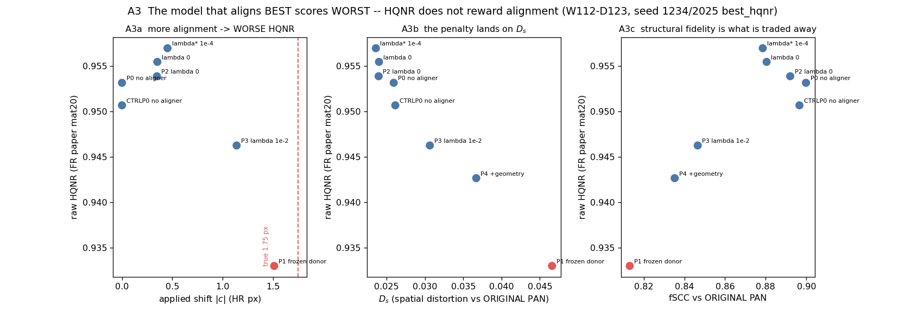

# PAN Aligner 검증 — 이 method 는 유의미하고 정직하고 제안할만한가 (2026-09-17)

기 실험 산출물 기반 감사. 대상은 **가장 최근 Teacher T0 = `PALS24_L1E4_W112_D123_WV3_S2025_N2LAST_R200_v1` / `best_hqnr`**
(step 24240, raw HQNR 0.95698, `assets/pakd50/T0_run`) 과 그 λ_off 사다리·대조군 전체.
근거는 PALS24 · PALSV18(V1–V4) · NF16(P0–P4) · PO10(N2 donor) · EQREC4 의 산출물이고,
**새로 돌린 것은 §6 의 빠진 대조군 하나뿐**이다(`tools/aligner_constant_control.py`, FR20 재평가 3벌).
그림 생성기 `tools/aligner_audit_figures.py`.

판정 지표는 **raw HQNR**(FR 논문 세트 `.mat` 20장, raw_original 전체 프레임), 보조 SCC.
판정선은 실측 2σ = **0.0031**. fSCC·ERGAS·D_λ·D_s·B·|c| 는 **진단량**이다.

기호: **ε** = 학습·검사 때 PAN 에 주입하는 알려진 변위 · **ĉ** = aligner 가 내놓는 보정 벡터 ·
**B_diag** = ĉ(ε) 의 ε 에 대한 응답 기울기(**이상 −1** = 주입한 변위를 정확히 상쇄) ·
**|c|** = native 입력에서 예측한 보정 크기(HR px) · **proxy 실제 오정합** = Scharr-ZNCC 추정기
(`align/estimator.py`) 로 잰 PAN↔MS 잔여 변위 — **센서 GT 가 아니다**.
case 약명: CTRLP0/P0 = aligner 없음 · P1 = donor 동결 · L000/P2 = aligner 있고 λ_off 0 ·
L3E5/L1E4/L3E4/L1E3/L3E3 = λ_off 3e-5/1e-4/3e-4/1e-3/3e-3 · P3 = λ_off 1e-2 · P4 = P3+GT 기하.

---

## 1. 한 줄 결론

**aligner 는 실제로 무언가를 학습한다. 그러나 HQNR 이 그것을 보상하지 않으며, 현재 형태로는 제안할 수 없다.**

세 가지가 동시에 참이다.

1. **학습은 된다** — ε 응답 B 는 λ_off 에 따라 −0.20 → −0.86 으로 단조 제어되고, native 예측은
   proxy 실제 오정합과 scene 단위로 **r = +0.83** 상관한다(방향 cos 0.992, 20/20 scene 개선).
2. **그런데 정합을 잘할수록 HQNR 이 나빠진다** — 가장 잘 정합하는 모델(P1, donor 동결, B −0.91,
   실제 1.75 px 중 1.51 px 보정)의 HQNR 이 **0.93298 로 전 case 중 최악**이고 D_s 는 두 배다.
   HQNR 최적점은 실제 오정합의 **26 %** 만 보정하는 지점이다.
3. **얻은 이득은 scene 적응 때문이 아니다** — 같은 checkpoint 에서 scene 별 예측을 **전역 상수 하나**
   (그 예측들의 평균)로 바꿔도 HQNR 이 그대로다(차이 −0.0004 ~ −0.0001, 3 seed 전부 **음수**).

→ 지금 상태의 서사("PAN 을 MS 프레임으로 정합하면 복원이 좋아진다")는 **데이터가 지지하지 않는다.**
성립하는 것은 훨씬 좁은 진술이다 — "PAN 을 0.45 px 쯤 옮기면 이 지표가 오른다".

---

## 2. 무엇을 어떻게 물었나

| 질문 | 검사 | 근거 |
|---|---|---|
| Q1 ε 로 학습이 제대로 되는가 | 주입 변위에 대한 응답 B_diag, λ 사다리·학습 궤적 | §3 |
| Q2 예측값이 유의미한가 | scene 별 예측 대 proxy 실제 오정합 (상관·크기·분산) | §4 |
| Q3 실제로 개선하는가 | 정합 없음 대비 3-seed 차이, **선택 있는 best 대 선택 없는 last/plateau** | §5 |
| Q4 정직한가 | 정합 능력과 HQNR 의 관계, 다른 지표가 함께 움직이는가 | §7 |
| Q5 제안할만한가 | **빠져 있던 대조군** — scene 별 예측 대 전역 상수 하나 | §6 |

---

## 3. Q1 — ε 기전은 작동한다. 다만 **가르치는** 것이 아니라 **덜 잃게** 하는 것이다

| 모델 | B_diag (이상 −1) | \|c\| px | offset EPE | 해석 |
|---|---:|---:|---:|---|
| **donor N2** (PO10, 무작위 변위 명시 감독) `last` | **−0.93** | 1.511 | 0.093 | 거의 이상적 |
| P1 donor 동결 | −0.92 | 1.511 | 0.107 | 동결하면 보존됨 |
| P2 / L000 (λ_off 0, 공동 미세조정) | **−0.20** | 0.347 | 0.749 | **10K step 안에 붕괴** |
| L3E5 (3e-5) | −0.23 | 0.387 | 0.713 | 거의 회복 못 함 |
| **L1E4 (1e-4 = λ\*)** | **−0.34** (T0) / −0.30 ~ −0.51 | 0.452 | 0.626 | 이상의 **1/3** |
| L3E4 (3e-4) | −0.64 | 0.688 | 0.366 | |
| P3 (1e-2) | −0.78 | 1.138 | 0.211 | donor 에 근접 |

학습 궤적(A1b)이 결정적이다. aligner 는 donor(−0.93)에서 **초기화**되는데, 공동 미세조정 10K step
만에 −0.24 로 무너진다. 그 뒤 λ_off 가 다시 쌓아 올린다 — L1E4 는 50K 에서 −0.53 까지,
L000 은 −0.20 에서 평평하다.

**따라서 offset consistency loss 는 정합을 가르치는 장치가 아니라, donor 가 이미 가진 성질이
복원 손실에 밀려 사라지는 것을 늦추는 정규화 장치다.** 그리고 HQNR 로 고른 λ\* = 1e-4 는
그 성질을 **donor 의 1/3 수준까지만** 남긴 지점이다. 이 사실 자체가 §7 의 복선이다 —
더 잘 정합하는 설정이 있는데 지표가 그것을 고르지 않았다.

---

## 4. Q2 — 예측값은 유의미하다. 단 **심하게 수축**돼 있다

FR20 각 scene 에서 모델 예측 ĉ 와 proxy 실제 오정합을 직접 비교했다(12 checkpoint).

| | 값 |
|---|---:|
| proxy 실제 오정합 (FR20 중앙값) | **1.749 px** |
| 모델 보정량 평균 | 0.660 px = 실제의 **38 %** |
| 보정 후 잔여 | 0.990 px (43 % 감소) |
| 방향 일치 cos(예측, 실제) | **0.992** |
| scene 변동 추종 r | dy **+0.83** · dx +0.68 · \|c\| +0.81 |
| 예측 sd / 실제 sd | dy 0.56 · dx 0.48 |
| 개선된 scene | **20 / 20** (전 checkpoint) |
| T0 의 예측 IQR (dy, dx) | 0.072 / 0.033 px |

**이건 진짜다.** 방향은 거의 완벽하고, scene 간 변동도 r = 0.83 으로 따라간다. 무반응 상수가 아니다
(2026-09-10 PA_A1 의 "입력 무반응 0.2 px" 병리는 해소됐다).

동시에 **회귀-평균형 수축**이 뚜렷하다 — 기울기 0.5 안팎, 크기는 실제의 38 %.
ε 응답 B ≈ −0.34 (이상의 34 %) 와 native 크기 38 % 가 같은 방향을 가리킨다: 이 aligner 는
**일관되게 약 3 배 적게 예측한다.**

그리고 실용적으로 중요한 규모 문제: T0 의 scene 간 예측 sd 는 **0.054 px** 인데 공통 성분은
**0.463 px** 다. 즉 예측의 90 % 는 모든 scene 에 공통인 전역 오프셋이고, scene 적응분은 그 위의
얇은 층이다. 이것이 §6 의 결과를 예고한다.

---

## 5. Q3 — 개선 방향은 일관되지만, **test 세트 선택을 빼면 판정선 안**이다

CTRLP0(정합 모듈 없음) 대비 3-seed 차이:

| case | best ckpt (**같은 FR20 으로 선택**) | last (선택 없음) | plateau (선택 없음) | 시드 부호 |
|---|---:|---:|---:|---|
| L000 (λ 0) | +0.00230 | +0.00184 | +0.00197 | +++ / +++ / +++ |
| L3E5 | +0.00121 | +0.00110 | +0.00112 | +++ / −++ / −++ |
| **L1E4 (λ\*)** | **+0.00441** (밴드 넘음) | **+0.00228** (밴드 안) | **+0.00257** (밴드 안) | +++ / +++ / +++ |
| L3E4 | +0.00219 | **−0.01081** | −0.01058 | +−+ / −−− / −−− |

세 가지를 읽어야 한다.

1. **헤드라인 +0.0044 의 약 40 % 가 체크포인트 선택 인플레이션이다.** 선택을 빼면 +0.0023 으로
   판정선(0.0031) **안**으로 들어간다. 부호는 3/3 일치하므로 저장소 규칙상 *방향*은 주장할 수 있지만,
   **"판정선을 넘는 개선"은 선택을 포함했을 때만 참이다.**
2. **구성요소가 각각은 밴드를 못 넘는다.** aligner 추가(L000 vs CTRLP0) +0.0023, λ_off 추가
   (L1E4 vs L000) +0.0021 — 둘 다 밴드 안. 합쳐야 넘는다. offset consistency loss 에 이득을
   귀속시키는 근거로는 약하다.
3. **λ 가 조금만 커지면 부호가 뒤집힌다.** L3E4 는 best 에서 +0.0022 인데 last 에서 −0.0108 이다.
   이득이 학습 중 **일시적**이고, 그 순간을 test 세트로 집어내고 있다는 뜻이다.

> FR20 은 (a) 체크포인트 선택, (b) λ\* 선택, (c) 최종 보고에 **모두** 쓰였다. hold-out 이 없다.

---

## 6. Q5 — 빠져 있던 대조군: **전역 상수 하나가 scene 별 예측과 동등하다**

PALSV18 의 `constant_calibration` 대조군은 train patch 의 median(|c| = **0.137 px**)을 썼다.
FR scene 예측(0.46–0.56 px)의 1/4 이라 사실상 zero 와 같았고 — 실제로 그 값이 zero 와 붙어 있다 —
그래서 **"scene 별 예측이 단일 전역 상수보다 나은가" 는 검증된 적이 없었다.**

같은 checkpoint·같은 평가 경로에서 적용하는 보정만 바꿔 다시 쟀다(`tools/aligner_constant_control.py`).

| L1E4 best_hqnr | \|c\| | learned − zero | **learned − const_mean** | learned − shuffle |
|---|---:|---:|---:|---:|
| seed 2025 (**= T0 Teacher**) | 0.463 | +0.00691 | **−0.00006** | +0.00008 |
| seed 1234 | 0.557 | +0.00597 | **−0.00043** | +0.00020 |
| seed 7777 | 0.465 | +0.00812 | **−0.00017** | +0.00006 |

`const_mean` = 그 모델이 20 scene 에 내놓은 예측의 **평균 벡터 하나를 전 scene 에 동일 적용**.

**보정을 넣는 것은 크게 중요하다(+0.006 ~ +0.008). 어느 보정인지는 전혀 중요하지 않다.**
전역 상수가 오히려 근소하게 낫고, 세 seed 모두 부호가 음수이며, 차이는 판정선의 1/7 이하다.

이유는 §4 에서 이미 나왔다 — 예측의 scene 간 sd 가 0.054 px 인데 공통 성분이 0.463 px 다.
CNN 이 계산한 scene 적응분은 HQNR 의 분해능 아래에 있다.

> **범위를 정확히 해 둔다.** 이 검사는 *adaptive aligner 로 학습된* 모델에서 **추론 시점의**
> 보정만 바꾼 것이다. "상수로 **학습**해도 같았을 것" 을 보인 것이 **아니다** — 학습 중 aligner 가
> 주는 변동이 U-Net 을 다르게 형성했을 수 있다. 그건 별도 실험이 필요하다(§10).
> 다만 **추론기로서의 scene 적응성은 이득이 증명되지 않았다.**

---

## 7. Q4 — 정직성: **정합을 잘할수록 HQNR 이 나쁘다**

같은 골격(W112·D123)에서 정합 강도만 다른 모델들:

| 모델 | 정합 능력 B | \|c\| px (실제 1.75) | **raw HQNR** | D_λ | D_s | fSCC |
|---|---:|---:|---:|---:|---:|---:|
| **P1 donor 동결 — 가장 잘 정합** | **−0.92** | **1.511 (86 %)** | **0.93298** | 0.02157 | **0.04659** | **0.8132** |
| P3 (λ 1e-2) | −0.78 | 1.138 (65 %) | 0.94625 | 0.02385 | 0.03064 | 0.8466 |
| P4 (P3 + GT 기하) | — | — | 0.94265 | 0.02144 | 0.03669 | 0.8353 |
| P0 / CTRLP0 정합 없음 | — | 0 | 0.95316 / 0.95068 | 0.02150 | 0.02592 | 0.8998 |
| L000 (λ 0) | −0.20 | 0.347 (20 %) | 0.95389 | 0.02271 | 0.02395 | 0.8921 |
| **L1E4 = λ\* (선택된 것)** | −0.34 | **0.452 (26 %)** | **0.95698** | 0.01990 | 0.02359 | 0.8786 |

**관계가 역전돼 있다.** 실제 오정합의 86 % 를 제대로 걷어내는 모델이 최악(−0.024 HQNR,
D_s 두 배)이고, 26 % 만 건드리는 모델이 최고다. 정합이 목적이라면 이 순서가 나올 수 없다.

기전은 2026-09-12 에 확인된 HQNR 의 **프레임 비대칭**이다 — D_λ 는 LRMS(MS 프레임)를,
D_s 는 **원본 PAN**(PAN 프레임)을 참조하는데 둘은 1.79 px 떨어져 있다. PAN 을 MS 쪽으로 옮기면
D_λ 는 좋아지고 D_s 는 원본 PAN 에서 멀어진 만큼 나빠진다. λ\* 는 그 **교환의 최적점**이지
정합의 최적점이 아니다. A3b 가 그대로 보여준다 — HQNR 은 D_s 와 거의 완전한 역관계다.

**함께 움직이지 않는 지표들.** L1E4 3-seed, CTRLP0 대비:

| 지표 | 차이 | 판단 |
|---|---:|---|
| **raw HQNR** (판정) | **+0.00442** | 밴드 넘음 (단 §5) |
| fSCC (원 PAN 참조) | **−0.0171** | 일관되게 악화. aligner 강도와 단조 (0.900 → 0.879 → 0.847 → 0.813) |
| RR SCC (보조 판정) | −0.00027 | SCC 포화 범위(±0.0015) 안 — 지지도 반박도 아님 |
| RR ERGAS (참고) | +0.0235 (+1.15 %) | **선택 epoch 교란** — L1E4 는 18180~40400, CTRLP0 는 33330~42420 에서 뽑혔다. aligner 탓으로 돌릴 수 없다 |

**오르는 것은 선택에 쓴 지표 하나뿐이다.** fSCC 는 확실히 내려간다. 출력의 구조가 원본 PAN 에서
멀어진다는 뜻이고, HQNR 만 보고하면 이게 가려진다.

공정을 위해 남길 것: 같은 checkpoint 안에서 보정을 끄면 **D_λ 와 D_s 가 둘 다** 나빠진다
(L1E4 s1234: ΔD_λ −0.0044, ΔD_s −0.0018). 즉 훈련된 모델은 warp 된 PAN 을 전제로 동작하며,
그 안에서는 보정이 두 성분 모두에 도움이 된다. 역전은 **모델 간** 비교에서만 나타난다.
또 `wrong_sign` 은 zero 보다도 나쁘고(0.9416 vs 0.9465) D_λ 만 크게 악화시킨다 —
**방향에는 실체가 있다.** blur 대조는 적용 불가로 나왔다(warp 이 Scharr 에너지를 줄이지 않음,
energy ratio 1.02) — 즉 **이득이 단순 블러 때문은 아니다.**

---

## 8. 판정 요약

| 질문 | 판정 | 근거 |
|---|---|---|
| ε 로 학습이 되는가 | **된다, 부분적으로** | B 가 λ 로 단조 제어(−0.20→−0.86). 단 donor(−0.93) 를 10K 에 잃고 λ\* 에서 1/3 만 회복 |
| 예측값이 유의미한가 | **유의미하다, 수축된 채로** | r(예측, proxy 실제) = +0.83, cos 0.992, 20/20 개선. 크기는 실제의 38 % |
| 개선이 유의미한가 | **불충분** | 방향 3/3 일치이나 선택 제거 시 +0.0023 = 판정선 안. 구성요소 각각도 밴드 안 |
| 정직한가 | **현재 서사로는 아니다** | 가장 잘 정합하는 모델이 최악(0.93298). HQNR 최적은 26 % 보정 지점. fSCC 는 일관 악화. FR20 3중 사용 |
| 제안할만한가 | **아니다 — 현재 형태로는** | scene 적응성이 전역 상수 하나 대비 이득 없음(3/3, 전부 음수) |

---

## 9. 무엇은 살아남고 무엇은 못 쓰는가

**살아남는 것**
- offset consistency loss 는 **작동하는 기전**이다. B 를 λ 로 예측 가능하게 제어한다. 이건 실재한다.
- aligner 는 **진짜 신호를 학습한다** — proxy 실제 오정합과 r = 0.83, 방향 cos 0.99.
- PO10 의 **명시적 변위 감독(donor N2)** 이 정합 능력의 진짜 출처다. B −0.93, 실제의 86 % 보정.
  정합 자체를 원한다면 **이쪽이 성공 사례**다.
- T0 Teacher 로서의 L1E4 선택은 **이 감사와 무관하게 유지**된다. PAKD50 은 T0 의 절대 성능이 아니라
  Student 에게 물려줄 초기값으로 쓴다.

**못 쓰는 것**
- "PAN 을 MS 프레임으로 정합하면 복원이 좋아진다" 는 인과 서사. §7 의 역전이 정면으로 반박한다.
- "scene 적응 aligner" 라는 기여 주장. §6 이 이득을 보여주지 못한다.
- HQNR 단독 보고. fSCC 를 함께 내지 않으면 교환을 숨기는 것이 된다.
- 선택 포함 수치(+0.0044)를 hold-out 성능처럼 쓰는 것.

---

## 10. 제안 가능한 method 가 되려면 — 필요한 것

우선순위 순. 1–2 는 이번 결론을 뒤집을 수 있는 것들이다.

1. **상수로 *학습*하는 대조군.** §6 은 추론만 바꿨다. `|c|` 를 학습 가능한 **2-파라미터 전역 상수**로
   두고 처음부터 학습한 모델이 aligner CNN 과 동등하다면, CNN 기여는 0 이다. 이게 결정적이다.
2. **hold-out FR 세트.** λ\* 선택과 체크포인트 선택을 FR20 밖에서 하거나, 최소한 20장을 반으로 갈라
   선택/보고를 분리한다. §5 의 +0.0023 이 진짜인지 이것 없이는 모른다.
3. **프레임 비대칭을 피하는 판정.** D_λ 와 D_s 가 1.79 px 다른 프레임을 참조하는 한, "PAN 을 옮기는"
   어떤 방법도 지표를 부분적으로 거래한다. 두 성분을 같은 프레임에서 재는 평가나,
   정합 자체를 재는 독립 지표가 필요하다.
4. **독립 2차 추정기.** 현재 proxy 는 `n_both_accepted = 0` 이다 — census 는 같은 추정기의 gate 이지
   독립 검증이 아니다. 위상 상관(phase correlation) 같은 다른 계열 추정기로 1.75 px 와 r = 0.83 을
   재확인해야 §4 를 근거로 쓸 수 있다.
5. **수축 보정.** 예측이 일관되게 3 배 작다. 출력에 고정 배율을 곱하거나 손실을 다시 잡으면
   정합은 좋아진다 — 다만 §7 대로 HQNR 은 **나빠질** 것이다. 그 실험 자체가 §7 을 직접 검정한다.

---

## 11. 한계

- **proxy 실제 오정합은 센서 GT 가 아니다.** 1.749 px 도, r = 0.83 도 한 추정기의 산물이고
  독립 검증기가 없다(§10.4). §4 전체가 이 가정 위에 있다.
- §6 은 **추론 시점 치환**이다. 학습까지 상수로 바꾼 경우는 검사하지 않았다.
- §7 의 모델 간 비교는 P1/P3/P4 가 **seed 1234 한 벌씩**이다. L1E4/CTRLP0 만 3 seed 다.
  역전의 방향은 크지만(−0.024) 시드 반복이 없다.
- FR20 은 전 캠페인에서 반복 사용된 벤치마크다. 절대 수치의 일반화는 주장하지 않는다.
- 3-seed 는 downstream 초기화 반복이지 독립 test seed 가 아니다(PALSV18 §표 D 와 동일 한계).
- `L3E4 last` 의 −0.0108 같은 값은 |Δ| 가 유용 창(0.45–0.7 px)을 벗어난 결과로, 2026-09-14 의
  기전 설명과 일관된다 — 새 현상이 아니다.

---

## 12. 다음

- **당장 바꿀 것 없음.** PAKD50 은 계속 돈다. T0 유지, λ\* = 1e-4 유지(§9).
- **보고·문서에서 바꿀 것**: aligner 이득을 인용할 때 (a) 선택 포함/제외 두 값을 같이 적고,
  (b) fSCC 를 함께 적는다. 이번 감사 이전 문서를 소급 수정하지는 않는다(규약 §5).
- **제안 여부 판단은 §10.1–10.2 결과를 보고 한다.** 둘 다 비용이 작다 — 상수 학습 대조군 1벌,
  FR20 분할 재선택은 재학습 없이 기존 후보 격자로 가능하다.
