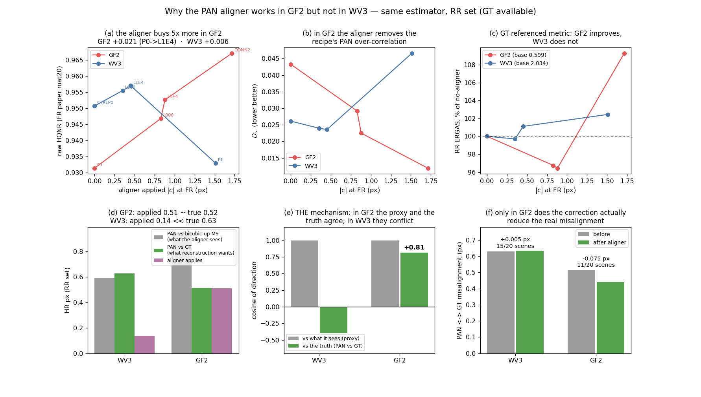

# GF2 는 왜 다른가 — aligner 관점의 고찰 (2026-09-21)

전날 감사 `results_log/2026-09-20_gf2-hqnr-gap-audit.md` 가 **지표·데이터 경로에 문제가 없고 격차는 recipe 효과**임을
확정했다(anchor 5 종 일치, 가설 10 개 기각). 이 문서는 거기서 열어 둔 질문 하나를 잇는다 — **aligner 가 GF2 에서
어떻게 다르게 작동하며, 무엇이 그 작동을 제약하는가.**

근거는 GF2 B 계열 실험(09-15~16, 결과 있는 최신분)과 이 문서에서 새로 잰 정합 실측이다.
비교 대상 WV3 는 T0(`PALS24_L1E4_…S2025` best_hqnr). 그림 생성기 `tools/gf2_aligner_figure.py`.

> **G20(09-21)은 아직 수치가 없다.** `work_dir/G20_GF2_*` 5 run 은 생성만 됐고 `checkpoint_metrics.csv`·
> `results/fr_mat20.json` 이 전부 비어 있다(eval 0 회). 계획은
> `research_log/PANDA_GF2_G20_ALL5_FixedArchitecture_ExperimentPlan_2026-09-20.md`, 09-21 노트 세 건은
> GPU parity·환경 기동 건이다. **따라서 이 분석은 B 계열이 최신 근거다** — G20 결과가 나오면 재검토 대상이다.

---

## 1. 한 줄 결론

**GF2 에서 aligner 가 잘 듣는 것은 GF2 가 더 잘 정합돼서가 아니라, GF2 에서만 aligner 가 보는 기준과
실제 오정합의 방향이 우연히 일치하기 때문이다.**

같은 추정기로 RR 세트(GT 가 있는 유일한 세트)에서 재면:

| | WV3 | GF2 |
|---|---:|---:|
| aligner 가 보는 것 (PAN vs bicubic↑MS) | 0.590 px | **0.946 px** |
| 복원이 원하는 것 (PAN vs GT) | 0.628 px | 0.515 px |
| aligner 가 적용하는 보정 | 0.138 px | **0.510 px** |
| **cos(보정, 실제 오정합)** | **−0.398** | **+0.812** |
| 보정 뒤 PAN↔GT | 0.628 → 0.633 (**악화**) | 0.515 → **0.440** (−15 %) |

WV3 에서는 보정이 **실제 오정합과 반대쪽**을 가리켜 아무것도 못 고치는데, GF2 에서는 **같은 쪽**을 가리켜
실제로 줄인다. 그래서 GF2 에서 HQNR 이득이 WV3 의 5 배(+0.021 vs +0.006)이고, **GT 를 참조하는 RR ERGAS 마저
좋아진다**(WV3 에서는 안 좋아진다).

---

## 2. GF2 는 무엇이 다른가

| | WV3 | QB | GF2 |
|---|---|---|---|
| 밴드 · 비트 | 8 · 11-bit (2047) | 4 · 11-bit | **4 · 10-bit (1023)** |
| D_λ MTF (genMTF.m) | 센서표 | 센서표 | **`otherwise` 0.3** (MATLAB 에 GF2 항목 없음) |
| 원본 FR 오정합 (NCC, 09-20 감사) | (+1.54, −0.53) | (+2.36, −1.19) | (+1.44, −0.20) |
| **Wald 학습·RR 잔여 오프셋** | **≈ 0.06 px** | ≈ 0.10 px | **≈ 0.43 px** |
| MS 유효 GNyq (native FR) | 0.18–0.27 | — | **0.04–0.11** (가정 0.3) |
| 논문 FR HQNR / D_s | 0.958 / 0.027 | 0.920 / 0.039 | **0.964 / 0.017** |
| 현 mainline P0 HQNR / D_s | 0.9507 / 0.0261 | 0.9149 / 0.0257 | **0.9314 / 0.0433** |

GF2 고유는 셋이다 — **10-bit**, **MTF 기본값 분기**, 그리고 **Wald 학습쌍이 0.43 px 어긋나 있다**는 것.
앞의 둘은 09-20 감사가 전수 검증해 기각했다(클립 L·GNyq sweep 모두 차이 0.000~0.002). **세 번째가 aligner 이야기의 핵심이다.**

MS 흐림도 GF2 가 가장 심하다 — 유효 GNyq 가 native 에서 0.04–0.11 로 가정값 0.3 과 크게 어긋나, RR 학습 ↔ FR 시험의
MS 흐림 불일치가 세 센서 중 가장 크다. 이건 "GF2 가 recipe 변화에 더 민감한" 이유이지 격차의 원인은 아니다(09-20 §3).

---

## 3. 성능이 안 나오는 이유 — 전날 감사의 결론 (요약)

격차 0.026(P0 0.9314 vs 옛 dual 0.9576)의 **74 % 가 D_s, 26 % 가 D_λ** 다. 기전은 **PAN 과잉 상관**:

| run | q_high − q_low (B,G,R,NIR) | q_high > q_low 비율 | D_s |
|---|---|---:|---:|
| **B01_GF2_P0** (단일 HRMS) | +0.026, +0.044, +0.047, +0.056 | **1.00** | 0.0433 |
| ARCH_W168_DUAL_GF2_S2025 | +0.006, +0.021, +0.011, +0.051 | 0.91 | 0.0234 |
| B01_QB_P0 | +0.017, +0.009, −0.006, −0.052 | 0.42 | 0.0257 |

**GF2 P0 만 네 밴드·20 장면 전부에서 fused 가 PAN 을 더 따른다.** dual → 단일 하락은 세 센서 공통이고
(WV3 −0.011 · QB −0.021 · GF2 −0.026) GF2 에서 가장 크며 D_s 로 나타난다. 다만 dual 대조군은 task·입력 채널·폭·
mode modulation 이 한꺼번에 달라 **어느 요소가 얼마인지는 분리되지 않았다**(09-20 §7; W112 dual 이나 W168 단일 run 이 GF2 에 없다).

---

## 4. aligner — GF2 에서 무엇이 다른가 (이 문서의 새 분석)

### 4.1 사다리: GF2 에서 aligner 는 recipe 의 약점을 직접 메운다

| GF2 run | \|c\| FR | raw HQNR | D_λ | **D_s** | fSCC | RR ERGAS |
|---|---:|---:|---:|---:|---:|---:|
| `B01_GF2_P0` (aligner 없음) | 0 | 0.9314 | 0.0264 | **0.0433** | 0.8770 | 0.5994 |
| `B03_GF2_L000` (λ_off 0) | 0.828 | 0.9468 | 0.0247 | 0.0292 | 0.8556 | 0.5799 |
| **`B03_GF2_L1E4`** (λ\* 1e-4) | 0.880 | **0.9526** | 0.0254 | **0.0225** | 0.8423 | **0.5780** |
| `B04_GF2_L1E4` (seed 1234) | — | 0.9500 | 0.0246 | 0.0261 | 0.8521 | 0.5728 |
| `B02_GF2_DONN2` (WV3 donor R200) | 1.714 | 0.9670 | 0.0214 | 0.0119 | 0.8280 | **0.6550** |

aligner 를 넣으면 **D_s 가 0.0433 → 0.0225 로 절반**이 된다 — §3 의 PAN 과잉 상관을 직접 상쇄한다.
WV3 에서는 같은 조치가 D_s 를 0.0261 → 0.0236 으로 10 % 만 움직인다.

**단 `B02_GF2_DONN2` 의 0.9670 은 이득이 아니다**(09-20 §4.5): FR 에서 PAN 을 1.73 px 옮겨 raw D_s 를 낮춘 것 +
test-set 선택(last 는 0.9479)이고, **GT 가 있는 RR 에서는 ERGAS 가 0.6550 으로 P0(0.5994)보다 나쁘다.**
즉 GF2 에서도 과하게 옮기면 WV3 과 같은 함정에 빠진다 — 좋아지는 구간이 L1E4 까지일 뿐이다.

### 4.2 기전 — 보는 기준과 진짜가 GF2 에서만 같은 방향이다

aligner 의 MS 기준은 `ms_base = F.interpolate(ms, ×4, bicubic)` 다(`pa/model.py`). 이 기준은 진짜 MS 기하에서
떨어져 있고(업샘플 위상), 그 편이가 실제 PAN↔MS 오정합과 **더해지느냐 상쇄되느냐가 센서마다 다르다.**
같은 추정기로 RR 에서 분해했다:

| | WV3 | GF2 |
|---|---:|---:|
| (1) PAN vs bicubic↑MS — **aligner 가 보는 것** | 0.590 | 0.946 |
| (2) PAN vs GT — **복원이 원하는 것** | 0.628 | 0.515 |
| (3) GT vs bicubic↑MS — **업샘플 위상만** | 0.677 | 0.702 |

WV3 은 (3) 이 (2) 보다 커서 (1) 이 위상 인공물에 지배되고 **방향이 뒤집힌다**. GF2 는 (2) 와 (3) 이 대체로 같은 쪽을
향해 (1) 이 둘의 합(0.946 > 둘 다)이 되고, **방향은 진짜 쪽을 유지한다.** 실측 코사인이 그대로다:

| | cos(보정, 보는 기준) | **cos(보정, 실제 PAN↔GT)** |
|---|---:|---:|
| WV3 | +1.000 | **−0.398** |
| GF2 | +0.996 | **+0.812** |

두 센서 모두 aligner 는 **자기가 보는 기준에는 충실하다**(cos ≈ +1.0; PAN↔bicubic↑MS 를 20/20 scene 에서 줄인다 —
WV3 0.590→0.413, GF2 0.946→0.460). 갈리는 것은 그 기준이 진짜를 대리하느냐다.

### 4.3 그래서 실제 오정합이 GF2 에서만 줄어든다

| | 보정 전 PAN↔GT | 보정 후 | 개선 scene |
|---|---:|---:|---|
| WV3 | 0.628 | 0.633 (**+0.005, 사실상 0**) | 15/20 |
| GF2 | 0.515 | **0.440 (−0.075, −15 %)** | 11/20 |

그리고 **크기도 GF2 에서만 맞는다** — GF2 는 0.510 적용 / 실제 0.515 필요(**99 %**), WV3 는 0.138 / 0.628(**22 %**).
2026-09-17 감사에서 "일관되게 약 3 배 적게 예측한다(수축)" 고 한 성질이 **GF2 에서는 나타나지 않는다.**

### 4.4 수축이 GF2 에서 사라지는 이유 — 학습 데이터가 다르다

aligner 는 **Wald RR patch 로 학습**한다. 그 학습쌍의 잔여 오프셋이 센서마다 다르다(09-20 감사 §3):

| | Wald 학습쌍 잔여 오프셋 |
|---|---:|
| WV3 | **≈ 0.06 px** |
| QB | ≈ 0.10 px |
| GF2 | **≈ 0.43 px** |

WV3 에서는 학습 patch 가 이미 정렬돼 있어 **복원 손실이 "움직이지 마라" 를 가르친다** — 2026-09-17 에서 본
"복원 손실이 \|c\| 를 0 쪽으로 당기고 λ_off 가 반대로 당기는 평형" 이 그것이다. GF2 에서는 학습 patch 자체가
0.43 px 어긋나 있어 **복원 손실이 움직이라고 가르친다.** 그래서 GF2 aligner 는 수축되지 않고, RR 에서 0.510 —
학습쌍 오프셋 0.43 과 같은 자릿수 — 를 내놓는다.

**이것이 "aligner 작동의 제약" 에 대한 답이다.** aligner 가 유용한지는 아래 두 조건에 걸려 있고, 둘 다 **센서가 정하는 것이지
설계로 통제되지 않는다**:

1. **학습쌍(Wald RR)에 되돌릴 오프셋이 남아 있는가** — 없으면 복원 손실이 aligner 를 0 으로 눌러 수축된다
2. **업샘플 위상 인공물이 실제 오정합과 같은 방향인가** — 반대면 aligner 가 인공물을 쫓는다

GF2 는 둘 다 만족하고 WV3 는 둘 다 불만족한다. **우연이다.**

---

## 5. 종합 — GF2 의 낮은 성능과 aligner 의 관계

- **성능 격차의 원인은 aligner 가 아니다.** 단일-HRMS 4-band recipe 의 PAN 과잉 상관이고(09-20), aligner 없는 P0 에서
  이미 D_s 0.0433 이다.
- **aligner 는 그 증상을 절반 걷어낸다**(D_s 0.0433 → 0.0225, HQNR +0.021). GF2 에서 유독 잘 듣는 이유는 §4.2–4.4 다.
- 따라서 **GF2 의 aligner 이득을 method 의 일반적 효능으로 읽으면 안 된다.** 같은 method 가 WV3 에서 +0.006 에
  그치고 실제 정합은 개선하지 못한다. GF2 수치는 **센서 조건이 맞아떨어진 경우**다.
- 거꾸로, **GF2 는 aligner 가 진짜로 작동하는 것을 볼 수 있는 유일한 자료다** — 실제 오정합이 15 % 줄고
  GT 참조 지표(RR ERGAS)가 같이 좋아진다. WV3 에서는 이 두 가지가 모두 안 나온다.

---

## 6. 다음에 확인할 것

1. **G20 결과가 나오면 §4.1 사다리를 갱신한다.** 현재 5 run 전부 eval 0 회다.
2. **§4.4 의 인과를 개입으로 가른다** — WV3 학습쌍에 인위로 0.4 px 오프셋을 넣고 학습하면 WV3 aligner 의 수축이
   사라지는가. 이게 "학습쌍 오프셋이 수축을 만든다" 의 직접 검정이다.
3. **aligner 의 MS 기준을 위상 보정본으로 바꾼다**(2026-09-17 §14.5 와 같은 처방). GF2 에서 이미 방향이 맞으니
   **WV3 에서만 효과가 있어야 한다** — 그러면 §4.2 가 확증된다.
4. QB 는 학습쌍 오프셋 0.10 px 로 중간이다. QB aligner 의 cos(보정, 진짜) 를 재면 세 점으로 추세를 볼 수 있다.

---

## 7. 한계

- **PAN↔GT·PAN↔MS 는 전부 `align/estimator.py` 한 추정기의 값이다** — 센서 GT 가 아니고 독립 2차 추정기가 없다
  (`n_both_accepted 0`). §4.2–4.3 전체가 이 가정 위에 있다. 다만 09-20 감사가 독립 방법(phase correlation ×100)으로
  센서 간 **순위**는 재확인했다.
- GF2 B 계열은 **seed 2025 단일**이 대부분이다(B04 만 1234). HQNR 판정선 2σ = 0.0031 은 WV3 실측이라 GF2 에서는 참고치다 —
  다만 여기서 다루는 차이(0.021–0.035)는 그 7–11 배다.
- §4.4 의 "학습쌍 오프셋 → 수축" 은 **상관 설명이지 개입이 아니다.** §6.2 가 그 검정이다.
- RR ERGAS 는 센서마다 스케일이 달라(GF2 ~0.58, WV3 ~2.03) 절대 비교하지 않았다 — 각 센서 안의 상대 변화만 썼다.
- `B02_GF2_DONN2` 의 0.9670 은 **인용하지 말 것** — test-set 선택 + PAN 1.73 px 이동의 산물이고 RR 은 오히려 나쁘다.
