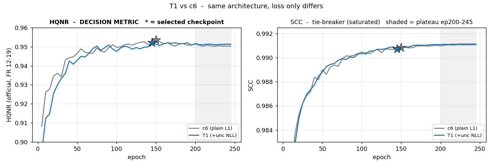
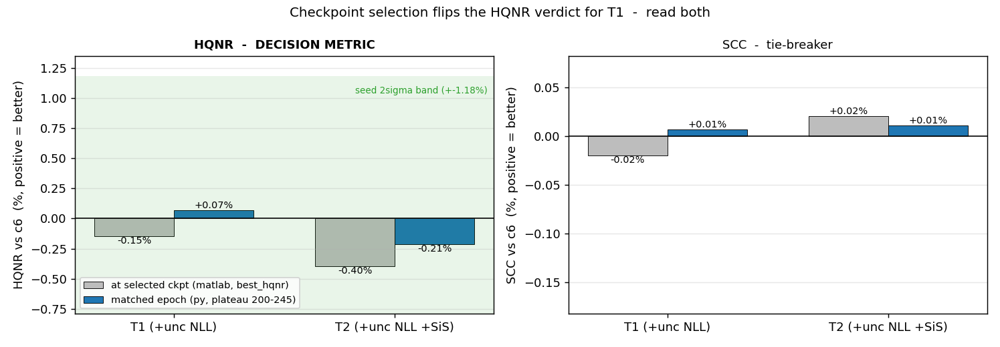
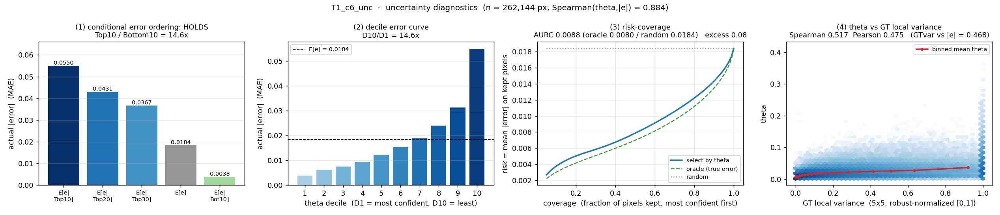

# T1 — c6 + uncertainty head (KD teacher 후보 #1)

`T1_c6_unc` · s1 · 2026-08-31 14:29→16:53 (2.43h) · 50K iter · seed 2025 · 아키텍처 `fixed`

> **판정 지표는 HQNR(공식 FR 12-19), 보조는 SCC.** ERGAS·SAM·PSNR·Q2n 은 기록만 하고
> 판정에 쓰지 않는다 (§4 참고 지표). 판정선 = HQNR 시드 2σ **1.18%**.
> 수치는 `matlab`(DLPan, `best_hqnr` 체크포인트) + 교차확인 `py`(metrics.csv 동일 epoch).

---

## 1. 어떤 실험인가

KD 캠페인의 **Teacher 를 만드는 실험**이다. Student(R4, 2.13M)에게 무엇을 배울지
알려주려면 Teacher 가 "여기는 내가 확신한다 / 여기는 나도 모른다" 를 픽셀 단위로
말할 수 있어야 한다. 그래서 최고 Teacher 후보 **c6 에 uncertainty head 하나만 얹고
loss 를 NLL 로 바꿨다.**

| | c6 (기준) | **T1 (이번)** |
|---|---|---|
| 구조 | w128 · depth [1,2,4] · attn 없음 · 11ch · nocrop | **동일 (완전히 같음)** |
| loss | L1 | **uncertainty NLL** `\|e\|/2θ + ½·log θ` |
| 비용 | 3.7719 M / 87.7 G / 6.63 ms | **3.7719 M / 87.7 G / 6.26 ms (동일)** |

**구조 고정 · loss 만 바뀐 단일 변인 실험**이다. 답해야 할 질문 두 가지:

1. NLL 로 바꾸면 **HQNR 이 깨지지 않는가** (깨지면 Teacher 로 못 쓴다)
2. θ 가 실제 오차를 **예측하는가** (예측 못 하면 K2~K4 의 U-Know 가중이 무의미)

2번이 **K2~K4 게이트의 통과 조건**이다.

---

## 2. 어떤 결과가 나왔나 — 판정 지표


*★ = HQNR 로 고른 체크포인트. c6 ep150 · **T1 ep145**. 회색 띠(ep200~245)가 두 실행
모두 수렴한 구간. 우: SCC 는 두 곡선이 겹쳐 포화돼 있다.*

### 2.1 HQNR — 판정 지표

| | c6 | **T1** | Δ | 판정선 | 판정 |
|---|---:|---:|---:|---:|---|
| 선택 ckpt (matlab) | 0.9536 | **0.9522** | −0.15% | 1.18% | 동급 |
| 동일 epoch (py, plateau ep200–245) | 0.95053 ±0.00038 | **0.95121 ±0.00017** | **+0.07%** | 1.18% | 동급 |

**두 기준의 부호가 다르고 크기는 판정선의 1/8 이다 → c6 와 구분되지 않는다.**


*연두색 띠가 시드 2σ. 네 막대 모두 그 안에 있다 — 어느 쪽도 방향을 주장할 수 없다.
선택 ckpt 만 보면 T1 이 c6 보다 나쁜 것처럼 보이지만 동일 epoch 에선 반대다.*

### 2.2 SCC — 보조 지표

| | c6 | **T1** | Δ |
|---|---:|---:|---:|
| 선택 ckpt (matlab) | 0.9908 | 0.9906 | −0.02% |
| 동일 epoch (py, plateau) | 0.99105 ±0.00003 | 0.99112 ±0.00002 | +0.01% |

**포화 구간이라 tie-break 가 되지 않는다.** HQNR 이 동급이고 SCC 도 포화이므로,
규약대로 여기서 **"구분되지 않는다"로 끝낸다** — ERGAS 로 내려가지 않는다.

### 2.3 HQNR 분해 — 무엇이 움직였나

`HQNR = (1 − D_λ)(1 − D_s)`

| | c6 | **T1** | Δ |
|---|---:|---:|---:|
| D_λ ↓ (스펙트럼 왜곡) | 0.0213 | 0.0253 | +18.8% |
| D_s ↓ (공간 왜곡) | 0.0256 | 0.0231 | −9.8% |
| **HQNR** ↑ | 0.9536 | 0.9522 | −0.15% |

**두 성분이 반대로 움직여 상쇄됐다.** NLL 이 HQNR 을 통째로 밀어올리거나 내리는 것이
아니라, 스펙트럼 왜곡을 조금 내주고 공간 왜곡을 되받는 **내부 재배치**를 했다.
순효과가 판정선 안인 이유다.

### 2.4 Uncertainty 진단 — θ 가 실제로 쓸 수 있는 신뢰도인가


*val 262,144 픽셀(32배치 × 8샘플, 2배 서브샘플). `tools/uncertainty_diag.py T1_c6_unc`*

**(a) 조건부 오차 순서 — 성립**

| | E[e\|Top10] | E[e\|Top20] | E[e\|Top30] | **E[e]** | E[e\|Bottom10] |
|---|---:|---:|---:|---:|---:|
| MAE | 0.05500 | 0.04311 | 0.03672 | **0.01841** | 0.00377 |
| E[e] 대비 | 2.99× | 2.34× | 1.99× | 1.00× | **0.20×** |

요구 관계 `E[e|Top10] > E[e|Top20] > E[e|Top30] > E[e] > E[e|Bottom10]` 가
**한 칸도 어긋나지 않고 성립**. Top10/Bottom10 = **14.6배**.

**(b) 상관** — Spearman(θ,|e|) **0.8843** · Pearson 0.8166

**(c) 10분위 error curve — 완전 단조**

| D1 | D2 | D3 | D4 | D5 | D6 | D7 | D8 | D9 | D10 |
|---:|---:|---:|---:|---:|---:|---:|---:|---:|---:|
| 0.00377 | 0.00629 | 0.00748 | 0.00945 | 0.01232 | 0.01548 | 0.01914 | 0.02394 | 0.03122 | 0.05500 |

D10/D1 = **14.6배**, 뒤집힌 칸 0개.

**(d) risk–coverage**

| coverage | 20% | 50% | 80% | 100% |
|---|---:|---:|---:|---:|
| risk (mean \|e\|) | 0.00503 | 0.00786 | 0.01223 | 0.01841 |
| E[e] 대비 | 0.27× | 0.43× | 0.67× | 1.00× |

| AURC | **θ 기준** | oracle(실제 오차) | random |
|---|---:|---:|---:|
| | **0.00884** | 0.00798 | 0.01841 |

**excess = (θ − oracle) / (random − oracle) = 0.082** (0 = oracle, 1 = 무작위)

**(e) θ vs GT 국소분산**

| | Spearman | Pearson |
|---|---:|---:|
| θ vs GT local variance | 0.5173 | 0.4749 |
| (참고) GT local variance vs \|e\| | **0.4685** | — |
| (대조) **θ vs \|e\|** | **0.8843** | 0.8166 |

θ 분포: mean 0.0189 · sd 0.0168 · p05 0.0040 · p95 0.0492

---

## 3. 어떤 분석이 나왔나

**① Teacher 품질은 보존됐다 — HQNR 로 c6 와 구분되지 않는다.**
선택 ckpt −0.15%, 동일 epoch +0.07%. **부호가 다르고 둘 다 판정선(1.18%)의 1/8 이하**라
어느 방향도 주장할 수 없다. SCC 도 포화라 tie-break 가 안 된다. 결론은
"T1 ≈ c6" 이고, 이것이 Teacher 로 쓰기 위해 필요했던 전부다.

D_λ·D_s 분해(§2.3)가 이유를 말해준다 — NLL 의 `|e|/2θ` 는 어려운 픽셀의 가중을 낮추는
robust 가중 L1 이라 스펙트럼 왜곡을 조금 늘리고(D_λ +18.8%) 공간 왜곡을 줄인다
(D_s −9.8%). 두 방향이 상쇄돼 HQNR 순효과가 판정선 안에 머문다.

**② 단일 체크포인트 HQNR 로 0.5% 미만 차이를 주장하면 틀린다.**
HQNR plateau 가 평평해서(실행 내 sd ±0.0004) argmax 가 사실상 무작위로 튄다.
실제로 c6 는 ep150, **T1 은 ep145 — 아직 수렴 전**에서 뽑혔고, 그 한 칸 차이로
판정 부호가 뒤집혔다.

> **캠페인 전체에 적용할 규칙.** HQNR 판정 문장을 쓸 때는 **plateau(ep200–245) 동일
> epoch 평균을 함께 낸다.** 두 값의 부호가 다르면 "구분되지 않는다"로 쓰고,
> 부호가 일치할 때만 방향을 주장한다.

**③ θ 는 통과가 아니라 압도적 통과다 — 그리고 "쓸 수 있는" 수준이다.**
게이트가 요구한 건 Spearman > 0 과 5분위 단조뿐인데, 실제로 나온 것은 훨씬 강하다.

- **판별력이 실재한다.** 상관이 높아도 분위 간 값이 붙어 있으면 가중을 만들어도 전부
  1 근처가 되어 아무 일도 일어나지 않는다. 여기서는 **D10/D1 = 14.6배** 라
  `w_hard = 1+u`, `w_soft = 1−u` 가 픽셀을 실제로 **구분**한다. K2 의 hard/soft 분리가
  작동할 물리적 근거가 여기서 확보됐다.
- **꼬리가 특히 강하다.** 상위 10% 픽셀이 평균의 **3배** 오차를 지고 하위 10% 는
  0.2배다. KD 에서 중요한 건 평균이 아니라 "어디를 믿고 어디를 버릴까" 이므로 이
  꼬리 분해능이 본질이다.
- **excess 0.082 는 oracle 에 거의 붙어 있다.** 실제 오차를 알고 고르는 상한 대비 8%
  손해다. θ 로 고른 선택이 사후 최적 선택과 사실상 같다는 뜻이고, K2 의 soft-KD 대상
  픽셀 선별이 "거의 정답에 가깝게" 이뤄질 수 있음을 의미한다.

**④ θ 는 GT 분산의 재탕이 아니다 — K3 가 별개 실험일 근거.**

| 오차 예측자 | Spearman(·, \|e\|) |
|---|---:|
| GT 국소분산 (구조만 보는 사전지식) | 0.469 |
| **θ (모델이 학습한 신뢰도)** | **0.884** |

θ vs GT분산 상관은 0.517 — 관련은 있지만 절반뿐이다. θ 는 GT 분산이 모르는 것을
**추가로** 알고 있고, 역으로 GT 분산 단독으로는 §2.4(d) 의 선택 품질이 나오지 않는다.
따라서 K3(= K2 + GT 분산 가중)는 K2 와 중복이 아니라 **직교 정보를 더하는 실험**이다.

산점도 우측 끝(GTvar = 1.0)의 세로 띠는 `robust_normalize_01` 의 q95 clip 이다.
정상이며, 그 구간에서도 θ 가 넓게 퍼져 있다 — **"고분산 = 고불확실" 이 아니라는**
같은 이야기다.

**⑤ 게이트 상태 — calibration 조건은 이 실험으로 닫혔다.**

| K2~K4 개방 조건 | 상태 |
|---|---|
| Teacher calibration PASS | **충족** (Spearman 0.884 · 완전 단조 · excess 0.082) |
| 대조군 K1B·K1B_T1 완료 | 대기 (큐 5·6번) |

**⑥ 다음.** T1 은 Teacher 후보 1번이지 확정이 아니다 →
[T2 보고서](2026-08-31_T2_c6-uncertainty-sis-teacher.md)

---

## 4. 참고 지표 — 판정에 쓰지 않음

기록용으로만 남긴다. 아래 수치로 결론을 세우지 않는다.

| | c6 | T1 | 선택 ckpt Δ | 동일 epoch Δ |
|---|---:|---:|---:|---:|
| ERGAS ↓ | 2.0826 | 2.0950 | +0.60% | **−0.41%** |
| SAM ↓ | 2.8178 | 2.7937 | −0.86% | −1.41% |
| PSNR ↑ | 37.8373 | 37.8231 | −0.01 dB | — |
| Q2n ↑ | 0.9204 | 0.9211 | +0.08% | — |

ERGAS 는 선택 ckpt 와 동일 epoch 에서 **부호가 반대**다 (§3-②의 같은 원인).
이런 지표로 tie-break 하지 않는 이유이기도 하다.

---

### 배제한 것

| 우려 | 확인 방법 | 결과 |
|---|---|---|
| NLL 이 HQNR 을 무너뜨린다 | 선택 ckpt·plateau 양쪽에서 c6 와 대조 | **아니다** — 둘 다 판정선의 1/8 이하 |
| HQNR 하락이 실재한다 | 동일 epoch 재비교 | **아니다** — 부호가 뒤집힌다 (−0.15% → +0.07%) |
| θ 가 상수로 붕괴한다 (trivial 해) | θ 분포·10분위 분산 | **아니다** — 0.0189±0.0168, 분위 14.6배 |
| θ 가 GT 분산의 재탕이다 | 두 예측자의 Spearman 대조 | **아니다** — 0.884 vs 0.469 |
| θ head 가 비용을 늘린다 | params·FLOPs·추론 | **아니다** — 셋 다 c6 와 동일 |

### 재현

```bash
./tools/run.sh T1_c6_unc                               # config/T1_c6_unc.yaml
python tools/check_calibration.py work_dir/T1_c6_unc   # 게이트 판정 (calibration.json)
python tools/uncertainty_diag.py T1_c6_unc             # §2.4 전체 (uncertainty_diag.json)
```
체크포인트 서명 `15247580-1788159204756931756` — 다른 체크포인트로 잰 값을 섞지 않기 위해
두 json 에 모두 기록된다. best epoch 145 (HQNR 0.95218).
