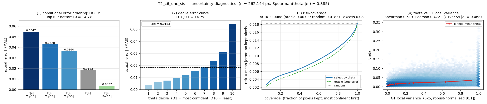

# T2 — T1 + SiS (KD teacher 후보 #2)

`T2_c6_unc_sis` · s1 · 2026-08-31 16:57→19:27 (2.49h) · 50K iter · seed 2025 · 아키텍처 `fixed`

> **판정 지표는 HQNR(공식 FR 12-19), 보조는 SCC.** ERGAS·SAM·PSNR·Q2n 은 기록만 하고
> 판정에 쓰지 않는다 (§4 참고 지표). 판정선 = HQNR 시드 2σ **1.18%**.
> 수치는 `matlab`(DLPan, `best_hqnr` 체크포인트) + 교차확인 `py`(metrics.csv 동일 epoch).

---

## 1. 어떤 실험인가

[T1](2026-08-31_T1_c6-uncertainty-teacher.md) 에 **SiS(Shift-invariant Spectral) 항
하나만 더한** 두 번째 Teacher 후보다. 구조·데이터·시드는 T1 과 완전히 같고 loss 한
항만 다르다.

| | c6 | T1 | **T2 (이번)** |
|---|---|---|---|
| uncertainty NLL | — | 있음 | 있음 |
| SiS | — | — | **`λ=0.1` · `r=1` · `shared_vector`** |
| 비용 | 3.7719 M / 87.7 G | 동일 | **동일** (SiS 는 학습 전용) |

**SiS 가 뭔가.** 예측을 MTF 로 다운샘플한 뒤 LRMS 와 비교하는데, 같은 위치끼리 비교하지
않고 **±1 픽셀 이동한 9개 후보 중 가장 잘 맞는 것을 골라** 비교한다. WV3 의 PAN–MS
미세 정합오차 때문에 "픽셀이 어긋난 것"과 "스펙트럼이 틀린 것"이 L1 안에서 섞이는데,
SiS 는 전자를 흡수해 후자만 벌하는 것이 설계 의도다.

답해야 할 것:

1. SiS 가 **HQNR 을 올리는가** (Teacher 교체는 HQNR 로 판정한다)
2. SiS 가 **uncertainty 를 망가뜨리지 않는가** (θ 는 K2~K4 의 재료다)
3. 그래서 **K2+ 의 teacher 를 T1 에서 T2 로 바꿔야 하는가**

---

## 2. 어떤 결과가 나왔나 — 판정 지표


*★ = HQNR 로 고른 체크포인트. c6 ep150 · T1 **ep145** · T2 ep185. 회색 띠(ep200~245)가
세 실행 모두 수렴한 구간. 우: SCC 는 세 곡선이 겹쳐 포화돼 있다.*

### 2.1 HQNR — 판정 지표

| | c6 | T1 | **T2** | T2−T1 | T2−c6 | 판정 |
|---|---:|---:|---:|---:|---:|---|
| 선택 ckpt (matlab) | 0.9536 | 0.9522 | **0.9498** | −0.25% | −0.40% | 동급 (2σ 1.18%) |
| 동일 epoch (py, plateau) | 0.95053 ±0.00038 | 0.95121 ±0.00017 | **0.94850 ±0.00023** | **−0.29%** | −0.21% | 동급 |

**T2 는 두 기준 모두에서 T1·c6 보다 낮고 부호가 일치한다.** 다만 −0.25% / −0.29% 는
판정선(1.18%)의 1/4 이라 **"확정된 손해"로 주장하지 않는다** — 규약상 0.8% 미만은
시드 3개에서 방향이 일관될 때만 주장한다. 현재 지위는 **"부호가 일관된 후보"**.


*연두색 띠가 시드 2σ. T2 는 두 기준 다 음수(부호 일관)인 반면, T1 은 부호가 갈린다.*

### 2.2 SCC — 보조 지표

| | c6 | T1 | **T2** |
|---|---:|---:|---:|
| 선택 ckpt (matlab) | 0.9908 | 0.9906 | **0.9910** |
| 동일 epoch (py, plateau) | 0.99105 ±0.00003 | 0.99112 ±0.00002 | **0.99116 ±0.00003** |

T2 가 명목 최고지만 **폭이 +0.01~0.04% 로 포화 구간**이라 tie-break 가 되지 않는다.
HQNR 이 동급이고 SCC 도 포화이므로 규약대로 여기서 끝낸다 — ERGAS 로 내려가지 않는다.

### 2.3 HQNR 분해 — SiS 가 어디를 건드렸나

`HQNR = (1 − D_λ)(1 − D_s)`

| | c6 | T1 | **T2** | T2−T1 |
|---|---:|---:|---:|---:|
| D_λ ↓ (스펙트럼 왜곡) | 0.0213 | 0.0253 | **0.0236** | −6.7% (좋아짐) |
| D_s ↓ (공간 왜곡) | 0.0256 | 0.0231 | **0.0272** | **+17.7% (나빠짐)** |
| **HQNR** ↑ | 0.9536 | 0.9522 | **0.9498** | −0.25% |

**SiS 는 설계한 방향으로 D_λ 를 개선했고, 그 대가를 D_s 로 치렀다.** D_s 는 PAN 과의
공간 구조 정합을 재는데 SiS 는 "±1 픽셀 어긋남을 벌하지 말라"고 가르치므로, 공간
정합 압력을 의도적으로 뺀 셈이다. **D_s 악화는 버그가 아니라 SiS 정의에서 예측되는
대가**이고, 순효과가 음수라 HQNR 이 내려갔다.

### 2.4 SiS 진단 — 실제로 shift 를 찾고 있는가

| 항목 | 전체 평균 (743 로그) | 후반 100 로그 | 경고 조건 | 판정 |
|---|---:|---:|---|---|
| center 채택 비율 (=이동 안 함) | 0.661 | 0.677 | — | 중앙 선호 우세 |
| boundary 비율 (=r 끝까지 밈) | 0.339 | 0.323 | 높으면 r 부족 | **정상** |
| SiS 항 값 | 0.00963 | 0.00929 | — | 수렴 |

r=1 의 9후보 중 2/3 이 중앙(=이동 없음)을 고른다. boundary 가 포화되지 않았으므로
**r=1 로 충분**하다 — 키울 근거가 없다. SiS 는 죽어 있지 않다(34%가 실제로 이동).

### 2.5 Uncertainty 진단 — θ 가 T1 만큼 쓸 만한가


*val 262,144 픽셀. `tools/uncertainty_diag.py T2_c6_unc_sis`*

**(a) 조건부 오차 순서 — 성립**

| | E[e\|Top10] | E[e\|Top20] | E[e\|Top30] | **E[e]** | E[e\|Bottom10] |
|---|---:|---:|---:|---:|---:|
| **T2** | 0.05466 | 0.04280 | 0.03645 | **0.01827** | 0.00373 |
| (T1) | 0.05500 | 0.04311 | 0.03672 | 0.01841 | 0.00377 |
| T2 E[e] 대비 | 2.99× | 2.34× | 1.99× | 1.00× | **0.20×** |

요구 관계 전부 성립. Top10/Bottom10 = **14.7배** (T1 14.6배).

**(b)~(d) 상관 · 10분위 · risk–coverage — T1 과 사실상 동일**

| | **T2** | T1 | 차이 |
|---|---:|---:|---:|
| Spearman(θ, \|e\|) | **0.8850** | 0.8843 | +0.0007 |
| Pearson(θ, \|e\|) | 0.8183 | 0.8166 | +0.0017 |
| 10분위 단조 | 완전 단조 | 완전 단조 | — |
| D10/D1 | 14.7× | 14.6× | — |
| AURC (θ) | 0.00876 | 0.00884 | — |
| AURC (oracle) | 0.00792 | 0.00798 | — |
| **excess ratio** | **0.0815** | 0.0824 | −0.0009 |

risk–coverage 곡선도 겹친다 — coverage 20/50/80% 의 risk 가 E[e] 의
0.27 / 0.43 / 0.66배로 T1 과 소수점 셋째 자리까지 같다.

**(e) θ vs GT 국소분산**

| | **T2** | T1 |
|---|---:|---:|
| Spearman(θ, GTvar) | 0.5134 | 0.5173 |
| (참고) Spearman(GTvar, \|e\|) | 0.4676 | 0.4685 |
| (대조) Spearman(θ, \|e\|) | **0.8850** | 0.8843 |

---

## 3. 어떤 분석이 나왔나

**① SiS 는 HQNR 을 올리지 못했다 — 내렸다.**
선택 ckpt −0.25%, 동일 epoch −0.29%. **두 기준의 부호가 일치**하고 plateau 실행 내
sd(±0.0002)보다 훨씬 크므로 실행 내부에서는 확실한 방향이다. 다만 판정선(1.18%)의
1/4 이라 시드 3개 전까지는 확정하지 않는다.

SiS 자체가 죽어 있던 것은 아니다(§2.4 — 후보의 34%가 실제로 이동). **작동은 하되
HQNR 을 올리지 못했다.** §2.3 이 이유를 정확히 보여준다 — D_λ 는 설계대로 −6.7%
개선했으나 D_s 를 +17.7% 내줬고, 곱으로 결합되는 HQNR 에서 순효과가 음수가 됐다.

**② 따라서 K2+ 의 teacher 는 T1 을 유지한다.**

| 순위 | 기준 | T1 | T2 | 결론 |
|---|---|---:|---:|---|
| 1 | **HQNR** (선택 / 동일 epoch) | 0.9522 / 0.95121 | 0.9498 / 0.94850 | **양쪽 다 T1 우위** |
| 2 | SCC | 0.9906 / 0.99112 | 0.9910 / 0.99116 | 포화, tie |
| 3 | calibration (교체 사유) | 0.8843 / excess 0.0824 | 0.8850 / 0.0815 | **동률** |

판정 지표에서 T1 이 명목 우위이고, 교체를 정당화할 유일한 다른 축인 calibration 은
동률이다. **교체 사유가 없다.** T1 유지는 기존 전 실행과의 비교성도 지킨다.

**③ 그래도 T2 를 폐기하지는 않는다 — 단 기대는 낮춘다.**
K1B(spectral KD)의 teacher 후보로 검토할 여지는 남는다. 전달 대상이 spectral 저주파이고
**T2 가 D_λ 에서 T1 보다 낫기 때문**(0.0236 vs 0.0253)이다. 다만 그것이 HQNR 로는
D_s 에 상쇄되므로, **T=c6 / T=T1 두 대조군 결과를 본 뒤에도 추가할 값어치가 있을 때만**
넣는다. 우선순위는 낮다.

**④ uncertainty 는 SiS 에 영향받지 않았다 — 이것 자체가 결과다.**
Spearman 0.8850 vs 0.8843, excess 0.0815 vs 0.0824, D10/D1 14.7 vs 14.6 — 셋째 자리까지
같다. loss 에 항을 하나 더해 학습 신호를 바꿨는데도 θ 의 오차 예측력이 요동하지
않았다는 것은, **θ head 가 특정 loss 구성에 얹힌 우연한 산물이 아니라 데이터의 난이도
구조 자체를 학습하고 있다**는 뜻이다. K2~K4 가 teacher 세부 구성에 민감하지 않을
것이라는 근거이기도 하다.

**⑤ (T1 과 공통) θ ≠ GT 분산.** Spearman(θ,|e|) 0.885 vs Spearman(GTvar,|e|) 0.468.
GT 분산의 오차 설명력은 θ 의 절반이고 θ vs GTvar 상관도 0.513 에 그친다.
K3(= K2 + GT 분산 가중)는 중복이 아니라 직교 정보를 더하는 실험이다.

---

## 4. 참고 지표 — 판정에 쓰지 않음

기록용으로만 남긴다. 아래 수치로 결론을 세우지 않는다.

| | c6 | T1 | T2 | T2−T1 (선택 ckpt) | T2−T1 (동일 epoch) |
|---|---:|---:|---:|---:|---:|
| ERGAS ↓ | 2.0826 | 2.0950 | 2.0682 | −1.28% | **+0.08%** |
| SAM ↓ | 2.8178 | 2.7937 | 2.7613 | −1.16% | **−0.12%** |
| PSNR ↑ | 37.8373 | 37.8231 | 37.9151 | +0.09 dB | — |
| Q2n ↑ | 0.9204 | 0.9211 | 0.9228 | +0.18% | — |

선택 ckpt 기준으로는 T2 가 RR 지표를 크게 이긴 것처럼 보이지만, **동일 epoch 에서는
차이가 소멸**한다(T1 이 유독 이른 ep145 에서 뽑힌 탓). 이런 지표로 결론을 세우지
않는 이유다.

---

### 배제한 것

| 우려 | 확인 방법 | 결과 |
|---|---|---|
| SiS 가 아무 일도 안 한다 (r=1 이 너무 좁다) | center/boundary 비율 | **아니다** — 34%가 실제로 이동, boundary 미포화 |
| r=1 이 부족해 r=2 가 필요하다 | boundary 포화 여부 | **아니다** — 0.32~0.34 안정, 확대 근거 없음 |
| SiS 가 HQNR 을 올린다 | 선택 ckpt·plateau 양쪽 | **아니다** — 둘 다 음수, 부호 일관 |
| D_s 악화가 버그다 | SiS 정의로부터의 예측과 대조 | **아니다** — 정의상 예측되는 대가 |
| HQNR 하락이 T2 를 확정 탈락시킨다 | 시드 2σ(1.18%)와 대조 | **판정 보류** — 부호는 일관하나 2σ 이내 |
| SiS 가 uncertainty 를 교란한다 | 진단 5종 전부 T1 과 대조 | **아니다** — 셋째 자리까지 동일 |

### 재현

```bash
./tools/run.sh T2_c6_unc_sis        # config/T2_c6_unc_sis.yaml (λ_sis 0.1 · r 1 · shared_vector)
python tools/check_calibration.py work_dir/T2_c6_unc_sis
python tools/uncertainty_diag.py T2_c6_unc_sis
```
체크포인트 서명 `15247580-1788169785784268685` · best epoch 185 (HQNR 0.94984,
그 시점 SCC 0.99109).
