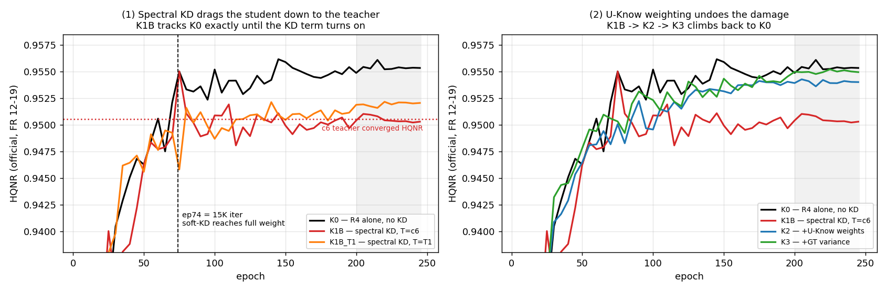

# KD 캠페인 종합 — s1 7건 완주 (K0~K4)

2026-08-31 19:27 ~ 2026-09-01 · 7건 무장애 완주 (각 2.0~2.4h) · seed 2025 · 아키텍처 `fixed`
Teacher = c6 계열 3.77M · Student = R4(`R4_w96_d124_noattn`, w96·d124·attn0·11ch) 2.13M

> **판정 지표는 HQNR(공식 FR 12-19), 보조는 SCC.** ERGAS·SAM 등은 §5 참고 지표.
> 판정선 = HQNR 시드 2σ **1.18%**. 수치는 `matlab`(DLPan, `best_hqnr` ckpt) +
> 교차확인 `py`(metrics.csv 동일 epoch plateau ep200–245).
> 개별 case 보고서는 [README 표](README.md)에서.

---

## 1. 어떤 실험인가

**"큰 Teacher 의 지식을 작은 Student 에 넘겨 경량화 손실을 회복한다"** 는 캠페인의
전제를 7단계 사다리로 검증했다. 각 단계는 앞 단계에 **한 항만** 더한다.

| case | 설정 | Teacher | 이 단계가 답하는 질문 |
|---|---|---|---|
| **K0** | R4 단독 학습, KD 없음 | — | Student 는 KD 없이 어디까지 가는가 (기준선) |
| **K1A** | + full-output KD `L1(pred, t_pred)` | c6 | 출력 전체 복제가 돕는가 |
| **K1B** | + spectral-only KD (LR 스케일 L1+SAM) | c6 | 스펙트럼만 선택 전달하면 돕는가 |
| **K1B_T1** | K1B 와 동일, teacher 만 교체 | **T1** | teacher 교체 효과와 가중 효과를 분리 |
| **K2** | + U-Know 가중 (`w_hard=1+αu`, `w_soft=1−u`) | T1 | θ 기반 가중이 돕는가 |
| **K3** | + GT 국소분산 (`w_hard=norm(1+αu+βv)`) | T1 | GT 분산이 θ 에 더할 것이 있는가 |
| **K4** | + Student SiS | T1 | 정합오차 흡수가 더할 것이 있는가 |

KD soft loss 는 5K→15K 램프 후 40K 부터 감쇠한다(≈ ep25 → **ep74** → ep198).

---

## 2. 어떤 결과가 나왔나

| case | 설정 | HQNR @sel | HQNR 수렴 | **vs K0** | SCC @sel | D_λ | D_s |
|---|---|---:|---:|---:|---:|---:|---:|
| **K0** | R4 단독, KD 없음 | **0.9562** | **0.95536** ±0.00029 | — | 0.9901 | 0.0235 | **0.0209** |
| K1A | full-output KD, T=c6 | 0.9551 | 0.95462 ±0.00024 | −0.077% | 0.9905 | 0.0231 | 0.0223 |
| K1B | spectral KD, T=c6 | 0.9550 | **0.95051** ±0.00028 | **−0.507%** | 0.9888 | 0.0222 | 0.0233 |
| K1B_T1 | spectral KD, T=T1 | 0.9522 | 0.95194 ±0.00017 | −0.357% | 0.9904 | 0.0239 | 0.0245 |
| K2 | + U-Know 가중 | 0.9543 | 0.95401 ±0.00018 | −0.141% | 0.9905 | 0.0211 | 0.0251 |
| K3 | + GT 국소분산 | 0.9552 | 0.95499 ±0.00011 | −0.038% | 0.9906 | 0.0226 | 0.0228 |
| K4 | + Student SiS | 0.9549 | 0.95462 ±0.00014 | −0.077% | 0.9906 | 0.0222 | 0.0234 |
| — | **c6 Teacher (3.77M)** | 0.9536 | 0.95053 ±0.00038 | −0.505% | 0.9908 | 0.0213 | 0.0256 |
| — | **T1 Teacher (3.77M)** | 0.9522 | 0.95121 ±0.00017 | −0.434% | 0.9906 | 0.0253 | 0.0231 |

**세 가지가 한눈에 보인다.**

1. **KD 를 붙인 6벌 중 K0 를 넘은 것이 하나도 없다.** 최선(K3)이 −0.038%.
2. **Teacher(3.77M)의 HQNR 이 Student(2.13M)보다 낮다** — c6 −0.505%, T1 −0.434%.
3. 전체 폭이 0.5% 로 **시드 2σ(1.18%)의 절반**이다.

### 2.1 KD 가 언제 해를 끼치는지 — 궤적이 말한다

**K1B 는 ep74 까지 K0 와 정확히 겹치다가(둘 다 0.9550 @ep75) 갈라진다.** ep74 = 15K iter,
soft KD 가중이 최대에 도달하는 지점이다. 이후 K1B 는 내려가 **c6 Teacher 의 수렴
HQNR 에 정확히 안착한다 — 0.95051 vs c6 0.95053.**

### 2.2 U-Know 사다리가 손실을 되돌린다

| 단계 | 무엇을 더했나 | vs K0 | 회복분 |
|---|---|---:|---:|
| K1B (spectral KD, T=c6) | — | −0.507% | — |
| K1B_T1 (teacher 만 T1 로) | teacher 교체 | −0.357% | +0.150%p |
| K2 (+U-Know 가중) | θ 가중 | −0.141% | +0.216%p |
| K3 (+GT 국소분산) | GT 분산 | **−0.038%** | +0.103%p |
| K4 (+Student SiS) | SiS | −0.077% | −0.039%p |

### 2.3 D_λ·D_s 평면 — 무엇이 오갔나

*`HQNR = (1−D_λ)(1−D_s)`. 회색 선이 등 HQNR 선. **K0(검정)만 아래쪽에 홀로 있다** —
D_s 0.0209 로 전 실행 중 최저. KD 를 붙인 순간 전부 위로(D_s 악화) 이동해 Teacher
쪽으로 끌려간다.*

---

## 3. 어떤 분석이 나왔나

**① 캠페인의 전제가 뒤집혔다 — Teacher 가 Student 보다 못하다.**
이 캠페인은 "Student 가 Teacher 대비 뒤처지니 KD 로 메운다" 는 전제로 짜였다.
그 전제는 **ERGAS 로 세운 것**이었고, HQNR 로 보면 성립하지 않는다.

| | params | HQNR 수렴 | ERGAS |
|---|---:|---:|---:|
| Student R4 (K0) | **2.13 M** | **0.95536** | 2.1273 |
| Teacher c6 | 3.77 M | 0.95053 | 2.0826 |

Student 는 **파라미터 56% 로 Teacher 보다 HQNR 이 높다.** 두 모델은 서로 다른 지점에
최적화돼 있을 뿐이고(§2.3 — Teacher 는 D_λ, Student 는 D_s 가 강하다) 위아래 관계가
아니다. **넘겨받을 "더 나은 지식" 이 애초에 없었다.**

**② 그래서 KD 는 이득이 아니라 오염으로 작동했다.**
§2.1 의 궤적이 이것을 기전 수준에서 보여준다 — K1B 는 soft loss 가 켜지기 전까지
K0 와 **완전히 같다가**, 켜지는 순간부터 갈라져 **Teacher 의 HQNR 로 수렴한다**
(0.95051 vs 0.95053, 5자리 일치). D_s 이동(§2.3)도 같은 이야기다. KD 가 Teacher 의
D_λ 강점과 함께 **D_s 약점까지 옮겨왔고**, Student 의 원래 강점이 D_s 였으므로
순손실이 됐다.

**③ U-Know 가중은 "이득 장치"가 아니라 "방어 장치"로 작동했다.**
K1B → K2 → K3 의 단조 회복(§2.2)은 설계 의도와 다른 방향으로 유효하다. θ 가중은
**Teacher 를 믿을 곳에서만 믿게 만들어 오염을 걷어낸다.** K3 에서 손실이 −0.038%,
즉 거의 완전히 사라진다. [T1 보고서](2026-08-31_T1_c6-uncertainty-teacher.md)에서
θ 의 오차 예측력이 압도적(Spearman 0.884, risk–coverage excess 0.082)이었던 것이
여기서 쓰였다.

**다만 방어의 최선이 "원점 복귀"다.** K3 는 K0 를 넘지 못했다. 나쁜 신호를 완벽히
차단해도 좋은 신호가 없으면 이득은 0 이다 — ②의 직접적 귀결이다.

**④ K1B_T1 이 설계대로 분해를 완성했다.**
K1B(T=c6) −0.507% → K1B_T1(T=T1) −0.357% → K2(T=T1 + 가중) −0.141%. teacher 교체가
+0.150%p, 가중이 +0.216%p 를 각각 기여한다. **가중 효과가 teacher 효과보다 크다** —
K2 의 이득을 "T1 이 c6 보다 나은 teacher 라서" 로 오귀속할 뻔한 것을 이 대조군이 막았다.

**⑤ 통계적 지위 — 무엇을 주장할 수 있고 없는가.**

| 주장 | 지위 |
|---|---|
| **KD 로 Student HQNR 을 개선하지 못했다** | **확정** — 6벌 전부 K0 이하, 예외 없음 |
| Teacher 가 Student 보다 HQNR 이 낮다 | **확정** — 선택 ckpt·수렴 양쪽에서 부호 일관 |
| KD 가 HQNR 을 **해친다** | **보류** — 최대 −0.507% 로 판정선(1.18%) 이내. 방향 일관·기전 확인·K1B 가 c6 값에 정확히 안착이라 정황은 강하나, 규약상 시드 3개 필요 |
| U-Know 가중이 손실을 되돌린다 | **보류** — 단조 회복은 명확하나 폭이 판정선 이내 |

**⑥ 다음에 할 것.**

1. **Teacher 를 다시 고른다.** 이 캠페인의 병목은 KD 기법이 아니라 **Teacher 선정
   기준이 ERGAS 였다**는 점이다. HQNR 이 Student 보다 확실히 높은 모델을 Teacher 로
   세우기 전까지 K1~K4 를 더 돌릴 이유가 없다. 후보는 HQNR 상위 실행에서 찾는다.
2. **경량화 결론이 바뀐다.** R4(2.13M)가 c6(3.77M) 대비 HQNR 우위이므로, "경량화 손실을
   회복한다" 가 아니라 **"경량화가 이미 이득"** 이다. 회복 대상이라는 프레임 자체를
   재검토해야 한다.
3. **K3 설정은 보관한다.** Teacher 가 제대로 서면 K3(U-Know + GT분산)가 오염 방어
   기본값이 된다 — 이번에 방어 성능은 입증됐다.
4. s2 mutual(M0~M3)은 **같은 함정에 빠져 있다.** R4↔R4 동형 상호학습은 "서로에게
   넘길 우위" 를 전제하는데, 여기서 본 것은 그 전제의 취약성이다. 기동 전 재검토 권고.

---

## 4. 배제한 것

| 가설 | 검증 | 결과 |
|---|---|---|
| KD 구현이 잘못돼 신호가 안 들어간다 | K1B 궤적이 soft 램프(ep74)에 정확히 반응 | **아니다** — 정확히 작동한다. 방향이 문제 |
| K1B 의 손실이 학습 불안정이다 | plateau sd ±0.00028, 곡선 평탄 | **아니다** — 안정적으로 낮은 값에 수렴 |
| K1B 가 실패작이라 이상치다 | c6 수렴 HQNR 과 5자리 일치 | **아니다** — Teacher 값으로 정확히 수렴 |
| K2 의 회복이 teacher 교체(c6→T1) 덕이다 | K1B_T1 대조군 | **아니다** — 가중이 +0.216%p, 교체는 +0.150%p |
| θ calibration 이 부실해 K2 가 약했다 | T1 진단 (Spearman 0.884, excess 0.082) | **아니다** — θ 는 최상급. 원료가 아니라 재료가 없었다 |
| Student 가 Teacher 보다 낫다는 건 선택 노이즈다 | 선택 ckpt·수렴 양쪽 확인 | **아니다** — 양쪽 다 부호 일관 |

---

## 5. 참고 지표 — 판정에 쓰지 않음

기록용. 아래 수치로 결론을 세우지 않는다.

| case | ERGAS ↓ | SAM ↓ | PSNR ↑ | Q2n ↑ | params | 추론 | 학습 |
|---|---:|---:|---:|---:|---:|---:|---:|
| K0 | 2.1273 | 2.8653 | 37.6663 | 0.9181 | 2.13 M | 4.75 ms | 1.98 h |
| K1A | 2.0991 | 2.8360 | 37.7733 | 0.9197 | 2.13 M | 4.37 ms | 2.24 h |
| K1B | 2.2436 | 2.9963 | 37.2426 | 0.9151 | 2.13 M | 4.77 ms | 2.32 h |
| K1B_T1 | 2.1041 | 2.8342 | 37.7588 | 0.9200 | 2.13 M | 4.77 ms | 2.31 h |
| K2 | 2.1013 | 2.8417 | 37.7739 | 0.9197 | 2.13 M | 4.67 ms | 2.32 h |
| K3 | 2.0915 | 2.8408 | 37.7978 | 0.9200 | 2.13 M | 4.97 ms | 2.32 h |
| K4 | 2.0926 | 2.8364 | 37.8058 | 0.9202 | 2.13 M | 4.80 ms | 2.39 h |
| c6 Teacher | 2.0826 | 2.8178 | 37.8373 | 0.9204 | 3.77 M | 6.63 ms | 2.40 h |

**ERGAS 로 읽으면 정반대 결론이 나온다** — KD 가 K0 2.1273 을 K3 2.0915(−1.7%)로
개선한 것처럼 보이고, Teacher 가 가장 좋아 보인다. HQNR 로는 그 반대다.
이 캠페인이 ERGAS 로 Teacher 를 고른 탓에 어긋난 것이 §3-①이다.
